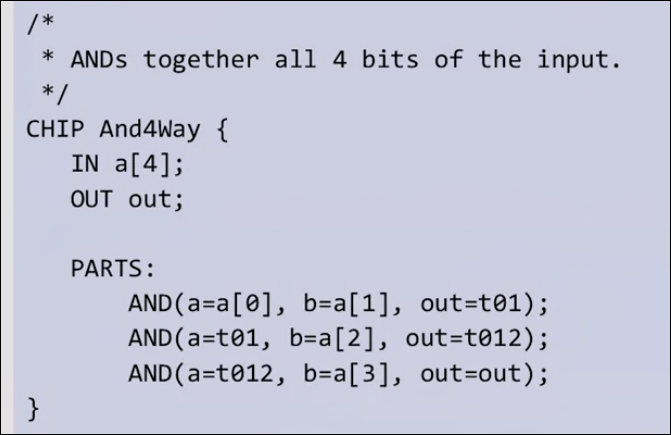
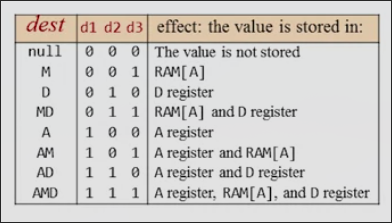

# 从与非门到俄罗斯方块

[online-IDE](https://nand2tetris.github.io/web-ide/chip)

[课程地址](https://www.coursera.org/learn/build-a-computer/home/week/1)

[搬运中字地址](https://www.bilibili.com/video/BV1KJ411s7QJ)

## 0 绪论

### 简介

从底层的软硬一构建出一个完整的通用计算机

* 前阶段构建硬件部分
* 第二阶段基于构建出的硬件构建计算机的软件

### 本课程的思想 

* 计算机的内容丰富且冗杂 
    * 源文件中的文本是如何发挥作用的
    * 编译器是如何工作的
    * 在屏幕上打印是如何做到的？如何控制具体像素点的亮度
    * 为什么不需要关心标准库等等的具体实现
        * 具体实现 how
        * 是什么东西（接口） what
    * 编程时不要关心多余东西的实现
* 抽象 从底层逐渐向顶层抽象（本课程采用这种方式）
    * 从基本的门逐渐封装为CPU等复杂芯片
    * 将其放入计算机为软件层服务
    * 将已经封装的抽象到下一个级别

### 本课程要构建的硬件 

* 计算机 CPU RAM ROM 等
* 连接鼠标键盘等
* 编写程序，运行

* 硬件部分专注于逻辑门，而不是芯片的制造等（这不是计算机领域）
    * 组合逻辑
    * CPU, 寄存器等
    * 最终组成计算机
* 使用硬件模拟器

* 硬件部分的课程内容
    * 建造一些基本的逻辑门
    * 建造一个算术逻辑单元 ALU
    * 建造存储系统 寄存器 RAM ROM
    * 用机器语言写一些程序，以了解这台计算机要做什么
    * 组成计算机！
    * 开发适合编写的机器语言的汇编器

### 本课程要构建的软件

* 构建非常低级的汇编语言以编写程序
* 了解软件的层次结构
* 构建一种高级语言，并构建编译器
* 构建标准库

## 1 逻辑门

### 布尔逻辑

| 0 | 1 |
| - | - |
| F | T |
| N | Y |

#### AND OR NOT

#### 布尔逻辑的基本组合计算

NOT(0 OR (1 AND 1))

#### 布尔逻辑表达式

f(x, y, z)=(x AND y) OR (NOT(x) AND z) 

了解此类函数的一种方式是列举所有x, y, z写下函数的值


另一种方式是通过公式化简

**交换定律**

* (x AND y)=(y AND x)
* (x OR y)=(y OR x) 

**结合律**

* (x AND (y AND z))=((x AND y) AND z)
* (x OR (y OR z))=,,

**分配律**

* (x AND (y OR z))=(x AND y) OR (x AND z)
* ..

**摩根定律**

* NOT(x OR y)=NOT(x) AND NOT(y)
* ..

### 从真值表构建布尔函数

* 逐行只关注表中输出取1的值
* 列写表达式,使得该表达式仅在本行的各个输入状态时取得1
* OR连接各行的表达式
* 化简

**任何真值表都能转化为AND, OR, NOT的组合**

*OR和AND可以放弃一个，因为他们可以用另外两种表示，但是不能放弃OR或者放弃两个*

### 与非门 NAND

x NAND y = NOT(x AND y)

*与非们可以用自己完成逻辑运算，因为无论AND, OR, NOT都可以由其表示*

你将要使用NAND构建你的计算机！

### 硬件实现布尔函数

**什么是逻辑门？**

逻辑门是一种独立的芯片，有着自己独立的功能

**复合逻辑门**

是由基本逻辑门和其他复合逻辑门组成的复杂一点的逻辑门

#### 基本逻辑门 

NAND, AND, OR, NOT

*用户如何使用门，只需要关注接口（输入与输出），但是如果希望了解门如何实现的，需要打开黑匣子，了解其内部构成*

#### 电路实现

*AND电路的实现*


### HDL 电路模拟语言 以异或门为例

在HDL构建的逻辑门可以实际对其模拟，测试

* 首先需要真值表（也被称为接口）
* 构建合适原理图


#### 编写HDL文件

```HDL
/** Xor gate: out = (a AND NOT(b)) OR (NOT(a) AND b) */

CHIP Xor {
    // 接口部分
    IN a, b;
    OUT out;

    PARTS:
    // 实现部分
    // 逐一描述原理图
    // 每一个中间输出起合适的名字
    Not (in=a, out=nota);
    Not (in=b, out=notb);
    And (a=a, b=notb, out=aAndNotb);
    And (a=nota, b=b, out=NotaAndb);  
    Or (a=aAndNotb, b=NotaAndb, out=out);
}
```

HDL是一种声明式的语言，不参与实际程序的运行，是门的静态表述

与先后顺序无关，不过习惯上从I到O

### 硬件模拟

* 测试模拟器, 根据更改不同的输入来获取输出，同时可以看到中间输出
* 编写测试语言文件（可以整理一组预先确定的可复制文件）
* 与脚本文件进行比较

#### 测试脚本

```tst
// This file is part of www.nand2tetris.org
// and the book "The Elements of Computing Systems"
// by Nisan and Schocken, MIT Press.
// File name: projects/1/Xor.tst

output-list a b out;

set a 0,
set b 0,
eval,
output;

set a 0,
set b 1,
eval,
output;

set a 1,
set b 0,
eval,
output;

set a 1,
set b 1,
eval,
output;
```

### 多位输入输出 bus 

*在操作硬件的时候，有时候会操作一堆具有相同地位的输入，将一堆作为一个实体进行整体操作很方便*

这种整体称为**bus**

#### HDL 关于bus

```HDL
CHIP ADD16{
    IN a[16], b[16];
    OUT out[16];

    PARTS:
        ...
}
```

当16位加法器被实现之后，如果我们想实现一个16位三数加法器，逻辑上显然可以使用两次两位加法器，在HDL中的做法：


即某一芯片的接口规定了bus输入输出，那么在使用的时候可以直接输入输出**整个bus**

如果在不是输入接口不是bus的芯片上输入bus数据的某一位，可以用bus数据[..]



而芯片的bus接口也可以分段输入输出


芯片的输入可以为常量 true 或 false

芯片的输出也不必全部需要，允许只输出一部分

### Project 1 简介

从Nand 开始，建造如下逻辑门

* Not And Or Xor Mux DMux 
* Not16 And16 Or16 Mux16 
* Or8Way Mux4Way16 Mux8Way16 DMux4Way DMux8Way

最常见和广泛，在计算机中广泛运用

#### 一些逻辑门的介绍

* Mux 多路复用器
    * 输入 a b sel
    * 输出 out
    * 当 sel 输入 0 out = a
    * 当 sel 输入 1 out = b
* DMux 解复用器
    * 输入 in sel 
    * 输出 a b
    * 当 sel 输入 0 则 a 输出 in 的值，而 b 保持 0
    * 当 sel 输入 1 则 b 输出 in 的值，而 a 保持 0
* And16
    * 输入 a[16] b[16]
    * 输出 out[16]
    * 16位中的每一位进行AND
* Mux4Way16
    * 输入 a[16] b[16] c[16] d[16] sel[2]
    * 输出 out[16]
    * 根据 sel的四种可能性来选择 a b c d

允许使用之前编写过的逻辑门

允许建立其余的芯片来辅助，但是没有必要

编写逻辑门，运行脚本，diff差异！

### 基本逻辑门 Q&A

**是否可以从非NAND的逻辑门建立计算机？**

是的,比如还有一种逻辑门NOR，它也可以构成任意逻辑门，或者从AND,OR,NOT自然地构建,用NAND门构建很常见，它也很便宜。

**如何去建造一个NAND门？**

这是物理学或者电子学的问题（模电），可以用电阻，晶体管等构建

**我们使用的HDL和硬件工程师使用的HDL相比？**

我们使用的HDL很好，是老师构建的，而工程师使用的更复杂一些，有一些C语言的形式，有循环等内容（16路不用CV16次了）,具有模拟功能，也能模拟时间和时钟，不过掌握时间长一些。

**我们目前建造的芯片很简单，如何制造包含数百个零件和连接的芯片？**

没有通用的方法去设计，需要一些聪明才智，我们已经学到一些技巧比如化简，也有一些编译器来制定功能，它们有一些算法来优化（但不是完美的，因为某种理论）

## 2 布尔运算和ALU

### 二进制表示整数

| Binary | Decimal |
| - | - |
| 0 | 0 |
| 1 | 1 |
| 10 | 2 |
| 11 | 3 |
| 100 | 4 |
| 101 | 5 |

如8位二进制在计算机中表示2^8=256个数（通常保留一位标识正负但也是128+128=256个数）

十进制转化二进制的一种方式：

每次找到最大的2^n, 余下的用2^(n-1)尝试

如 87 = 64 + 0 * 32 + 16 + 0 * 8 + 4 + 2 + 1 

-> 1 0 1 0 1 1 1

99 = 64 + 32 + 0 * 16 + 0 * 8 + 0 * 4 + 2 + 1 -> 1100011

### 二进制加法


和十进制加法类似地，当每一位（包括前一位的进位）加和大于等于2之后，减去2,并进位1

当最高位发生进位时（假设输出位数与输入相同），会出现**溢出**，在计算机中会被丢弃

**构建用于加法的硬件**

* 半加器 两位相加
* 全加器 三位相加
* 加法器 两个数加和

#### 半加器

| a | b | sum | carry |
| - | - | - | - |
| 0 | 0 | 0 | 0 |
| 0 | 1 | 1 | 0 |
| 1 | 0 | 1 | 0 |
| 1 | 1 | 0 | 1 |

#### 全加器

| a | b | c | sum | carry | 
| - | - | - | - | - |
| 0 | 0 | 0 | 0 | 0 | 
| 0 | 0 | 1 | 1 | 0 |
| 0 | 1 | 0 | 1 | 0 |
| 0 | 1 | 1 | 0 | 1 |
| 1 | 0 | 0 | 1 | 0 |
| 1 | 0 | 1 | 0 | 1 |
| 1 | 1 | 0 | 0 | 1 |
| 1 | 1 | 1 | 1 | 1 |

#### 加法器

按照真实的进位步骤进行

### 二进制负数

一种方式是把最高位（以四位二进制为例）作为符号位，当最高位为1,则为负数

| 二进制 | 数字 |
| - | - |
| 1100 | -4 |
| 1110 | -6 |
| 1000 | -0 | 

存在 -0 的问题，会带来一些问题，不好

改用的方案：

仍然使得最高位为0的为整数（0），为1的是负数，但是使用补码：使用2^n - x

以四bit为例，表示-1则使用16 - 1 = 15 > 1111

这样下来非负数可以表示0000-0111共8个数，负数可以表示1111-1000（-1～-8）共8个数

这种方案还可以直接地得到负数的加法，以及减法（基于某种数学原理）

比如 7 - 5 直接使用 7 - （-5）计算即可得到正确结果 2

因此构建减法器，实际上难点为如何计算出负数的二进制

而我们知道补码法确定-x实际上为2^n - x

即为1 + 2 ^ n - 1 - x 而 2 ^ n - 1 为 111111... - x 翻转 x的各个位即可

所以说**想得到一个负数的二进制，就把它的绝对值二进制的所有位翻转再加1**

最后加一的方式也很特别，可以在这个翻转数从低到高再翻转，直到碰到0,将这个0翻转后结束

### 算术逻辑单元 ALU

*冯诺依曼在论文中构建的体系结构*


可见其体系结构中CPU是计算机结构中的重要组成，而ALU是CPU中的重要结构

ALU有两个输入input1, input2

有一个函数控制（可能是逻辑函数或算术函数）

输出为f(input1, input2)

通常的计算有 整数加法、整数乘法、整数除法 逻辑运算如按位与、按位或等

**要在ALU中构建多少功能？**

这是一个权衡问题，如果不再硬件中实现某些东西，可以随时用软件对其扩展


#### 一个示例ALU The Hack ALU

* 输入 x[16] y[16]
* 输出 out[16]
* 功能选择 zx nx zy ny f no 他们的组合可以产生如下功能


* 此外还有两个控制输出 zr, ng

### The Hack ALU 的控制


#### zx ZEROx 

当 zx = 1 将输入的 x 设置为 0 

#### nx NOTx 

当 nx = 1 将输入的 x 取反

控制**按序而非同时发生**，比如 zx 和 nx 都为 1,先 zx 把输入置零，再取反置一

#### zy ZEROy ny NOTy

#### f

如果 f = 1 则计算 x + y, 否则计算 x AND y

请注意，**目前这五步包括尚未发生的下一步，仍是按序进行**

#### no NOT

如果 no = 1 否定输出结果

### The Hack ALU 输出的控制位

用来表示ALU的主要输出

如果 out = 0 则 zr 会 置1（zero）

如果 out < 0 则 ng 会 置1（negative）

### Project 2 概述

可以使用 Project 1 的全部实现

构建如下芯片

* HalfAdder
* FullAdder
* Add16
* Inc16
* ALU

#### HalfAdder

* 输入 a, b
* 输出 sum, carry
* 将两位相加，并输出两位的总和以及进位

#### FullAdder

* 输入 a, b, c
* 输出 sum, carry
* 将三位相加，并输出三位的总和以及进位

#### Add16

* 输入 a[16], b[16]
* 输出 out[16]
* 进行16位加法运算

#### Inc16

* 输入 In[16]
* 输出 out[16]
* 给传入值加1

#### 最有趣的部分 ALU

如上所述
不到20行代码即可实现

### 组合逻辑以及ALU 单元 Q&A

**我们在这门课已经制造了约20个芯片，它们是标准的吗？**

是的，半加器，全加器，加法器，多路复用器，异或门等等，这些都是在其他计算机中通用的器件。不过我们所建造的ALU不完全标准，它更简单（简单性也是本课程所着重的）

**为什么我们构建的ALU没有更多的如乘法和除法运算?**

如果在HDL代码中编写是可以实现的，但是有一些优雅和好的算法可以做到这点。我们在构建计算机系统时，系统提供的整体功能包括硬件和运行于其上的操作系统。而设计师可以自行决定每层的功能多少。在我们的设计中我们简化了ALU，乘除法运算将放在软件部分。

在本课程的第二部分，我们将设计一个操作系统，其包含了几个库，如数学库，其中就会包含如乘法和除法的运算。对于应用层程序员来说，不会注意到运算是由操作系统还是硬件完成的。这个问题的取舍点在于通常在硬件层的设计运行速度会快很多，但是设计成本很高（更复杂的硬件）

**这个ALU的效率？**

我们在本课程中设计的所有部分都是高效的，但是有一个组件可以进行优化：

**加法器的优化**

在我们之前的设计中，加法器由若干全加器组成，每个全加器从上一个全加器运算得到的进位中获取输入，这就导致了只有上一个全加器结束工作后，才开始工作。

假设每个全加器中有3-4个门组成，那么一个16bit的加法器耗时约为 4 * 16 * n = 64n 其中n为信号在每个门中处理的平均时间

**优化的思想是独立计算进位**

**为什么建议在project 2中使用内置芯片，而不是我们之前自己构建的芯片？**

欢迎使用自己的芯片，不过可能会面临局部失败的问题，避免之前构建的芯片有一些bug（可能侥幸通过了测试点），这也是一种单元测试，与系统的其余部分进行分离，避免干扰。在真实的项目中，当构建了某一底层功能之后，可以不必使用它，而是模拟它的接口和API来分离项目。（PS 内置的芯片由于实现规定了输入输出运行很快，而我们的芯片模拟器在执行时会从头开始，很慢）

## 3 内存

### 顺序逻辑

*在前两周中，我们忽略了时间的问题，假设一切立即发生，假设了芯片的功能是随输入立即输出*

但是面对真实的情况，我们需要引入时间，这需要解决两个问题：

* 使用相同的硬件随着时间连续地计算事物，比如说连续地加一系列数
* 记住过去发生的事，记住中间结果，正在计算的位置

物理上的时间是连续的，而我们要把这种连续的时间转化成容易处理的离散时间，这需要利用“时钟”——一种固定震荡的装置


在时钟的指示下，连续的物理时间被分割成等长的部分 t = 1, 2, 3...

这个等长的时间就是计算机中最小的时间单位，在这段时间当中，所有东西不会变化，只有在时钟交替时，输入输出才会改变


如图所示的非门，在时钟到来时，输入发生变化，而输出也随之瞬时变化

但是我们**不得不考虑延时的问题**

真实的模拟过程有一定延迟，但我们在计算机中不会考虑，当我们的时钟间隔足够时，我们就可以忽略，这不会对输入输出的变换产生影响


因此时钟选择的关键就是确保硬件在下一个时钟到来之前稳定下来达到终态

* 组合逻辑 out[t] = function(in[i]) 输入随输出瞬时变化
* 顺序逻辑 out[t] = function(in[t-1]) 输入后，预留出一个时钟的处理和延迟时间，在下一个时钟到来时输出

在顺序逻辑中，特别地，如果我们把上一个时钟的输入a在下一个时钟的输出f(a)继续投入到输入


我们在时间上即不断地改变状态，无需记忆最初的a，只是在前一步的基础上计算

### 记忆状态 D 触发器

我们现在可以做到在某一时钟瞬时进行计算，但是有一件事情：如何在计算完毕之后，保留输出直到下一个时钟到来呢？我们需要某种记忆的器件，它能够进行0、1之间的切换，并且在下一次信号到来之前记住当前的数字

这种器件称之为 **D 触发器**

* 输入 in
* 输出 out
* out[t] = in[t - 1]
* 记录上一时钟的值，并在下一时钟输出


小三角号表示这是一个顺序芯片，与之前我们的组合芯片不同，输出在下一个时钟

**关于D触发器的实现**

类似于NAnd，本课程把D触发器作为基石，实际上可以使用NAnd利用某种循环，进行建造。


因此在计算机中，我们通过D触发器来记忆信息，通过组合逻辑门在瞬时处理信息：

* 经过D触发器保存的信号在时钟到来时输出，并经过组合逻辑处理后，连同新增的输入，再次送到D触发器保存


#### 1-bit 寄存器

* 输入 in
* 输出 out
* 加载位 load
* 当load = 1, 会记住此时的in,即使得 out = in
* 当load = 0, out 保持
* 由于其时序特性，相应的out会滞后in和load一个时钟显现

### 存储单元

存储单元分为**主内存**，**辅助存储器**

* 主内存也有不同的分类
    * RAM 随机存储器，用于运行程序所依据的数据和指令
    * ...
* 辅助存储器的分类
    * 硬盘等
* 存储单元也有易失和非易失的区分（根据断电是否会丢失数据） 

我们关注于存储单元的逻辑，并重点关注RAM

#### 16-bit 寄存器

可以通过我们上节课建造的1-bit寄存器重复放置，构建16-bit寄存器

* 计算机中寄存器的长度我们成为w(word width)，有些是32位和64位
* 寄存器状态 是存储在寄存器中的值（目前由寄存器的内部电路所表示的值）

**如何读出寄存器状态？**

直接获取寄存器的输出即可

**如何写入新值到寄存器？**

如果要设置寄存器的值为v，那么设置输入为v，同时将加载位置1,那么寄存器的状态就变成了v，同时当下一时钟到来时，输出也变成了v

*值得注意的是寄存器状态不需要时钟结束后才变化*

#### RAM


我们把它视为一系列可寻址寄存器，即含有n个寄存器的RAM有0 ~ n - 1个地址

无论RAM中有多少寄存器，在一个时间点，都只会选择一个寄存器生效

* 地址的长度k = log2(n)
* 字w（每一个寄存器的位数）在我们的计算机中等于16

**如何读取RAM某个寄存器的值？**

设置地址为想要的寄存器地址，在下个时钟来临时，读取输出out

**如何设置RAM某个寄存器的值？**

设置地址为目标寄存器地址，设置输入为某值，同时加载位置一，寄存器的状态就会被改变，同时下个时钟到来时，RAM的输出也会改变为新值（如果地址仍是这个寄存器）

我们需要构建 RAM8 RAM64 RAM512 RAM4k RAM16k 这些数字表示w

**为什么叫RAM？**

RAM表示随机存储器，意味着有着能力只要根据地址就能立即选出任何寄存器

### 计数器

*一个会根据程序做蛋糕的机器人，我们写出一个很具体的50个指令，在这些指令旁边有一个计数器，它会告诉机器人它下一步执行的指令编号，当机器人执行若干指令时，当到一定阶段的末尾，我们可以让计数加1，机器人会根据计数器，接着执行下一个指令*

*我们也需要让计数器的数字可以跳转到特定数，完成指令的循环等操作*

因此我们需要能完成三种功能的计数器，**清零**（以便机器人从头开始执行），**自增**，**跳转**


* 输入 in[16]
* 输出 out[16]
* 控制位 load inc reset
* 如果reset置1,那么时钟到来时out会清零
* 如果load置1，同时给了in,那么在时钟到来时，out会输出之前in的值
* 如果inc置1,那么时钟到来时out会在上次的基础上自增1
* 如果所有位都置0,那么时钟到来时out不变

### Project3 概述

基于Project1和2构建的所有芯片，以及D触发器（Data)


### 存储系统单元 Q&A

**在本单元，我们使用了触发器但是没有真正构建它，怎样真正构建一个触发器？**

在常见的计算机课程中，通常教学生们从与非门构建触发器，但在我们的课程中，更强调组合逻辑和时序逻辑间的区别，以下是构建的方式：


把两个与非门连接在一起，每一个的输出连接进另一个的输入（通常这是不被允许的，不应该在组合门中出现循环）

1. 最开始时两个单独的输入置1，这时我们并不知道输出也就是另外两个输入的值
2. 当某一个单独的引脚置0，由于是与非门，其输出确定为1，同时这个1进入另一个与非门的输入，把其输出变为了0，这个输出又进入前者的输入，形成稳态
3. 当我们再次改变置0的那个引脚，把它置1,由于其另一个引脚是0,不会发生变化
4. 但当我们改变另外一个单独的引脚为0时，其输出变成了1,同时进入另一个与非门的输入，因为我们之前改变了这个与非门的另一个引脚为1,所以其输出0,0进入前者的输入，形成稳态（和2一样）
5. 这种结构记住了最后一个置0的引脚（把其输出最终置1），输入的瞬时变化改变另未来的输出

**NAND门是构建存储系统的唯一基本技术吗？**

不是的，在一些系统中，根据基础固体物理的一些性质来构建存储系统，是物理或者电子工程的范畴。

**我们构建的RAM是计算机唯一使用的存储设备吗？**

不是的，但是RAM是最重要的，它是一个易失的，断电丢失数据。

计算机还常用一种成为ROM只读存储器的设备，它是非易失性的，会维持现有内容很长时间。

也因此ROM是程序存放的地方，在启动过程（boot up）时程序预先在ROM中运行，其会初始化所有内容（在低级代码中），并会从磁盘克隆操作系统的启动代码。

另一种技术叫闪存，它结合了RAM和ROM的优点，可读可写，不依赖电源

还有一种方式叫缓存

**什么是缓存，我们为什么需要它？**

存储是计算机中很昂贵的内容，记忆越快，越多，就会越贵

缓存就是小而快的记忆，除此之外，还有一些缓慢，但是更大的存储，这种层次结构更有效

## 4 机器语言

### 机器语言概述

之前我们构造了ALU和内存，下周我们将其组装为计算机，本周我们以用户的视角来看待我们的计算机要做什么

计算机可以做很多事，不同于其它机器。我们要用同一硬件运行不同的软件

这也是通用图灵机的概念，而冯诺依曼完整地架构了这种机器：**通过程序软件放入硬件,不同的程序会创建不同的操作，完成不同的功能**


让我们回到计算机系统原理图思考如何做到这一点

* 在内存中会有程序，会告诉程序要做什么，怎么做
* 这个程序可以更改，它由一系列指令构成，每个指令由二进制编码，存放于连续的地址
* 硬件逐个指令执行
* 在不同的指令集，指令序中，硬件执行不同


*每一个指令告诉硬件要做什么？*

*我们如何知道，每个时间和阶段该执行哪条指令？*

*硬件在那些地方操作？比如告知硬件相加两个数，它如何获取值，如何相加，如何存放结果*

这种编程语言对硬件来说很明确，但是对于人来说不友好。所以人们通过高级语言间接地编写机器语言。一种自动程序（编译器）把它翻译成机器语言，变成软件。

*在我们的课程中，由于我们将编写直接运行机器上方的软件，因此关心机器语言，我们的机器语言会做出简化*

* 真正机器语言中的指令总是位序列，并且最终编码成我们理解的东西


我们将其简化为编码后的形式，即直接用`ADD`来替代`0100010`

* 当我们用机器语言编程时，使得程序员可以用这种`ADD`好理解的方式来编程。这就是汇编器的工作，这种编程是汇编语言，我们之后将着手建造汇编器。

### 机器语言的元素

*机器语言是计算机的一个重要接口，是软件控制硬件的根本方式*

* 规定了硬件如何操作？操作什么？结果放在哪里？
* 准确地指定了硬件可以为我们做的事

#### 机器语言可以执行的操作类型

* 算术运算 加减乘除
* 逻辑运算，比如两个数的按位与
* 流量控制，比如何时进入程序 

*一些硬件提供了如浮点数运算的功能，这样在实现浮点数功能时，就会运行的比在硬件层只实现整数功能的快许多*

机器语言如何确定要执行哪里？如果在指令中直接给定存储地址，那么在大量存储空间时，就会耗费很多位，在指示地址这一功能。此外，从很大的内存中访问特定元素很慢。

#### 内存层次结构

*解决上面两个问题的方法*


* 以CPU的角度，我们不必指定很大的地址，因为靠近CPU的存储空间（寄存器）空间很小
* 同时由于空间很小，访问速度会很快

离ALU越远，存储空间越大，访问效率越低

#### CPU内部的最小内存：寄存器

CPU内部包含了一些最小的存储空间

它们的类型和功能是机器语言的一部分

访问它们非常快

**寄存器的类型**

* 进行运算操作并进行存储
* 存储主存中的地址，将会确定想访问主存时操作的地址

**寻址模式**


**如何控制输入输出设备？**

* 实际连接它们，把它们和寄存器相关联

#### 流量控制

程序通常在按序执行，但是有时候，需要跳转

**无条件跳转**


* 可以给要跳转的地点起一个名字比如 loop 
* 102行变为`loop: Add 1, R1`
* 156行变为`jump loop`

**有条件跳转**


### 我们的机器语言

机器语言设计和机器设计往往是齐头并进的

我们的计算机是16位的，这意味着其中信息的存储，运输都是以16bit为最小单位

它由以下几部分组成：

* `Data memory(RAM)` 由若干16bit寄存器组成
* `Instruction（指令） memory(ROM)` 也是若干16bit寄存器组成 
* `Central Processing Unit(CPU)` 可以使用其内部的ALU来操纵16bit值的设备
* 各种bus（总线）指令/数据/地址 来传输数据


我们将为这台机器设计两种指令

* 16bit长度的A指令
* 16bit长度的C指令

**控制 The Hack computer 的过程**

* 首先把程序加载进ROM
* 按下重置按钮
* 程序开始运行

我们的计算机可以识别三个寄存器

* D寄存器 保存一个16bit数据
* A寄存器 保存一个16bit数据，表示当前选择的RAM寄存器地址
* M寄存器 映射了当前选择的RAM寄存器

#### A指令 的语法

* `@Value`
* `value`可以是非负十进制常量，也可以是指代这种常量的符号
* `@21`会将A寄存器设置为21，同时RAM[21]成为选定的RAM寄存器，操作M寄存器此时会实际操作RAM[21]


#### C指令 的语法

* `dest=comp; jump`dest和jump是可选择的
* 首先进行某些计算
* 然后可以选择把结果存储起来
* 也可以选择根据结果决定是否跳转

comp字段进行计算，为以下之一


dest字段进行存储，为以下之一


jump字段进行跳转，为以下之一


* 这些是跳转的八个条件，**这些条件总是将计算结果和0比较**
* 如果比较成功，跳转至ROM[A]

### The Hack 机器语言规范

目前我们有机器（ROM存放指令，CPU包括ALU处理数据，RAM存放数据）

还规定了两种指令（A指令改变操作地址，C指令赋值跳转）

而我们的机器语言是这些指令的顺序结合

这种机器语言有两种表达方式


右侧是机器真实获取到的结果，如果我们以左侧的符号形式编写，则需要有负责将符号翻译为二进制代码的事物，这将是汇编程序的工作，我们将考虑这个程序。

#### A指令的汇编

* `@value`，`value`可能是数字或者表示数字的符号
* 首先我们把`@`符号定为`0`，当机器获取以0开头的指令时，它会得知这是A指令
* 在`0`的后面，我们把`value`翻译成二进制（我们先暂时只考虑数字的情况）
* 在表示`@`的0和表示`value`的二进制中间，有若干占位的`0`


#### C指令的汇编

* `dest = comp ; jump`
* 首先使用`1`作为C指令的标识
* 后面的两位不使用，但按照惯例设置为1
* 后面的7位表示计算comp,后续这些位将发送至ALU
* 再后面三位表示目的地`dest`，最后三位表示跳转条件`jump`


##### 计算位comp的汇编


##### 目标dest的汇编



##### 跳转条件jump的汇编


*一个实例程序*


*其翻译的二进制机器语言程序*


最终二进制程序加载到计算机执行

### 机器语言控制输入输出设备


在高级语言如java,puthon等，我们有很多库进行输出，创建图片，动画等(这些我们将在本课程的第二部分讨论）

但是在机器语言中，我们唯一可以使用的就是Bits

#### 控制输出到屏幕

* `Screen memory map`是一个RAM上的指定区域。显示器持续不断地获取`memory map`中的数据来进行刷新，每秒数次

我们的计算机屏幕由256*512像素组成，可以控制像素的打开与关闭（这是一个黑白屏幕）

内存映射是一系列的16位值


每组数据也被称为字，共计8k16bit的字（8k*16大约等于256*512,每一位对应操纵了一位像素，但是我们在我们的内存中只能16bit整体操作）

在我们的内存中，屏幕的第一行像素，对应了内存映射区域第1-第512 / 16 = 32行，也就是内存映射空间中每32行对应了屏幕的一行

在我们的计算机中，我们使用一种叫`Screen`的芯片来表示内存映射单元，其组成和API与RAM相同，但是整个RAM由Screen等组成，最终它们会组合在一起，我们通过整体RAM访问屏幕内存映射的时候，要加上Screen芯片的起始地址（如图所示）（为了避免与其他内存单元地址冲突）

**设置屏幕某一位像素的方式**


#### 控制从键盘输入

键盘由电缆接入键盘内存映射空间

键盘内存映射是一个单一的寄存器（因为控制键盘不需要超过16bit的空间）

在我们的计算机中位于RAM[24576]

当我们按下按键时，按键的`scan code`通过电缆映射到键盘内存映射 


在我们获取按下按键时，只需要检查这个寄存器的值即可

### 低级语言编程 以 The Hack 为例

#### 内存和寄存器

内存和寄存器是低级语言的基础

我们有三个寄存器 D A M


为了避免计算机在我们的程序结束后继续执行，执行空指令（可能会导致执行恶意程序）

计算机永远不会停滞不前，即便是不动鼠标，也会在后台执行程序

我们可以在程序结束后，让计算机做我们可以控制的事情，不妨使用这两行代码

```asm
6> @6 // 当前行
7> 0;JMP // 跳转到上一行，反复执行
```

#### The Hack 语言的一些特性

* 十六个虚拟寄存器`R0..R15`（实际指代了0-15的值）
    * 他们用于在更改目标RAM地址为0-15时替换`@0-15`为`@R0-R15`
    * 这样使得A寄存器在作为数据存储和目标地址切换的功能分离
* The Hack 区分大小写
* `SCREEN`、`KBD`指代了它们实际的起始地址值
* 此外还有六个符号，为后续的高级语言使用

#### 分支，变量，迭代

分支（选择结构）是告诉计算机评估某个布尔表达式的值，并决定是否跳转或继续前进


符号引导（标签）

*为了让程序更可读*

* 在我们的语言里可以替换`@`后面的表示行号的数字
* 语法是`(name)`，`@name`


变量

在低级语言，或者说在我们语言中，我们使用当个寄存器表示我们所有的变量

在我们的程序，使用`@name`声明一个变量，这个`name`不是任意标签名或者内置的如`R1`的关键字

当我们`@temp`时，我们的计算机会在RAM中找到空间的寄存器，然后设置其可用（把M和它关联），当我们之后再次`@temp`时，又会把M和其关联，我们就可以读写其中的值


汇编器对变量的处理是首先当`@`后的内容没有与之对应的标签或关键字时，识别为标签，并从地址16开始，替换其为地址

迭代


