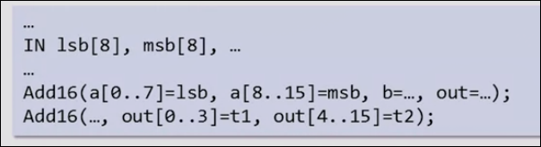

# 1 基本逻辑门

## 布尔逻辑

| 0 | 1 |
| - | - |
| F | T |
| N | Y |

### AND OR NOT

### 布尔逻辑的基本组合计算

NOT(0 OR (1 AND 1))

### 布尔逻辑表达式

f(x, y, z)=(x AND y) OR (NOT(x) AND z) 

了解此类函数的一种方式是列举所有x, y, z写下函数的值


另一种方式是通过公式化简

**交换定律**

* (x AND y)=(y AND x)
* (x OR y)=(y OR x) 

**结合律**

* (x AND (y AND z))=((x AND y) AND z)
* (x OR (y OR z))=,,

**分配律**

* (x AND (y OR z))=(x AND y) OR (x AND z)
* ..

**摩根定律**

* NOT(x OR y)=NOT(x) AND NOT(y)
* ..

## 从真值表构建布尔函数

* 逐行只关注表中输出取1的值
* 列写表达式,使得该表达式仅在本行的各个输入状态时取得1
* OR连接各行的表达式
* 化简

**任何真值表都能转化为AND, OR, NOT的组合**

*OR和AND可以放弃一个，因为他们可以用另外两种表示，但是不能放弃OR或者放弃两个*

## 与非门 NAND

x NAND y = NOT(x AND y)

*与非们可以用自己完成逻辑运算，因为无论AND, OR, NOT都可以由其表示*

你将要使用NAND构建你的计算机！

## 硬件实现布尔函数

**什么是逻辑门？**

逻辑门是一种独立的芯片，有着自己独立的功能

**复合逻辑门**

是由基本逻辑门和其他复合逻辑门组成的复杂一点的逻辑门

### 基本逻辑门 

NAND, AND, OR, NOT

*用户如何使用门，只需要关注接口（输入与输出），但是如果希望了解门如何实现的，需要打开黑匣子，了解其内部构成*

### 电路实现

*AND电路的实现*


## HDL 电路模拟语言 以异或门为例

在HDL构建的逻辑门可以实际对其模拟，测试

* 首先需要真值表（也被称为接口）
* 构建合适原理图


### 编写HDL文件

```HDL
/** Xor gate: out = (a AND NOT(b)) OR (NOT(a) AND b) */

CHIP Xor {
    // 接口部分
    IN a, b;
    OUT out;

    PARTS:
    // 实现部分
    // 逐一描述原理图
    // 每一个中间输出起合适的名字
    Not (in=a, out=nota);
    Not (in=b, out=notb);
    And (a=a, b=notb, out=aAndNotb);
    And (a=nota, b=b, out=NotaAndb);  
    Or (a=aAndNotb, b=NotaAndb, out=out);
}
```

HDL是一种声明式的语言，不参与实际程序的运行，是门的静态表述

与先后顺序无关，不过习惯上从I到O

## 硬件模拟

* 测试模拟器, 根据更改不同的输入来获取输出，同时可以看到中间输出
* 编写测试语言文件（可以整理一组预先确定的可复制文件）
* 与脚本文件进行比较

### 测试脚本

```tst
// This file is part of www.nand2tetris.org
// and the book "The Elements of Computing Systems"
// by Nisan and Schocken, MIT Press.
// File name: projects/1/Xor.tst

output-list a b out;

set a 0,
set b 0,
eval,
output;

set a 0,
set b 1,
eval,
output;

set a 1,
set b 0,
eval,
output;

set a 1,
set b 1,
eval,
output;
```

## 多位输入输出 bus 

*在操作硬件的时候，有时候会操作一堆具有相同地位的输入，将一堆作为一个实体进行整体操作很方便*

这种整体称为**bus**

### HDL 关于bus

```HDL
CHIP ADD16{
    IN a[16], b[16];
    OUT out[16];

    PARTS:
        ...
}
```

当16位加法器被实现之后，如果我们想实现一个16位三数加法器，逻辑上显然可以使用两次两位加法器，在HDL中的做法：


即某一芯片的接口规定了bus输入输出，那么在使用的时候可以直接输入输出**整个bus**

如果在不是输入接口不是bus的芯片上输入bus数据的某一位，可以用bus数据[..]


而芯片的bus接口也可以分段输入输出



芯片的输入可以为常量 true 或 false

芯片的输出也不必全部需要，允许只输出一部分

## Project 1 简介

从Nand 开始，建造如下逻辑门

* Not And Or Xor Mux DMux 
* Not16 And16 Or16 Mux16 
* Or8Way Mux4Way16 Mux8Way16 DMux4Way DMux8Way

最常见和广泛，在计算机中广泛运用

### 一些逻辑门的介绍

* Mux 多路复用器
    * 输入 a b sel
    * 输出 out
    * 当 sel 输入 0 out = a
    * 当 sel 输入 1 out = b
* DMux 解复用器
    * 输入 in sel 
    * 输出 a b
    * 当 sel 输入 0 则 a 输出 in 的值，而 b 保持 0
    * 当 sel 输入 1 则 b 输出 in 的值，而 a 保持 0
* And16
    * 输入 a[16] b[16]
    * 输出 out[16]
    * 16位中的每一位进行AND
* Mux4Way16
    * 输入 a[16] b[16] c[16] d[16] sel[2]
    * 输出 out[16]
    * 根据 sel的四种可能性来选择 a b c d

允许使用之前编写过的逻辑门

允许建立其余的芯片来辅助，但是没有必要

编写逻辑门，运行脚本，diff差异！

## 基本逻辑门 Q&A

**是否可以从非NAND的逻辑门建立计算机？**

是的,比如还有一种逻辑门NOR，它也可以构成任意逻辑门，或者从AND,OR,NOT自然地构建,用NAND门构建很常见，它也很便宜。

**如何去建造一个NAND门？**

这是物理学或者电子学的问题（模电），可以用电阻，晶体管等构建

**我们使用的HDL和硬件工程师使用的HDL相比？**

我们使用的HDL很好，是老师构建的，而工程师使用的更复杂一些，有一些C语言的形式，有循环等内容（16路不用CV16次了）,具有模拟功能，也能模拟时间和时钟，不过掌握时间长一些。

**我们目前建造的芯片很简单，如何制造包含数百个零件和连接的芯片？**

没有通用的方法去设计，需要一些聪明才智，我们已经学到一些技巧比如化简，也有一些编译器来制定功能，它们有一些算法来优化（但不是完美的，因为某种理论）


