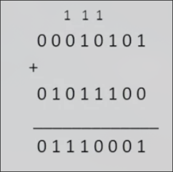
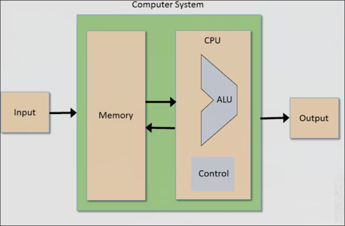
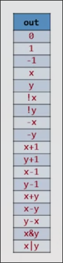

# 2 组合逻辑及ALU

## 二进制表示整数

| Binary | Decimal |
| - | - |
| 0 | 0 |
| 1 | 1 |
| 10 | 2 |
| 11 | 3 |
| 100 | 4 |
| 101 | 5 |

如8位二进制在计算机中表示2^8=256个数（通常保留一位标识正负但也是128+128=256个数）

十进制转化二进制的一种方式：

每次找到最大的2^n, 余下的用2^(n-1)尝试

如 87 = 64 + 0 * 32 + 16 + 0 * 8 + 4 + 2 + 1 

-> 1 0 1 0 1 1 1

99 = 64 + 32 + 0 * 16 + 0 * 8 + 0 * 4 + 2 + 1 -> 1100011

## 二进制加法

和十进制加法类似地，当每一位（包括前一位的进位）加和大于等于2之后，减去2,并进位1

当最高位发生进位时（假设输出位数与输入相同），会出现**溢出**，在计算机中会被丢弃

**构建用于加法的硬件**

* 半加器 两位相加
* 全加器 三位相加
* 加法器 两个数加和

### 半加器

| a | b | sum | carry |
| - | - | - | - |
| 0 | 0 | 0 | 0 |
| 0 | 1 | 1 | 0 |
| 1 | 0 | 1 | 0 |
| 1 | 1 | 0 | 1 |

### 全加器

| a | b | c | sum | carry | 
| - | - | - | - | - |
| 0 | 0 | 0 | 0 | 0 | 
| 0 | 0 | 1 | 1 | 0 |
| 0 | 1 | 0 | 1 | 0 |
| 0 | 1 | 1 | 0 | 1 |
| 1 | 0 | 0 | 1 | 0 |
| 1 | 0 | 1 | 0 | 1 |
| 1 | 1 | 0 | 0 | 1 |
| 1 | 1 | 1 | 1 | 1 |

### 加法器

按照真实的进位步骤进行

## 二进制负数

一种方式是把最高位（以四位二进制为例）作为符号位，当最高位为1,则为负数

| 二进制 | 数字 |
| - | - |
| 1100 | -4 |
| 1110 | -6 |
| 1000 | -0 | 

存在 -0 的问题，会带来一些问题，不好

改用的方案：

仍然使得最高位为0的为整数（0），为1的是负数，但是使用补码：使用2^n - x

以四bit为例，表示-1则使用16 - 1 = 15 > 1111

这样下来非负数可以表示0000-0111共8个数，负数可以表示1111-1000（-1～-8）共8个数

这种方案还可以直接地得到负数的加法，以及减法（基于某种数学原理）

比如 7 - 5 直接使用 7 - （-5）计算即可得到正确结果 2

因此构建减法器，实际上难点为如何计算出负数的二进制

而我们知道补码法确定-x实际上为2^n - x

即为1 + 2 ^ n - 1 - x 而 2 ^ n - 1 为 111111... - x 翻转 x的各个位即可

所以说**想得到一个负数的二进制，就把它的绝对值二进制的所有位翻转再加1**

最后加一的方式也很特别，可以在这个翻转数从低到高再翻转，直到碰到0,将这个0翻转后结束

## 算术逻辑单元 ALU

*冯诺依曼在论文中构建的体系结构*

可见其体系结构中CPU是计算机结构中的重要组成，而ALU是CPU中的重要结构

ALU有两个输入input1, input2

有一个函数控制（可能是逻辑函数或算术函数）

输出为f(input1, input2)

通常的计算有 整数加法、整数乘法、整数除法 逻辑运算如按位与、按位或等

**要在ALU中构建多少功能？**

这是一个权衡问题，如果不再硬件中实现某些东西，可以随时用软件对其扩展

### 一个示例ALU The Hack ALU

* 输入 x[16] y[16]
* 输出 out[16]
* 功能选择 zx nx zy ny f no 他们的组合可以产生如下功能

* 此外还有两个控制输出 zr, ng

## The Hack ALU 的控制

### zx ZEROx 

当 zx = 1 将输入的 x 设置为 0 

### nx NOTx 

当 nx = 1 将输入的 x 取反

控制**按序而非同时发生**，比如 zx 和 nx 都为 1,先 zx 把输入置零，再取反置一

### zy ZEROy ny NOTy

### f

如果 f = 1 则计算 x + y, 否则计算 x AND y

请注意，**目前这五步包括尚未发生的下一步，仍是按序进行**

### no NOT

如果 no = 1 否定输出结果

## The Hack ALU 输出的控制位

用来表示ALU的主要输出

如果 out = 0 则 zr 会 置1（zero）

如果 out < 0 则 ng 会 置1（negative）

## Project 2 概述

可以使用 Project 1 的全部实现

构建如下芯片

* HalfAdder
* FullAdder
* Add16
* Inc16
* ALU

### HalfAdder

* 输入 a, b
* 输出 sum, carry
* 将两位相加，并输出两位的总和以及进位

### FullAdder

* 输入 a, b, c
* 输出 sum, carry
* 将三位相加，并输出三位的总和以及进位

### Add16

* 输入 a[16], b[16]
* 输出 out[16]
* 进行16位加法运算

### Inc16

* 输入 In[16]
* 输出 out[16]
* 给传入值加1

### 最有趣的部分 ALU

如上所述
不到20行代码即可实现

## 组合逻辑以及ALU 单元 Q&A

**我们在这门课已经制造了约20个芯片，它们是标准的吗？**

是的，半加器，全加器，加法器，多路复用器，异或门等等，这些都是在其他计算机中通用的器件。不过我们所建造的ALU不完全标准，它更简单（简单性也是本课程所着重的）

**为什么我们构建的ALU没有更多的如乘法和除法运算?**

如果在HDL代码中编写是可以实现的，但是有一些优雅和好的算法可以做到这点。我们在构建计算机系统时，系统提供的整体功能包括硬件和运行于其上的操作系统。而设计师可以自行决定每层的功能多少。在我们的设计中我们简化了ALU，乘除法运算将放在软件部分。

在本课程的第二部分，我们将设计一个操作系统，其包含了几个库，如数学库，其中就会包含如乘法和除法的运算。对于应用层程序员来说，不会注意到运算是由操作系统还是硬件完成的。这个问题的取舍点在于通常在硬件层的设计运行速度会快很多，但是设计成本很高（更复杂的硬件）

**这个ALU的效率？**

我们在本课程中设计的所有部分都是高效的，但是有一个组件可以进行优化：

**加法器的优化**

在我们之前的设计中，加法器由若干全加器组成，每个全加器从上一个全加器运算得到的进位中获取输入，这就导致了只有上一个全加器结束工作后，才开始工作。

假设每个全加器中有3-4个门组成，那么一个16bit的加法器耗时约为 4 * 16 * n = 64n 其中n为信号在每个门中处理的平均时间

**优化的思想是独立计算进位**

**为什么建议在project 2中使用内置芯片，而不是我们之前自己构建的芯片？**

欢迎使用自己的芯片，不过可能会面临局部失败的问题，避免之前构建的芯片有一些bug（可能侥幸通过了测试点），这也是一种单元测试，与系统的其余部分进行分离，避免干扰。在真实的项目中，当构建了某一底层功能之后，可以不必使用它，而是模拟它的接口和API来分离项目。（PS 内置的芯片由于实现规定了输入输出运行很快，而我们的芯片模拟器在执行时会从头开始，很慢）

