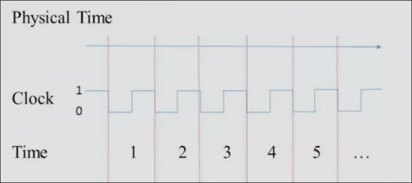
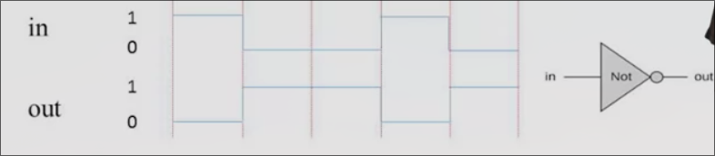
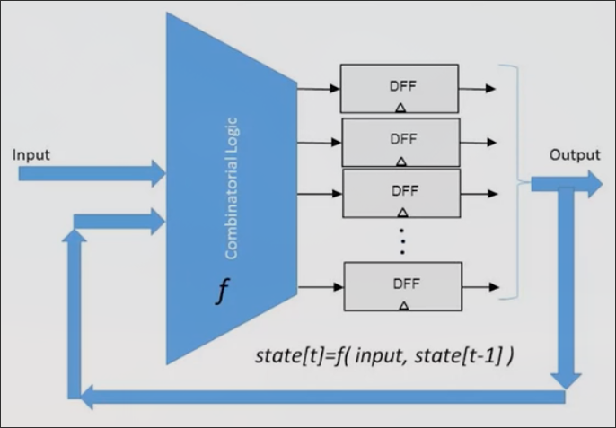
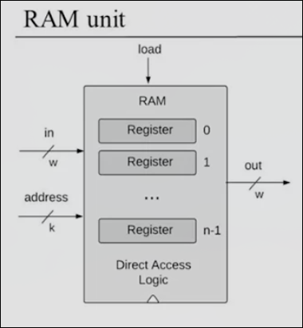
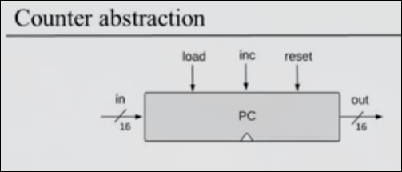
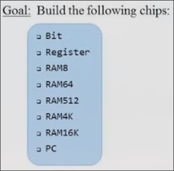

# 3 存储系统

## 顺序逻辑

*在前两周中，我们忽略了时间的问题，假设一切立即发生，假设了芯片的功能是随输入立即输出*

但是面对真实的情况，我们需要引入时间，这需要解决两个问题：

* 使用相同的硬件随着时间连续地计算事物，比如说连续地加一系列数
* 记住过去发生的事，记住中间结果，正在计算的位置

物理上的时间是连续的，而我们要把这种连续的时间转化成容易处理的离散时间，这需要利用“时钟”——一种固定震荡的装置

在时钟的指示下，连续的物理时间被分割成等长的部分 t = 1, 2, 3...

这个等长的时间就是计算机中最小的时间单位，在这段时间当中，所有东西不会变化，只有在时钟交替时，输入输出才会改变

如图所示的非门，在时钟到来时，输入发生变化，而输出也随之瞬时变化

但是我们**不得不考虑延时的问题**

真实的模拟过程有一定延迟，但我们在计算机中不会考虑，当我们的时钟间隔足够时，我们就可以忽略，这不会对输入输出的变换产生影响

因此时钟选择的关键就是确保硬件在下一个时钟到来之前稳定下来达到终态

* 组合逻辑 out[t] = function(in[i]) 输入随输出瞬时变化
* 顺序逻辑 out[t] = function(in[t-1]) 输入后，预留出一个时钟的处理和延迟时间，在下一个时钟到来时输出

在顺序逻辑中，特别地，如果我们把上一个时钟的输入a在下一个时钟的输出f(a)继续投入到输入

我们在时间上即不断地改变状态，无需记忆最初的a，只是在前一步的基础上计算

## 记忆状态 D 触发器

我们现在可以做到在某一时钟瞬时进行计算，但是有一件事情：如何在计算完毕之后，保留输出直到下一个时钟到来呢？我们需要某种记忆的器件，它能够进行0、1之间的切换，并且在下一次信号到来之前记住当前的数字

这种器件称之为 **D 触发器**

* 输入 in
* 输出 out
* out[t] = in[t - 1]
* 记录上一时钟的值，并在下一时钟输出

小三角号表示这是一个顺序芯片，与之前我们的组合芯片不同，输出在下一个时钟

**关于D触发器的实现**

类似于NAnd，本课程把D触发器作为基石，实际上可以使用NAnd利用某种循环，进行建造。

因此在计算机中，我们通过D触发器来记忆信息，通过组合逻辑门在瞬时处理信息：

* 经过D触发器保存的信号在时钟到来时输出，并经过组合逻辑处理后，连同新增的输入，再次送到D触发器保存

### 1-bit 寄存器

* 输入 in
* 输出 out
* 加载位 load
* 当load = 1, 会记住此时的in,即使得 out = in
* 当load = 0, out 保持
* 由于其时序特性，相应的out会滞后in和load一个时钟显现

## 存储单元

存储单元分为**主内存**，**辅助存储器**

* 主内存也有不同的分类
    * RAM 随机存储器，用于运行程序所依据的数据和指令
    * ...
* 辅助存储器的分类
    * 硬盘等
* 存储单元也有易失和非易失的区分（根据断电是否会丢失数据） 

我们关注于存储单元的逻辑，并重点关注RAM

### 16-bit 寄存器

可以通过我们上节课建造的1-bit寄存器重复放置，构建16-bit寄存器

* 计算机中寄存器的长度我们成为w(word width)，有些是32位和64位
* 寄存器状态 是存储在寄存器中的值（目前由寄存器的内部电路所表示的值）

**如何读出寄存器状态？**

直接获取寄存器的输出即可

**如何写入新值到寄存器？**

如果要设置寄存器的值为v，那么设置输入为v，同时将加载位置1,那么寄存器的状态就变成了v，同时当下一时钟到来时，输出也变成了v

*值得注意的是寄存器状态不需要时钟结束后才变化*

### RAM

我们把它视为一系列可寻址寄存器，即含有n个寄存器的RAM有0 ~ n - 1个地址

无论RAM中有多少寄存器，在一个时间点，都只会选择一个寄存器生效

* 地址的长度k = log2(n)
* 字w（每一个寄存器的位数）在我们的计算机中等于16

**如何读取RAM某个寄存器的值？**

设置地址为想要的寄存器地址，在下个时钟来临时，读取输出out

**如何设置RAM某个寄存器的值？**

设置地址为目标寄存器地址，设置输入为某值，同时加载位置一，寄存器的状态就会被改变，同时下个时钟到来时，RAM的输出也会改变为新值（如果地址仍是这个寄存器）

我们需要构建 RAM8 RAM64 RAM512 RAM4k RAM16k 这些数字表示w

**为什么叫RAM？**

RAM表示随机存储器，意味着有着能力只要根据地址就能立即选出任何寄存器

## 计数器

*一个会根据程序做蛋糕的机器人，我们写出一个很具体的50个指令，在这些指令旁边有一个计数器，它会告诉机器人它下一步执行的指令编号，当机器人执行若干指令时，当到一定阶段的末尾，我们可以让计数加1，机器人会根据计数器，接着执行下一个指令*

*我们也需要让计数器的数字可以跳转到特定数，完成指令的循环等操作*

因此我们需要能完成三种功能的计数器，**清零**（以便机器人从头开始执行），**自增**，**跳转**

* 输入 in[16]
* 输出 out[16]
* 控制位 load inc reset
* 如果reset置1,那么时钟到来时out会清零
* 如果load置1，同时给了in,那么在时钟到来时，out会输出之前in的值
* 如果inc置1,那么时钟到来时out会在上次的基础上自增1
* 如果所有位都置0,那么时钟到来时out不变

## Project3 概述

基于Project1和2构建的所有芯片，以及D触发器（Data)

## 存储系统单元 Q&A

**在本单元，我们使用了触发器但是没有真正构建它，怎样真正构建一个触发器？**

在常见的计算机课程中，通常教学生们从与非门构建触发器，但在我们的课程中，更强调组合逻辑和时序逻辑间的区别，以下是构建的方式：

把两个与非门连接在一起，每一个的输出连接进另一个的输入（通常这是不被允许的，不应该在组合门中出现循环）

1. 最开始时两个单独的输入置1，这时我们并不知道输出也就是另外两个输入的值
2. 当某一个单独的引脚置0，由于是与非门，其输出确定为1，同时这个1进入另一个与非门的输入，把其输出变为了0，这个输出又进入前者的输入，形成稳态
3. 当我们再次改变置0的那个引脚，把它置1,由于其另一个引脚是0,不会发生变化
4. 但当我们改变另外一个单独的引脚为0时，其输出变成了1,同时进入另一个与非门的输入，因为我们之前改变了这个与非门的另一个引脚为1,所以其输出0,0进入前者的输入，形成稳态（和2一样）
5. 这种结构记住了最后一个置0的引脚（把其输出最终置1），输入的瞬时变化改变另未来的输出

**NAND门是构建存储系统的唯一基本技术吗？**

不是的，在一些系统中，根据基础固体物理的一些性质来构建存储系统，是物理或者电子工程的范畴。

**我们构建的RAM是计算机唯一使用的存储设备吗？**

不是的，但是RAM是最重要的，它是一个易失的，断电丢失数据。

计算机还常用一种成为ROM只读存储器的设备，它是非易失性的，会维持现有内容很长时间。

也因此ROM是程序存放的地方，在启动过程（boot up）时程序预先在ROM中运行，其会初始化所有内容（在低级代码中），并会从磁盘克隆操作系统的启动代码。

另一种技术叫闪存，它结合了RAM和ROM的优点，可读可写，不依赖电源

还有一种方式叫缓存

**什么是缓存，我们为什么需要它？**

存储是计算机中很昂贵的内容，记忆越快，越多，就会越贵

缓存就是小而快的记忆，除此之外，还有一些缓慢，但是更大的存储，这种层次结构更有效

