# 4 机器语言

## 机器语言概述

之前我们构造了ALU和内存，下周我们将其组装为计算机，本周我们以用户的视角来看待我们的计算机要做什么

计算机可以做很多事，不同于其它机器。我们要用同一硬件运行不同的软件

这也是通用图灵机的概念，而冯诺依曼完整地架构了这种机器：**通过程序软件放入硬件,不同的程序会创建不同的操作，完成不同的功能**

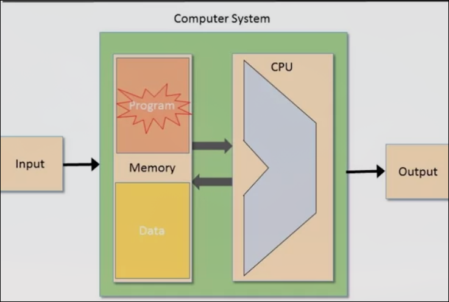

让我们回到计算机系统原理图思考如何做到这一点

* 在内存中会有程序，会告诉程序要做什么，怎么做
* 这个程序可以更改，它由一系列指令构成，每个指令由二进制编码，存放于连续的地址
* 硬件逐个指令执行
* 在不同的指令集，指令序中，硬件执行不同


*每一个指令告诉硬件要做什么？*

*我们如何知道，每个时间和阶段该执行哪条指令？*

*硬件在那些地方操作？比如告知硬件相加两个数，它如何获取值，如何相加，如何存放结果*

这种编程语言对硬件来说很明确，但是对于人来说不友好。所以人们通过高级语言间接地编写机器语言。一种自动程序（编译器）把它翻译成机器语言，变成软件。

*在我们的课程中，由于我们将编写直接运行机器上方的软件，因此关心机器语言，我们的机器语言会做出简化*

* 真正机器语言中的指令总是位序列，并且最终编码成我们理解的东西


我们将其简化为编码后的形式，即直接用`ADD`来替代`0100010`

* 当我们用机器语言编程时，使得程序员可以用这种`ADD`好理解的方式来编程。这就是汇编器的工作，这种编程是汇编语言，我们之后将着手建造汇编器。

## 机器语言的元素

*机器语言是计算机的一个重要接口，是软件控制硬件的根本方式*

* 规定了硬件如何操作？操作什么？结果放在哪里？
* 准确地指定了硬件可以为我们做的事

### 机器语言可以执行的操作类型

* 算术运算 加减乘除
* 逻辑运算，比如两个数的按位与
* 流量控制，比如何时进入程序 

*一些硬件提供了如浮点数运算的功能，这样在实现浮点数功能时，就会运行的比在硬件层只实现整数功能的快许多*

机器语言如何确定要执行哪里？如果在指令中直接给定存储地址，那么在大量存储空间时，就会耗费很多位，在指示地址这一功能。此外，从很大的内存中访问特定元素很慢。

### 内存层次结构

*解决上面两个问题的方法*

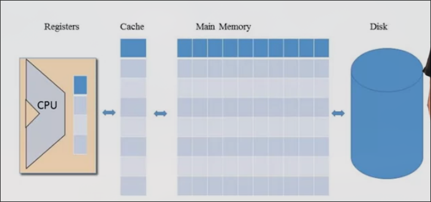

* 以CPU的角度，我们不必指定很大的地址，因为靠近CPU的存储空间（寄存器）空间很小
* 同时由于空间很小，访问速度会很快

离ALU越远，存储空间越大，访问效率越低

### CPU内部的最小内存：寄存器

CPU内部包含了一些最小的存储空间

它们的类型和功能是机器语言的一部分

访问它们非常快

**寄存器的类型**

* 进行运算操作并进行存储
* 存储主存中的地址，将会确定想访问主存时操作的地址

**寻址模式**

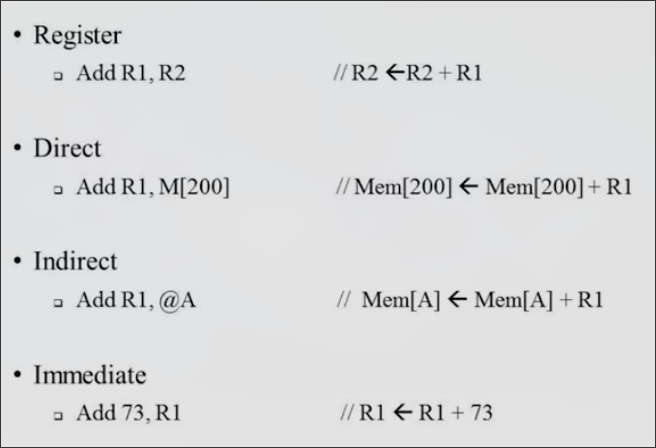

**如何控制输入输出设备？**

* 实际连接它们，把它们和寄存器相关联

### 流量控制

程序通常在按序执行，但是有时候，需要跳转

**无条件跳转**

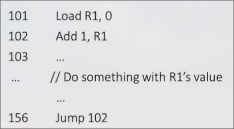

* 可以给要跳转的地点起一个名字比如 loop 
* 102行变为`loop: Add 1, R1`
* 156行变为`jump loop`

**有条件跳转**


## 我们的机器语言

机器语言设计和机器设计往往是齐头并进的

我们的计算机是16位的，这意味着其中信息的存储，运输都是以16bit为最小单位

它由以下几部分组成：

* `Data memory(RAM)` 由若干16bit寄存器组成
* `Instruction（指令） memory(ROM)` 也是若干16bit寄存器组成 
* `Central Processing Unit(CPU)` 可以使用其内部的ALU来操纵16bit值的设备
* 各种bus（总线）指令/数据/地址 来传输数据

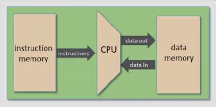

我们将为这台机器设计两种指令

* 16bit长度的A指令
* 16bit长度的C指令

**控制 The Hack computer 的过程**

* 首先把程序加载进ROM
* 按下重置按钮
* 程序开始运行

我们的计算机可以识别三个寄存器

* D寄存器 保存一个16bit数据
* A寄存器 保存一个16bit数据，表示当前选择的RAM寄存器地址
* M寄存器 映射了当前选择的RAM寄存器

### A指令 的语法

* `@Value`
* `value`可以是非负十进制常量，也可以是指代这种常量的符号
* `@21`会将A寄存器设置为21，同时RAM[21]成为选定的RAM寄存器，操作M寄存器此时会实际操作RAM[21]


### C指令 的语法

* `dest=comp; jump`dest和jump是可选择的
* 首先进行某些计算
* 然后可以选择把结果存储起来
* 也可以选择根据结果决定是否跳转

comp字段进行计算，为以下之一


dest字段进行存储，为以下之一


jump字段进行跳转，为以下之一

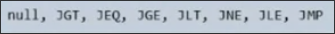

* 这些是跳转的八个条件，**这些条件总是将计算结果和0比较**
* 如果比较成功，跳转至ROM[A]

## The Hack 机器语言规范

目前我们有机器（ROM存放指令，CPU包括ALU处理数据，RAM存放数据）

还规定了两种指令（A指令改变操作地址，C指令赋值跳转）

而我们的机器语言是这些指令的顺序结合

这种机器语言有两种表达方式

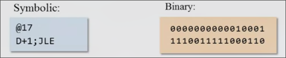

右侧是机器真实获取到的结果，如果我们以左侧的符号形式编写，则需要有负责将符号翻译为二进制代码的事物，这将是汇编程序的工作，我们将考虑这个程序。

### A指令的汇编

* `@value`，`value`可能是数字或者表示数字的符号
* 首先我们把`@`符号定为`0`，当机器获取以0开头的指令时，它会得知这是A指令
* 在`0`的后面，我们把`value`翻译成二进制（我们先暂时只考虑数字的情况）
* 在表示`@`的0和表示`value`的二进制中间，有若干占位的`0`

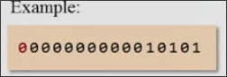

### C指令的汇编

* `dest = comp ; jump`
* 首先使用`1`作为C指令的标识
* 后面的两位不使用，但按照惯例设置为1
* 后面的7位表示计算comp,后续这些位将发送至ALU
* 再后面三位表示目的地`dest`，最后三位表示跳转条件`jump`

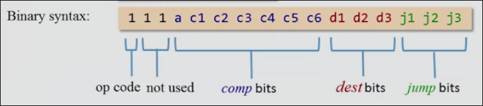

#### 计算位comp的汇编


#### 目标dest的汇编


#### 跳转条件jump的汇编


*一个实例程序*

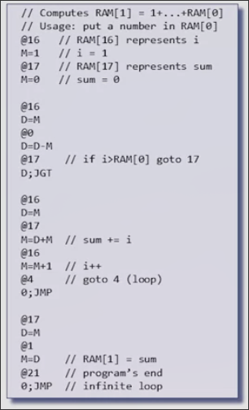

*其翻译的二进制机器语言程序*


最终二进制程序加载到计算机执行

## 机器语言控制输入输出设备

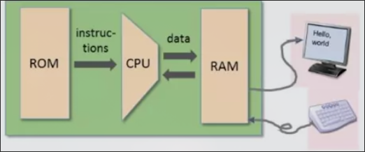

在高级语言如java,puthon等，我们有很多库进行输出，创建图片，动画等(这些我们将在本课程的第二部分讨论）

但是在机器语言中，我们唯一可以使用的就是Bits

### 控制输出到屏幕

* `Screen memory map`是一个RAM上的指定区域。显示器持续不断地获取`memory map`中的数据来进行刷新，每秒数次

我们的计算机屏幕由256*512像素组成，可以控制像素的打开与关闭（这是一个黑白屏幕）

内存映射是一系列的16位值

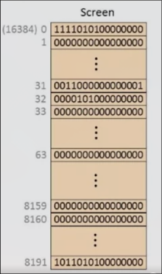

每组数据也被称为字，共计8k16bit的字（8k*16大约等于256*512,每一位对应操纵了一位像素，但是我们在我们的内存中只能16bit整体操作）

在我们的内存中，屏幕的第一行像素，对应了内存映射区域第1-第512 / 16 = 32行，也就是内存映射空间中每32行对应了屏幕的一行

在我们的计算机中，我们使用一种叫`Screen`的芯片来表示内存映射单元，其组成和API与RAM相同，但是整个RAM由Screen等组成，最终它们会组合在一起，我们通过整体RAM访问屏幕内存映射的时候，要加上Screen芯片的起始地址（如图所示）（为了避免与其他内存单元地址冲突）

**设置屏幕某一位像素的方式**


### 控制从键盘输入

键盘由电缆接入键盘内存映射空间

键盘内存映射是一个单一的寄存器（因为控制键盘不需要超过16bit的空间）

在我们的计算机中位于RAM[24576]

当我们按下按键时，按键的`scan code`通过电缆映射到键盘内存映射 


在我们获取按下按键时，只需要检查这个寄存器的值即可

## 低级语言编程 以 The Hack 为例

### 内存和寄存器

内存和寄存器是低级语言的基础

我们有三个寄存器 D A M


为了避免计算机在我们的程序结束后继续执行，执行空指令（可能会导致执行恶意程序）

计算机永远不会停滞不前，即便是不动鼠标，也会在后台执行程序

我们可以在程序结束后，让计算机做我们可以控制的事情，不妨使用这两行代码

```asm
6> @6 // 当前行
7> 0;JMP // 跳转到上一行，反复执行
```

### The Hack 语言的一些特性

* 十六个虚拟寄存器`R0..R15`（实际指代了0-15的值）
    * 他们用于在更改目标RAM地址为0-15时替换`@0-15`为`@R0-R15`
    * 这样使得A寄存器在作为数据存储和目标地址切换的功能分离
* The Hack 区分大小写
* `SCREEN`、`KBD`指代了它们实际的起始地址值
* 此外还有六个符号，为后续的高级语言使用

### 分支，变量，迭代

分支（选择结构）是告诉计算机评估某个布尔表达式的值，并决定是否跳转或继续前进


符号引导（标签）

*为了让程序更可读*

* 在我们的语言里可以替换`@`后面的表示行号的数字
* 语法是`(name)`，`@name`


变量

在低级语言，或者说在我们语言中，我们使用当个寄存器表示我们所有的变量

在我们的程序，使用`@name`声明一个变量，这个`name`不是任意标签名或者内置的如`R1`的关键字

当我们`@temp`时，我们的计算机会在RAM中找到空间的寄存器，然后设置其可用（把M和它关联），当我们之后再次`@temp`时，又会把M和其关联，我们就可以读写其中的值


汇编器对变量的处理是首先当`@`后的内容没有与之对应的标签或关键字时，识别为标签，并从地址16开始，替换其为地址

迭代

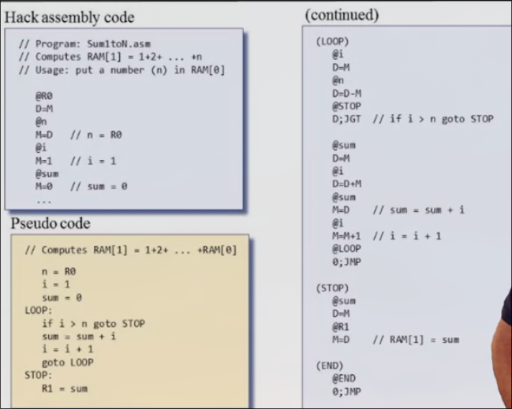

编写低级语言的技巧

1. 使用高级一点的伪代码设计程序（具有标签，跳转等）
2. 翻译成低级语言
3. 模拟其运行过程，记录主要变量的变化

## 指针 处理输入输出

指针即为存储地址的变量，在我们的语言中，最终会直接或者间接赋值给A寄存器，来操纵目标地址

输出就是要控制屏幕的内存映射

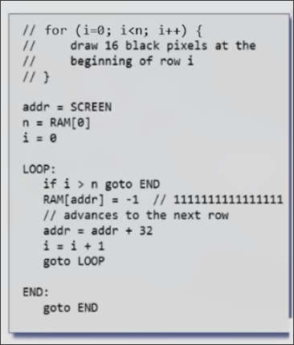

输入要检查当前的@KBD - M的值

## Project 4 概述

本项目旨在体验低级编程，初步了解与硬件的交互

* 编写一些代数运算
    * R2 = R0 * R1
    * 事先在R0和R1存放数字，运行后R2为正确的结果
    * 利用循环
* 与键盘和屏幕交互
    * 监听按键，当任意按键被按下，屏幕完全变黑，再次抬起，重新变白
    * 尝试一些特殊的顺序，使其变白或变黑

文件的命名一般以大写字母开头，`.asm`作为后缀

规范：

* 合理的注释，代码简洁优雅
* 使用标签和变量
* 变量名小写，标签名大写
* 使用缩进（按照之前的若干事例）

## 机器语言单元 Q&A

**HACK机器语言和典型计算机的机器语言有何不同？**

我们的机器语言很简单，其旨在非常简单的硬件平台上运行（但是它非常强大，可以提供需要的任何东西）。典型的机器语言指令集会丰富许多（更多的命令，更多的指令类型，更多的数据类型比如浮点数，更多的运算比如乘除法）。但是这些花哨的东西都可以在更高级的软件层面实现。

**在我们的机器中，做一些事情往往需要两条指令（A&C），一个用于对寄存器寻址，一个用于对寄存器操作，这是标准的方式吗？**

大多数机器语言比我们的更复杂更强大，并且通常允许我们在单个指令中指定操作对象和操作方法。但是我们的计算机只有16位，这很困难去同时在16位中存放这么多信息

不过我们的处理（寻址和操作分开）在很多其他机器语言中都存在这种想法。

**我们的机器语言有很多特别的语法，这些语法是怎么抉择出来的？**

区别与高级语言，低级语言旨在服务于机器，它必须直接操纵ALU、内存、寄存器，同时保证高效。我们的语法比一般机器语言的语法做出了简化。

* 在我们的语言中，加法表述为`D=D+M`
* 而普通的机器语言中，通常以运算符开头，如`ADD D ADDR`

* `D=M` <= `LOAD D M`

**人们必须要经历使用机器语言编程的麻烦吗？**

人们通常不使用机器语言编程，有些开发人员会编写生成机器语言代码的程序（编译器），这就要求他们很了解机器语言（我们在第二部分的工作之一）

在某些应用程序，尤其是实时系统中，对性能要求非常高时，程序要有时需要检查机器语言代码的细节（通常用C语言等编写，在编译成机器语言后，进行检查，再重新编写高级语言代码）


