# 5 计算机体系结构

## 冯诺依曼结构

我们的计算机通过完全相同的硬件运行不同的软件，它可以做任何事情

这种结构理论上叫通用图灵机，而真正实现其架构的为冯诺依曼结构

在上一周，我们应用它，了解到它可以做到任何事情，本周我们组建它

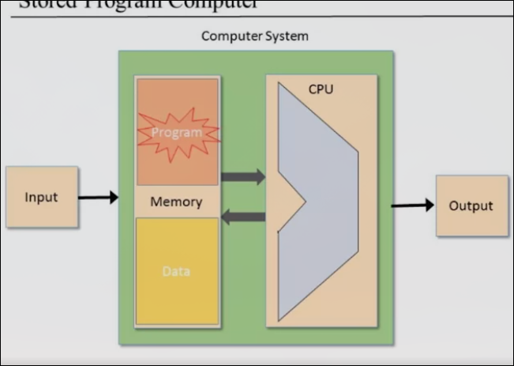

* 存储单元：存储数据和要执行的程序要
* CPU执行指令，运行并控制

### CPU的构成

有两个部分组成，ALU（算术逻辑单元）以及若干寄存器

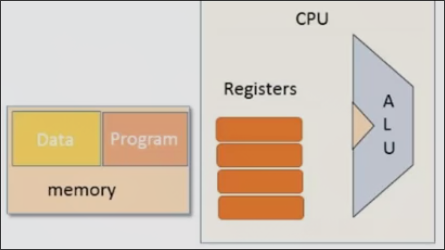

### 内存的组成

包括存储数据和存储程序的部分

这些部分间如何交互？计算机中信息是如何从一个部分走到另一个部分的？

### 信息流

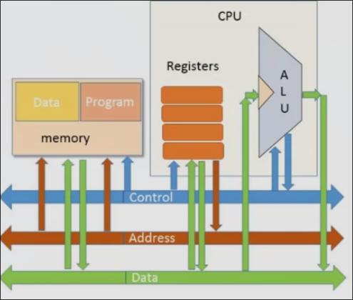

计算机中有三种信息

* Data 数据 比如数字要进行加法运算，需要从一个地方移动到另一个地方，比如从逻辑单元到内存
* Address 地址 我们现在要执行什么指令，我们要访问内存中的哪个位置，这由地址控制
* Control 控制 告知系统每个部分在特定时间点做什么

这三部分通常由电线控制，每一组称为bus（总线）

### 逻辑单元的信息流

逻辑单元需要接收数字（数据总线输入），并被告知进行一些逻辑操作（控制总线），最终输出结果（数据总线），并且结果能控制其它部分如跳转（控制总线输出）

### 寄存器的信息流

寄存器可以存储中间结果（数据总线输入），一些寄存器可以用来指定目标内存的地址（地址总线输出）

### 内存的信息流

其数据存储部分，内存从地址总线中获取需要使用的地址，并且与数据总线发生数据交互。

而其另一部分，程序部分，从地址总线中获取需要的地址，同时从程序内存中获取指令，并把数据部分（如把5加到某个寄存器）放入数据总线，同时向控制总线发送信号以控制系统的其它部分

## 读取指令

本节我们关心计算机如何一条接一条的读取指令

获取指令-执行-再获取-再执行

我们通过操纵程序计数器来确定下一条指令的执行位置，程序计数器的输出连接到ROM的地址输入，之后ROM就会输出对应地址的指令

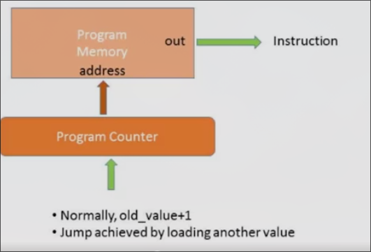

以上就是程序的获取阶段

而在指令的执行阶段，我们获取表示特定的位（表示一系列同类操作都在同一些位上），然后根据这些位实际决定要做什么

在硬件视角，获取到的指令将通过控制总线进入CPU等等，控制总线能做的事情很多，包括告知ALU执行什么指令，数据从何而来（更微观的如何做到将在后续讨论）

**解决取指令、取数据的地址访问冲突**

*冯诺依曼结构没有把数据和指令地址区分，与之相反的是哈弗结构，数据存储和指令存储分离*

通过多路复用器，在读指令期间其定位到指令区域，而执行指令时（会读取数据）定位到数据区域

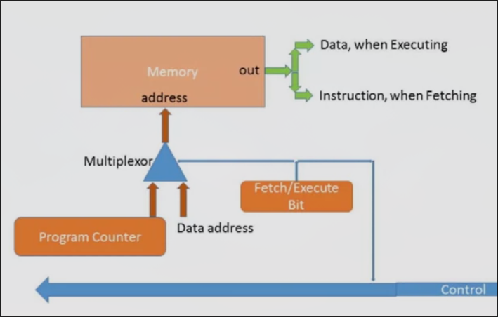

取指令之后，我们把指令存放在指令寄存器，以便执行阶段使用

## CPU 中央处理器 以我们的CPU为例

CPU是计算和控制中心，决定应该获取和执行哪条指令

**把Hack CPU当作黑匣子**

给入一条Hack语言编写的指令，其会执行这条指令

在执行的过程中，还会弄清楚接下来该去执行哪条指令

**CPU的接口**

* 输入 inM[16], instruction[16], reset
* 输出 outM[16], writeM, addressM[15], pc[15]
* inM[16] 来源于数据存储器，表示当前M寄存器的值，即选定的RAM寄存器值
* instuction[16] 所选指令寄存器的值（ROM中当前输入的指令）
* reset 来源于用户（我们在后续讨论）
* outM[16] 想要向RAM某个寄存器中写入什么 
* writeM 表示允许写入到RAM
* addressM 表示向RAM写入数据的地址
* pc 保存了下一条指令的地址，以便在下一个周期获取执行

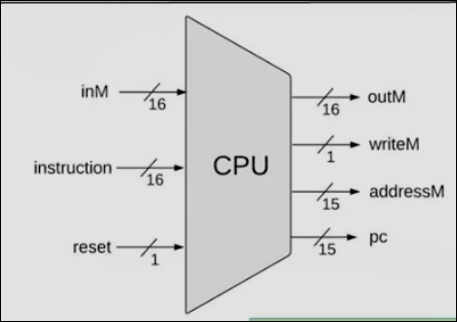

**CPU的架构**

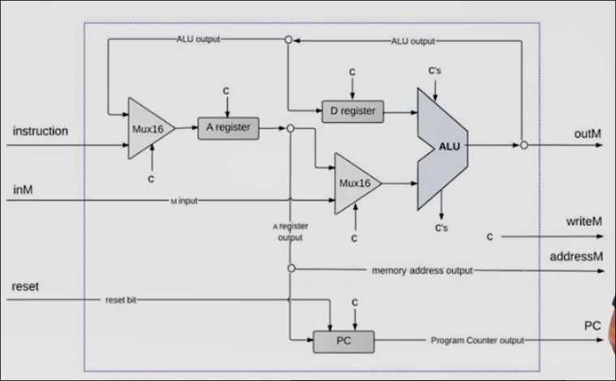

### A寄存器部分

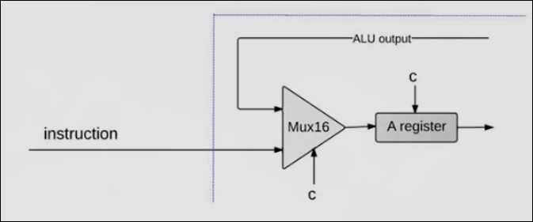

* 当`instruction[16]`传来A指令（以0开头，后15位表示地址来改变A寄存器的内容）
    1. CPU首先把它解码为1+15bit的值
    2. 然后查看首位，当发现首位为0,则断定这是A指令，把后续地址放入A寄存器
    3. 并把通过A寄存器的输出，发送至最终addressM[16]的输出，完成对RAM地址的指定
* 当传来C指令（以1开头，后2位保留，7位comp字段，3位dest字段，3位jump字段）
    1. 首先解码指令，根据第一位判断出C指令，之后解码出comp(ALU control bits), dest(Destination load bits), jump(Jump bits)
    2. 把他们输入不同的部分
* 此外Mux16还接受来自ALU的输出，即在接收C指令时，目的存储为A寄存器的情况

### ALU的部分

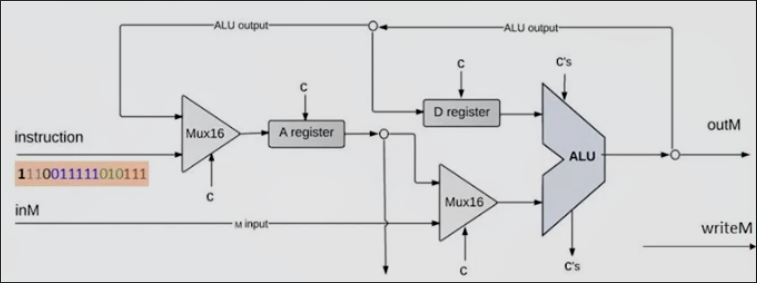

ALU的输入来自与D寄存器和（A寄存器或M寄存器即RAM中的当前寄存器）

此外ALU还获取来自指令的六个控制位

ALU的输出可能被总往三个目的的A寄存器前的Mux16、D寄存器、outM（受dest控制）

此外ALU还有两个输出控制位（ZR、NG）

### reset部分

按下后程序会运行当前的程序

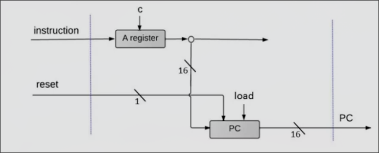

当指令的最后三位000时，不跳跃，111时，无条件跳跃。

* 在开机时，我们希望PC重置为0
* 而在指令jump字段000时，我们希望PC自增
* 如果为111,我们希望PC=A
* 如果部分为1,我们希望有条件跳转，则查看ALU的输出并决定是否可以实现，如果不能实现，则自增

而这种架构实现了我们的想法

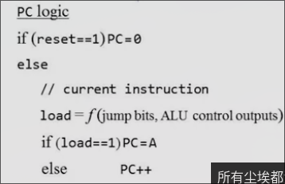

而PC的输出即为下一条指令的地址

## The Hack 的整体架构

能够运行Hack机器语言的计算机，可以通过键盘和屏幕进行交互

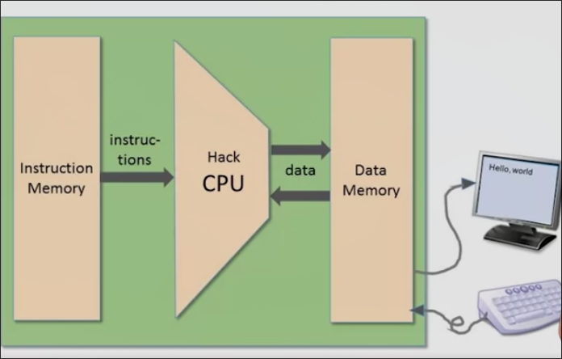

### CPU 

*CPU是如何处理具体的指令的*

* `D=D-A`
    * 当指令中存在D或A寄存器，CPU操纵位于内部的D和A寄存器
* `@17`
    * CPU通过第一位断定这是A指令，之后获取后续15位的值，并存入A寄存器
* `M=M+1`
    * 当指令右侧（COMP）提及M寄存器，CPU会处理inM[16]
    * 当指令左侧（DEST）提及M寄存器，CPU会在输出outM[16], wirteM, addressM 中输出
* `@100` `D=D-1;JEQ`
    * 当`reset`为0时，CPU根据ALU的输出以及JUMP字段决定是否跳跃（load是否为1），如果跳跃，PC设置为A寄存器，更新的PC输出的CPU的PC引脚
    * 如果`reset`为1，PC设置为0

### 数据存储器（Data Memory）

* 0-16k 存储程序生成和操作的数据（RAM）
* 接下来的8k 为屏幕内存映射
* 最后一个寄存器用于反应按下的keycode

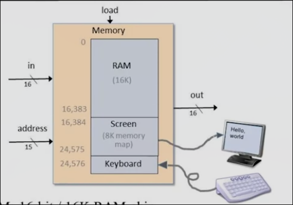

* 输入 load 加载位，连接CPU的writeM
* 输入 address[15]，连接CPU的addressM[15]
* 输入 in[16]，连接CPU的outM[16]
* 输出 out[16]，连接CPU的inM[16]

由三个芯片组成，而`Screen`和`Keyborad`芯片即为特殊的RAM和寄存器（无输入，只有一个输出引脚out[16]）

### 指令存储器 ROM32k

可以把程序加载其中，然后按下重置按钮，程序开始运行

加载的方式：烧录进ROM, ROM即插即用；硬件模拟

工作原理和ROM几乎相同 

* 输入 address[15]，连接PC[15]
* 输出 out[16]，连接CPU的instruction[16]

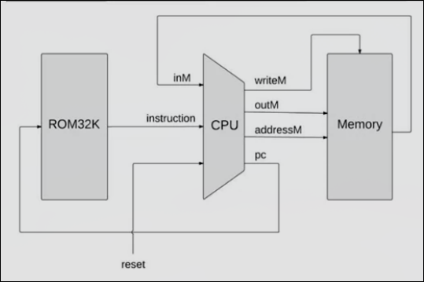

## Project 5 概述

我们实现计算机（抽象为一种非常高级的芯片），其以CPU和内存单元作为主要组件

CPU包含几个寄存器，一个程序计数器，一个ALU

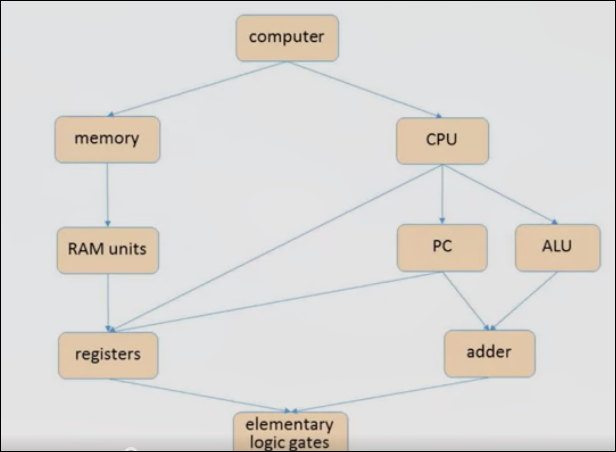

### 构建CPU的技巧

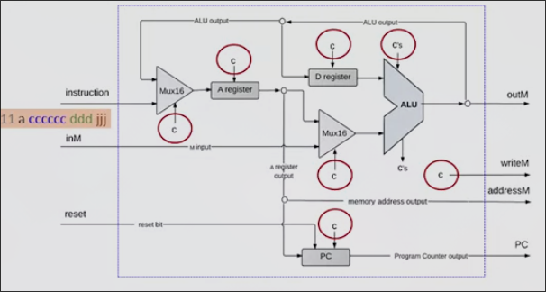

* 首先组成CPU的所有芯片都是我们之前所构建的，我们只需要按序组合就好
* 所有控制位`c`大多来自当前的指令
    * 比如C指令，由若干字段构成
    * 我们的任务是解包这些控制位，并把它们路由到正确的目的地
    * 有一些控制位需要添加一些逻辑

## 计算机体系结构 Q&A

**冯诺依曼结构和哈佛结构的区别？**

在我们的计算机中，程序的只读内存和读写存储器分开。这种分开的结构称之为哈佛结构，而冯诺依曼结构（更多的类似于风格）中，只有一个存储器（包含数据和程序存储），而这种一体化的结构中，我们需要额外的访问程序指令，而下一个周期，我们执行访问数据存储器的程序。而哈佛结构可以在一个周期就完成这两件事。

这种哈佛结构很适用与嵌入式计算机，因为嵌入式计算机把程序加载进去，再运行即可。而真实的想要不断更改运行程序的通用计算机，更适合冯诺依曼结构。

**是否可以模拟冯诺依曼结构这种在不同时期做不同事情的方式？**

哈佛结构也可以模拟这种冯诺依曼的状态，这种不同时期做不同事情可以通过有限状态机来表示，而我们可以用组合逻辑芯片来模拟这种状态机，把它的输出接入计算机，同时计算机也可以决定它下一步的输入来影响其状态。

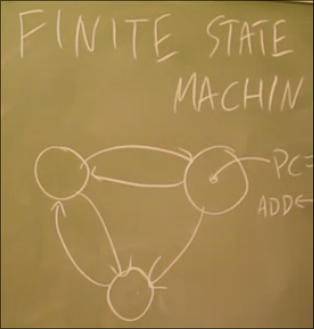

**我们的计算机可以和键盘和鼠标交互，那么如何连接更多的外围设备呢？**

如麦克风，磁盘等，我们同样可以分配内存空间来代表一个外围设备，当我们操作使用这些设备时，我们可以将代码写入存储器，这些代码稍后会转换为操作这些设备的物理信号。

但当设备过多时，CPU会变得过载，一种办法是不再让CPU管理设备，而使用设备控制器，如添加磁盘时，磁盘将适配设备控制器，其内部知道如何管理，如何将CPU执行的操作转换为磁盘的实际移动。

以屏幕为例，我们来操作屏幕显示图形完全依靠CPU，而真实的计算机配备显卡或者图形加速器，根据控制开关像素是这些专用设备的任务

