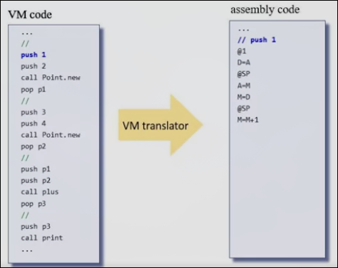

# 机器语言入门

本章讨论机器语言的基础知识（本章与第一部分机器语言单元重合）

机器语言是软硬件的交互点

**VM翻译器**

VM（虚拟机语言）将通过VM翻译器（我们之后通过真实高级语言编写的程序），这个翻译器将VM代码视为输入，以Hack汇编代码作为输出

逐句翻译VM代码，将每一句转换为若干汇编代码

因此我们需要理解这种汇编（机器语言）代码，故引入本章的学习（Part1 Unit4）

[此处查看Part1 Unit4](../Part1/Unit4.md)
