# 虚拟机

一段高级语言代码执行的底层过程

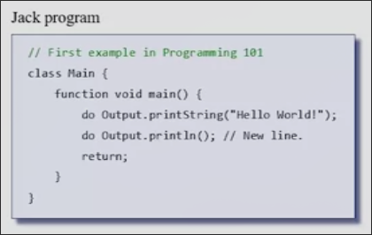

当我们编写出这样一段`helloworld`程序，这只是一段文本，我们通过一定方式将其转换为一组低级指令，使得计算机完全理解我们的意图。

计算机如何在屏幕上显示图像或者“hello, world“？如何显示H？如何显示单个像素？

诸多技术细节是汇编器，编译器，虚拟机，操作系统在工作,而高级程序员不关注于这些细节。

在我们的计算机中，程序员写好`.jack`语言程序，连同其引用的类文件交给`compiler`编译器，编译器把各个jack文件编译成`.vm`文件，然后由`vm translator`翻译成一个`.asm`汇编文件,最终通过汇编器生成`.hack`

## 为什么引入vm？

高级语言最终会编译成机器语言

全世界的计算机有不同的种类，我们希望高级程序可以在许多不同的平台运行，但是不同种类的计算机有着不同的机器语言。

因此需要开发不同的编译器来处理不同的架构，同时需要发布所有这些不同种类的编译器

而替代的方案就是引入虚拟机，实现”write once, run anywhere"，最典型的例子就是Java

Java无法直接编译为机器语言，而是采用"两层编译":

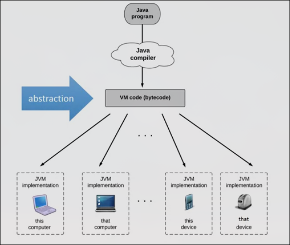

1. Java编译器将Java源文件编译为"字节码" （对应我们的Jack编译为VM码的过程）这种字节码或是VM码被设计为在一个抽象的”虚拟机“上运行
2. 通过JVM（输入字节码，输出目标平台的机器语言）进一步把字节码翻译为目标平台的程序（对应我们将VM码翻译为机器语言的过程）

通过引入的字节码，我们将高级语言和汇编语言之间的巨大差距分解了，同时当编译器程序员适配新平台时，不必直接考虑将Java翻译为其汇编语言，而是将低级一些的字节码翻译为汇编语言。

而同样的，我们也在自己的真实电脑上，运行Jack代码，通过一个VM虚拟机。我们会实现Hack计算机的VM翻译器。

## 栈

对于vm代码，我们一方面希望足够高级（缩小高级语言和vm语言之间的差距,方便编写高级语言编译器）,而另一方面我们希望其足够低级,以缩小其与目标汇编语言的距离，使得翻译器（虚拟机）的编写更容易。最终我们在这两点间寻求平衡。

而多年来，找到的平衡点，这种虚拟机被成为`stack machine`，这种栈机器是一个抽象概念，由一个栈和一组操作组成。

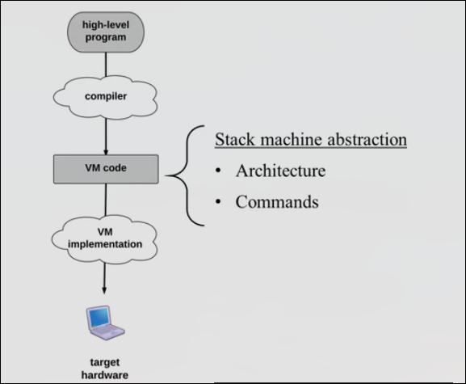

Stack栈是一种数据结构，一段封闭,允许从顶部进行`push`和`pop`操作。（类似于一摞盘子）

栈顶指针sp总是指向下一个push的盘子将要放置的位置即栈顶。

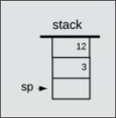

#### 虚拟机与栈

在虚拟机程序中，栈与预先分配给虚拟机的内存空间配合使用：

1. 我们实现在虚拟机的内存中标记若干位置`x`，`y`
2. 当我们`push x`，标记x对应的空间存储7，7会被添加到栈顶sp
3. 当我们`pop y`，首先我们移除栈顶的元素，之后会将这个被移除的元素存储在内存中标记y的空间

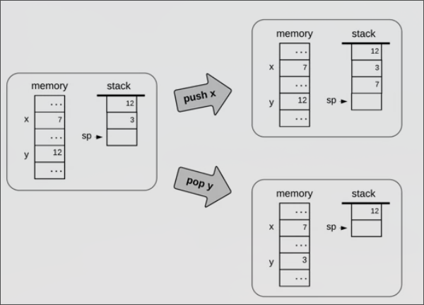

**此外我们还有一整套命令**

#### 算术/逻辑命令 

任何语言编写的算术/逻辑语句总能写成一系列这些命令

* `add` 最高的两个元素出栈，然后将计算他们的和，将和入栈
* `sub` 最高的两个元素出栈，将先出栈的作为减数，后出栈的作为被减数，将差入栈
* `neg` 将最高元素出栈，取反后入栈
* `eq`  最高的两个元素出栈，比较他们的值，将`true`或`false`入栈
* `lt`  判断栈中第二个元素小于栈顶元素？
* `gt`  判断栈中第二个元素大于栈顶元素？
* `or`  最高两个元素出栈，（布尔类型）将Or运算的结果如栈
* `and` `not`

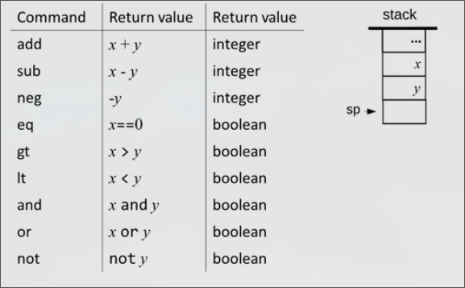

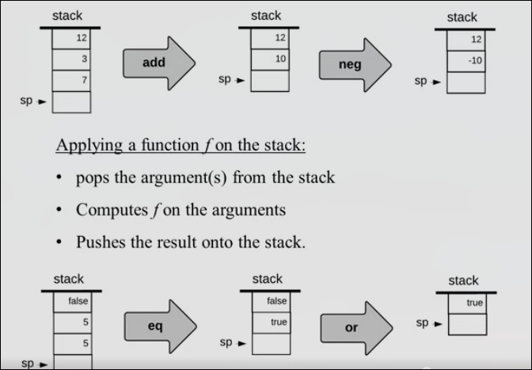

这些命令来自于哪里？

我们最终并不实际使用这些命令打交道，课程后期我们构建的编译器将高级语言转换成这些vm码

### 内存段

在高级语言中，不同的变量有不同的作用，如`静态变量` `局部变量` `形参`等等，我们希望在虚拟机的抽象上也能体现变量的不同

我们的虚拟机不只有一个内存，其包含多个内存段如`argument`, `local`, `static`等

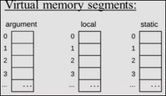

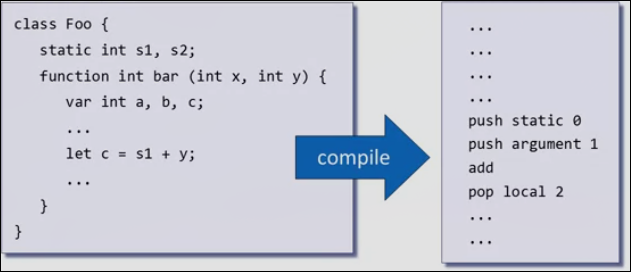

实际上这个过程舍弃了变量名

此外我们还有常量内存段(constant)，用来存储常数0,1...

因此我们的若干内存段和栈之间通过push和pop以及内存段名+索引进行交互

我们的全部内存段

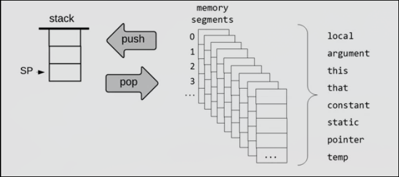

### 建造虚拟机 入栈命令的实现

* 我们需要在RAM上选择合适地址来映射需要的8个内存段
* 需要把命令转换为汇编语言，来实际操作空间

#### 指针操作

* 解引用`D=*p`表示p（所在空间的内容）视为地址，然后`*`得到地址的内容(D=RAM[p]) = `@p` `A=M` `D=M`
* `p--` `D=*p`会得到RAM[p-1]的值

#### 入栈操作的汇编

栈指针sp存在RAM[0]，其值也就是指向，从256开始

想要入栈，首先把入栈的值通过解引用赋给指针指向的空间，然后指针自增完成操作

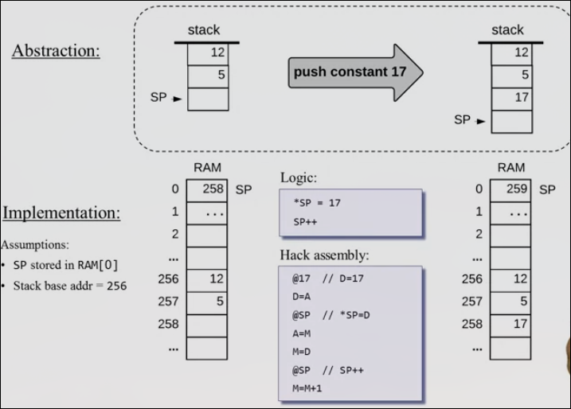

### 内存段的实现

以local内存段为例，我们将local的基址存放在RAM[1]，并把它作为变量LCL，因此LCL是指向local段基址的指针 

local段的pop实现：

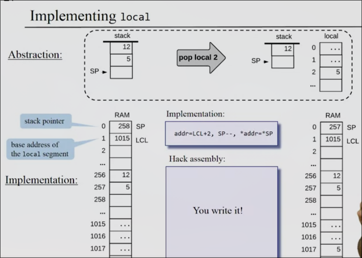

其余的内存段指针依次为`LCL`,`ARG`,`THIS`,`THAT`

#### 常量段的实现

常量只有`push`操作，在是一个虚拟段，我们通过`*sp=i,sp++`完成

#### static段的实现

与local等局部作用域的变量不同，static变量作用在当前文件

我们在机器语言中将static段所操作的值作为变量处理，因此静态段最终会位于16-255（变量存储区域），方便程序的其余部分如函数等访问

```
// Foo.mv
pop static 2

=>
// .asm
@Foo.2
M=D
```

#### temp段的实现

当编译器将Javk转为vm代码会需要一些临时变量

实现为一个固定的长度为8的内存段，位于RAM[5-12]

```
// push
push temp i

=> 

addr=5+i
*sp=*addr
sp++

// pop
pop temp i

=>

addr=5+i
sp--
*addr=*sp
```

#### pointer段的实现

存在两个指针0、1来操作THIS和THAT（在编译器中代表当前对象和当前对象在处理的数据）的基址

只存在如下操作

```
push pointer 0/1
pop pointer 0/1
```

```
// push
*sp=THIS/THAT,sp++
//pop
sp--,THIS/THAT=*sp
```

## VM模拟器

一个高级语言编写的程序，可以模拟执行vm代码

与翻译器的区别：

* 翻译器只是把vm代码作为输入，汇编代码作为输出
* 而VM模拟器模拟"执行"了vm代码(可以视为翻译器+执行，不过底层可能并不是先翻译为某种机器语言，而是直接模拟）

**用途**

* 运行编译后的JACK（VM码）代码
* 运行测试脚本
* 来学习理解虚拟机的抽象（单步运行VM程序，并观察指令的影响，如栈，各内存段）
* 观察虚拟机抽象在真实平台上的实际托管方式（可以看到Hack平台的RAM）

## The hack计算机上的虚拟机实现

vm翻译器是一个由高级语言编写，输入为vm码，输出为目标平台的汇编语言（每当翻译一条vm指令，同时以注释的形式生成该vm指令

我们要处理的vm指令如下

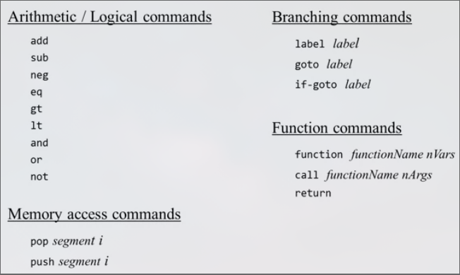

本项目我们只关注算术逻辑和内存指令

而目标语言的介绍如下

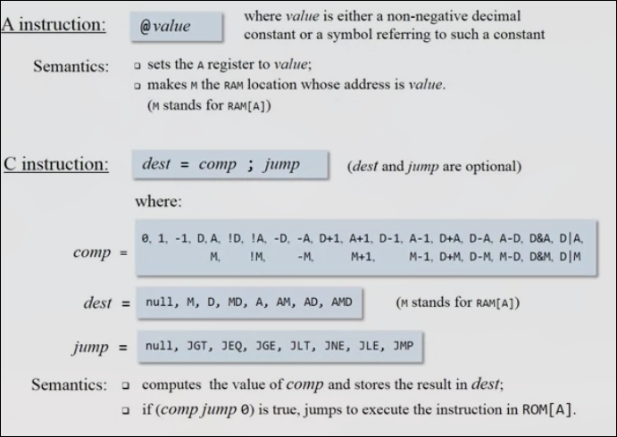

如何在RAM上选取合适的位置来存放内存段？

我们提供了标准映射

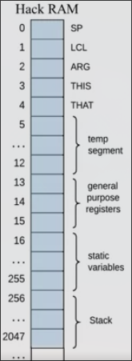

我们在翻译为汇编语言时，采用如下一些标签

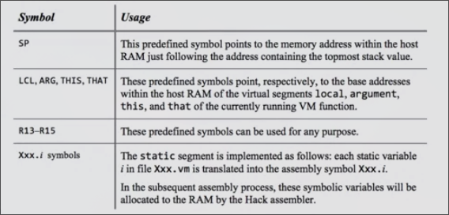

## 使用高级语言构建翻译器的建议

建议开发三个独立的模块

* Parser
* CodeWriter
* Main 

### Main 主模块

以`.vm`文件作为输入，`.asm`文件作为输出

1. 构建了`Parser`解析器
2. 构建了`CodeWriter`代码编写器
3. 遍历输入的文件，分别处理文件中的每一行
    * 将每一行输入到`Parser`进行解析为各个组，也就是虚拟机的各个元素
    * 将组传递给`CodeWriter`，生成汇编代码，写入`.asm`

### Parser 解析器 

读取`.vm`文件，并逐行将vm码拆分成单个元素，同时删除注释和空行（忽略）

* 构造函数 打开输入文件进行处理 `Parser(string fileName)`
* 获取是否还有更多命令（是否已到达末尾）`bool hasMoreCommands`
* 前进到下一行，并进行分解操作 `void advance()`
* 查看当前的命令类别 `string commandType`
    * 根据算术逻辑、push、pop等 分为如下类别

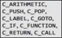

* 当前命令的参数 `string arg1` `int arg2`
    * 参数的表述如下

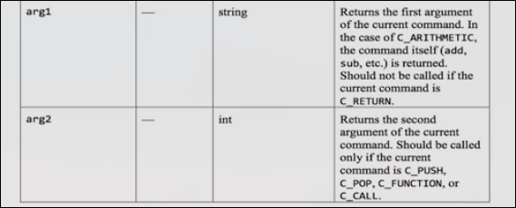

### CodeWriter 汇编生成器

输入解析后的vm码，输出汇编代码

* 构造函数 打开输出文件并准备写入 `CodeWriter(string fileName)`
* 编写逻辑算术命令的汇编代码 `void writeArithmetic(string cmd)`
* 编写push，pop命令的汇编代码 `void writePushPop(string cmdType, string seg, int index)`
* 关闭输出文件`void close()`

## Project 1 构建vm翻译器 初步

由高级语言编写可以将前两类（算术/逻辑、内存）vm码翻译为汇编语言的程序

在每一句的翻译前，应输出vm码的注释到`.asm`

我们提供5个测试文件

* `SimpleAdd.vm`
* `StackTest.vm`
* `BasicTest.vm`
* `PointerTest.vm`
* `StaticTest.vm`

建议先在vm模拟器中运行，尝试理解程序的目的和执行过程

最终在把翻译得来的`.asm`加载入CPU模拟器时，会不能执行，因为我们的vm代码没有初始化，因此需要把测试脚本`.tst`先加载入cpu模拟器
