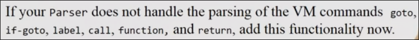

# Unit 2 虚拟机 第二部分

## 程序控制

**函数的概念** `disc`函数是被扩展出来的，是基本命令中没有的，我们可以任意地实现命令的扩展

* `call function`
* `function function`
* `return`

**分支的概念** 

* `goto label`
* `if-goto label`
* `label label`

## 分支命令

通过引入分支命令，我们的vm程序可以是非线性的

分支可以实现向前或向后的跳转，并更进一步实现循环等结构

分支分为有条件分支和无条件分支

### 无条件分支 `goto`

* 声明标签 `label LOOP`
* 执行跳转 `goto LOOP`

### 有条件分支 `if-goto`

* 在执行条件跳转前确保栈顶已经判断出需要的布尔值`gt`
* 跳转`if-goto LOOP`，栈顶值出栈，当栈顶值为真，执行跳跃

## 函数命令

### 函数的调用

这里的Math类是我们之后实现的操作系统的一部分

通过 `call function n`实现 指定了函数名和参数

在函数调用前，需要将函数的参数先放到栈上，而当函数调用完毕，函数的返回值会替代栈上之前参数的位置

### 函数的定义

我们可以自己在vm程序中实现函数，从而添加更多的功能

* `function mult 2` 分别规定的函数名和参数个数
* `return` 标识着函数的结束

函数的调用语句被称为`caller`，函数的声明被称为`callee`

1. 当函数调用时，程序进入callee，并初始化属于callee的空栈
2. 把caller中传递的栈上参数传给属于callee的argument段
3. 之后对属于callee的argument, local等段进行若干操作
4. 在return时，会携带属于callee的栈顶元素返回

5.返回caller后返回值替代之前传递给callee的argument的栈上元素

**函数模型要做的事情**

当call发生时

* 以某种方式传递参数（从caller到callee，进行握手）
* 从调用者的代码中确定返回地址，以顺利返回到下一命令
* 存储要返回的地址
* 保存caller的当前状态，包括caller的栈，local, argument等内存段

当return发生时

* 返回给caller(的栈)，callee计算的值（因此，任何函数返回前，需要在其栈上存放1值）
* 回收callee使用的栈，内存段
* 重建caller的世界，栈，内存段
* 跳回caller的下一条语句

## 函数的调用和返回实现 预览

调用链：a函数调用b函数，b函数又在其函数体内调用c函数...

状态：当函数仍位于调用链上时（没有return），我们需要保存其信息（栈，内存段，地址...)

**如何实现呢？**

函数的模式是后入先出 LIFO 符合栈结构的特点

当call发生时

1. 设置ARG指针于caller的栈上将传入的参数处，完成对callee的参数传递
2. 在当前的栈上创建caller的"框架"，依次包含了返回的地址，`LCL`指针, `ARG`指针，`THIS`指针，`THAT`指针，完成对caller状态的保存
3. 跳转到callee的代码

当来到callee的`function foo nVars`，callee依据`nVars`得知初始化几个locals

1. 在栈上初始化nVars个空间作为locals, 并将LCL指向开始的地方
2. 之后即可运行函数体语句

当return时（事先已经在栈上存放了要返回的数据）

1. 把栈顶值取出，复制到ARG 0（由于ARG 0指向的是上一个函数传入参数开始的地方，看图）
2. 恢复caller的ARG，LCL, THIS, THAT
3. 清理栈
4. 跳转到caller代码地址

### 全局栈

函数的状态和数据随着函数链在同一个栈上依次排列构成了全局栈

全局栈中，块是一个函数的世界，包含着传入参数，caller的状态，callee的栈，内存段等等

## 模拟函数调用

## 函数命令和架构的代码实现

在vm转换器中利用标签和跳转实现

当call发生时

当执行`function Bar.mult 2`时

当执行`return`时

## 在Hack平台实现VM转换器

多个vm文件会被汇编进同一个.asm文件

从vm到汇编时，我们失去了函数这一概念，我们在汇编中找到合适的方式来实现vm的语义

### Booting

在计算机启动时，如何执行程序

任意一个vm程序都存在一个`main.vm`

当每次vm程序开始运行时，会执行操作系统函数`Sys.init`，`Sys.init`会调用`Main.main`，开始运行

我们需要在ROM中存放以下指令作为计算机的启动指令

用到的符号

## 用高级语言实现完整的vm翻译器

* 扩展处理多个vm文件的能力：将多个vm文件翻译为一个`.asm`文件
* 使用和前一个项目相同的三个模块`Parser`, `CodeWriter`, `Main`

### Main 模块

输入 一个单独的vm文件名 或一个目录名，其中包含一个或多个`.vm`文件

输出为 fileName.asm或目录名.asm

1. 构建`CodeWriter`
2. 如果输入是单独的文件，构建`Parser`对其进行处理，通过输入文件中的每个命令遍历，并把结果交给`CodeWriter`，输出汇编代码
3. 如果输入是目录，则会对目录中的每个文件进行如上的处理

### Parser 模块

* 处理一个单独的vm文件
* 读取一个vm指令分解为其各个词汇
* 和上一个项目中基本相同，只是新增了一些命令

### CodeWriter 模块

之前的CodeWriter

需要新增如下功能

* `setFileName(string fileName)` 通知CodeWriter新VM文件的处理刚刚开始
* `writeInit()` 写入Booting代码
* `writeLable(string label)` 生成`label`的汇编代码
* `writeGoto(string label)` 生成`goto`的汇编代码
* `writeIF(string label)` 生成`if-goto`的汇编代码
* ...

## Project 8 构建完整VM翻译器

本项目中，构建处理多文件，包含分支和函数命令的vm翻译器

我们有一些测试文件供检查，和上一个项目相同的要求

