# Unit 3 Jack高级语言

## 认识

### hello world

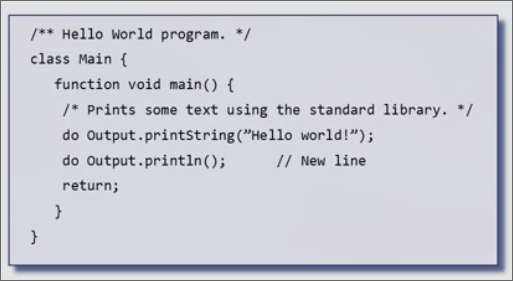

**注释**

*在Jack语言中，有三种注释*

* `/**...*/` 可以由外部工具处理（类似`Javadoc`）的描述API的注释
* `/*...*/`多行注释
* `//` 行内注释

**缩进**

Jack编译器会忽略缩进和空白部分，我们使用合适缩进来使得代码更可读

### 计算平均值

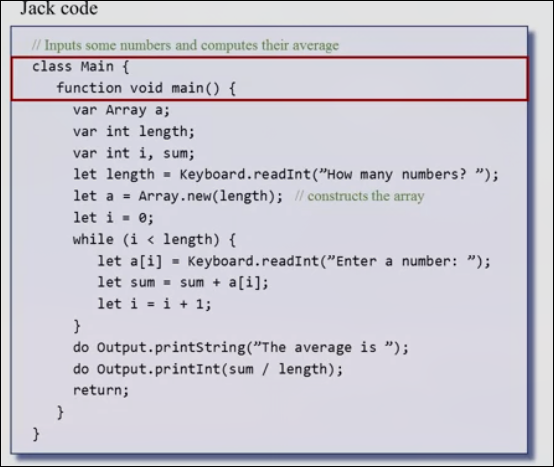

* Jack程序是类的集合，包含一个或多个类，其中一定要有一个Main类，并且Main类中一定要有一个main函数作为程序的入口
* Jack程序提供流程控制语句`if / if...else while do`
* Jack程序中的数据作为实例进行实现`let a = Array.new(length);`，这个数据类是操作系统的一部分
* Jack程序可以在同一数组存放不同数据类型
* 如`KeyBoard`, `Output`这些类包括其方法同样隶属于操作系统
* Jack程序中有着如`int`, `char`, `boolean`等数据类型，此外还有类数据类型如`Array`

## 面向对象编程

Jack只有三种数据类型，而数字类型只有`int`一种

### 扩展分数

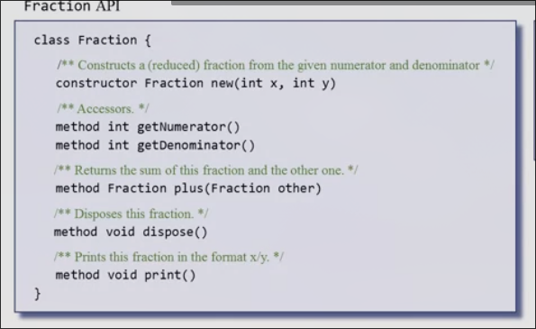

* 包括构造分数、获取分子分母、分数相加、释放内存、打印的功能

**相加2/3和1/5**

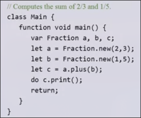

**分数类的部分设计实现**

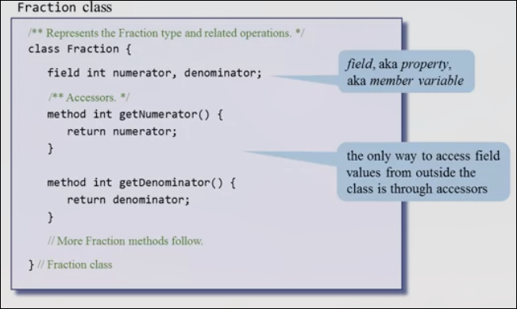

在Jack中，类内的成员变量（属性）在外部只能通过向外提供的方法接口来访问和改变

**构造函数**

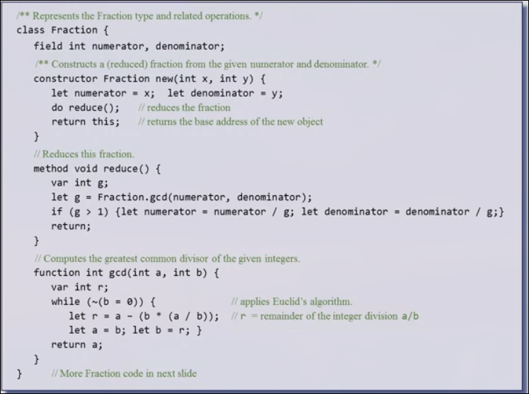

构造函数中调用成员方法`reduce`进行分数的化简，如`4/8`化简为`1/2`, 而`reduce`的实现使用了静态函数`gcd`，后者通过欧几里得算法实现了最大公约数的获取

* 方法用于对当前对象进行操作
* 函数不操作对象，相当于Java中的静态方法
* `this`存储当前对象，实际上是一个内存地址，是当前对象在ram中的基址，构造函数需要返回（Java中隐式返回，由编译器进行处理）
* Jack中所有的函数、方法都要进行返回，如果没有返回值可以`return;`（Java中这一过程隐式进行）

**加法方法**

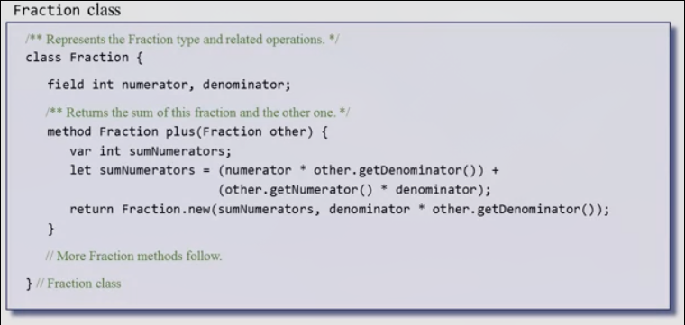

**打印方法**

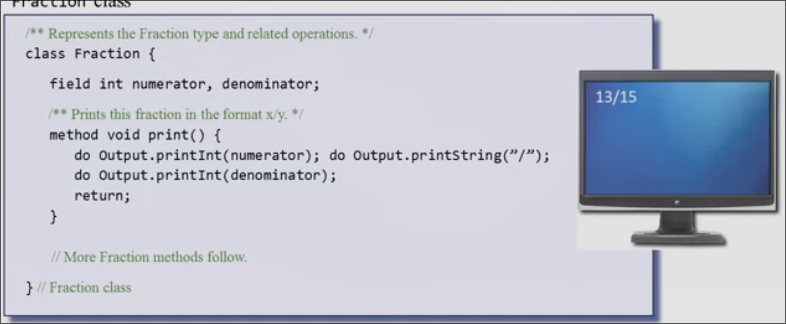

**释放内存**

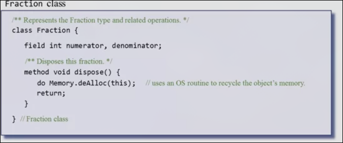

* `memory.deAlloc`是一个操作系统的方法，用来释放内存中的地址

### Jack底层

内存中分为栈区和堆区，堆区用来存储对象和数组，栈区用来存放其余内容

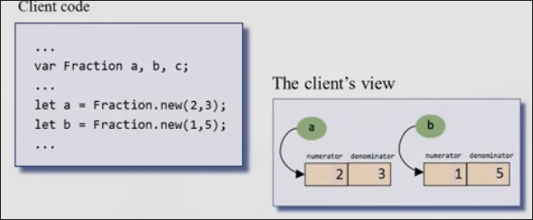

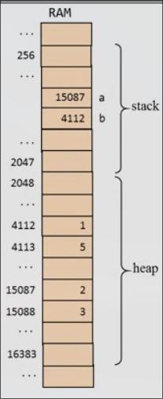

变量a作为指针（引用）存储在栈区，其指向为堆区的对象首地址（2和3）
