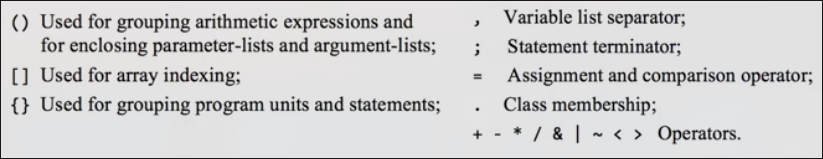
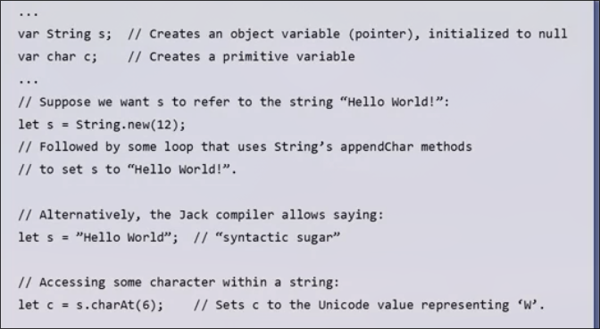
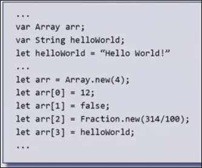
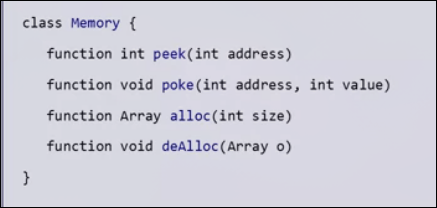

# Unit 3 Jack高级语言

## 认识

### hello world


**注释**

*在Jack语言中，有三种注释*

* `/**...*/` 可以由外部工具处理（类似`Javadoc`）的描述API的注释
* `/*...*/`多行注释
* `//` 行内注释

**缩进**

Jack编译器会忽略缩进和空白部分，我们使用合适缩进来使得代码更可读

### 计算平均值


* Jack程序是类的集合，包含一个或多个类，其中一定要有一个Main类，并且Main类中一定要有一个main函数作为程序的入口
* Jack程序提供流程控制语句`if / if...else while do`
* Jack程序中的数据作为实例进行实现`let a = Array.new(length);`，这个数据类是操作系统的一部分
* Jack程序可以在同一数组存放不同数据类型
* 如`KeyBoard`, `Output`这些类包括其方法同样隶属于操作系统
* Jack程序中有着如`int`, `char`, `boolean`等数据类型，此外还有类数据类型如`Array`

## 面向对象编程

Jack只有三种数据类型，而数字类型只有`int`一种

### 扩展分数


* 包括构造分数、获取分子分母、分数相加、释放内存、打印的功能

**相加2/3和1/5**


**分数类的部分设计实现**


在Jack中，类内的成员变量（属性）在外部只能通过向外提供的方法接口来访问和改变

**构造函数**


构造函数中调用成员方法`reduce`进行分数的化简，如`4/8`化简为`1/2`, 而`reduce`的实现使用了静态函数`gcd`，后者通过欧几里得算法实现了最大公约数的获取

* 方法用于对当前对象进行操作
* 函数不操作对象，相当于Java中的静态方法
* `this`存储当前对象，实际上是一个内存地址，是当前对象在ram中的基址，构造函数需要返回（Java中隐式返回，由编译器进行处理）
* Jack中所有的函数、方法都要进行返回，如果没有返回值可以`return;`（Java中这一过程隐式进行）

**加法方法**


**打印方法**


**释放内存**


* `memory.deAlloc`是一个操作系统的方法，用来释放内存中的地址

### Jack底层

内存中分为栈区和堆区，堆区用来存储对象和数组，栈区用来存放其余内容


变量a作为指针（引用）存储在栈区，其指向为堆区的对象首地址（2和3）

## 链表

列表`list`的基本形式是`(元素, list)`

其是一种递归的数据结构

如`(2, (3, (5, null)))`可以简写成`(2, 3, 5)`


### 链表类的API


**使用链表**


## Jack语法规范


* 允许空白，三种类型的注释
* 关键字：共20个


* 符号



* 常量


* 标识符 *创建变量的方法*

由字母数字下划线组成，并且只能由字母或下划线开头

### 数据类型


* `int` 整形 可以表示0-32767的整数
* `bool` 布尔值
* `char` Unicode字符
* `类` 类型如 `String` `Array` 

#### 类型转换

```jack
// `char`和`int`可以彼此转换
var char c; 
let c = 65; // 整数转成了char

// 单字符字符串不能直接转成char
var String s;
let s = "A";
let c = s.charAt(0); // 通过字符串的方法实现转换

// 数组变量允许赋值到对应的数组地址
var Array Arr;
let arr = 5000; // 存储内存地址 5000
let arr[100] = 17; // 设置内存地址5100的值为17
```

数组和对象的转换


### 类

类是Jack中的基本组成单元

每个类存储在单独的Jack文件中

类名和文件名相同，并且首字母大写


**类的意义**

*类可以分成两种*

* 提供功能的类


其特征是只包含函数，也就是某些语言中的**静态方法**，并没有构造函数和实例方法，也不会在使用时构造实例对象

这种类即是一些函数的库

* 表示对象的类

比如链表类，分数类，字符串类

这些类设计的目的是最终构造出其实例对象

在Jack语言中，这种类至少有一个实例方法,也允许有静态函数（通常用于辅助类的实现，比如分数类中的`gcd`函数）,但是在其它语言中，不是直接用于操作本类对象的函数通常放在其它位置

不要将两种类混合：


这里的gcd就是一个反例，因为gcd在其它数学运算中也很常见，因此最好把它放在单独的类，比如`Math`

### 子程序

在类的结尾，是**子程序注入**的部分，即构造函数，静态函数，实例方法


这些子程序都具有参数和返回值，对于`void`子程序要返回`null`，简写为`return;`

#### 构造函数

*用于构造对象*


允许有0个或多个

返回值类型必须是所属类的名称

必须返回 `this`

### 变量

* `static` 变量 类中的所有子程序都可以看到
* `field` 变量 可以由类中的方法和构造函数访问，而函数访问不到
* `local` 变量 在子程序中创建使用
* `parameter` 变量 和`local`变量相同，用于传递参数

先声明再使用，具有类型

### 语句


### 表达式


### 子程序调用


### 字符串

由操作系统定义的类



其中`"Hello world"`由编译器处理，等同于一些复杂的方法来构造字符串

### 数组



Jack中的数组没有类型，可以存放不同类型数据

### Jack语法总结

* 在操作变量时需要使用`let`关键字
* 在不将函数/方法赋值给变量时要使用`do`关键字
* 在语句体，如`if` `while`，即便是单语句，也要使用`{}`包裹
* 所有子程序要`return`
* 算术没有优先级的概念`2 + 3 * 4`会返回20，要使用`()`
* Jack是弱类型语言

## Jack应用开发

1. 创建项目文件夹，文件以应用名称命名
2. 使用文本编辑器编写Jack类
3. 使用Jack编译器编译单文件或项目目录
4. 可以将生成的单个vm或包含多个vm文件的目录加载入vm模拟器执行

### 输出文字


屏幕可以看作有23行，每行可以容纳64个字符的黑白屏幕

### 输出图形


屏幕可以看作有256行，每行有512个像素的黑白屏幕

* `setColor`指定画笔的颜色，直到下一次调用，`true`表示黑色

### 输入


* `keyPressed()` 返回正在被按压的按键的扫描代码，如果没有则返回0

### 数学类


### 字符串类


### 数组类


### 内存类



谨慎使用

### Sys 类


## 复杂图形的处理

**精灵** 二维的单一形象

可以绕过操作系统的Screen api，直接操纵屏幕内存

屏幕由256行，每行512像素构成

屏幕中的一行512像素(32 * 16), 在内存中被映射为32行

而Screen是从RAM[16384]作为起始地址0的

在Hack语言中，操作系统提供了直接操纵内存的API `peak`读取某地址值 `poke`写入某地址值


而使用操作系统api操作像素时，效率会低

我们的生态提供了这样一种工具 自动生成对应图形的Jack代码

## Unit3 Jack语言编程 Q&A

**Jack和典型面向对象的语言之间的区别？**

Jack有着典型程序设计的特点，但是也有一些局限性，比如较为原始的类型系统,很少的流程控制语句，没有继承的概念。

没有添加这些特性的原因是我们在本课程中不追求建立强大的语言，而是掌握高级语言的精髓

**什么是弱类型的语言？**

强类型语言对变量的声明和使用要求很严格：

* 在声明前不能使用变量
* 声明后如何使用也有严格的限制，比如所赋值和声明类型不同
    * 3.14赋值给int会丢失小数部分这种情形，是不会被强类型语言允许的

在Jack语言中可以任意赋值不同类型的数值

* 这种弱类型也方便我们进行各种操作以控制底层硬件平台
    * 操作系统通常由`c++`编写的原因就是尽管c++是一种强类型语言，但是其提供了弱化类型的方法

**Jack有一些语法如let, do, 但是大多现代语言缺不需要这样做，为什么引入？**

当给变量赋值时，必须使用`let`，这些前缀被加入的目的是在开发编译器时，我们足够轻松，简洁优雅

解析`parsing`，可以分析程序的语法结构 通过语句的第一个关键词如`let` `while`，我们即可得知这是哪种语句
