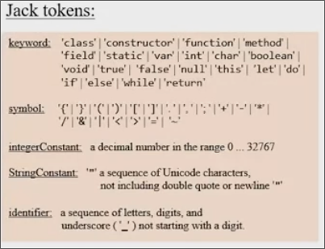
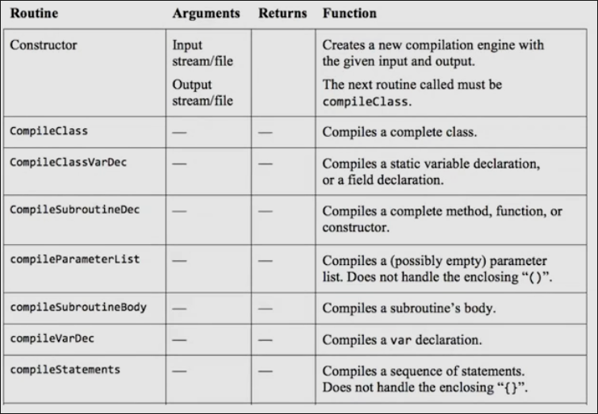
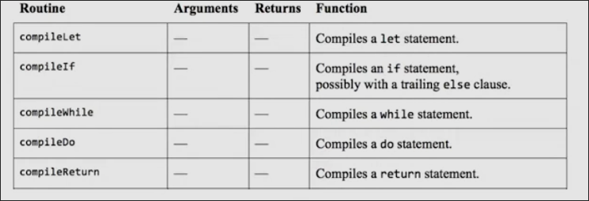
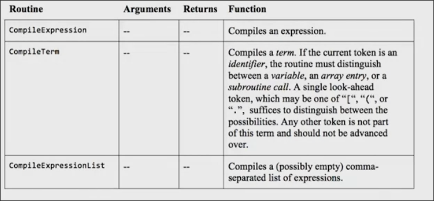
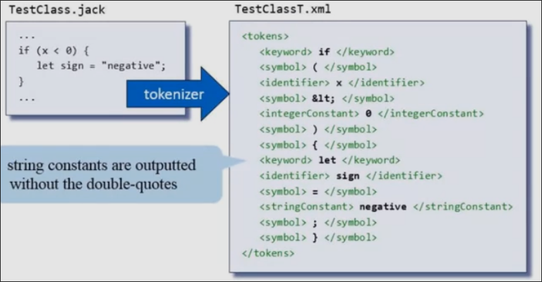

# Unit 4 编写编译器 第一部分 语法分析器

编辑器 将 高级语言转换成 作为中间层的 vm码

## 词汇分析

当我们拥有一段Jack代码时，我们实际只是拥有一段字符流，而词汇分析的工作是把其转换成有意义的标记流

在词汇分析结束，这些标记`tokens`交由编译器的下一工序，我们便可以忽略掉原文件

不同的语言中有着不同`token`，比如`++`在c语言和c++中是允许的`token`, 而在Jack中，会被分成两个`+`token从而导致异常

我们的语言有五种`token`

* `keyword`
* `symbol`
* 0-32767的整数
* `String`的字面量
* `标识符`

Tknzr要完成的工作

## 语法

语法定义了token的合法组合

如图所示 是部分英语语法规则

其中分为**终止规则**和**非终止规则**，前者意味着规则在此处截止，其右侧是一些常量，而非终止规则右侧是一些规则，这些规则仍可以继续展开为规则和常量

### Jack语法

解析即为断定输入是否符合语法的过程

## 解析树

英语的语法可以转换为这样一个树状结构

可以看出作为叶节点的规则是终止规则，而其余节点则是非终止规则

而Jack的解析树如图所示

除了这种可视化形式之外，解析树还可以被表达成其余格式，比如`XML`

XML格式用于规定一些标签来格式化表达结构化数据

## 解析逻辑

在编译引擎模块中，有四种方法

分别对应了大多数非终止规则,而其余的规则，我们隐式地处理

解析while语句时,首先调用处理`while`的方法，然后一一对比，是否有`(`，当处理到一个表达式时，再去调用表达式相关的方法，这样子递归

* 初始化：使得`tokenizer`前进一步，开始解析
* 得到了一个`token`，比如`while`，调用`compileWhileStatement`,继续使得`tokenizer`前进，查看下一个`token`
* 程序在当前语句方法的要求，当前的`token`，`tokenizer`移动，以及调用相应非终止规则方法之间循环

相关的实现如图，`eat`方法表示期望从当前的`token`得到此值，否则抛出异常（或其他处理）

LL 语法 不需要反向跟踪的解析,比如我们的Jack

LLk 语法 一种只需要根据前k个token就能确定如何处理的LL语法，我们的语言是LL1语言（编程语言一般都是，而自然语言则更复杂）

## Jack 语法

### 词汇元素

### 程序结构

Jack中的每个文件即类是分开编译的

每个类的形式如下

### 表述 statements

### 表达式 expressions

在处理表达式时，当我们遇到的`term`为变量时，有些棘手，它可能是以下几种情况：

这种情况下我们需要 查看下一个token才能确定比如`.` `[` `(`，这时语法为`ll2`

## 编写Jack 分析器

分析器由`tokenizer`和`parser`构成

其输出为XML代码

### 对于终止规则的处理

我们在接收到终止元素的输入时，会触发终止规则

### 大多数非终止规则的处理

递归地调用其它规则

### 其余的一些浅显的非终止规则

比如`varName` 会被跳过，继续递归给它下面的规则`identifier`，最终生成的xml中并不包含`varName`

## 编写 Jack 分析器的建议

通过输入Jack源文件，输出其语法树的XML文件

分为三个模块

* `JackTokenizer`
    * 处理词汇元素
* `CompilationEngine`
    * 处理除词汇元素外的其余元素
* `JackAnalyzer(Main)`
    * 输入可能是单个`.jack`文件，或者是某个目录的名字
    * 输出为单文件或目录中每个文件都有一个的`前缀.xml`文件（仍在此目录）
    
### JackTokenizer

*封装了输入，对于其它部分来说`Tokenizer`即为输入，而舍弃了输入源文件*

* 忽略空格
* 前进一步推进到下一个`token`
* 给出当前`token`的信息

**API**

* 构造函数`JackTokenizer(file)`，输入源文件，并开始获取`token`
* `hasMoreTokens` 标识是否还有更多`token`等待前进
* `advance()` 获取下一个`token`
* `tokenType` 标识当前`token`的类别
    * `KEYWORD`
    * `SYMBOL`
    * `IDENTIFIER`
    * `INT_CONST`
    * `STRING_CONST`
* `keyWord` 如当前`token`是KEYWORD,标识`token`的实际值
* `symbol` `identifier` `intVal` `stringVal` 同理于`keyWord`

### CompilationEngine

*从`JackTokenizer`获取输入*

**API**

* 构造函数`CompilationEngine(inFile, outFile)`
* `compliteClass()` 处理一个完整的类，输出对应XML
* `compileClassVarDec()` 处理一个`static`或`field`变量的声明
* ...

### Main

接收单个的Jack文件名或包含0个到多个Jack文件的目录名

对于每一个Jack文件

1. 创建`JackTokenizer`
2. 创建输出文件`fileName.xml`
3. 创建并使用`CompilationEngine`，从`JackTokenizer`中获取输入，并输出到`xml`

## Project 10 构建Jack分析器

### 步骤

1. 建造`Jack Tokenizer`
2. 建造基本的`compilation engine` 即不包括表达式的处理
3. 建造完整`compilation engine`

* 整个文件由`<tokens></tokens>`包裹
* 对于`stringConstant`的字符串字面量，不应输出引号
* 对于`>` `<` `.` `&` 被转义为`&gt` `&lt` `&quot` `&amp` 原因是浏览器对这些符号会特殊解析

## Unit4 构建 Jack 分析器 Q&A

**编译器不仅会翻译程序，还会发现和报告错误，我们的编译器要处理程序中更多错误吗？**

我们在本单元中完全回避了错误诊断，我们只着眼于将程序翻译成VM码，而假设程序完全没有错误

在一些情况下，很容易进行错误诊断，比如在解析`let`语句时，首先是一个`let`关键字，然后是一个`identifier`, 当编译器发现`let`的下一个`token`不是`identifier`，可以生成一条错误信息，并终止编译

一些编译器则更加友好，并不会在发现错误时停止，而是试图继续寻找其他可能的错误。一些编译器尝试找到源代码中产生错误的准确位置。

因此错误处理需要复杂的诊断方法

而且在我们的编译器中，一旦我们构建了`tokenizer`, 便舍弃了源文件。但是在更加智能的编译器中，我们需要保留源文件以应对各种错误消息，警告消息

**我们是否可以运用我们在本单元学到的知识来为其他语言开发编译器？**

解析器非常有用，可以解析任何基于语法的文本，经常被应用程序员用到，无论生物信息，电子邮件，金融服务等需要结构化文本的地方。

我们在本模块中学习的内容直接使用于这些领域，我们讨论了语法分析`syntax analysis`的两个最重要元素：标记化`tokenizing` 和 解析`parsing`。这是语法分析的精髓所在

但是与其他编程语言相比，`Jack`语言非常简单，没有操作优先级，继承，也没有工业级编程语言的其他特性，这种设计利于我们的编译器开发。

我们使用的解析方法，从上到下读取尽可能少的`token`，来确定当前的语法，是一种贪婪算法，这种策略很适合简单语法的语言。而开发复杂语法的编译器时，通常使用从下到上的解析方法。

从下到上的解析首先构造语法数的叶节点，也就是终止规则。这样利于同时考虑几种解析可能性，而这些算法必须使用回溯来查看先前的`token`

**为什么我们不使用lex和yacc？**

lex和yacc是Unix的两个软件工具，lex是词汇分析器，可以自动的生成`tokenizing code`, yacc可以自动生成解析代码，这两者是形影不离的

一些优秀的程序员追求自动化任何可以自动化的东西，而解析逻辑是高度结构化的，我们在开发中也可以体会到这一点，其代码完全可以自动化生成

因此可以将一个有一定格式的语法规范作为输入，输出一个语法分析器，可能需要微调，但是大多数逻辑都是自动生成的

而我们不用这些自动工具的原因是，我们在这门课的任何阶段都是从头来进行，为了学习的目的，没有使用任何黑盒工具
