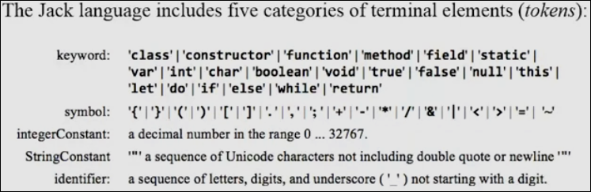
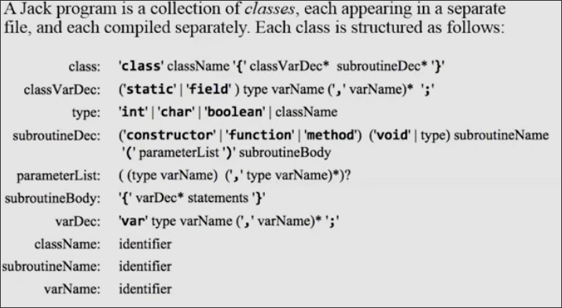

# Unit 4 编写编译器 第一部分 语法分析器

编辑器 将 高级语言转换成 作为中间层的 vm码

## 词汇分析

当我们拥有一段Jack代码时，我们实际只是拥有一段字符流，而词汇分析的工作是把其转换成有意义的标记流

在词汇分析结束，这些标记`tokens`交由编译器的下一工序，我们便可以忽略掉原文件

不同的语言中有着不同`token`，比如`++`在c语言和c++中是允许的`token`, 而在Jack中，会被分成两个`+`token从而导致异常

我们的语言有五种`token`

* `keyword`
* `symbol`
* 0-32767的整数
* `String`的字面量
* `标识符`

Tknzr要完成的工作

## 语法

语法定义了token的合法组合

如图所示 是部分英语语法规则

其中分为**终止规则**和**非终止规则**，前者意味着规则在此处截止，其右侧是一些常量，而非终止规则右侧是一些规则，这些规则仍可以继续展开为规则和常量

### Jack语法

解析即为断定输入是否符合语法的过程

## 解析树

英语的语法可以转换为这样一个树状结构

可以看出作为叶节点的规则是终止规则，而其余节点则是非终止规则

而Jack的解析树如图所示

除了这种可视化形式之外，解析树还可以被表达成其余格式，比如`XML`

XML格式用于规定一些标签来格式化表达结构化数据

## 解析逻辑

在编译引擎模块中，有四种方法

分别对应了大多数非终止规则,而其余的规则，我们隐式地处理

解析while语句时,首先调用处理`while`的方法，然后一一对比，是否有`(`，当处理到一个表达式时，再去调用表达式相关的方法，这样子递归

* 初始化：使得`tokenizer`前进一步，开始解析
* 得到了一个`token`，比如`while`，调用`compileWhileStatement`,继续使得`tokenizer`前进，查看下一个`token`
* 程序在当前语句方法的要求，当前的`token`，`tokenizer`移动，以及调用相应非终止规则方法之间循环

相关的实现如图，`eat`方法表示期望从当前的`token`得到此值，否则抛出异常（或其他处理）

LL 语法 不需要反向跟踪的解析,比如我们的Jack

LLk 语法 一种只需要根据前k个token就能确定如何处理的LL语法，我们的语言是LL1语言（编程语言一般都是，而自然语言则更复杂）

## Jack 语法

### 词汇元素

### 程序结构

Jack中的每个文件即类是分开编译的

每个类的形式如下

### 表述 statements

### 表达式 expressions

在处理表达式时，当我们遇到的`term`为变量时，有些棘手，它可能是以下几种情况：

这种情况下我们需要 查看下一个token才能确定比如`.` `[` `(`，这时语法为`ll2`

## 编写Jack 分析器

分析器由`tokenizer`和`parser`构成

其输出为XML代码

### 对于终止规则的处理

我们在接收到终止元素的输入时，会触发终止规则

### 大多数非终止规则的处理

递归地调用其它规则

### 其余的一些浅显的非终止规则

比如`varName` 会被跳过，继续递归给它下面的规则`identifier`，最终生成的xml中并不包含`varName`

## 编写 Jack 分析器的建议

通过输入Jack源文件，输出其语法树的XML文件

分为三个模块

* `JackTokenizer`
* `CompilationEngine`
* `JackAnalyzer(Main)`
    * 输入可能是单个`.jack`文件，或者是某个目录的名字
    * 输出为单文件或目录中每个文件都有一个的`前缀.xml`文件（仍在此目录）
