# Unit 5 编译器 第二部分 代码生成器

每个Jack文件都是分开编译的，一次只需要编译一个类

而对于一个类来说，首先是一些`field`, `static`变量的声明，其次是一些子例程

因此编译由可以分为两个子过程：**对类变量声明的编译** **对子例程的编译**

而对一个子例程的编译由这些构成

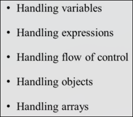

## 处理变量

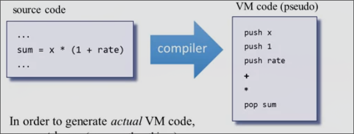

在vm伪代码中，我们得知对变量主要进行`push` `pop`操作，但是在真正代码中，我们的`push` `pop`都是对内存段进行操作，因此，我们需要根据前后文得知变量具体属于那个内存段

在Jack中，变量有四种类别`field`, `static`, `local`, `argument`

每个变量有自身的四个属性

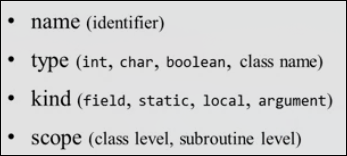

需要维护并记录每个变量的属性, 可以用到`symbol table`

### 变量的声明 - 建立符号表

*符号表的建立*
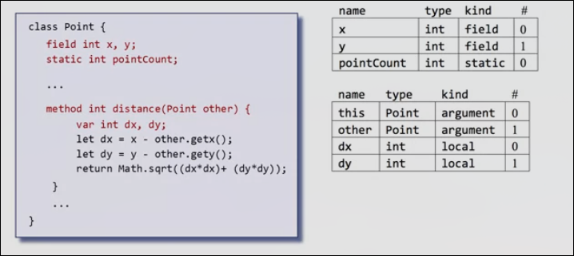

值得注意的是当构建子例程的符号表时，要额外包括一个隐含的参数变量：this

而类级别符号表（用于存储类级别变量）在每一个类编译开始时被重置

子例程级别符号表在编译一个新的子例程时重置

当遇到变量的`field/static/var`声明时，会添加其到对应的符号表中

而`arguments`的添加是在处理`parameterList`时进行的

在此声明阶段，`CodeWriter`只需要生成符号表，而无需生成代码

### 变量的使用 - 查找顺序

我们在`expression`和`statements`中使用变量

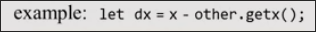

我们首先在子例程级别符号表中查找变量, 如果没有找到则在类级别符号表中查找变量

对于更多作用域的语言，比如Java可以拥有无限作用域，其子例程内还可以包括更小的子例程，而小范围作用域之内可以访问到更大范围内的作用域，而同级之间或小范围不能访问大范围。我们可以采取符号表，并让它们以链表的结构相连

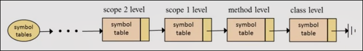

小范围如果查找不到大范围，则向父节点继续查找，直到`class`级别

## 处理表达式

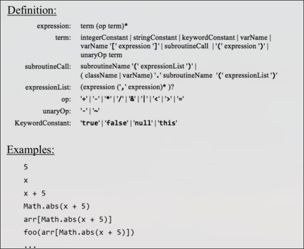

根据语法，这些都是合法的表达式

### 解析树、前缀、中缀、后缀

**中缀表示法**

如 `a * (b + c)` 可以构造这样一个树, 并且这种表示是人类所理解的中缀表示法

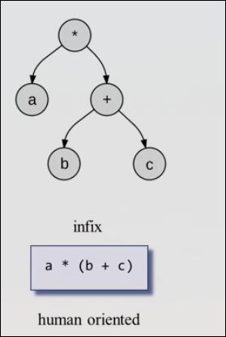

**前缀表示法**

我们把操作符放在操作数的前面`* a + b c`如同函数一般

每个操作符期望其后面为两个参数，而当某一个参数仍是操作符时，意味着进入这个操作符计算，并期望其后的两个参数，把返回值作为先前的操作符参数，如此递归进行

**后缀表示法**

先列出计算用到的参数，然后调用操作符 `a b c + *`

操作符依次应用于先前的两个参数，并把返回值放在操作数尾部

显然其与栈关系密切，更适用我们的vm

### 将中缀表达式转为后缀

首先生产中缀表达式对应的解析树（这一点在我们构建Jack分析器时已经完成）

之后遍历解析树，生成相应vm码

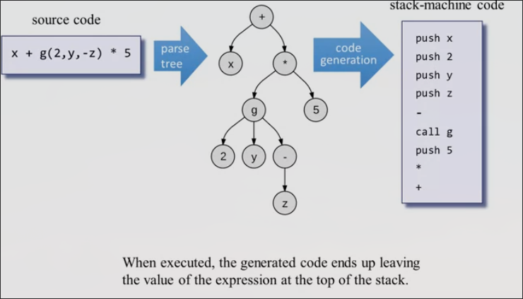

遍历的方式为深度优先搜索：首先从根节点出发，走到叶节点，生成叶节点的代码，之后往回走一格，查看当前节点是否为叶节点（如果一个节点的所有子节点都被遍历过，其成为了一个新的叶节点）。我们不使用这种算法

我们使用的方法免于创建解析树，直接从表达式生成

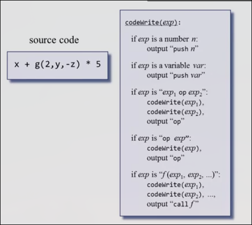

编写这样一条语言的vm代码，对表达式的处理可能出现两个版本

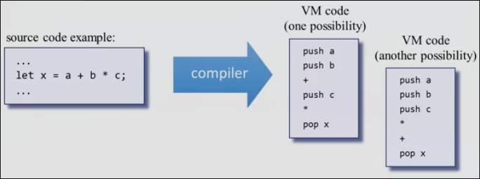

由于Jack没有优先级的表达，所以我们并不对哪个版本作要求，无论哪个都不完全符合自然的逻辑，第一个从前向后进行可能更符合一些

## 控制流的处理

将`if` `else` `while` 重新表达为vm中的`goto` `if-goto` `label`

### if-else

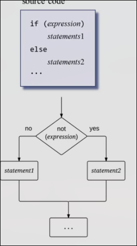

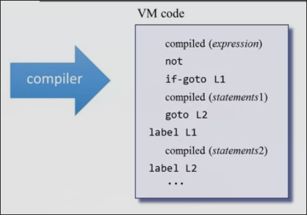

not的原因是使得生成代码更紧凑

### While

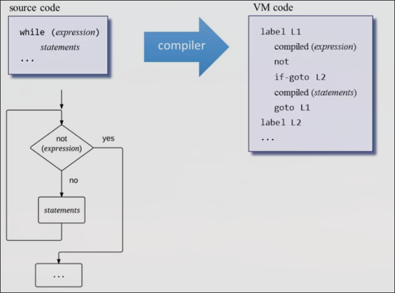

注意标签的唯一性

而对于嵌套结构，我们已经进行递归处理, 是自然而然发生的

## 对象数组的底层

我们将对象和数组存储在堆，而在某一时刻，堆上可能有许多对象、数组。而我们需要操作`this`和`that`指针来表明我们目前操作的对象、数组在堆上的什么位置。

而要改变`this、that`的指向（也就是`RAM[3]、RAM[4]`的值）需要使用`push/pop pointer 0/1`

当`this、that`的指向被确定到实际某对象、数组存储的位置，我们就可以使用`push/pop this/that i`来访问数组、对象的元素

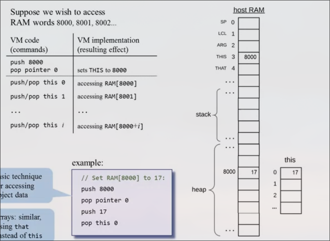

对象由`this`访问，数组由`that`访问

## 构造对象

对象的构造分为两部分：caller callee

在caller中

当编译器遇到对象的声明时，不会生成任何代码，只是更新相应符号表

当调用构造函数时，我们正常地用函数（表达式）的处理方式

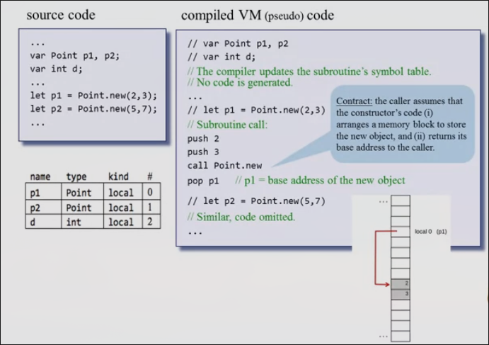

在callee中

构造函数具体地为对象开辟空间，并初始化一些对象的属性`field`

首先当编译器遇到`field` `static`的声明，只会添加到类符号表

当遇到`constructor`后会将参数添加到子例程符号表

之后编译器要为新对象分配空间：通过查阅符号表，得知有多少`field`来分配空间

由操作系统来决定分配到哪里：调用`sys.alloc` `call Memory.alloc fieldNum`

其会返回所分配空间的基址,我们使得`this`指向它 `pop pointer 0`

之后进行属性的初始化

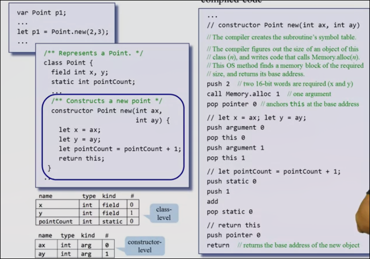

## 操作对象

同样分为caller和callee

vm语言不知道什么是对象，我们将对象作为一个隐含的参数传给对象调用的函数

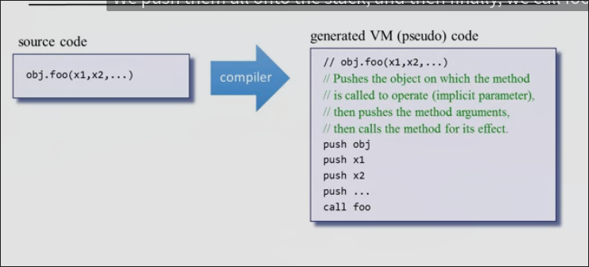

在callee中

首先我们生成类符号表

之后生成子例程符号表

当执行一些`statements`之前，我们将`caller`传递的this参数赋予THIS

`push arguments 0` `pop pointer 0`

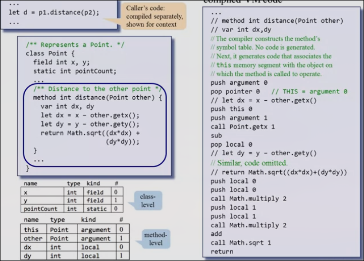

而`void`方法在`return`之前`push 0`

而`caller`中，我们要去除这个0 `pop temp 0`

## 处理数组

构造数组很容易

首先在数组的声明比如`var Array arr`时，只会改变符号表

在构造的时候与调用一个方法无区别

而在处理数组时

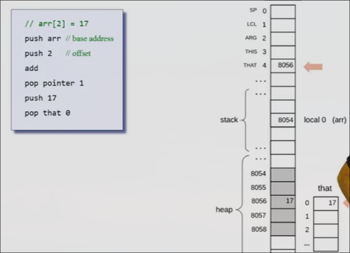

->

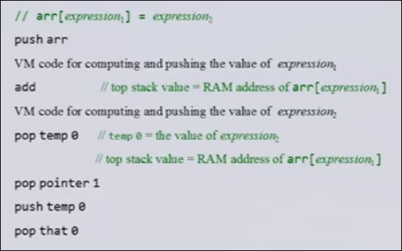

## 虚拟机上的Jack标准映射

### 文件和子例程映射

一个Jack类/文件会被翻译为相同前缀的vm文件

每个子例程会被翻译为一个vm函数

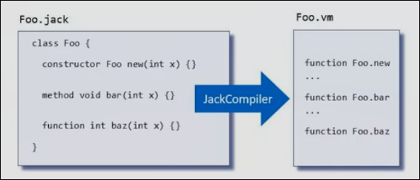

如果jack函数/构造函数有k个参数，则vm函数就有k个参数

而jack方法有k个参数，所对应的vm函数有k + 1个参数，因为其还有`this`隐含的参数

### 变量的映射

jack中由`var`声明的的`local`变量会映射到vm中的`local`内存段

在子例程中参数列表内的`argument`变量会被映射到`argument`内存段

`static`声明的静态变量会映射到`static`内存段

`field`声明的变量会被映射到`this`内存段（前提是this指针已经位于对象的基址）

### 数组的映射

当访问`arr[i]`时，首先将`that`指针指向`arr[i]`值所在位置

之后`that 0`即为所得

### 编译子例程

当编译方法时

1. 首先确保`this`指向当前变量的位置，也就是`argment 0`
2. 之后需要处理`field`时，通过`this i`来获取

当编译构造函数时

1. 首先通过分配对象需要的内存空间，并使得`this`指向分配空间的基地，并使得`this`指向分配空间的基址
2. 之后可以使用`this i`来初始化、操作其`field`变量
3. 将`this`的值返回给`caller`

当编译`void`函数或方法时

1. 我们返回`0`给`caller`
2. 而`caller`去除这个0

### 编译子例程调用时

1. 首先`push`参数列表中的参数
2. 之后`call` 子例程

如果子例程是一个方法

1. 先push要操作的对象基址
2. 之后push参数列表
3. call 子例程

如果子例程是void时

1. push、call
2. `pop temp 0`

### 编译常量

* `null` 被映射为 `0`
* `false` 被映射为 `0`
* `true` 被映射为 `-1`

### 操作系统的类和子例程

操作系统被实现为8个vm文件

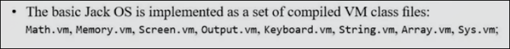

这些类同样会被生成于项目目录, 因此任何vm函数都能调用操作系统中的vm函数

### 特殊的操作系统服务

比如`*` `/`运算符，会调用操作系统的一些函数

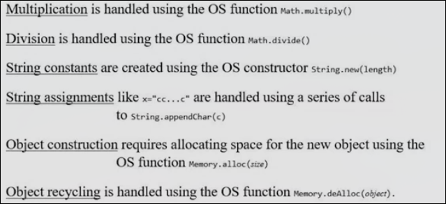

## 构造Jack编译器的建议

我们使用五个模块

* `JackCompiler(Main)` 顶层模块
* `JackTokenizer`
* `SymbolTable`
* `VMWriter` 生成VM代码
* `CompilationEngine` 微调上一个模块

### JackCompilier 

输入可以是一个`xxx.jack`的单个文件名或者是一个目录名，其包含一个或多个`.jack`

如果输入是单个文件，输出单个文件`xxx.vm`

如果输入是目录，则在目录下输出多个`xxx.vm`

1. 对于每个`.jack`，创建一个新的`JackTokenizer`，和一个`.vm`
2. 使用`SymbolTable`, `CompilationEngine`, `VMWriter`写入vm代码

### JackTokenizer 

我们已经拥有

### SymbolTable

* 构造函数 `SymbolTable()` 创建一个新的符号表
* `void startSubroutine()`  重置符号表
* `void define(string name, string type, strin kind)` 向符号表中添加数据 `name`变量名 `type` 数据类型 `kind` `STATIC FIELD ARG VAR`中的一种 并且还隐式给数据添加了相对于其`kind`的索引
* `int varCount(string kind)` 返回符号表中某一`kind`变量的数量
* `string kindOf(string name)` 根据变量名查找表中对应变量的`kind`，没有找到返回`None`
* `string typeof(string name)` 根据变量名 找到对应变量的`Type`
* `int indexOf(string name)` 根据变量名 查询变量的索引，没有找到可以返回`-1`

可以使用哈希表实现

### VMWriter

* 构造函数`VMWriter(string outFile)` 创建输出文件并准备写入
* `void writePush(segment, index)` 写入 push 命令
* `void writepop(segment, index)`
* `void writeArithmetic(cmd)` 写入算术逻辑命令
* ...
* `void close()` 关闭输出文件

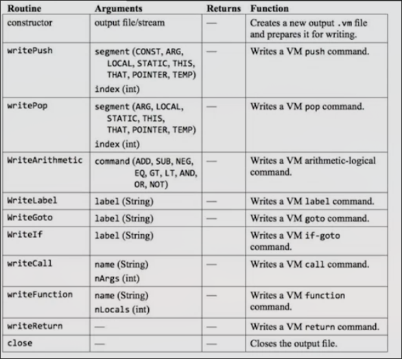

### CompilationEngine

从`Tokenizer`获取输入，并将输出通过`VMWriter`写入输出

在`compileXxx`中，生成关于`xxx`的vm代码

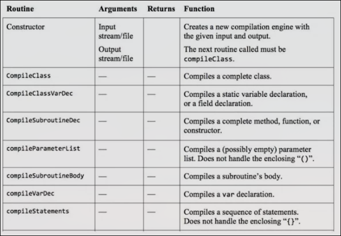

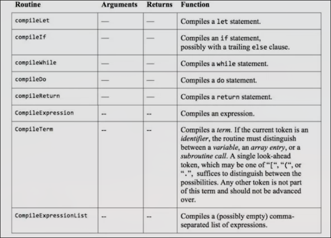

## Project 11 概述

完成编译器的构建

之前我们的分析器并没有处理符号的能力，我们统称其为`identifier`, 我们引入符号表来赋予其能力，为了测试功能，我们生成一个更加全面的`xml`

之后我们舍弃掉`xml`代码，而替换生成`vm`代码

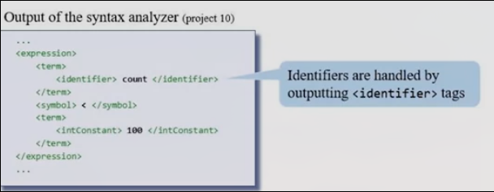

首先我们希望`xml`将`identifier`分类为具体的`var argument static field class`

并且我们还需要在`xml`中标识`var argument static field`的数量

并在`xml`中表示这个`identifier`是否在被定义还是被使用

简单输出，可自选标签，仅供测试

之后舍弃掉`xml`开始最终代码生成的编写

我们提供6个测试文件 分阶段开发 单元测试

* `Seven` 计算 `1 + (2 * 3)`
    * `只包括常数的表达式`
    * `do 语句`
    * `return 语句`
    * 结果应在屏幕输出`7`

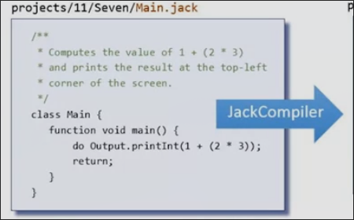

* `ConvertToBin` 十进制转化为二进制
    * 在RAM[8000]中存放输入的十进制数，在8001到8016中倒序输出每一位二进制位
    * 不包括数组或方法调用的表达式
    * `if` `while` `do` `let` `return`

* `Square` 控制方块
    * 构造函数
    * 方法
    * 包含方法调用的表达式

* `Avarage` 平均数
    * 数组
    * 字符串

* `Pong` 击打球游戏
    * 处理完整的应用程序
    * 对象、静态变量

* `ComlpexArrays` 复杂数组
    * 花哨的数组和复杂的索引表达式

## Unit 5 vm代码生成器 Q&A

**Jack是一门简单的语言，那么为更复杂的语言生成代码需要什么呢？**

首先我们的类型系统很简单，所有数据都是16位，不同类型数据之间都可以相互转换，所以编译器几乎完全可以回避掉类型相关的问题

比如在处理表达式时，编译器不必关心表达式组成元素的类型

并且Jack没有继承、权限控制的设计

**我们距离编译Java和Python等的差距有多少？**

为了支持继承、多态等，需要编译器的大量工作

有一些特性是比较容易添加的，比如`for`, `switch`等结构

扩展更多的类型也是相对容易的

Jack中不可以将字符的字面量赋予`char`类型，而是需要使用一些字符串的函数，但是这一点也易于扩展

在扩展语言时，首先语言设计师要小心地扩展，在规范地扩展后，编译器编写者要扩展他们的编译器

大多数的扩展都是相对独立的，因此比较容易局部扩展我们的分析器和代码生成器

编译器的另一个值得扩展的方向是代码优化，一个简单的`x++`可能经过两层编译会生产几十行代码，但是使用机器语言只需要两行

即便我们的编译器没有经过优化，其仍代表了一项复杂而重要的工作。
