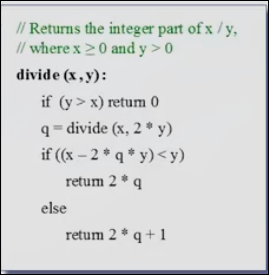
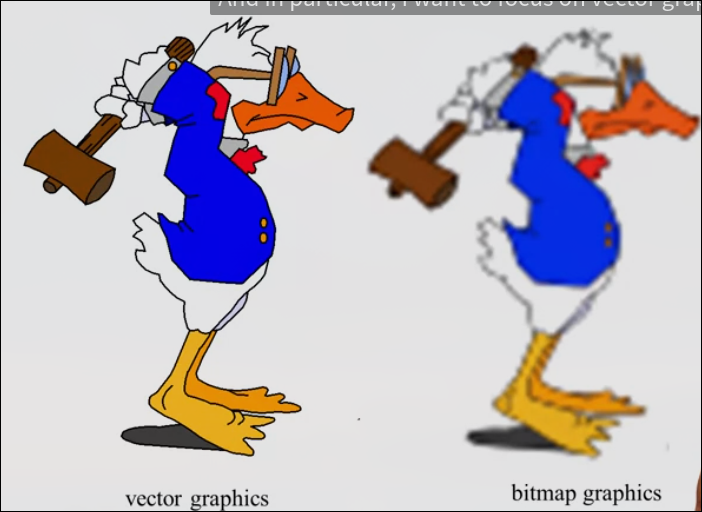
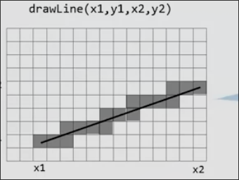

# Unit 6 操作系统

## 操作系统的任务

操作系统的意义在于缩小高级编程和硬件平台之间的差距

操作系统一方面提供一些标准类库，比如数学，数组，输入输出，图形

另一方面提供一些面向系统的服务，比如内存管理，文件系统，驱动程序，UI(shell/windows), 多任务，网络，安全

我们的操作系统将开发一些标准类库，内存管理和一些驱动

*标准类库*

* `Math` 提供一些数学操作
* `Memory` 基本的内存操作
* `Screen` 绘制基本图形到屏幕
* `Output` 在屏幕上输出文字
* `Keyboard` 获取键盘的输入
* `String` 字符串类
* `Array` 数组类

当设计操作系统时，效率变得至关重要，因为所有应用开发在我们的设计之上

因此我们在本模块，将改变忽视效率的思维

## 效率问题 - 乘法算法

越低层的服务就要越高效，因为其上层的应用也就越多

如数学类中的`*` `/` `sqrt` 都要是高效的

一种低效的，完全由y线性主导的o(y)算法

另一种是模拟的算法

其线性于y的位数，在我们的计算机，位数最多为16，最多循环16次

实际是一种对数复杂度的算法，对数复杂度的算法非常受计算机世界的欢迎，随着数据量指数增长，其迭代次数仅仅线性增长

## 其它数学运算 的效率

### 除法运算

暴力算法

重复地减去除数，直到结果小于0

需要迭代(x/y)次

同样是模拟算法来优化

算法的细节

也是log级别的算法

而另一种算法是一种递归

`100 / 7 = 2 * (100 / 7) / 2 = 2 * (100 / 14)`

重复地提出2, 当y > x时终止

### 平方根

* 其反函数`x^2`我们已经实现
* 其函数单调递增

因此使用二分搜索算法很高效

### 乘法算法的一些问题

#### 溢出以及有符号问题

如果二进制数由补码表示，符号会自然而然地成功处理

而溢出问题，这个算法在溢出时总会返回2^16

#### 取出16位数的每一位

我们可以封装这个函数

用这16个值 2^i & x

### 除法算法的一些问题

#### 被除数或除数为负数

可以用绝对值相除，然后操纵结果的符号

#### y溢出

监控y的值：

### 平方根

#### 溢出

## 内存管理 peak poke

高级和低级的桥梁

`function int peak(int address)` 查看RAM某地址的值

`function int poke(int address, int value)` 设置RAM某地址的值

巧用Jack可以任意类型转换的特点

巧妙地把0作为数组的基址，依次数组`ram`可以任意访问整个内存空间，这是正常创建数组在堆区所做不到的

## 堆管理 alloc deAlloc

`function int alloc(int size)` 分配指定大小的连续堆空间，返回首地址

`function int deAlloc(int object)` 回收特定的`Object`或`Array`的地址

我们使用一个链表来跟踪所有我们可以使用的堆内存段

每一个链表单元首位储存指向下一个链表的指针

第二位存储长度

后续是一些空闲空间

当`alloc`时，首先我们遍历链表，找到合适的空间, 当我们找到时，移除这个单元，并将地址返回给用户

具体来讲，当遍历中，一个链表单元存储空间的大小 >= 用户需要的size，这个单元被标记为可以分配，一种算法直接返回，另一种算法返回给用户的是所有可以分配单元的最小值

之后返回用户需要大小的空间后，将剩余的空间仍放在链表中

当`deAlloc`时，添加单元到链表

根据用户提供的地址的上面存放size的空间，得知单元的大小，加入链表

我们回收的越多，整个链表就越碎片化，就更短，当我们找不到任何足够长的段来分配, 对链表进行整合（我们不要求，可以扩展）

### 图形

图像的存储分为**矢量图形**和**位图**

#### 位图存储

简单用打开关闭相应的像素对应的01来存储

#### 矢量图存储

存储绘制图形所用的指令集

* 记录信息少，因此也容易传输
* 很放大缩小效果很好，因为只需要按比例扩大系数，传入绘制指令
* 很容易转为位图

### 绘制像素 

`function void drawPixel(int x, int y)`

我们使用内存段来操作屏幕

内存基址从`16384`开始

屏幕共有 256行 512列像素

内存的每一个寄存器表示16个像素

### 绘制线

`function int drawLine(x1, y1, x2, y2)`

记录下分别向上和向右走过的距离

根据斜率来判断下一步向右还是向上

但是斜率的判断需要两个log(n)级别的除法

可以转化为乘法，并且随着a、b（向右或向上的程度）的增加，`diff = a * dy - b * dx` 只是增加`dy` 或 `dx` 而这是一个常数，因此乘法又变成了加法

计算机的原点通常选在左上角，并考虑其他方向的线以及水平竖直方向

### 绘制圆

`function drawCircle(int x, int y, int r)`

根据勾股定理，很容易确定每个确定的dy, x的值

会存在溢出问题，要控制r在181以下

## 文本输出

把屏幕当作画布来看待，共有256行，512列像素

而当作田字格来看待则可以容纳23行，64列字符

我们要设计这些字符

我们要设计的字符集每个字符由11行8列像素空间组成，其中包括右侧两列和下方两列间距

这是一个庞大的工作，我们已经提供，在项目中可以直接使用

因此在`create`函数中，输入是一个字符位图，把位图的每一行赋予`map`数组，又把`map`数组赋予静态数组`charMaps`，这样`charMaps`存储了所有通过`create`定义的位图

### 光标

显示了下一个字符将在哪里写入

* 如果要显示新行，光标移动到下一行开头
* 如果回退 光标向左移动一格
* 如果要输入一个字符，输入字符到光标，光标右移

## 输入

位于24576是一个表示键盘内存的寄存器

使用`peak`可以轻易实现

## 字符串

比较有挑战性的是 `num2String string2Num`

## 数组处理

值得注意的是 new 需要被设计称一个函数，而不是构造函数

原因在于，一旦设计为构造函数，其在编译器中，通过检查`field`来分配空间，不是我们想要的结果

## 系统类

`booting` 加载基本软件，使其在开机或重置后进入内存，我们的`Sys.init`将初始化操作系统

硬件基础：我们的计算机在重置后，总是执行`ROM`的第一条语句

VM基础: vm转换器自动在程序顶部写入如下内容(翻译为机器语言)

Jack基础: 程序都有`Main.main()`, 并以此作为程序的入口

## Project 12 构造操作系统

我们的操作系统是一组API的抽象

我们内置了操作系统的vm文件

在我们开发自己的某一个API时，可以任意使用其它API，因为它们在对应的vm文件（作为黑盒程序）

这也是如Linux基于Unix开发的模式

在我们线上的编译器找到用户实现的Screen.jack后，不会使用内置的Screen.vm程序，而是编译我们的使用

我们提供了存根文件，其为各个API Jack文件的骨架

同时我们也提供了测试文件

在每个API开发之后分别测试

在所有API开发后进行最终测试

