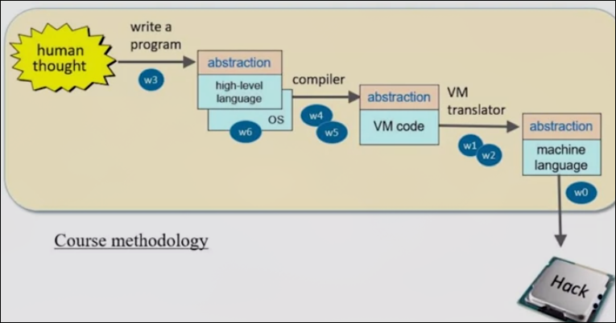
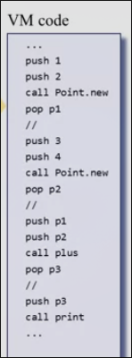

# 从与非门到俄罗斯方块

[online-IDE](https://nand2tetris.github.io/web-ide/chip)

[课程地址](https://www.coursera.org/learn/build-a-computer/home/week/1)

[搬运中字地址](https://www.bilibili.com/video/BV1KJ411s7QJ)

## Part1 目录

| 地址 | 名称 | 描述 |
| - | - | - |
| [Module1](Part1/Unit1.md) | 基本逻辑门 | |
| [Module2](Part1/Unit2.md) | 组合逻辑及ALU | |
| [Module3](Part1/Unit3.md) | 存储系统 | |
| [Module4](Part1/Unit4.md) | 机器语言 | |
| [Module5](Part1/Unit5.md) | 计算机体系结构 | |
| [Module6](Part1/Unit6.md) | 汇编语言 | |

## Part2 目录

| 地址 | 名称 | 描述 |
| - | - | - |
| [Module1](Part2/Unit1.md) | 虚拟机 第一部分 | vm 内存、算术逻辑命令 |
| [Module2](Part2/Unit2.md) | 虚拟机 第二部分 | vm 函数、分支命令 |
| [Module3](Part2/Unit3.md) | Jack语言 | |
| [Module4](Part2/Unit4.md) | Jack编译器 第一部分 | Jack 分析器的编写 |

## Part1 绪论

### 简介

从底层的软硬一构建出一个完整的通用计算机

* 前阶段构建硬件部分
* 第二阶段基于构建出的硬件构建计算机的软件

### 本课程的思想 

* 计算机的内容丰富且冗杂 
    * 源文件中的文本是如何发挥作用的
    * 编译器是如何工作的
    * 在屏幕上打印是如何做到的？如何控制具体像素点的亮度
    * 为什么不需要关心标准库等等的具体实现
        * 具体实现 how
        * 是什么东西（接口） what
    * 编程时不要关心多余东西的实现
* 抽象 从底层逐渐向顶层抽象（本课程采用这种方式）
    * 从基本的门逐渐封装为CPU等复杂芯片
    * 将其放入计算机为软件层服务
    * 将已经封装的抽象到下一个级别

### 本课程要构建的硬件 

* 计算机 CPU RAM ROM 等
* 连接鼠标键盘等
* 编写程序，运行

* 硬件部分专注于逻辑门，而不是芯片的制造等（这不是计算机领域）
    * 组合逻辑
    * CPU, 寄存器等
    * 最终组成计算机
* 使用硬件模拟器

* 硬件部分的课程内容
    * 建造一些基本的逻辑门
    * 建造一个算术逻辑单元 ALU
    * 建造存储系统 寄存器 RAM ROM
    * 用机器语言写一些程序，以了解这台计算机要做什么
    * 组成计算机！
    * 开发适合编写的机器语言的汇编器

### 本课程要构建的软件

* 构建非常低级的汇编语言以编写程序
* 了解软件的层次结构
* 构建一种高级语言，并构建编译器
* 构建标准库

## Part2 绪论

本课程我们从Hack计算机出发，构建虚拟机、编译器、操作系统和所有必要系统

最终我们可以在其运行面向对象的高级语言

### 关于我们的编译器

类似Java、python、c#，我们的编译器不会直接翻译成机器语言，而是首先翻译成一种中间语言——VM语言，为在抽象的虚拟机上运行而设计

最终这种VM代码翻译为汇编代码

完成项目非常重要！

只需要基础的编程技能。

### Project 0 概述

* 下载本课程的软件套件 www.nand2tetris.org (同样可以使用在线IDE）
* 提交一个文件
