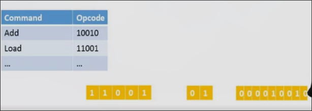
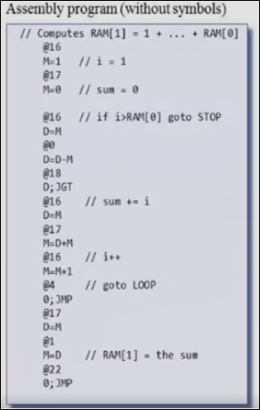
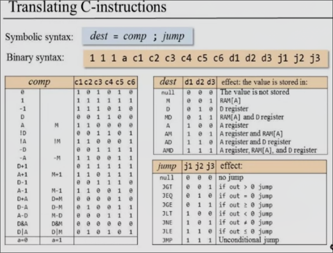
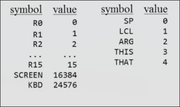
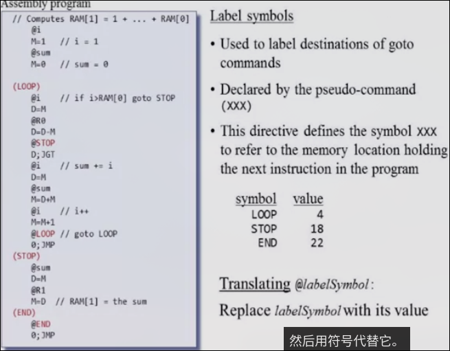
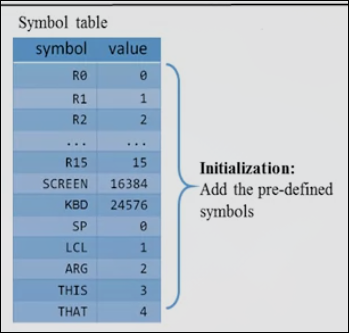
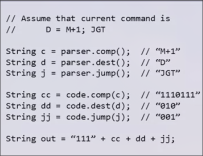

# 6 汇编语言

在前两周，我们使用汇编语言来替代人类不易读懂的机器语言进行编程。

本周我们着重于如何将汇编语言变成机器语言

我们着重于一个输入为汇编语言，而输出为机器语言的程序（软件）

由于我们只创造了一台可以运行机器语言的计算机，我们只能用0和1来编写这个软件，这会很麻烦。所以我们假设有另外一台可以运行高级语言的计算机（我们目前使用的计算机和我们熟知的高级语言），我们使用这种语言来编写汇编器，因此这种汇编器程序在我们自身的计算机上运行，它所生成的机器语言代码可以在HACK计算机上运行（**交叉编译器-在一台计算机上运行，生成另一台计算机所能执行的代码**）

## 汇编器的工作

1. 循环从输入读入汇编指令
2. 把指令分成几部分
3. 用我们语言指定的独特方式翻译成二进制
4. 合并这些二进制为一条机器语言指令
5. 输出并转到下一个汇编指令

以一种常见汇编指令 `Load R1,18`为例

1. 我们需要以空格和`,`为分界，通过字符串操作，把其分割为`Load`, `R1`, `18`三部分
2. 翻译为相应的二进制（根据汇编语句和机器语言之间的对应关系即汇编语言的规范）

3. 把他们进行拼合（可能根据语言规范中定义的其他位来填充）
4. 打印至文件（合并成实际可以被执行的格式）

### 符号的问题

如标签`JMP loop`这种程序员自定义的标签，还有自定义的变量名（这些实际上是某种地址），我们如何把这些符号转换为地址呢？

我们需要维护一种表格，当识别出符号，把它们和分配给其的地址（通过汇编语言的规范来分配）填入表格中。后面当再次遇到符号，首先在表格中查找，当没有找到时，把它作为新增的符号填入，否则替换为表格中已有的地址

当标签的使用位于标签的定义前，有一些处理方式：

* 记住这个位置，并跳过，当后面遇到标签定义时，再分配地址，回过头处理标签使用处
* 分为两遍读取汇编文件，第一遍先浏览所有的标签定义，一一分配地址在表格中，第二遍再给所有的使用处使用地址来替换（这种更常用）

## The Hack 汇编器

我们的汇编语言由A指令、C指令、符号组成

程序中存在空行和注释，我们需要消去

我们暂时不考虑符号，首先我们解决一个仅有AC指令，空行和注释的汇编程序

**处理空行以及注释**

当我们遇到空行和注释时，简单地扔掉后续的部分

剩下的就是仅有AC指令组成的无空行和注释的文件

## 翻译单纯的AC指令

A指令 `@value`

首先以0为起始位，把后面的值翻译为二进制，然后添加0使其为十五位

C指令 `dest=comp;jump`

比如`MD=D+1`

我们需要使用切割的方式把它分为三个字段`dest`，`comp`，`jump`

前面加上C指令的前缀`111`，后面按照表格对应把每个字段翻译为二进制

对于整个的程序文件（经过空行和注释舍弃处理）：

读取每行，对于每一行，解析其为A指令还是C指令，可以通过第一个非空格字符是否为`@`判断。通过上述AC指令的解析，把输出写到新文件

## 符号的处理

在我们的程序中有三种符号

* 变量符号 `@i` `@sum` 程序员并不在意这些变量的在内存中的实际位置，位置由汇编器决定
* 标签符号 `LOOP` `MAIN` `END` 是`goto`的目的地
* 预定义符号，如`R1` `KBD` `Screen`

### 预定义符号的处理

根据我们的语言规范，存在23个预定义符号

这些指令只会在A指令中作为抽象的地址出现，如`@R0`

我们只需要把预定义符号替换为相应的值，然后后续把它当作正常的A指令处理

### 标签符号的处理

标签符号的声明是通过`(MAIN)`这种符号，使用同样是`@MAIN`作为抽象地址在A指令中使用

其声明是一种伪命令，因为其不在机器语言中生成任何代码，其意义在于每当程序中出现其声明的标签符号，把它替换为其下面最近的“真命令”的行号

### 变量符号的处理

程序中出现的任意未预定义且没有在“标签表”中查到的符号为变量`i`, `sum`（同样在A指令中替代地址的位置）

变量地址的分配从16开始分配内存，同样可以建立“变量表”

当变量第一次出现在程序，给它分配一个新地址，否则用表中已有的地址替换它

## 符号表

可以使用这样一个数据结构**符号表**，其由两部分`symbol`和`value`组成

1. 在汇编器程序开始工作时，创建一个空的符号表
2. 使用预定义的符号进行填充

3. 浏览整个汇编文件，寻找标签声明（以左括号开头的行），同时记录正在读的是第多少行，并据此填充符号表
4. 重新阅读文件，当我们看到符号时（表中从未出现过），意味着它是变量，加入表中，从16开始分配地址

## 整个汇编过程

1. 初始化：构造空的符号表，准备处理输入文件，将预定义符号加入符号表中
2. 第一次浏览全文，搜索以左括号开头的指令，记录行号，加入符号表
3. 第二次浏览全文，处理变量声明
4. 在第二次浏览中，我们同时翻译A指令和C指令

## 程序架构

程序分为几个模块

* 读取、解析命令
* 将解析出的词转为实际二进制代码
* 处理符号

*各模块作为单独的类*

### 解析器

其工作重点在于解析命令中读取的组件，读取输入并分解为各个部分

因此构建其的关键为让其理解输入命令的格式，以及如何分解为不同组件

1. 读入给点名字的文件（构造函数中）
2. 逐行读取所读文件
    * 可能需要的API
    * 是否到达末尾？`bool hasMoreCommands();`
    * 获取下一条命令 `void advance();`
    * 需要一次读取一行，并自动跳过注释和空白行
3. 解析为各个部分
    * 当前命令的种类（A/C/Label)
    * 根据当前的类型分解各个部分
        * `D=M+1;JGT` -> `D` `M+1` `JGT`
        * `@sum` -> `sum`

### 翻译器 将每个组件翻译为二进制代码

不必关系这些组件如何得到，我们只需要根据特定组件翻译即可

比如`dest`中的M,查表即可

*将解析器和翻译器配合使用*

### 符号表

* 可以创建空表
* init时 包含预定义符号
* 可以添加symbol-value对
* 可以根据`symbol`查找并返回结果

### 总体的逻辑

* 初始化解析器（读入文件、初始化符号表）
* 第一遍阅读文件，只关注标签，并填入符号表
* 第二遍阅读文件，翻译同时在表中输入新符号
* 主循环
    * 逐行读取命令并解析
    * 对于A命令，将符号转为二进制地址
    * 对于C命令，将其分解为C命令的三个部分，并把每一个转为二进制
    * 输出机器语言指令

## 项目6 概述 编写汇编器

假设输入的文件没有错误，把文件作为命令行参数传入 

