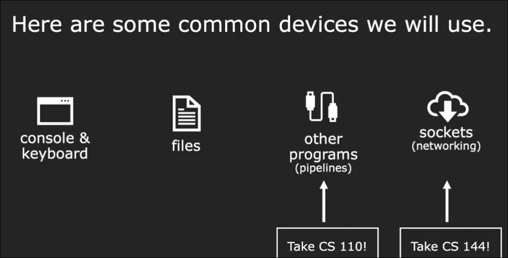
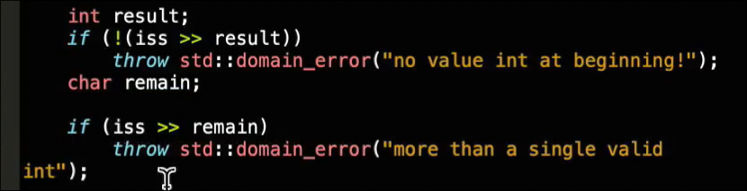
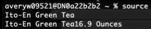

# 流
 
* [上半部分](#上半部分)
* [下半部分](#下半部分)
  * [cin](#cin)
  * [getline](#getline)

---

*上半部分在添加目录时由于脚本的错误处理不周导致被清空*

*刚好没有提交*

*这里补充代码和图片及简要说明*

*以后一定常提交 :(*

---

## 上半部分

* 输入输出字符串流
* 流提供了统一的接口 完成各个类型数据通过流的缓冲区 再和复杂的外部事物交互
* 流的四种状态
* 流的操纵符
 
```cpp
#include <iostream>
#include <sstream>

using namespace std;

int stringToInterger(const string& s);
void printIssStatus(const istringstream &iss);
void printEndTime(const string& input);

int main()
{
    string inputString = "1:30 PM \n 1 hour 40 minute";
    printEndTime(inputString);
}

void printEndTime(const string& input) {
    int beginHour;
    int beginMinute;
    int durHour;
    int durMinute;
    char rubbishChar;
    string rubbishStr;
    istringstream iss(input);
    iss >> beginHour >> rubbishChar >> beginMinute >> rubbishStr >> durHour >> rubbishStr >> durMinute;
    int endHour = beginHour + durHour;
    int endMinute = beginMinute + durMinute;
    if (endMinute >= 60) {
        endHour++;
        endMinute -= 60;
    }
    cout << endHour << ':' << endMinute << endl;
}

int stringToInterger(const string& s) {
    istringstream iss(s);
    printIssStatus(iss);
    int i;
    iss >> i;
    if (iss.eof() && !iss.fail()) {
        return i;
    }
    cout << "error string" << endl;
    return -1;
}

void printIssStatus(const istringstream& iss) {
    cout << (iss.good() ? 'G' : '-');
    cout << (iss.fail() ? 'F' : '-');
    cout << (iss.eof() ? 'E' : '-');
    cout << (iss.bad() ? 'B' : '-') << endl;
}
```

流设置或移动其缓存区当前的指针位置


流和不同设备交互



从流输入 可以 自动类型转换 和 尽可能多地获取数据（直到遇到空白符号或者对该类型无意义）


四种状态 

* 其中 `Bad` 很少遇到 
* `Fail` 意味操作失败 且之后对此流的操作不会再生效
* `EOF` 意味到达尽头（但是在创建时不会触发 因为只有尝试读取 *包括内部自动尝试读更多内容* 时 超出才会触发）
* 通常会检查 `Fail` 和 `EOF`


对于输入输出流 我们通常再检查一个读取字符`fail` 而不检查`eof`


流自身返回一个布尔值 和其`fail` 相反 



字符串输出流的指针位于开头


但是可以在初始化传入参数 使得指针位于末尾




其中`mindlessWord`耗时很长 但是参数为`cout` `CS106L` 会一同显示在终端 原因在于 `cout`为一种缓冲流 出于考虑打印频繁会效率低下的目的 先全部输出到缓冲区 到需要的时候才会一同从缓冲区输出控制台 


流的修饰符是一些函数


---

## 下半部分

### cin


cin 和 cout 也是一种输入输出流

* 但是`cin`有一个独特的地方 在于 当其**从空的缓冲区读取时 不会失败并EOF** 而是阻塞并等待键盘输入
* 其读到缓冲区的末尾试图继续时 也**不会产生`EOF`**
* `cin`每次读取字符串**停止在空白字符前** 只有当下一次读取才会跳过/消耗空白字符


仅仅输入全名会导致意想不到的错误

* 在`Avery`被读到`name`后
* 尝试读到整形`age` 去掉空白后缓冲区不为空 因此向后读 但是 没有可能是整数 因此`fail`开启
* 之后的所有`cin`失效冻结

### getline

允许我们读取一整行 直到换行符**并消耗其**


返回传入的输入流对象

```cpp
int getInterger(const string &prompt) {
    cout << prompt << endl;
    string line;
    getline(cin, line);
    istringstream iss(line);
    int res; char rub;
    if ((iss >> res) && !(iss >> rub)) return res;
    return getInterger(prompt); // 输入不合法
}
// 转化为循环更好

```

可以加上


避免 `cin` 在其他地方 fail

输入流 提取 后 使用`getline` 往往会导致`bug`


原因在于二者消耗`\n`的时机

* 一种解决方案是 需要再调用一次`getline` ` 24`
* 另一种是 调用`getline`前 使得`iss`缓冲区 指针位置 挪到`\n`后 `iss.jgnore()` 忽略一个字符

## 何时使用字符串流


* 处理字符串
* 格式化输入输出 **大写** **转十六进制** **其他流操作符**
* 转换为不同的类型

如果仅仅是拼接，就不需要
