# 运算符
 
* [+=](#+=)
* [+](#+)
* [一般的规则](#一般的规则)
* [<<](#<<)
* [pola原则](#pola原则)
* [[]](#[])

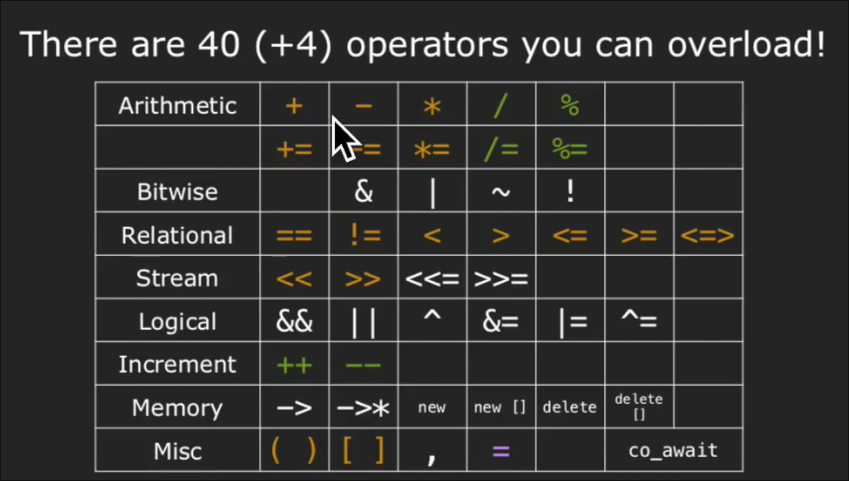

对于基本类型 这些运算符按照我们的预期工作

* 但是对于像`vector`这样的类 其`[]`如何获取到内部元素的呢
* 对于`string` `+=` 是如何奏效的

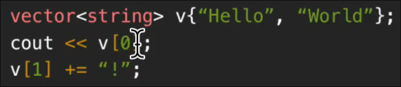

这实际等同于

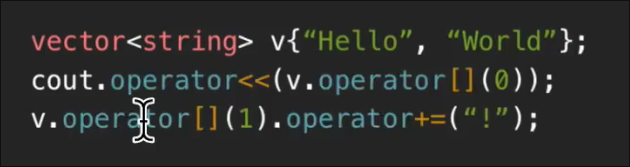

`c++`编译器为我们自动转化为这些函数 或者是

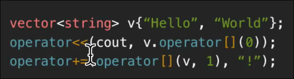

而实现这些类的人需要实现这些函数

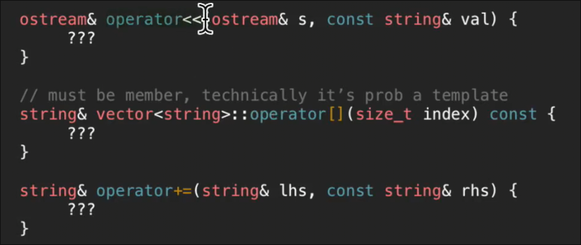

## +=

如果我们希望为`stringvector`实现`+=`操作

```cpp
    stringvector sv;
    sv += "abc";
    sv += "bcd";

    sv.push_back("Hello");
    sv.push_back("World");
    for (const auto & s : sv) {
        cout << s << endl;
    }
```

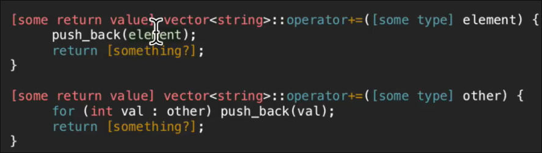

* 参数应设置`&` 因为对于一个很大的字符串我们不想复制 此外要设置`const` 否则我们的`+=` 无法接收`const` 修饰的字符串
* 返回值 对于基本类型如整数的`+=` 其返回的是新值（事实上是对添加后对象的引用)
    * 因此这样的代码应当奏效

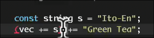

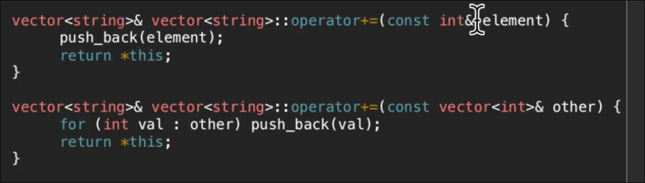

## +

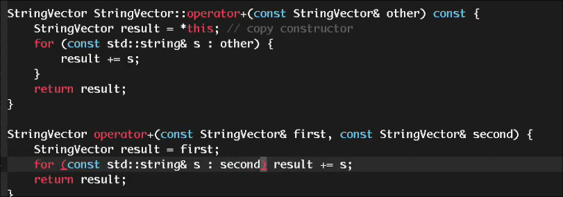

第二种作为非成员函数实现更好

## 一般的规则

1. 某些操作符必须作为成员函数实现 `[]` `()` `->` `=`等
2. 某些操作符必须作为非成员函数实现 `<<`等
    * 因为如果要实现为成员函数 我们不得不在`ostream` 中实现
    * 可以使用**友元** 获取私有变量
3. 一元操作符如`++` 必须实现为成员函数 
4. 如果一个二元操作符`+` `<` 对于两个操作符处理一样 那么应该实现为非成员函数
    * 如果没有平等处理两个操作数 修改了左侧 `+=` 那么应该实现为成员函数（访问需要修改的成员变量更容易）

## <<

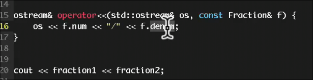

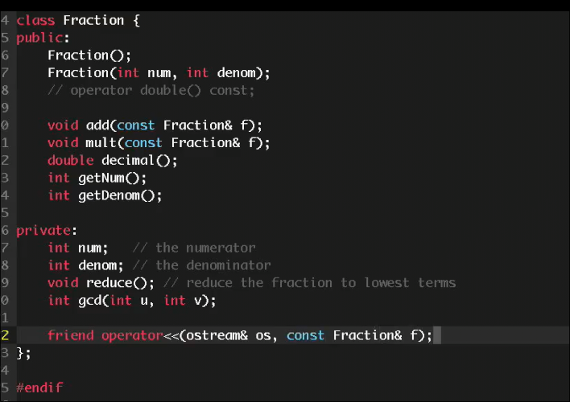

## pola原则

**最少惊讶**


使得其他人使用运算符不必感到惊讶

* 尽量模仿常规用法 *如基本类型*
* 如果有歧义 不要修改 
* 不要重载`,`
* 重载了其中一个 那么重载和其相关的全部
    * 如表示关系的全部6个
    * `+` 和 `+=`

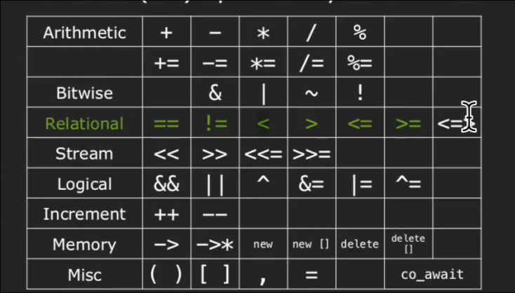

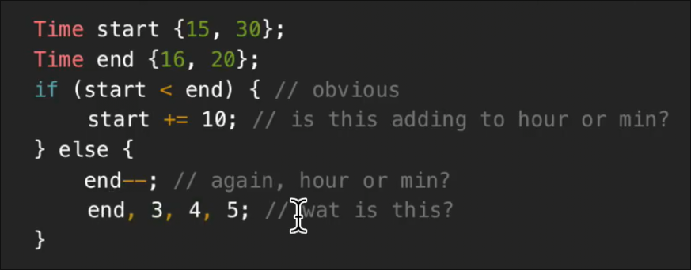

## []

对于`[]` 应当分别实现 `const` 和 非`const` 的版本

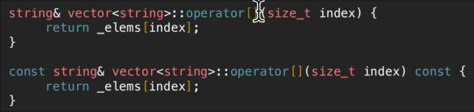

原因是有时候我们需要将这个类实现为`const` 此时只能使用`const`的版本来获取每个元素

而对于非`const`的类，有着使用非`const`版本来更改元素的需求 *由于返回的是引用 所以可以做到修改*

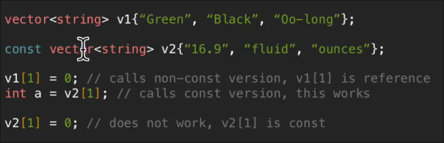
