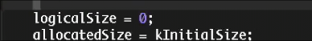
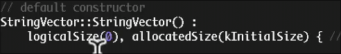
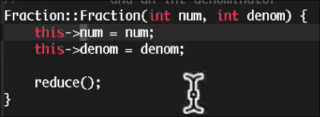
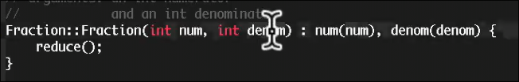
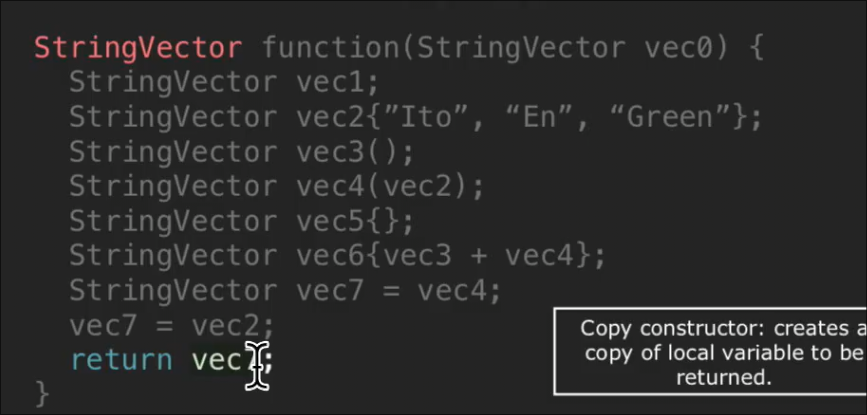
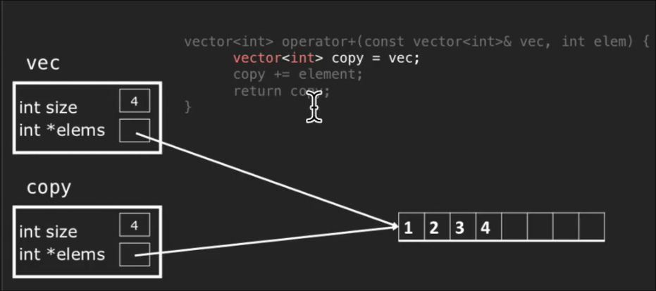
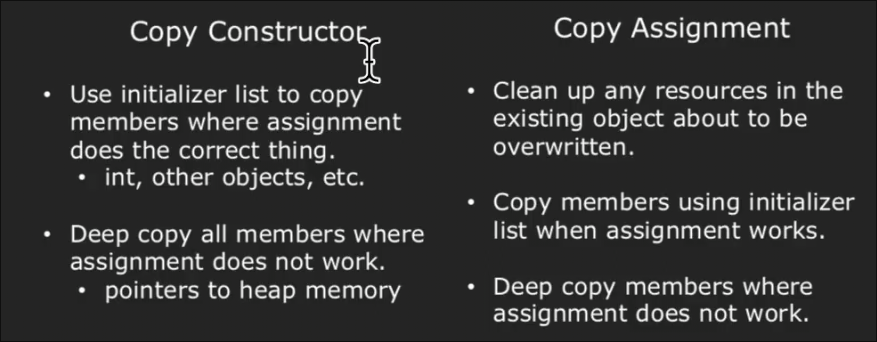
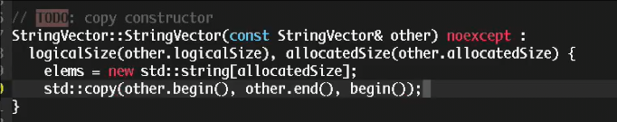
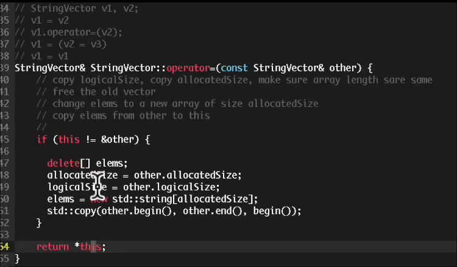
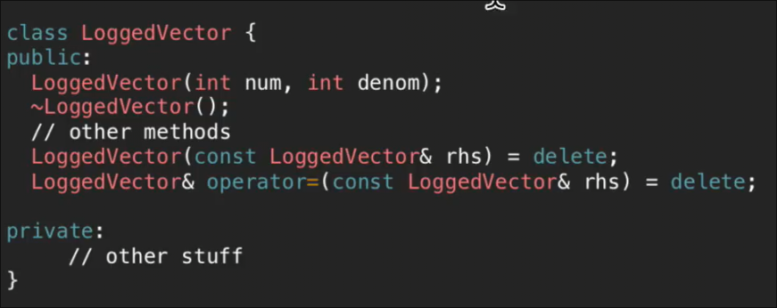

# 特殊成员函数
 
* [构造函数_析构函数](#构造函数_析构函数)
  * [初始化列表](#初始化列表)
  * [拷贝操作](#拷贝操作)
  * [拷贝构造_和_拷贝赋值的任务](#拷贝构造_和_拷贝赋值的任务)
* [不允许拷贝](#不允许拷贝)
* [三法则](#三法则)
* [0法则](#0法则)

## 构造函数_析构函数

### 初始化列表

对于成员为`const`的类

在构造函数中

不起作用

但是可以采取初始化列表

这会在变量声明时赋值 

相当于`const i = 3`是允许的

而 `const i` `i = 3` 是禁止的

此外引用也存在初始化后不能被重新赋值的情况 *其在声明时需要立即初始化*

如`ostream`的引用 需要使用初始化列表

可能的条件下 尽可能使用初始化列表

这个等同于

### 拷贝操作

特殊的成员函数通常会被编译器自动生成 

* 默认构造函数
* 拷贝构造函数
* 拷贝赋值运算符
* 析构函数

拷贝构造函数和拷贝赋值运算符在使用`=`时调用

* 前者在将已有对象赋值到新对象时调用
* 后者在另一对象赋值给已经存在的对象时调用

从上到下每一行调用的函数分别是

* 拷贝构造函数 形参传递时 在作用域中创建新的变量
* 默认构造
* 初始化列表构造
* 函数原型 *奇怪的语法 不要使用*
* 拷贝构造
* 默认构造 `{}` 什么也没有 是`C++` 区分`()` 提供的默认构造方式
* 拷贝构造
* 拷贝构造 创建了新变量
* 拷贝赋值 赋值给存在的对象
* 拷贝构造 按值返回 在返回的作用域中创建了新变量

`C++` 默认提供的拷贝函数仅仅复制每个成员

因此这样的代码不起作用 *因为被复制的是指针*

### 拷贝构造_和_拷贝赋值的任务

* 复制所有成员 但是对于特定的一些类型 需要**深拷贝**

对于所有可以简单复制的元素 在初始化列表中赋值

而对于指针等 在函数体中额外处理

注意第一步检查对于`v1 = v1` 很有必要

通常对于成员是**指针** **互斥锁？`mutexes`** **流**等我们需要手动指定拷贝构造和拷贝赋值

## 不允许拷贝

如流对象

试图拷贝会抛出编译错误

## 三法则

如果定义或删除 拷贝构造、拷贝赋值或者析构函数中的任何一个 那么通常应当定义或者删除 所有

* 原因在于 需要我们手动指定析构函数时 通常也是成员指针等的处理遇到问题

## 0法则

如果默认操作可以工作 那么就不要自己写这些
