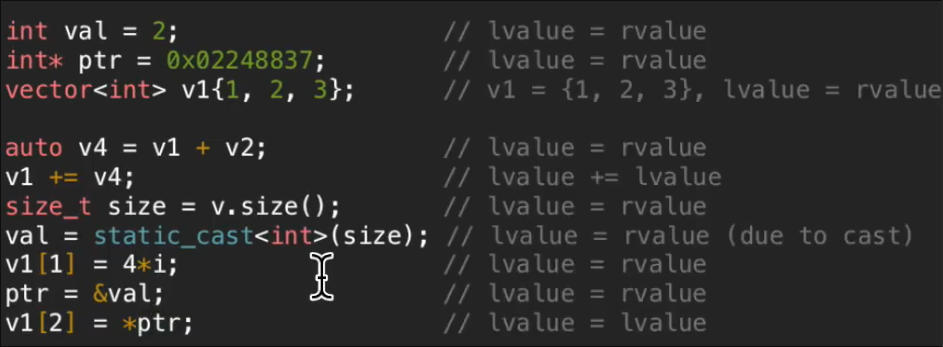

# 移动语义
 
* [vector::emplace_back](#vector::emplace_back)
* [拷贝省略](#拷贝省略)
* [左值和右值](#左值和右值)
  * [左值引用](#左值引用)
* [移动](#移动)
  * [移动构造函数_移动赋值函数](#移动构造函数_移动赋值函数)
* [5原则](#5原则)

## vector::emplace_back

和`push_back` 功能类似 

区别在于`push_back` 之前我们需要先创建一个对象 将其作为`push_back` 的实参传入 之后`push_back` 在内部创建一个这个对象来添加

而`emplace_back` 无需先创建对象 仅仅传入创建对象需要的东西 而只需要在函数内部创建一次这个对象

## 拷贝省略

对于几句代码

1. 进入`readNames` *调用含参构造* 
2. 返回时 拷贝构造给`caller` 作用域 
3. 拷贝结束 调用析构函数 
4. 回到`caller` 调用拷贝构造给`name1` 
5. 这一行结束后 右侧返回到临时对象调用析构函数
6. 下一行 默认构造
7. 再次进入`readNames` *调用含参构造*
8. 返回时 拷贝构造
9. 拷贝后析构函数
10. `name2` 拷贝赋值
11. 一行结束后 临时函数调用析构函数
12. `main`结束后 两次析构 `name1` `name2`

共3次拷贝构造 1次默认构造 2次含参构造 1次拷贝赋值 6次析构函数

而当我们指定编译器 拷贝省略后 *C++17 可以保证这个特性* 

编译器在应当返回某变量时 会直接在`caller` 的作用域创建 而不是当前的作用域 因此少了返回时的拷贝构造

同时对`main` 中`=`的拷贝构造进行拷贝省略

## 左值和右值

接下来我们希望对拷贝赋值进行优化 右侧的临时对象返回后仅仅拷贝后就析构

我们能不能直接偷到`name2`中

左值和右值是对复杂语义的简化

* `L-value` 是有名称和身份的表达式 可以使用`&` 直到其位置
* `R-value` 没有名称和身份 是**临时值** 因此无法使用`&` 找到

直观上`L-value` 可以出现在等号两侧 但是`R-value` 只能出现在等号右侧

* 函数返回值 往往是 R-value，但是如果返回的是引用 那么是L-value `[]`

### 左值引用

左值引用即对左值的引用 即另一个名字 `ptr2` 是 `ptr`的另一个名字

但是不能将右值给`auto &` 这样的左值引用

然而一个例外是**常量左值引用** `const auto&` 可以绑定到右值

* 原因是我们不会使得`const`修饰的变量出现在左侧

但是可以绑定给右值引用 `auto &&` *右值引用也不能绑定到左值*

* 其作用是 延长临时值的声明周期 将本该在下一行消失的`v1 + v2` 通过右值引用附加到`v4`
* 对`v4`的任何更改都会改变那个临时值

## 移动

对于`R-value` 由于是临时值 我们可以随意复制或移动 但是对于`L-value` 我们只能复制

### 移动构造函数_移动赋值函数

拷贝构造函数从现有左值中创建一个新对象

而移动构造函数从现有右值中创建一个新对象

现在我们只需要浅拷贝所有成员 即便是指针

但是我们还是进行了拷贝操作 *注意右侧是l值 `=`的动作一定是拷贝而不是移动* 如果成员是更大的类 如`vector` 呢

我们可以使用`move`函数将左值转为右值

* 接收参数将其转为右值后返回
* 应当不要再使用其参数 已经变成临时值

## 5原则

如果要重写其中一种 那么通常要写其中五种

