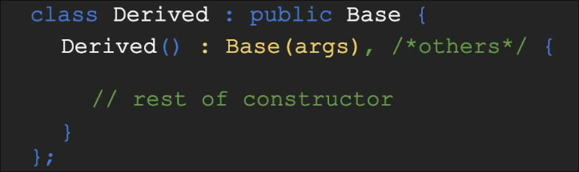
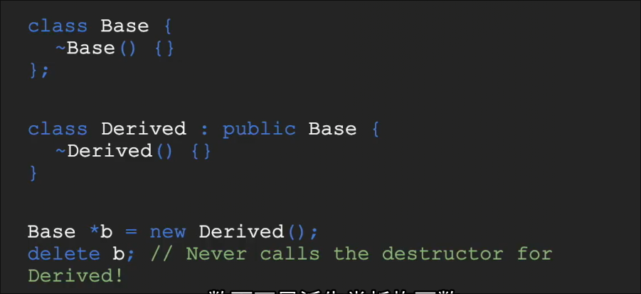
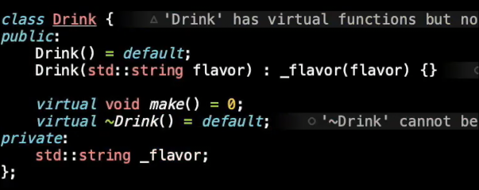
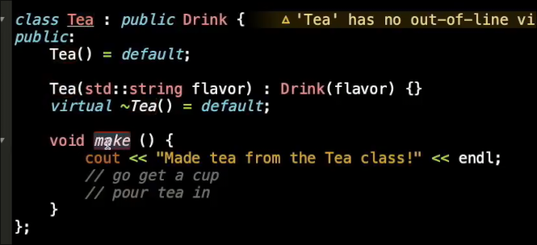
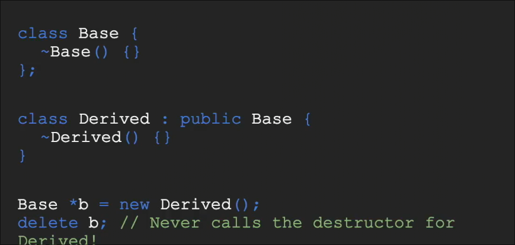
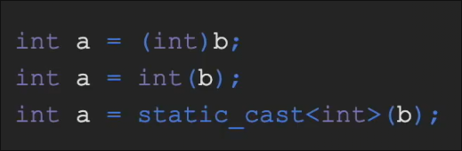

# 命名空间_继承
 
* [命名空间](#命名空间)
  * [命名空间的使用](#命名空间的使用)
  * [命名空间的定义](#命名空间的定义)
  * [类和作用域解析符](#类和作用域解析符)
* [继承](#继承)
  * [cpp中的接口](#cpp中的接口)
  * [继承的规范](#继承的规范)
  * [权限控制](#权限控制)
  * [模板和继承_静态与动态多态性](#模板和继承_静态与动态多态性)
* [类型转换](#类型转换)
 
## 命名空间

### 命名空间的使用

命名空间引入的意义在于区分其他库*如标准库 中 常常有 常用的命名函数如`count` `find`* 和自己编写的代码 之间的命名冲突

* 在标准库中的`count`算法和我们先行定义的`count` 整形变量 发生了冲突

可以这样改正 指定`count` 是命名空间`std`的

类似`python`的`import random` 之后`random.xxx`

### 命名空间的定义

在之后使用中可以`Lecture::count(..)`

### 类和作用域解析符

对于方法的实现 我们也需要标注作用域 但这不是命名空间

这样做的目的是 告诉编译器 我们正在实现哪个头文件 *头文件和.cpp文件命名不一致时也可编译*

这里类起到命名空间的作用

## 继承

### cpp中的接口

* `Drink`**接口类中**的`make`函数需要子类实现 被指定为`virtual`
* `=0` 要求 实现类 必须要实现这一接口函数 否则不会被视作阵阵的类 编译器会报错 *纯虚函数*
* 实现类必须实现所有纯虚函数

* 至少有一个纯虚函数的类被成为**抽象类**
* 抽象类不能被实例化
* 还可以有非纯虚函数 和 常规函数

覆盖继承的成员变量 之前的成员变量被隐藏不见

非纯虚函数 需要 提供一个默认的实现 并由子类可选地覆盖

### 继承的规范

* 子类同样可以覆盖普通函数 但是*不规范* 父类中应当给可能覆盖的函数 设置为虚函数
* 子类的构造函数应以父类构造作为初始化列表的一部分

* 如果希望自己的类可继承 那么将析构函数设为`virtual` *是否可继承的标志* 否则面临内存泄露

这里只会调用`Base`的析构函数

### 权限控制

* `private` 修饰的成员 只能被这个类访问
* `protected` 修饰的成员 可以被这个类和派生类访问
* `public` 可以被任何类访问

* `= default` 告诉编译器保留默认的构造函数
* 有参构造采用初始化列表
* 这个类是一个抽象类 有一个`make` 纯虚函数 需要子类实现
* 仅允许本类访问的`_flavor`
* `virtual` 修饰的默认析构函数 表示可被继承

* 子类中无参构造如不指定调用父类构造，会自动调用父类的构造函数
* 而其他有参构造需要在初始化列表手动指定父类的构造函数
* 析构函数也会自动调用父类的 但是指定为`virtual` 允许继承
* `Tea`类不再有纯虚函数 可以被实例化

### 模板和继承_静态与动态多态性

什么是否使用哪一个来进行多态性呢？

* 模板在编译时 完成其多态性 由编译器生成所需的具体类型的代码片段
* 类在运行时 完成其多态性

编译时并不会确定b的具体类型和方法 只有运行才知道实际指向的是派生类对象

## 类型转换

在`c++` 中最好的实践是后者
