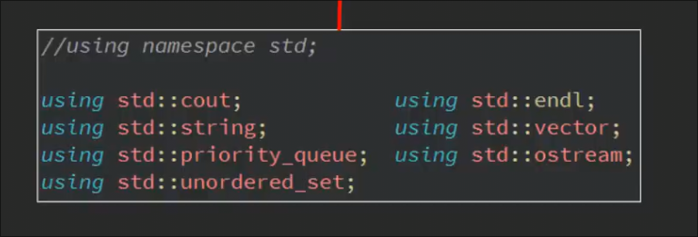
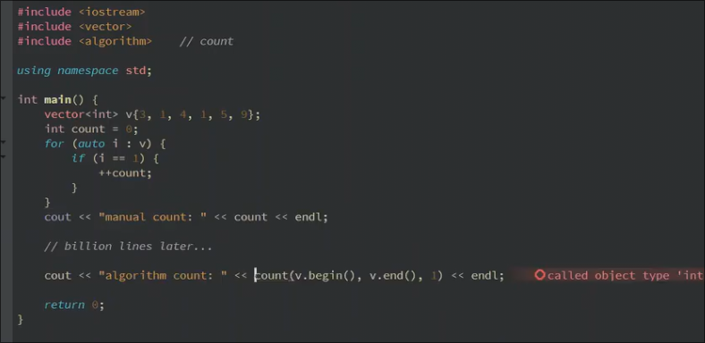
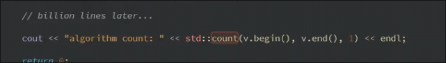
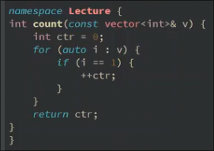
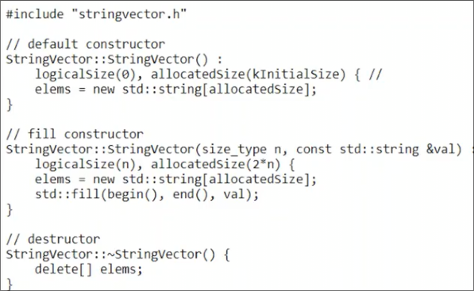
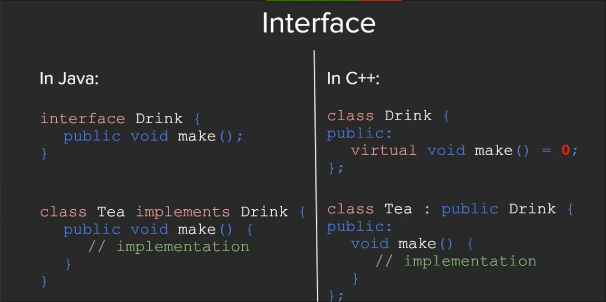
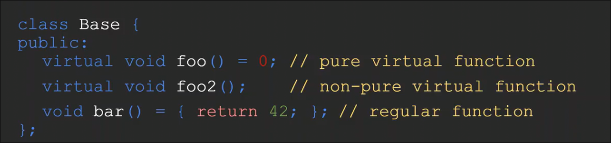
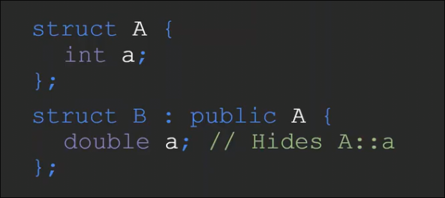

# 命名空间_继承
 
* [命名空间](#命名空间)
  * [命名空间的使用](#命名空间的使用)
  * [命名空间的定义](#命名空间的定义)
  * [类和作用域解析符](#类和作用域解析符)
* [继承](#继承)
  * [cpp中的接口](#cpp中的接口)

## 命名空间

### 命名空间的使用

命名空间引入的意义在于区分其他库*如标准库 中 常常有 常用的命名函数如`count` `find`* 和自己编写的代码 之间的命名冲突

* 在标准库中的`count`算法和我们先行定义的`count` 整形变量 发生了冲突

可以这样改正 指定`count` 是命名空间`std`的

类似`python`的`import random` 之后`random.xxx`

### 命名空间的定义

在之后使用中可以`Lecture::count(..)`

### 类和作用域解析符

对于方法的实现 我们也需要标注作用域 但这不是命名空间

这样做的目的是 告诉编译器 我们正在实现哪个头文件 *头文件和.cpp文件命名不一致时也可编译*

这里类起到命名空间的作用

## 继承

### cpp中的接口

* `Drink`**接口类中**的`make`函数需要子类实现 被指定为`virtual`
* `=0` 要求 实现类 必须要实现这一接口函数 否则不会被视作阵阵的类 编译器会报错 *纯虚函数*
* 实现类必须实现所有纯虚函数

* 至少有一个纯虚函数的类被成为**抽象类**
* 抽象类不能被实例化
* 还可以有非纯虚函数 和 常规函数

覆盖继承的成员变量 之前的成员变量被隐藏不见

