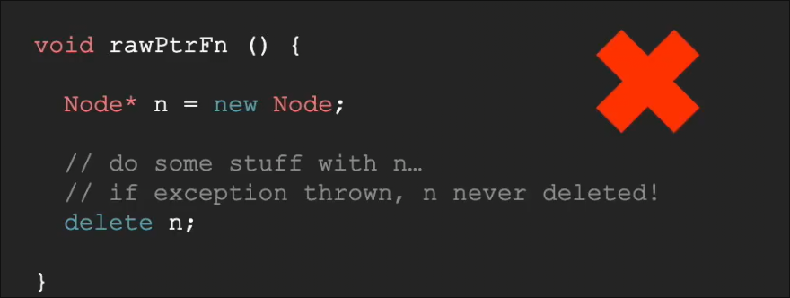

## RAII_智能指针
 
* [RAII_](#RAII_)
  * [代码路径](#代码路径)
  * [raii_资源获取即初始化](#raii_资源获取即初始化)
* [智能指针](#智能指针)

### 代码路径

从函数调用伊始 到 函数返回*或意外退出*为止 经过的路径数

* 正常退出存在3条路径
    * 两个条件`False` 正常`return`
    * 第一个为`true` 进入里面 后 `return`
    * 第一个为`false`后判断 第二个为`true` 进入里面后 `retuen`
* 几乎每个函数和运算符 参数 返回值 都可能出现异常

问题是对于这么多代码通路

我们仅仅能保证其中三条不会造成内存泄露 其余大多不会到达`delete` 我们可以用`try-catch`来捕获异常

这些内容必须要记得完成时退出或关闭

### raii_资源获取即初始化

更准确的翻译应为 SBRM 作用域基本内存管理 CADRE 构造函数获取 析构函数释放

由于构造函数在创建对象时调用 析构函数在超出作用域时调用

因此我们应当将`delete`相关放到析构函数中 对象的创建放在构造函数中

这就不符合RAII规范

然而文件流以及实现了RAII规范 我们无需自行open 和 close *存在是为了兼容*

尽量避免手动调用资源

## 智能指针

这样使用指针不符合RAII原则 类似地 我们将其包装为一个类 

* `unique_ptr` 类似**锁** 其唯一拥有所持有资源 析构时删除持有资源 不可复制

* `shared_ptr` 符合规范 但是允许不同的`shared_ptr` 持有此资源 当没有指针指向其时才会将其删除 允许复制
* 使用引用计数计数 每次构造和析构被调用 加减1

* `weak_ptr` 不会增加引用计数 但也允许我们持有其他指针

应当使用专门的函数构建指针

原因涉及到类似多线程的静态条件

现代c++已经基本 摆脱new和delete 为了更好的内存控制
