# 多线程
 
* [原子指令](#原子指令)
* [锁](#锁)
* [条件变量](#条件变量)
* [future_头文件](#future_头文件)
* [代码](#代码)

多线程的意义是 当程序等待某些事情 如 输入 网络请求 文件读入等等耗时操作 可以用其他线程做其他事情

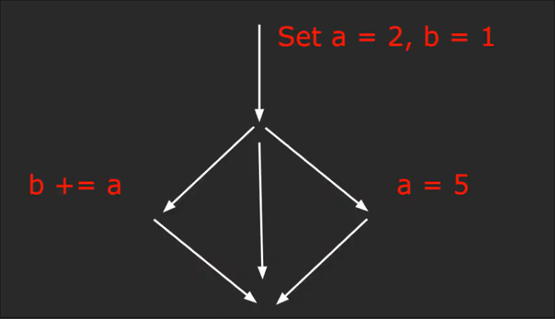

这里的多线程带来的一个问题是 我们不知道哪个线程先执行 顺序影响了最终b的结果 **数据竞争**

解决方案是使用**锁**

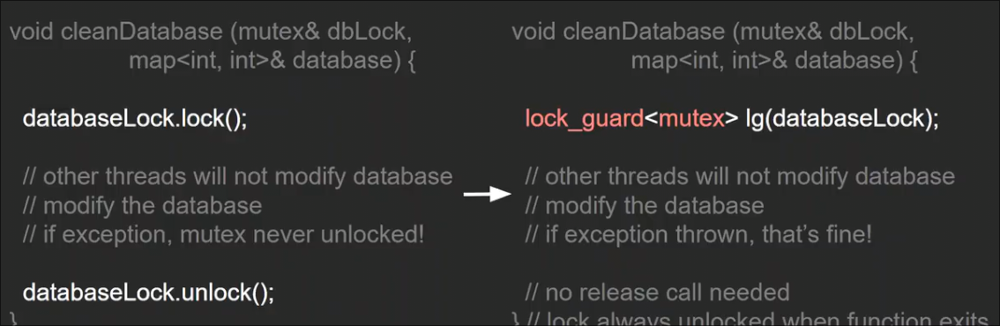

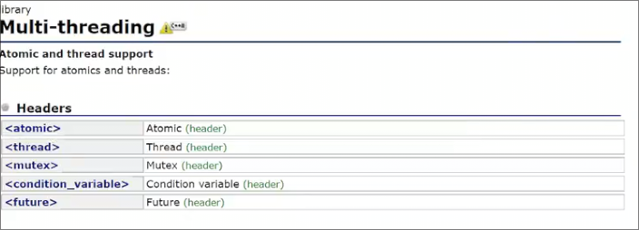

## 原子指令

`<atomic>` 头文件中 包括一些 **原子类型** 来确保单个操作 一条指令完成

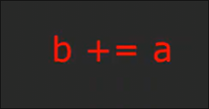

比如这条指令 如果使用普通整形 在底层需要很多代码才能执行

但是使用 原子整形 只会用一条指令

不必将多线程程序中所有都使用原子操作 只有某些关键操作 如执行顺序很重要时

## 锁

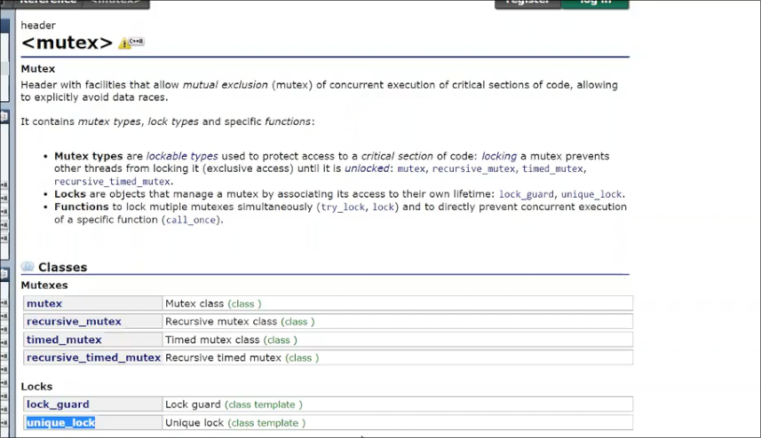

除了只能解锁于作用域末尾的`lock_guard` 还存在可以在函数中部解锁或加锁 但是保证在作用域结束后解锁的`unique_lock`

## 条件变量

用于线程间的通信

## future_头文件

提供 类似`JavaScript` 的`await` 异步函数

## 代码

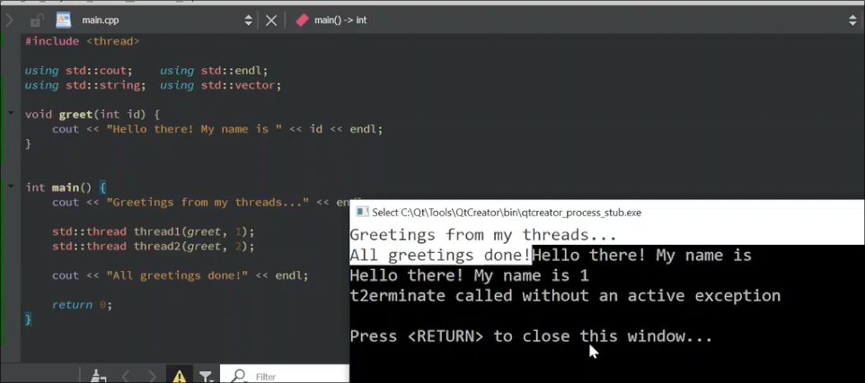

* 其声明的语法是 执行的函数 后面的执行函数的参数

1. 为什么 最后输出的 `All greenting done` 在两个线程声明后输出

主线程仍是一个在允许的线程 其顺序不可预测 

我们在分支线程中休眠一段可看到主线程先返回

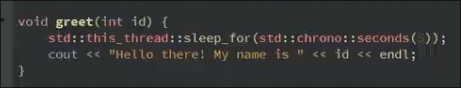

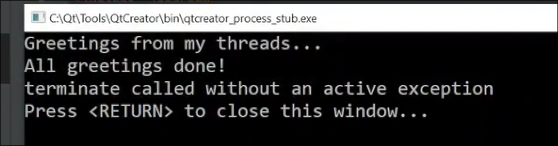

同时在主线程返回后 分支线程超出作用域析构而没有执行 `term...` 表明线程异常终止

2. 输出重叠？

cout不是一个原子操作 流被争用 **锁**

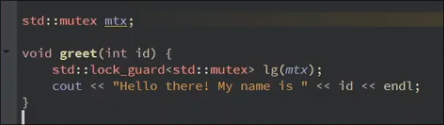

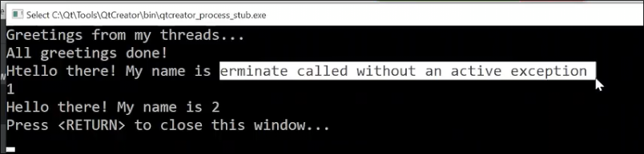

虽然两个子线程不再争用 但是主线程的输出依旧混在子线程输出中

告诉其明确等待子线程结束

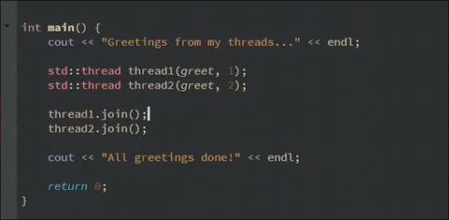

`join` 意为等待子线程结束后重新加入主线程 这样主线程才会继续

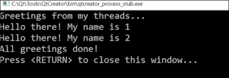

线程和其他类型一样 可以作为各种数据结构中的一部分

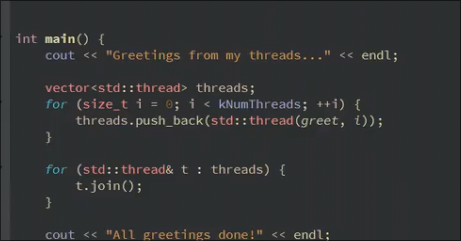
