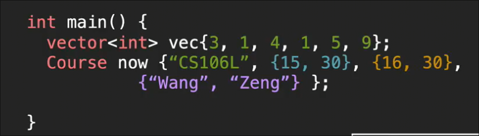
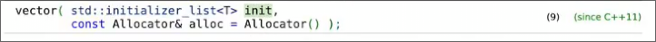

# 现代C++类型
 
* [类型别名_](#类型别名_)
* [auto](#auto)
* [多个返回值_结构体](#多个返回值_结构体)
* [初始化_初始化列表](#初始化_初始化列表)

这样的警告是由于 将 表示`size` 的无符号整数直接和普通整数相比较

包括数组的索引 也期望接受无符号整数

一种解决方法是 `size_t` 一种无符号整数

这个去掉首位字符串的函数存在bug

其不能处理空字符串的情况 size - 1得到 -1 但是由于 为无符号整数 转化为一个巨大的值 程序崩溃

需要单独处理空情况

## 类型别名_

给某类型 一个别名

## auto

**编译器**为我们确定类型

* 其中`name` 由于使用了`C`字符串字面量 会是一个`char *` C字符串
* 而下面的写法才可以转换C++字符串
* 将`const`的变量给`auto` 会去掉`const` 因此要在`auto`的前面加回来
* 引用也会被抛弃 需要自行加上

有些情况必须使用`auto` 如 `lambda`

使用`auto`的场景

* 不关心类型是什么 `iterators`
* 上下文中 其类型很清晰时 `templates`
* 不知道类型是什么 `lambdas` 
* 不要对返回值使用`auto`
* 类型很长

C++14后 lambda的参数可以使用`auto` C++20后 普通函数的参数可以使用`auto`

## 多个返回值_结构体

c++ 提供了 pair 和 tuple 允许返回值为多个

配合**结构化绑定**

同样可以对结构体进行结构化绑定 赋值

在使用对的时候 比如 `min` 和 `max` 

有时我们不知道哪一个才是最大值 缺乏**自文档化** 这时候可以用结构体

结构体是对和元组的更一般形式 内部的内容有自己的名称

## 初始化_初始化列表

C++中 对于各种类型 之前共存在26种初始化方式 为了统一 在11引入 **统一初始化**

大括号的初始化方式 **初始化列表** 结构体、类等等都允许这样初始化

并且如下面的`now` 变量可以嵌套

* 分别在`now`的初始化列表中初始化其内部成员`string` 结构体 `vector`

关于类可以进行统一初始化 是因为其定义提供了初始化列表版本的构造函数

