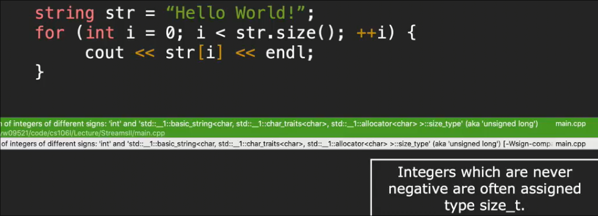
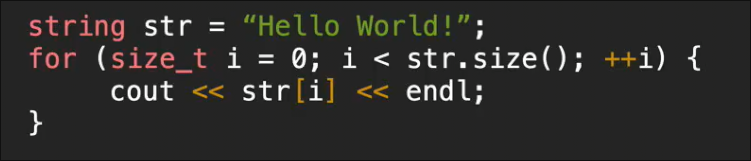
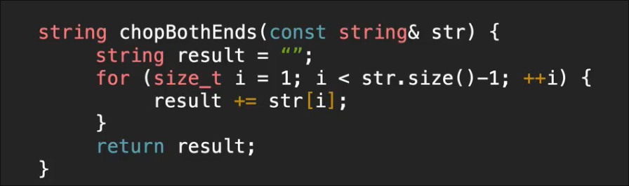
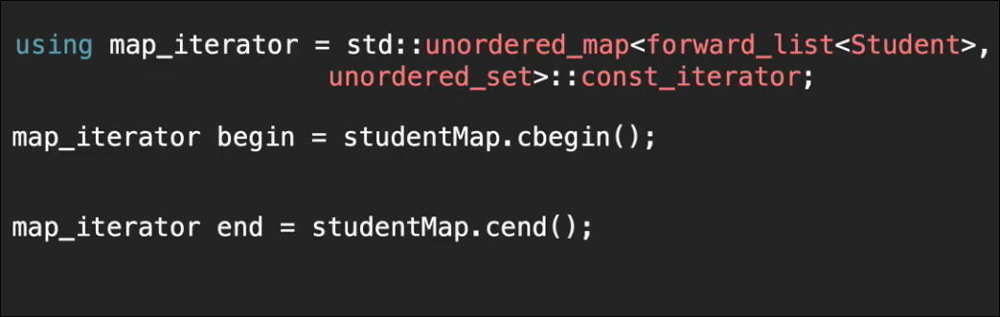
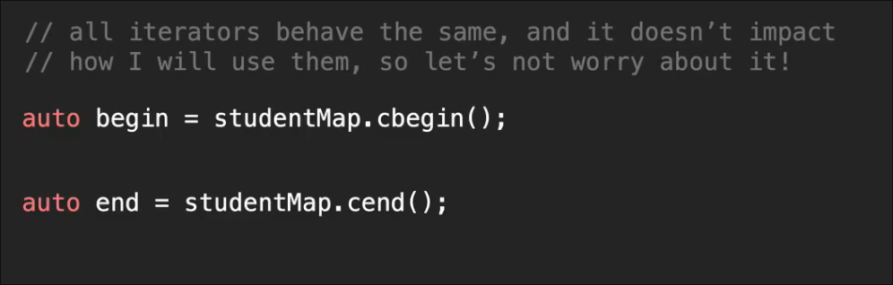
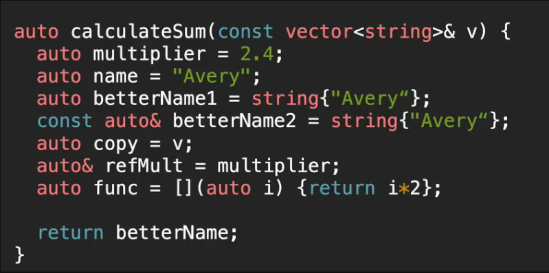
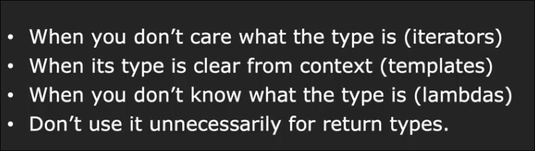
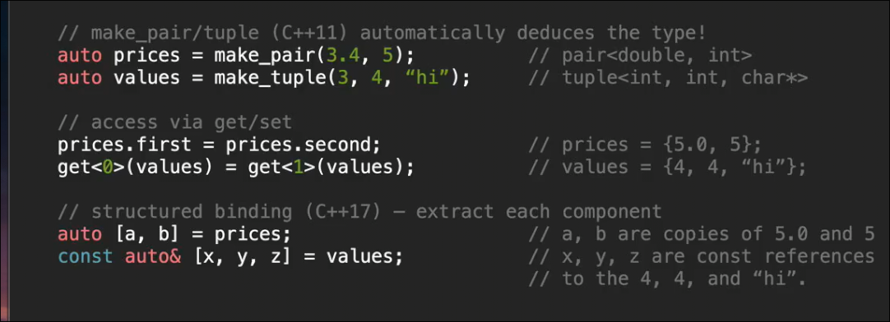
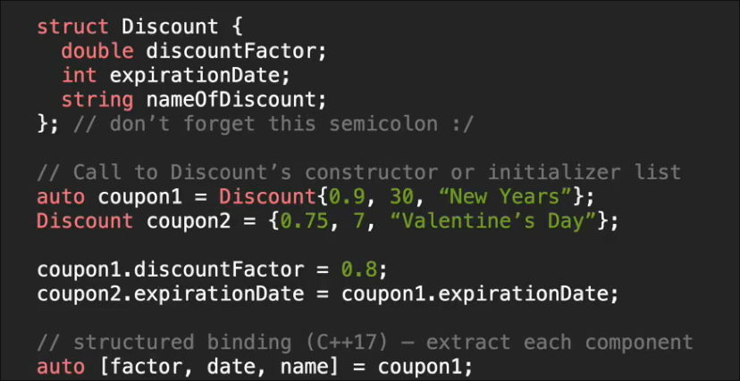

# 现代C++类型
 
* [类型别名_](#类型别名_)
* [auto](#auto)
* [多个返回值](#多个返回值)

这样的警告是由于 将 表示`size` 的无符号整数直接和普通整数相比较

包括数组的索引 也期望接受无符号整数

一种解决方法是 `size_t` 一种无符号整数

这个去掉首位字符串的函数存在bug

其不能处理空字符串的情况 size - 1得到 -1 但是由于 为无符号整数 转化为一个巨大的值 程序崩溃

需要单独处理空情况

## 类型别名_

给某类型 一个别名

## auto

**编译器**为我们确定类型

* 其中`name` 由于使用了`C`字符串字面量 会是一个`char *` C字符串
* 而下面的写法才可以转换C++字符串
* 将`const`的变量给`auto` 会去掉`const` 因此要在`auto`的前面加回来
* 引用也会被抛弃 需要自行加上

有些情况必须使用`auto` 如 `lambda`

使用`auto`的场景

* 不关心类型是什么 `iterators`
* 上下文中 其类型很清晰时 `templates`
* 不知道类型是什么 `lambdas` 
* 不要对返回值使用`auto`
* 类型很长

## 多个返回值

c++ 提供了 pair 和 tuple 允许返回值为多个

配合**结构化绑定**

同样可以对结构体进行结构化绑定 复制

