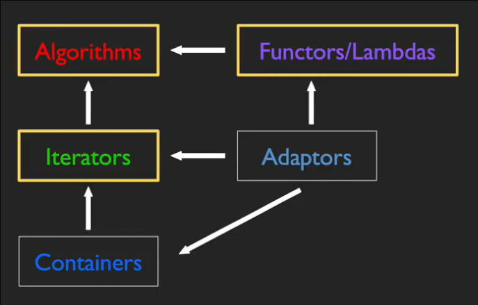
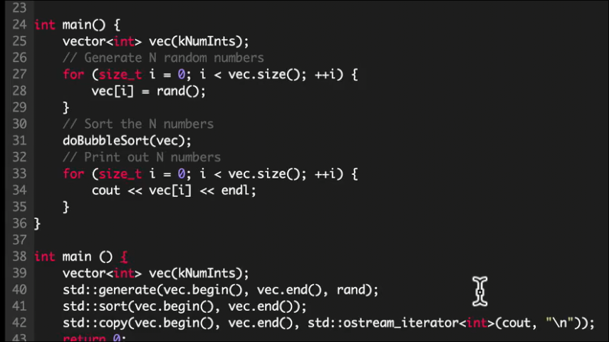
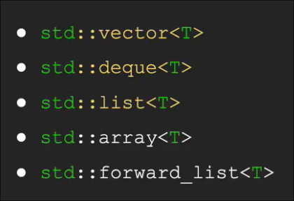
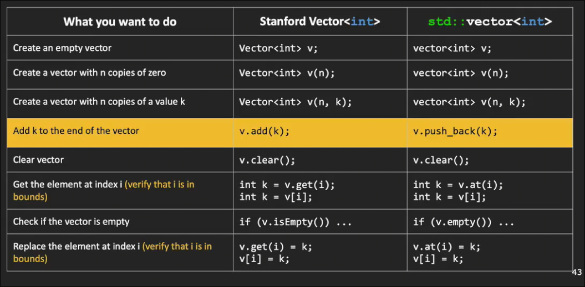
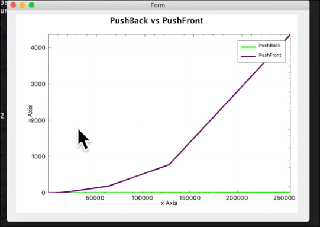
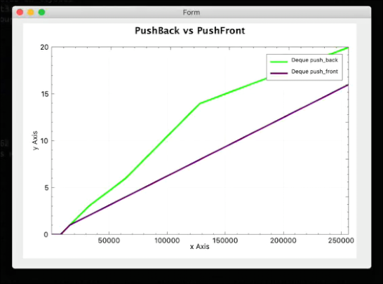
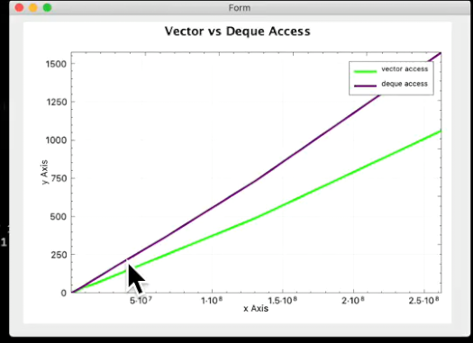

# 标准模板库 序列容器

处于实现算法和数据结构的一般版本的目的

* 容器
* 适配器
* 迭代器
* 算法
* 仿函数/lambda

stl能做到的是 上图中所示的 将很机械的过程转变为专注于更大的问题

## 序列容器

是提供对元素序列访问的数据结构

### vector

* `.at`和`[]`的一个区别是 当`[]`访问越界时 不会检查 也不会主动引发错误 可能造成`segmentation fault` *也可能不会报错 未定义行为*
    * 原因在于c++希望给处更自由的操作空间
    * 而`.at`会检查 并主动抛出异常 `std::out_of_range`

### deque

通常情况下我们都会使用`vector` 出于其基础、轻便性

但是在**前插**的情况 `vector`更慢 我们可以使用c++提供的双端队列`deque`

* `push_front`

常数时间内 前后插入

然而其访问元素的速度不如`vector` 虽然也是常数时间

