# 容器适配器_关联容器_迭代器
 
* [容器适配器](#容器适配器)
* [关联容器](#关联容器)
* [迭代器](#迭代器)
  * [map的迭代器](#map的迭代器)
* [for_范围循环](#for_范围循环)
* [迭代器类型](#迭代器类型)
 
## 容器适配器

对于数据结构 栈和队列

在c++的实现 底层就是 `vector` 和 `deque`

* `Stack`是仅仅允许`push_back`和`pop_back`的`vector/deque`
* `Queue`是仅仅允许`push_back`和`pop_front`的`deque`

其使用的都是`vector`和`deque`中最快的函数 因此 其效率比一般使用的`vector`或`deque`高

此外我们可以自定义使用的容器给栈或者队列

## 关联容器

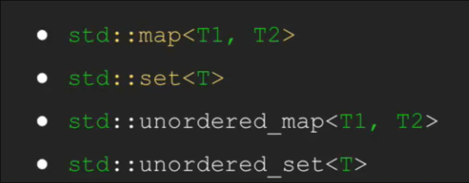

其中没有序列的概念 无法通过`[0]` 来访问

数据以键值对存储

* `Map`和`Set`的键是有序的 因此其作为`key`的类需要定义`<`的表现
    * 迭代**某一范围内**的元素很快
* `unorder_map`和`unorder_set`在底层不排序 其余相同 因此遍历时不保证按照字母序
    * 访问单个元素更快

在`map`中`at`和`[]`表现与在`vector`中相似但有所不同

* 用`[]`访问没有插入的`key` 不会导致未定义行为 但是会插入一个默认值 可以用其赋值`m["hi"] = ..`
* 用`at`访问或赋值未插入的`key` 会抛出错误

`.count()` 返回 `key` 出现的次数 在上述关联容器中 只会`0/1`

* `c++20` 引入`.contains()` 返回`key`是否存在的布尔值

## 迭代器

对于序列容器我们很好迭代 那么如果迭代如`map` `set`的关联容器呢 有没有对于可迭代容器统一的迭代方法？

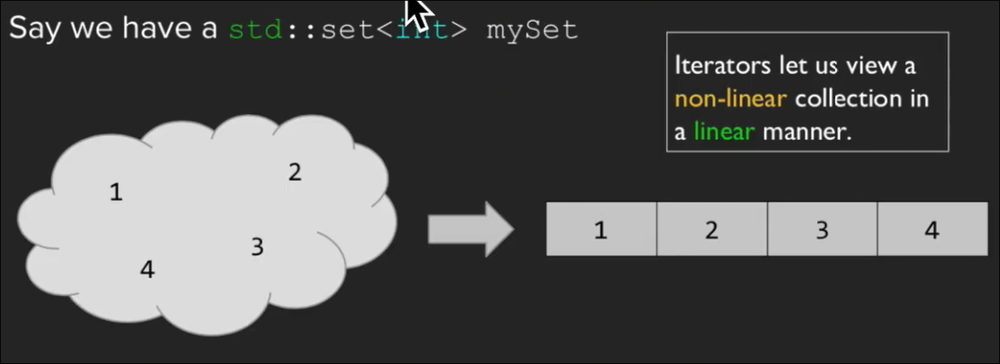

迭代器可以使我们以线性的方式查看非线性容器

与迭代器关联的几个常见函数

* `.begin()` 返回指向容器中第一个元素的迭代器
* `.end)()` 返回容器中最后一个元素的**下一个**的迭代器

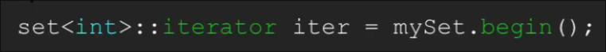

是一个迭代器类型 并与正在使用的容器关联 整数集合类型的迭代器

* 对迭代器解引用可以访问其指`*iter`
* `iter++`  递增迭代器

迭代器的一大作用是抽象掉容器具体是什么

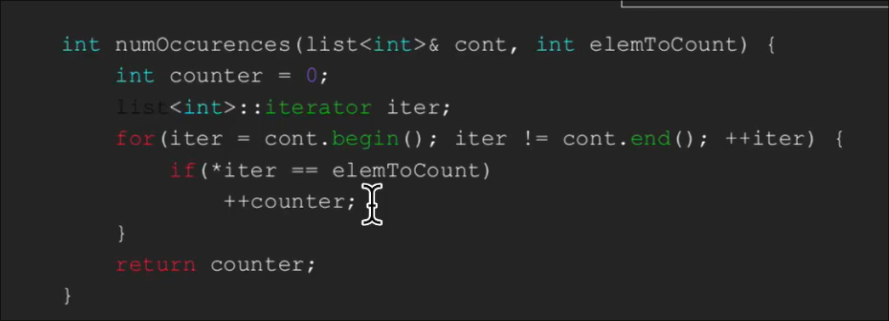

两个迭代器比较而可以用`==` 或者 `!=`

**随机迭代器**允许`+3` 这种操作

可以配合一些函数在中间范围迭代

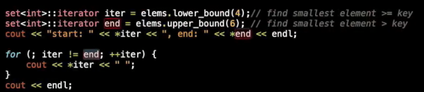

其中`elems`是一个`set<int>`

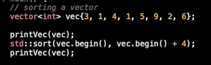

### map的迭代器

对于`pair` 之前我们用其返回多个值

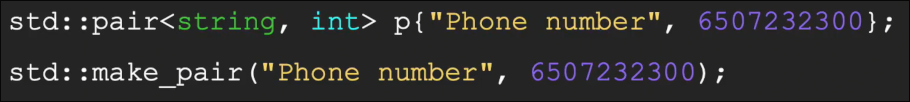

这是其构建的两种方式

* `make_pair`的方式 配合auto 我们不需要提前知道类型

其的另一个应用是对于`multimap`的插入 *一个`key`允许多个`value`*

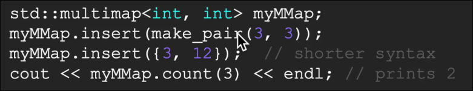

第二种方式实际上传入的是**初始化列表**

对于`map`的迭代器 解引用 会得到一个`pair` 对应`key` 和 `value`

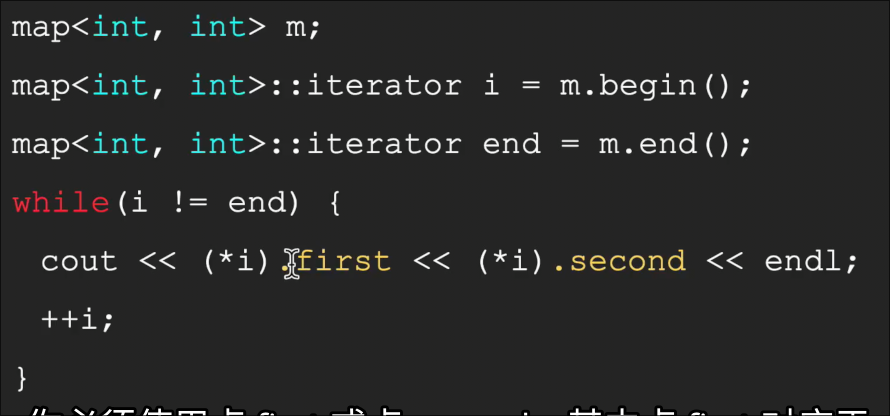

* 等同于 `i->first`

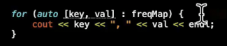

一种更简单的写法

## for_范围循环

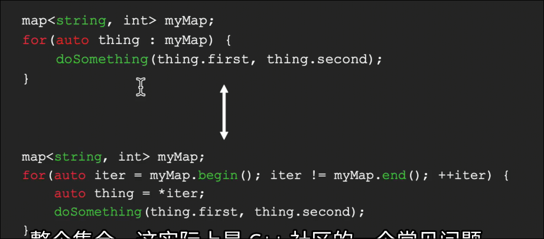

## 迭代器类型

如`sort`函数 仅仅允许我们传入两个随机访问迭代器 

而对于`set` `map` 的迭代器会报错

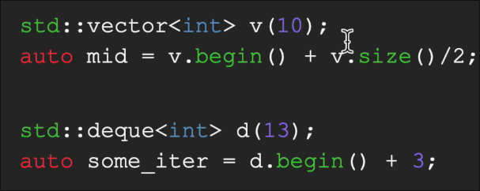

这是正确的 而下面的链表、集合不支持随机访问 

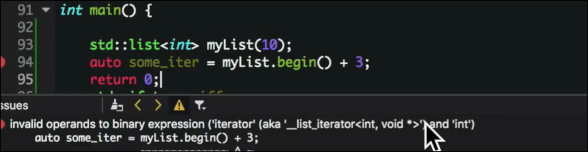

迭代器共有5类

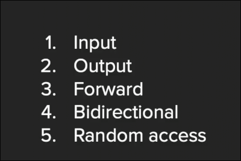

随机访问迭代器最强大 而 输入输出迭代器 的功能最少

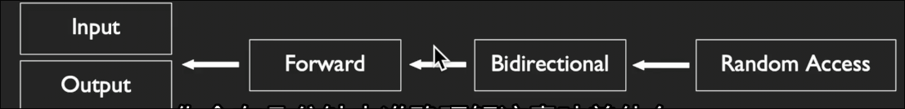

每个迭代器都能执行这些操作

* 从存在的迭代器中创造
* `++`
* `==` `!=`

* 输入迭代器
    * 只读 仅仅能出现在表达式右侧
    * 单次遍历
    * `std::find` `std::count` 使用这种迭代器及更高级迭代器
* 输出迭代器
    * 只写 仅仅能出现在表达式左侧
    * `std::copy` 使用其及更高级迭代器
* 前向迭代器 
    * 额外具有多次遍历的功能 两个指向同一对象的迭代器 分别`++` 指向的仍是同一对象
* 双向迭代器 
    * 额外具有`--`
    * `std::map` `std::set` `std::list`
* 随机访问迭代器
    * 允许`+3`这样的操作
    * 指针、`std::vector` `std::deque` `std::string`

迭代器类别像一种接口 给我们可以随机访问与否的承诺 而指针想是随机访问迭代器实现的一种类，和向量的迭代器同级关系 都是随机访问迭代器的一种实现
