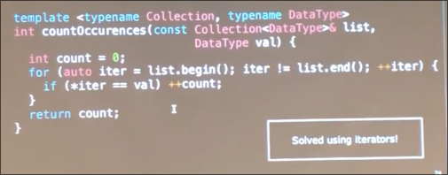

# 模板

现在的需求是我们自己实现一个比较两整数元素大小的函数依次返回较小和较大

这个函数很好写 但是如果我们将其扩展呢？ 比如 字符串？

一种是利用**重载**

非常冗余 只有类型不一致

于是我们写成`T`

我们需要告诉`C++`这是一个模板

* 其后的一个函数模板中可用
* 这里的`typename` 意思是`T`可以放入任意类型
* 此外还可以为`class`等 T只能是`class`; `int` `double`将不起作用

使用的时候，常用方式是显示指定类型

同样可以隐式指定 一个区别在于 显示在编译时填充 而隐式仅仅在编译时检查 运行时填充

* 要注意隐式时传入字符串字面量的表现和显示`string`不同 因为其是`char *`类型 不会得到预期的`<`操作结果

允许多个模板参数

考虑这段代码 我们将允许使用的容器模板化 然而对于`set` `map` 代码中的`list[i]`不起作用 而迭代器此时就很有必要了

注意`auto` 在这里是允许使用的

为了让函数更具有泛性

参数改为输入迭代器
