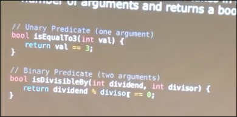
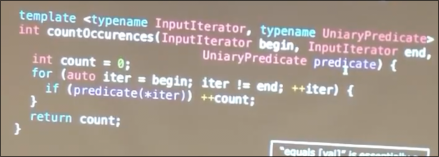
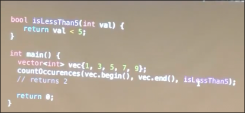
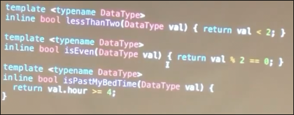
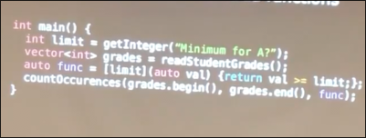
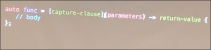
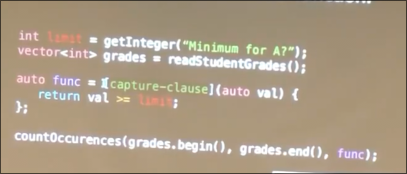
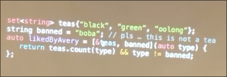
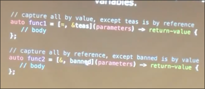

# 谓词 lambda

## 谓词

接受一些参数 返回布尔值 的函数

有了谓词我们可以让我们在模板一节提到的 统计某容器中元素出现次数更泛化

问题等价于 统计容器中元素和给定元素相等的次数 我们可以泛化为 ...小于的次数 ...大于的次数 通过传入谓词实现

注意传入的谓词本身也可以是一个函数模板 

这里在传入时需要**显式指定谓词函数模板类型**

## lambda

*c++11*

是一个轻量级的对象 表现为一个函数 **函数对象**

结构为

* **捕获子句**
* 参数
* 返回值类型 *c++14 中 可选*

lambda 中的参数可以使用`auto` C++14 *模板化*

lambda 是一个对象 但是其类的名字很奇怪 因此必须要用`auto` 接收

这段代码不会编译 出于作用域的原因 无法访问到 `limit` 而捕获子句用来捕获外部的变量  *不允许修改* 内部允许重新声明自己的同名变量

但是可以采用引用传递 这样即可修改 但也可以重新声明自己的同名变量

也可以复制传递或者引用传递所有

复制传递所有 但是引用所选内容 （不推荐 因为会变得全局化）

函数以及lambda的默认值不能与`auto`或者模板类型的参数 一起使用
