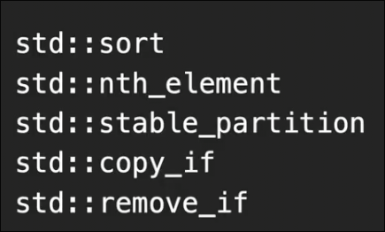
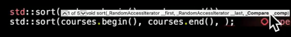
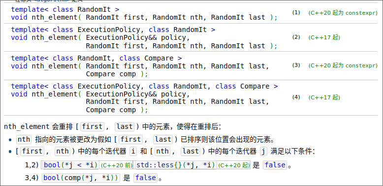
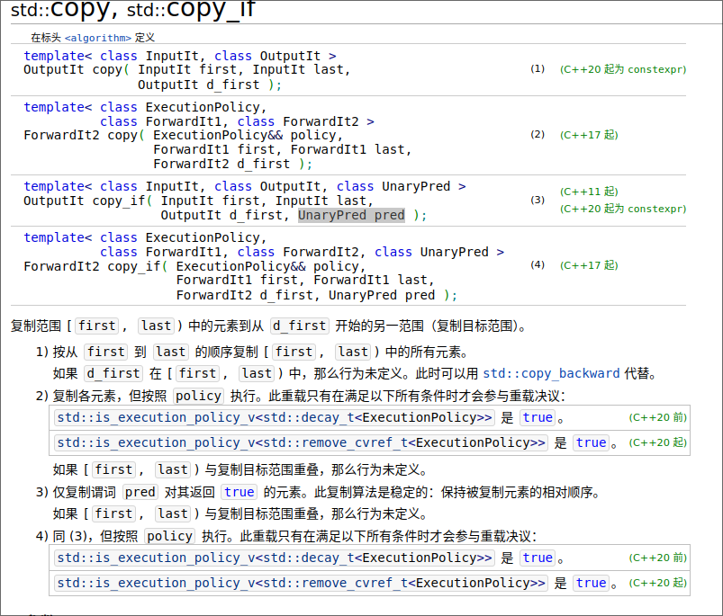
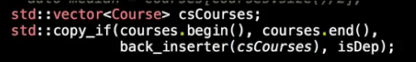
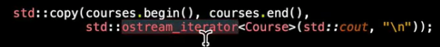
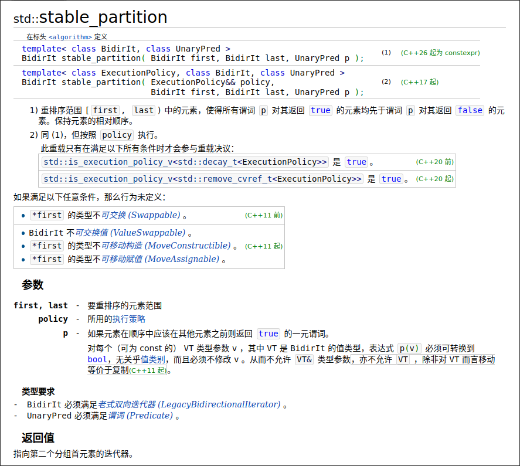
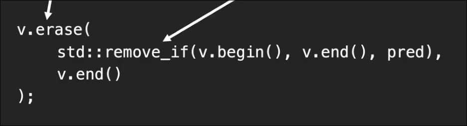

# 算法
 
* [count__count_if](#count__count_if)
* [sort](#sort)
* [nth_element](#nth_element)
* [copy__copy_if](#copy__copy_if)
  * [迭代器适配器](#迭代器适配器)
  * [流迭代器](#流迭代器)
* [stable_partition](#stable_partition)
* [remove_if](#remove_if)
* [find](#find)

## count__count_if

* `count` 不需要谓词 提供数据值 检查有多少实例
* `count_if` 需要谓词

## sort

可选地传入二元谓词 用来比较排序容器中的两元素第一个是否小于第二个

O(nlogn)

## nth_element

平均情况 O(n)

类似快排的的步骤1

## copy__copy_if

复制一些元素到另一迭代器开始的范围

注意输出迭代器所在容器的大小

### 迭代器适配器

* 存在可以扩展容器大小的迭代器 *迭代器适配器* `back_inserter`
* 会在需要时 自动尾部扩展容器 传入支持`push_back` 的容器

### 流迭代器

有时候我们需要copy到输出流

传入`cout`到`ostream_iterator` 返回一个针对`cout` 的输出迭代器

## stable_partition

按照谓词真假来分组

## remove_if

去除满足谓词的项

返回rwmove后的`end`迭代器

不能实际改变容器的大小 而是将删除的内容（一般）放在了末尾 并且不对其是否改变予以保证

这是一般的彻底删除操作

## find

找到匹配的元素

每个容器类也有自己的find

对于集合和映射 自己的`find` 更快
