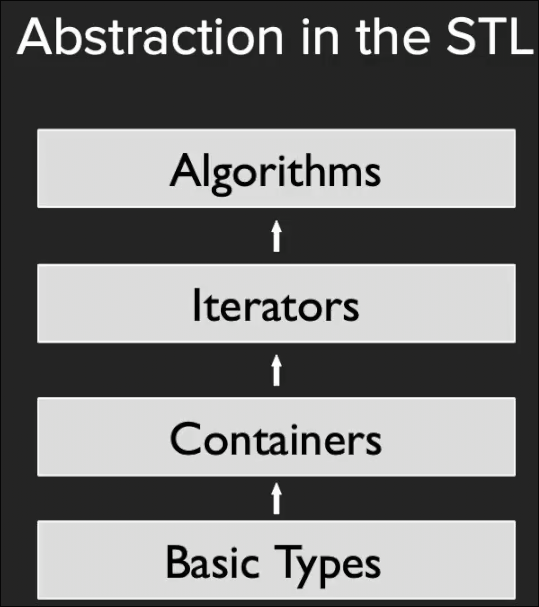

# STL 总结

## stl 的抽象思想

忽略掉基本类型是什么 STL提供了容器

抽象掉容器是什么 STL提供了迭代器

而提供的算法适用于多种迭代器

* `std::transform` 类似于 `python` 的 `map`
* 从字符串搜索字符串 应该用`search` 而不是`count` 后者用来搜索容器中元素也就是单个字符
* `inner_product` 用于计算`.`积

程序的构建过程 是 自顶向下
