# 面向对象
 
* [头文件和源文件](#头文件和源文件)
* [构造函数_析构函数](#构造函数_析构函数)
* [const](#const)
  * [const_参数](#const_参数)
  * [const_成员函数](#const_成员函数)
  * [const_指针](#const_指针)
  * [const_迭代器](#const_迭代器)

面向对象是C++编程的一种常用方式

## 头文件和源文件

* `.h` 用来为类指定接口 定义类和函数 *面向公众的API*
* 而`.cpp` 用来实现 *用来隐藏细节*

*有更多扩展名*

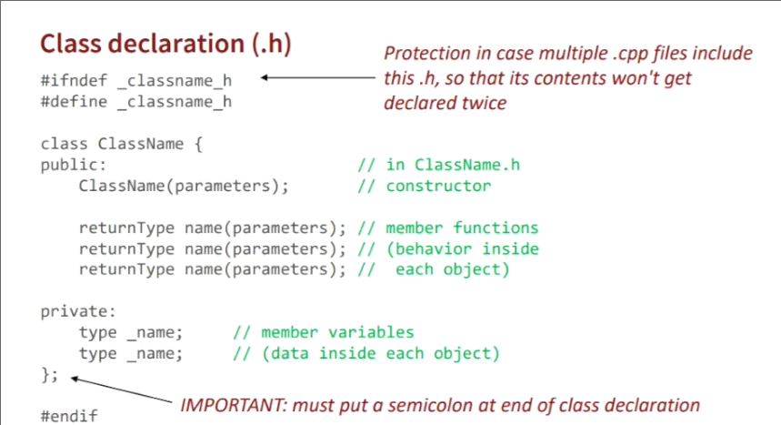

## 构造函数_析构函数

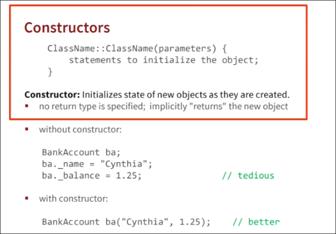

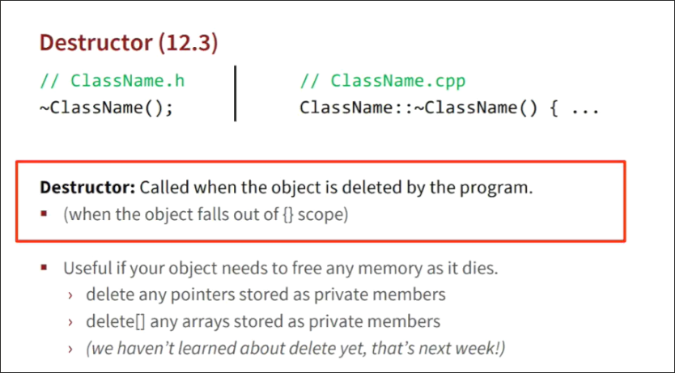

## const

*为什么不常用全局变量？*

全局变量可以被程序的任何部分访问和修改 难以推理其意思 也被视为不安全的

*为什么使用const？*

对于程序的安全性有帮助 便于理解变量的用途 使得承诺的接口为实际的接口

### const_参数

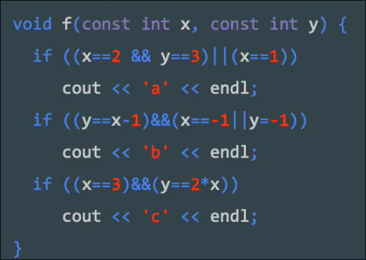

比如这样的错误 在我们使用`const`修饰`x`和`y`时 就可以在编译时发现

* 此外 `const` 修饰参数 使得函数承诺其不会修改传入的参数 *对于引用传递很重要*
* 因此尽可能设置为`const`

对于 某些实现不好的库 尽管其内部无需改变参数 但是参数并未const 我们再试图传入`const`参数会报错

* 此时的解决方案是 **常量转换** 允许去掉`const`
* 常量转换 还有其他用途 但是一般情况下 不要丢掉 `const`

### const_成员函数

* 被`const`修饰的成员函数不能修改类变量和传递给其的任何变量

const 成员函数 只允许有 `const` 参数 

非const 成员函数 既可以有`const`参数 也可以非`const`参数

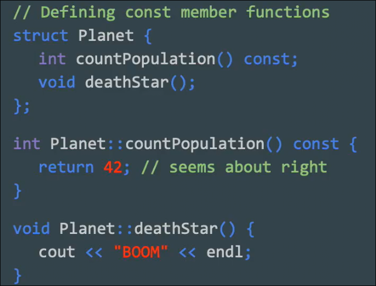

* 被`const`修饰的对象 无法调用其 非`const`成员函数 只能调用`const`成员函数 *编译时报错*

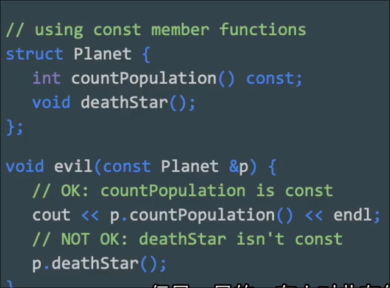

### const_指针

这个`const`修饰是指针本身

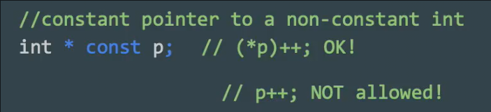

因此可以修改其指向的内容 但是不能修改指针本身（自增等）

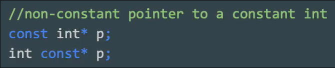

这两种修饰的是`int` 因此指针允许变化 但是指向的内容不能变

二者都不可改变

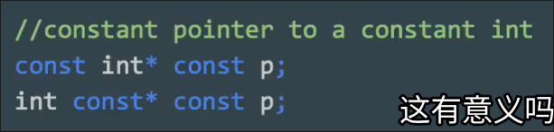

### const_迭代器

迭代器行为和指针类似 当迭代器被指针修饰 类似指针本身不能改变

但其指向的内容可以改变

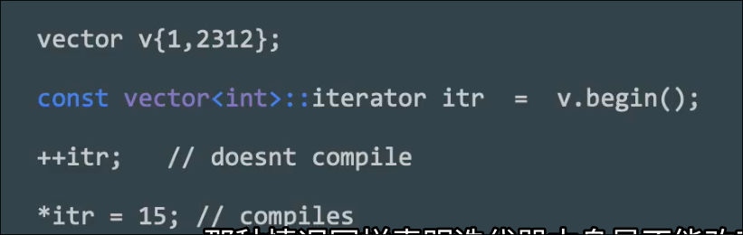

如果我们希望迭代器指向的内容本身不能改变 需要专门的类 **常量迭代器**

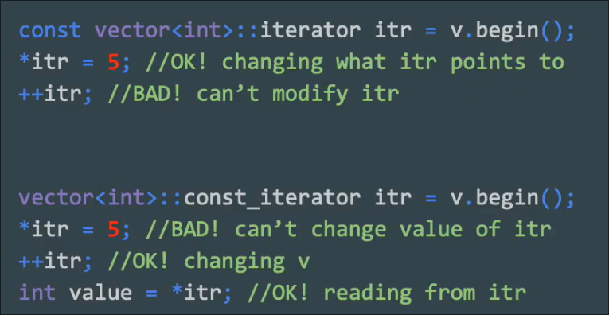
