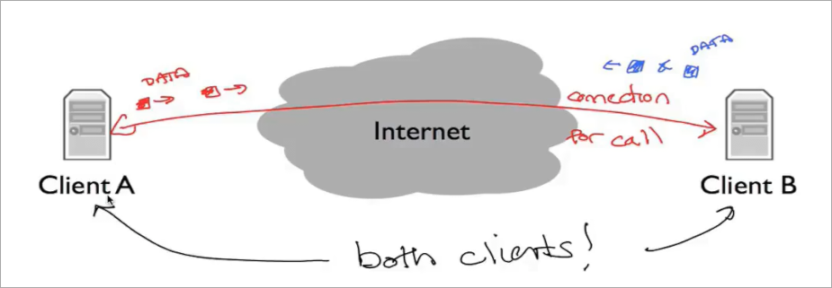

* 互联网的基本原理 
* 如今的设计 优势和劣势
* 普遍接受的互联网设计
* 什么是互联网
* 互联网四层模型

## 互联网应用 

联网应用可以在全世界交换数据


### 通信方式 双向可靠字节流 

当今网络中最常用的通信模式

1. B在等待其他计算机的连接 A在连接到B
2. AB建立连接
3. A在向连接写入数据 而B从连接中读取
4. 反之B写入 A读取
5. 任意一方都可以关闭连接 *连接被服务器重置* *关闭页面*
    * 同样服务端也可以拒绝连接甚至不响应连接


### 应用 万维网

使用一种称为`HTTP`的协议 **超文本传输协议**

* `http://` 意味着使用这种协议进行通信

`http`中 客户端会打开一个到服务器的连接 并向其发送命令

* 命令常见有`GET` 用于请求一个页面
* `http`被设计为**面向文档**地在程序间通信

1. 建立连接
2. 客户端 发送`GET`请求
    * 此外还有`PUT` `DELETE` `INFO` 等请求
3. 服务端验证请求是否有效
    * 有效则返回一个响应 其中包括一个数字状态码 `200 OK`表示请求被接受 响应的其余部分 包含文档数据
    * 还有其他响应 `400` 请求错误

`http`的所有内容是ASCII码 是人类可读的

`GET`请求的开头是这样

```http
GET / HTTP/1.1
```

成功响应的开头是这样

```http
HTTP/1.1 200 OK
```

### 应用 bittorrent

一款允许人们共享和交换大型文件的程序

**客户端从其他客户端**中请求文档

将文件分解成称之为**片**的数据块

客户端从另一客户端下载完整的片后 会告诉其他客户端它拥有该片 以便他们下载 这些协同工作的客户端称为**群**

使用和万维网相同的机制 **可靠双向字节流** 但是使用方式复杂一些

1. 客户端想要下载文件 首先要找到**种子文件**
    * 通常使用万维网找到 并通过`http`下载
    * 种子文件 描述有关下载的数据文件的一些信息 以及告知客户端该种子的**跟踪器**是谁
    * 跟踪器 是一个节点 负责跟踪哪些客户端是群的成员 
2. 我的客户端通过跟踪器 获取 群的客户端列表
3. 我的客户端和其他一些客户端建立连接 并开始请求文件的部分内容
4. 与此同时 跟踪器记录我的客户端加入了群 其他新加入的客户端也可以和我建立连接 请求文件的部分

一张密集的客户端之间的连接图 动态交换数据


### 应用 skype

流行的语音聊天和视频服务

在简单模式下 类似于`http` 呼叫者和接受者建立联系 并交换数据

但是区别在于彼此都是客户端 两台计算机相互请求数据



更复杂的是引入`NAT` **网络地址转换器**

* 通过引入NAT 可以连接到互联网 但是互联网外部却不能轻易连接到NAT背后的计算机


通过引入一个`Rendezvous`的**控制服务器**解决 

1. 当B登录`Skype`时，B客户端会打开到控制服务器的连接
2. 当A呼叫B时，会向控制服务器发送消息 
3. 此时控制服务器通过和B的连接 通知B 有A的呼叫请求 
4. 如果B接受请求 那么会主动发起和A的连接（这样就由NAT后面的客户端主动连接）**反向连接**


出于安全考虑 个人电脑通常在NAT背后 而需要公共访问的服务器通常不会

那么如果两个客户端都在NAT背后呢

引入一个**中继服务器** 两个客户端都和中继服务器建立连接 中继服务器转发双方的数据


## 什么是互联网 互联网四层模型

* 如何构建各种组件使得通信正常进行
* 如何正确设计抽象 使得应用无须关心在互联网上的传输路径或路由
* 如何做到 当数据丢失或损坏 重新发送

互联网四层模型使得应用程序能反复利用相同的构建块 而无须为每个新应用从头构建


这些层都是为了最终使得主机中的应用程序能可靠通信

每一层有不同的职责 都是在下一层的基础上构建服务

### 链路层

互联网由**主机 链路 和 路由器** 组成

* 数据在每个链路上以**数据包**的形式传递
* 数据包 是自包含的单元 包含传递的**数据和报头**
* 报头 包含数据包从哪里来 要到哪里去等信息

每次传递一条链路上的数据

*以太网* *wifi*


### 网络层

*最重要的一层*

* 端到端地传递**数据包** 跨越整个互联网 从源头到目的地


* 网络层的数据包称为**数据报**

1. 网络层将数据报交给链路层 告知其发送到链路
    * 链路层本质上是为网络层提供服务 
2. 链路的另一端是一个路由器 其链路层接受来自链路的数据报 并向上交给路由器的网络层
3. 路由器的网络层检查数据报目的地址 再次发送给链路层 以此类推直到到达目的地


网络层不关心 链路层如何具体通过链路发送数据报 *不同链路层 工作方式 不同*

#### ip协议

*互联网协议*

向互联网发送数据时一定要使用ip协议

* IP尽力尝试将数据报传递到另一端 但不承诺
* IP数据报 可能丢失 可能乱序到达 可能损坏 不保证任何事 *由更高层 更高层的协议处理*

### 传输层 tcp

最常见的传输层是TCP *传输控制协议*

* TCP确保 应用程序在互联网一端发送的数据正确地按顺序传到另一端
* 如何网络层发生丢失 那么TCP会多次传送它
* 发生乱序 TCP会正确排列

对于一些应用 使用tcp是必要的 并且可以减轻手动构建这种功能的负担 *电子邮件 短信*

但是一些如视频通话 等 实时应用 不需要 tcp服务

不需要可靠传递时 可以使用更简单的`UDP`传输层等  *用户数据报协议*

* UDP将应用程序数据打包 并交给网络层传递到另一端
* 不提供任何保证

### 应用层

通过使用从应用层到TCP或UDP服务定义明确的API来重用传输层

* 有自己的协议来定义两个端点之间数据流的语法和语义
    * 例如Web应用使用`http`协议中`Get`命令和服务端交互
    * HTTP规定GET以ASCII字符串形式发送 并包含所请求页面的URL

应用层的眼中 数据直接发送到另一端的应用层 而无须考虑正确性 重新传输等


应用层将GET请求传递给TCP层 TCP提供保证可靠的服务 依次使用下层的服务

而每一层都仿佛直接和另一端的相同层通信 无须考虑下层做了什么


### 总结

在网络层 IP协议通常无可替代 而其余层均有不同协议


ISO的七层模型已经被四层互联网模型取代


## ip服务

IP协议在互联网中非常重要

IP数据报 由一个报头和一些数据组成
