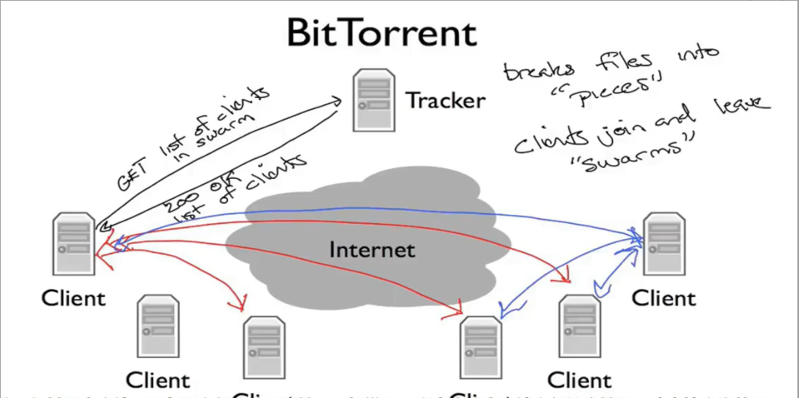

* 互联网的基本原理 
* 如今的设计 优势和劣势
* 普遍接受的互联网设计
* 什么是互联网
* 互联网四层模型

## 互联网应用 

联网应用可以在全世界交换数据


### 通信方式 双向可靠字节流 

当今网络中最常用的通信模式

1. B在等待其他计算机的连接 A在连接到B
2. AB建立连接
3. A在向连接写入数据 而B从连接中读取
4. 反之B写入 A读取
5. 任意一方都可以关闭连接 *连接被服务器重置* *关闭页面*
    * 同样服务端也可以拒绝连接甚至不响应连接


### 应用 万维网

使用一种称为`HTTP`的协议 **超文本传输协议**

* `http://` 意味着使用这种协议进行通信

`http`中 客户端会打开一个到服务器的连接 并向其发送命令

* 命令常见有`GET` 用于请求一个页面
* `http`被设计为**面向文档**地在程序间通信

1. 建立连接
2. 客户端 发送`GET`请求
    * 此外还有`PUT` `DELETE` `INFO` 等请求
3. 服务端验证请求是否有效
    * 有效则返回一个响应 其中包括一个数字状态码 `200 OK`表示请求被接受 响应的其余部分 包含文档数据
    * 还有其他响应 `400` 请求错误

`http`的所有内容是ASCII码 是人类可读的

`GET`请求的开头是这样

```http
GET / HTTP/1.1
```

成功响应的开头是这样

```http
HTTP/1.1 200 OK
```

### 应用 bittorrent

一款允许人们共享和交换大型文件的程序

**客户端从其他客户端**中请求文档

将文件分解成称之为**片**的数据块

客户端从另一客户端下载完整的片后 会告诉其他客户端它拥有该片 以便他们下载 这些协同工作的客户端称为**群**

使用和万维网相同的机制 **可靠双向字节流** 但是使用方式复杂一些

1. 客户端想要下载文件 首先要找到**种子文件**
    * 通常使用万维网找到 并通过`http`下载
    * 种子文件 描述有关下载的数据文件的一些信息 以及告知客户端该种子的**跟踪器**是谁
    * 跟踪器 是一个节点 负责跟踪哪些客户端是群的成员 
2. 我的客户端通过跟踪器 获取 群的客户端列表
3. 我的客户端和其他一些客户端建立连接 并开始请求文件的部分内容
4. 与此同时 跟踪器记录我的客户端加入了群 其他新加入的客户端也可以和我建立连接 请求文件的部分

一张密集的客户端之间的连接图 动态交换数据



### 应用 skype

流行的语音聊天和视频服务

在简单模式下 类似于`http` 呼叫者和接受者建立联系 并交换数据

但是区别在于彼此都是客户端 两台计算机相互请求数据


更复杂的是引入`NAT` **网络地址转换器**

* 通过引入NAT 可以连接到互联网 但是互联网外部却不能轻易连接到NAT背后的计算机


通过引入一个`Rendezvous`的**控制服务器**解决 

1. 当B登录`Skype`时，B客户端会打开到控制服务器的连接
2. 当A呼叫B时，会向控制服务器发送消息 
3. 此时控制服务器通过和B的连接 通知B 有A的呼叫请求 
4. 如果B接受请求 那么会主动发起和A的连接（这样就由NAT后面的客户端主动连接）**反向连接**


出于安全考虑 个人电脑通常在NAT背后 而需要公共访问的服务器通常不会

那么如果两个客户端都在NAT背后呢

引入一个**中继服务器** 两个客户端都和中继服务器建立连接 中继服务器转发双方的数据


## 什么是互联网 互联网四层模型

* 如何构建各种组件使得通信正常进行
* 如何正确设计抽象 使得应用无须关心在互联网上的传输路径或路由
* 如何做到 当数据丢失或损坏 重新发送

互联网四层模型使得应用程序能反复利用相同的构建块 而无须为每个新应用从头构建


这些层都是为了最终使得主机中的应用程序能可靠通信

每一层有不同的职责 都是在下一层的基础上构建服务

### 链路层

互联网由**主机 链路 和 路由器** 组成

* 数据在每个链路上以**数据包**的形式传递
* 数据包 是自包含的单元 包含传递的**数据和报头**
* 报头 包含数据包从哪里来 要到哪里去等信息

每次传递一条链路上的数据

*以太网* *wifi*


### 网络层

*最重要的一层*

* 端到端地传递**数据包** 跨越整个互联网 从源头到目的地


* 网络层的数据包称为**数据报**

1. 网络层将数据报交给链路层 告知其发送到链路
    * 链路层本质上是为网络层提供服务 
2. 链路的另一端是一个路由器 其链路层接受来自链路的数据报 并向上交给路由器的网络层
3. 路由器的网络层检查数据报目的地址 再次发送给链路层 以此类推直到到达目的地


网络层不关心 链路层如何具体通过链路发送数据报 *不同链路层 工作方式 不同*

#### ip协议

*互联网协议*

向互联网发送数据时一定要使用ip协议

* IP尽力尝试将数据报传递到另一端 但不承诺
* IP数据报 可能丢失 可能乱序到达 可能损坏 不保证任何事 *由更高层 更高层的协议处理*

### 传输层 tcp

最常见的传输层是TCP *传输控制协议*

* TCP确保 应用程序在互联网一端发送的数据正确地按顺序传到另一端
* 如何网络层发生丢失 那么TCP会多次传送它
* 发生乱序 TCP会正确排列

对于一些应用 使用tcp是必要的 并且可以减轻手动构建这种功能的负担 *电子邮件 短信*

但是一些如视频通话 等 实时应用 不需要 tcp服务

不需要可靠传递时 可以使用更简单的`UDP`传输层等  *用户数据报协议*

* UDP将应用程序数据打包 并交给网络层传递到另一端
* 不提供任何保证

### 应用层

通过使用从应用层到TCP或UDP服务定义明确的API来重用传输层

* 有自己的协议来定义两个端点之间数据流的语法和语义
    * 例如Web应用使用`http`协议中`Get`命令和服务端交互
    * HTTP规定GET以ASCII字符串形式发送 并包含所请求页面的URL

应用层的眼中 数据直接发送到另一端的应用层 而无须考虑正确性 重新传输等


应用层将GET请求传递给TCP层 TCP提供保证可靠的服务 依次使用下层的服务

而每一层都仿佛直接和另一端的相同层通信 无须考虑下层做了什么


### 总结

在网络层 IP协议通常无可替代 而其余层均有不同协议


ISO的七层模型已经被四层互联网模型取代


## ip服务

IP协议在互联网中非常重要

IP数据报 由一个报头和一些数据组成 

* 数据来自上层 包含上层的数据和报头
* 整个IP数据报又交由下层链路层 形成链路层的数据


IP服务有以下一些特点

* 向另一端网络层发送数据报 不可靠 最大努力 不连接

数据报头部包括 **目标IP地址** **源IP地址**


在每个路由器中存在一个**转发表** 告诉在匹配到给定的地址后 下一步发往哪里

IP服务如此简单的原因有

* 由于IP服务在互联网应用中总被需要 因此需要更快 更简洁 建设和维护成本更低
* **端到端原则**指出 尽可能在终端主机上实现功能 
* 允许在其之上构建可靠或不可靠的服务
* 在任何链路层上都能工作 没有任何假设 *甚至可以把信鸽作为链路层*

一些细节

* IP试图阻止数据包无限循环
    * 路由器中的转发表可能出错
    * 转发表发送更改时这种情况最可能发生
    * 在每个数据报头部添加跳数字段 TTL 经过路由器会使其递减 当其到达0 丢掉数据报
* 如果数据包太长以至于某些路由器或链路不能承受 IP会对其切片
* IP使用报头校验和减少数据报传递到错误目标的可能性
* 支持新版本 `IPv4` `IPv6`
* 支持在头部添加新字段

### ipv4 数据报


* 源地址 目标地址
* 协议ID 告知 数据字段中包含什么 以便目标主机进行分解
    * 如果是6 则告知数据包中含有一个TCP段
    * IANA 定义 140多个
* 版本字段 目前有效取值为IPv4 IPv6
* 总数据包长度 可以达到64k字节 包括首部和数据
* 生存时间 防止无限循环
* 数据报ID 标志 分片偏移量 帮助路由器正在需要时将IP数据报分解为更小的自包含数据报
* 服务类型字段 向路由器提供 有关此数据报重要性的提示
* 报头长度 
* 一些可选信息
* 校验和

## 数据包的一生

以浏览器和服务器发送和接受的数据包为例

在传输层 几乎所有网络流量都经由TCP

在连接时，客户端和服务端经过**三次握手** `SYN`客户端同步 `SYN/ACK`服务端同步和确认 `ACK`客户端确认


网络层用于发送数据到另一主机 传输层用于将数据传递到应用程序

而网络层的角度 发送到同一台计算机上不同应用程序的数据包看起来相同 为了区分 还需要一个地址

* IP地址 指定数据发往哪个主机
* TCP端口 告诉计算机数据传递到哪个程序
    * Web服务通常允许在80端口


而数据包在网络中的传播经过多次跳跃 第一条通常是无线连接到wifi接入点


路由器决定将数据发往哪个链路 或者对于目标地址是自身 传递给自己的软件 


* 采用路由表 决定不同ip的匹配 

`wireshark` 展示数据包 `traceroute` 观察数据包在互联网上传播路径

> tcp.port == 80 && ip.addr == 202.197.61.57


包括时间戳 源地址 目标地址 协议 长度 更多信息

1. 第一条数据包 从本地发往目标 由某端口发送到TCP.80 超文本传输协议端口 是SYN数据包 三次握手的第一步
2. 第二条 从目标发往本地 SYN ACK 
3. 本地发往目标 ACK 完成握手 建立连接

接下来本地开始HTTP请求 GET命令 之后目标响应

想查看包在网络层的传播路径 使用`traceroute`

> traceroute -w 1 csu.edu.cn

指定超时时间1s

```bash
➜  kitty traceroute -w 1 csu.edu.cn
traceroute to csu.edu.cn (202.197.61.57), 30 hops max, 60 byte packets
 1  _gateway (192.168.3.1)  13.645 ms  13.731 ms  14.500 ms
 2  192.168.1.1 (192.168.1.1)  15.520 ms  15.630 ms  15.791 ms
 3  100.69.0.1 (100.69.0.1)  17.855 ms  19.763 ms  19.898 ms
 4  112.100.103.29 (112.100.103.29)  19.314 ms  19.447 ms  19.626 ms
 5  112.100.4.153 (112.100.4.153)  18.421 ms 112.100.4.165 (112.100.4.165)  19.608 ms 112.100.4.233 (112.100.4.233)  22.533 ms
 6  202.97.126.181 (202.97.126.181)  40.691 ms 202.97.38.9 (202.97.38.9)  33.684 ms 202.97.104.133 (202.97.104.133)  36.590 ms
 7  202.97.22.25 (202.97.22.25)  50.241 ms * *
 8  * * *
 9  202.97.17.58 (202.97.17.58)  54.002 ms  52.784 ms  52.246 ms
10  101.4.117.125 (101.4.117.125)  52.889 ms  52.983 ms  61.505 ms
11  101.4.118.213 (101.4.118.213)  56.538 ms  55.031 ms  52.307 ms
12  101.4.112.37 (101.4.112.37)  55.144 ms  55.162 ms  55.033 ms
13  101.4.115.66 (101.4.115.66)  55.140 ms  55.132 ms  56.714 ms
14  * * *
15  * * *
16  * * *
17  * * *
18  * * *
19  * * *
20  * * *
21  * * *
22  * * *
23  * * *
24  * * *
25  * * *
26  * * *
27  * * *
28  * * *
29  * * *
30  * * *
```

第一个跳跃是无线接收器

三个星号表示路由器不会向`traceroute`暴露自己

## 分组交换

思想是将数据分解为离散的 自包含的数据块

每个数据块称为**数据包**

简单情况下，每个数据报都是独立路由的


在**源路由** 每个数据包中明确指定了沿途每个分组交换机的ID 一直到目的地


* 这种源路由被支持 但是通常禁用 因为存在重大安全问题

一种优化是 在每个交换机中放置少量**状态**

* 如存在一个目标地址和下一条对应起来的表
* 查找地址来确定下一跳 因此数据包中仅仅需要携带目标地址

分组交换的好处

* 交换机可以对每个数据包独立做出决策
* 可以高效共享多个用户之间的链路

### 流

我们通常不会发送单个数据包 而是一系列 

同一个端到端通信的一组数据报称为**流** 如TCP连接

交换机不需要知道流或者组 而是独立处理每个数据包 因此不需要跟踪流的状态

## 分层

分层是用来描述将系统组织成多个独立的功能组件或层级的方法

每一层级都只能与上下层进行交互 并且下层为上层提供一个定义明确的服务


这种分层思想在日常生活中也有所体现


C代码替换某些分层使得和具体硬件无关  

但是有时候C代码使用某些平台才有的特殊功能 （允许直接包含汇编代码）

分层可以隔离抽象 但是有时候必须打破层级边界 尽管降低了灵活度

分层的优势

* 模块化
* 定义良好的服务
* 复用
* 关注点分离
* 允许各个功能不断改进
* 对于网络 点对点通信 而不必担心下层过程
