# 传输层

为应用程序间数据通信提供服务

* `UDP` 简单不可靠的字节流
* `TCP` 可靠的双向字节流

## tcp服务模型

当应用程序使用TCP时，会将字节传给TCP 并希望由TCP传到另一端

1. TCP将字节放入TCP段(TCP中的数据包)中 并开始处理
2. TCP将段交给IP层 IP层将其封装到IP数据报中
3. IP数据报又被传递给链路层 构建链路帧 添加链路地址 发送到网络

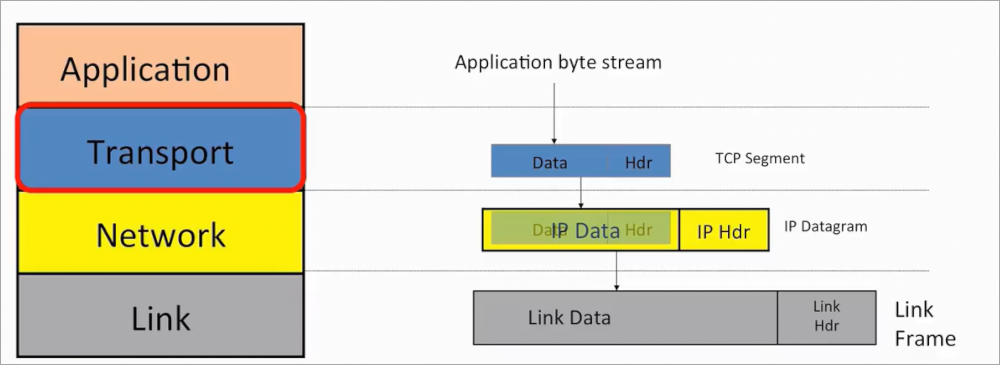

在两个应用使用TCP时，会在各自的TCP之间建立一个双向的通信通道：

1. 主动发起方的TCP先建立到对方TCP的通道
2. 接收方TCP又建立通道到主动方TCP
3. 形成的双向通信叫**连接**
    * 在连接的两端 TCP维护一个**状态机**跟踪连接的状态

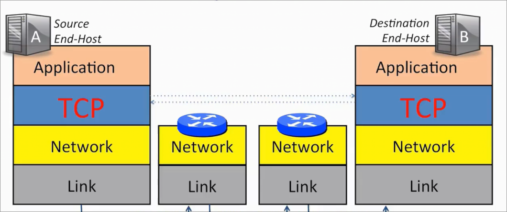

### 三次握手

连接通过三次握手建立

* A向B发送消息 表示A的TCP想要建立连接连接到B的TCP 
  * `SYN` 同步 因为A还发送正向字节流的起始序号
* B回复 `SYN+ACK` 同步、确认 B确认A的请求并同意建立连接 同步表示B还发送反向字节流的起始序号
* A回复`ACK` 接受反向通信的请求

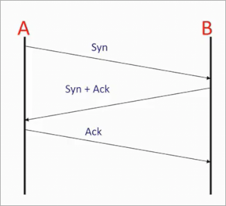

### 字节流

主机间相互发送数据 如同连续的字节流 

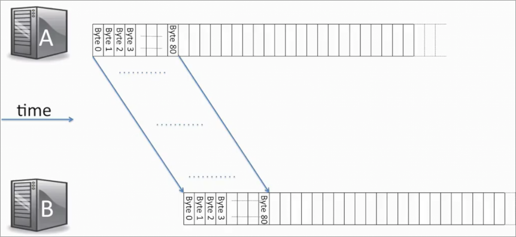

来自A的字节流被B接收 A和B的TCP层协同工作 确保字节流按正确顺序传递到B

流被封装入TCP段 传递给下方 当到达B的TCP段 流被从TCP段提取出

TCP段可以小到一个字节 但是为了效率 可以填满到最大IP数据报的大小

### 连接的拆除

当完成传输后 双方关闭连接 并清楚与状态机有关状态

1. A发送 `FIN` 完成
2. B `ACK` 确认A没有数据发送 停止寻找来自A的新数据
    * 此时关闭了A到B的通道 但是B仍然可以有一些新数据发送给A 因此还会发送一些`Data`
3. 没有要发的数据后 B发送`FIN` 完成
4. A `ACK` 确认 停止寻找来自B的新数据

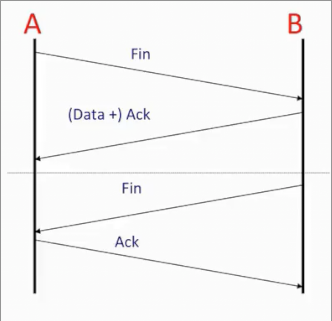

此时连接完全关闭 状态可以安全移除

### 连接可靠性

TCP有四种机制

* 当TCP层收到信息 会给发送方一个**确认信息** 告知数据正确到达
* 用**校验和**检测损坏的数据
  * TCP首部包含校验和 涵盖首部和段中的数据
* **序号**检测丢失数据 和 顺序
  * 每个段首部含有 该段第一个字节的序号 
  * 如双方约定从1000开始计数 那么第一个段的序号是1000 而段中500字节 则第二个段序号 1500
* **流量控制**防止接收方超载
  * 如果A发送比B接收的速度快很多 那么就会出现超载的情况
  * TCP使用流量控制 阻止这种情况 
  * 接收方 不断告诉 发送方是否可以继续发送 具体而言 是告诉发送方 缓冲区还有多少空间可以接收新数据

此外 TCP对网络进行堵塞控制 其试图将网络容量平均分配给使用网络的所有TCP连接

## tcp段格式

* 目标端口 告诉本地TCP层 将字节传递给另一端哪个应用程序 
* 源端口 告诉另一端TCP层 使用我的哪个端口 发送数据回来
* 段的序号
* 确认序号 告诉另一端接下来期待哪个字节 *成功接收到了此前的所有字节*
* 16位校验和 在整个段上计算
* 报头长度 间接告诉我们有多少可选字段 通常没有
* 可选字段
* 一些传递信息的标志
  * `ACK` 表示 **确认序列号字段** 是有效的
  * `SYN` 表示 我们正在进行同步 这个段用于握手
  * `FIN` 表示 连接单方向关闭
  * `PSH` 告诉另一方 到达后立即向应用传递数据 而非等待更多数据

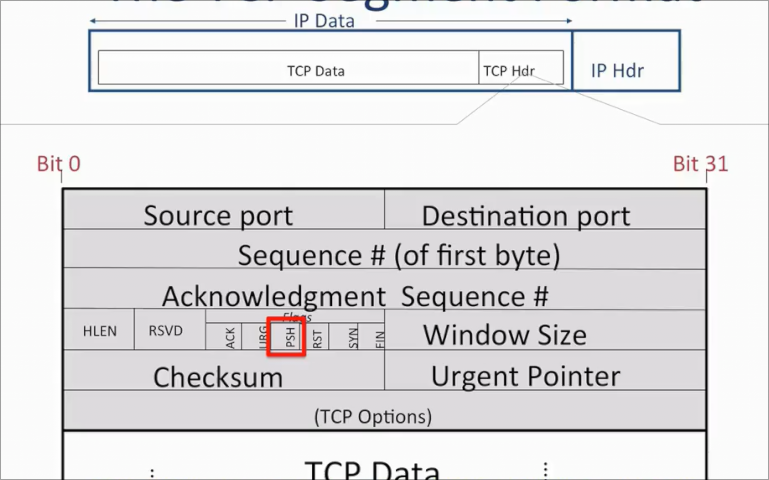

## tcp连接的唯一性

通过TCP和IP头部的五个信息实现唯一性

* IP源和目的 唯一标识端点
* IP头的协议ID 为 TCP 表示传输层用的协议
* TCP 源端口和目的端口 

而发送方源端口号通常唯一 但是如果新增大量连接 也可能出现使用一个源端口号的情况 此时 随机选择的初始端口降低混淆的可能

1. 从A到B发送的段 序列号为偏移初始序列号后的第一个字节序列号
2. 从B到A返回的段中 确认序列号 告诉A B接下来期待哪个偏移初始序列号后的字节

## 端口号的工作原理

假设现在B服务器运行两个服务 邮件服务器 和 web服务器

1. 当A上的浏览器（web客户端）想从B上的web服务器请求页面 则将请求数据发送给TCP
2. 假设双方的TCP已经完成握手 建立连接 那么现在只需要发送数据
3. A的TCP创建段 并写入目标端口 80 而来源端口 写入本地生成的 如`123456` 
4. 封装为IP数据报
5. IP数据报到达B后 解出TCP段 送往上层TCP层
6. TCP看到目标端口80 则将数据发送给web服务器 

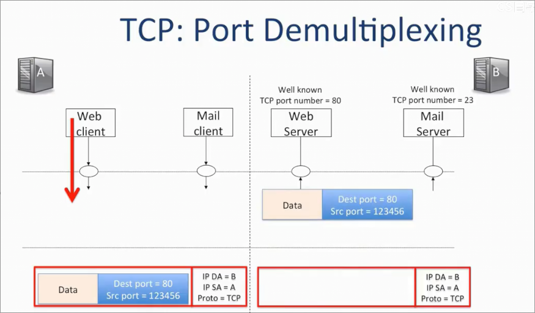

## udp 服务模型

另一种传输层协议 为不需要TCP保证交付服务的应用使用 这些应用或许不需要重传 又或许自行处理重传

udp数据报 只用来标识在另一端接收数据的应用

其结构是

* 来源端口 数据来自哪个应用
* 目标端口 
* 整个UDP数据报的长度
* *可选的校验和* 发送方不包含时 则填充0
  * 计算也包含一部分IPv4的内容 *违反分层原则 的原因是 允许udp 检测到 被传输到错误目的地的报文*

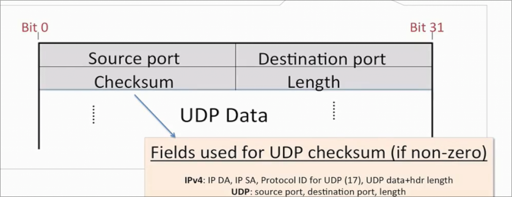

其端口工作原理和TCP相同

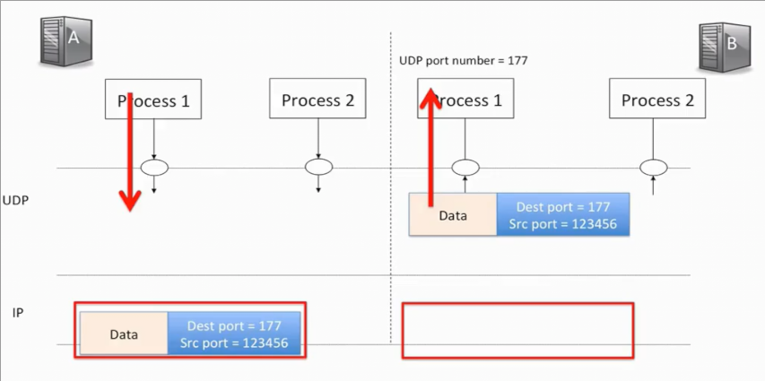

多路分解机制 根据到达端口号的不同 将到达报文划分 送到不同进程

* 无连接
* 任意顺序 应用程序根据需要可以自行处理
* 不可靠的交付 无确认 无通知 应用程序可能会自己选择实现重传机制

应用如DNS 发送一个包含主机名的DNS请求 DNS服务器响应一个IP 这个请求就使用UDP

UDP很快

* 对时间有要求
* 对TCP中实现的一些机制有自己的特殊要求

## ICMP服务模型

ICMP 互联网控制报文协议 用来报告错误并诊断网络层的问题

使得网络层正确工作的三个部件

* IP协议 逐跳地端到端转发分组
* 路由表
* ICMP协议 帮助在主机和路由器之间传递有关网络层的信息

ICMP在网络层之上 严格来说是传输层协议

当目标或者路由想向源报告错误时，将信息包裹在ICMP中 交给IP层发送

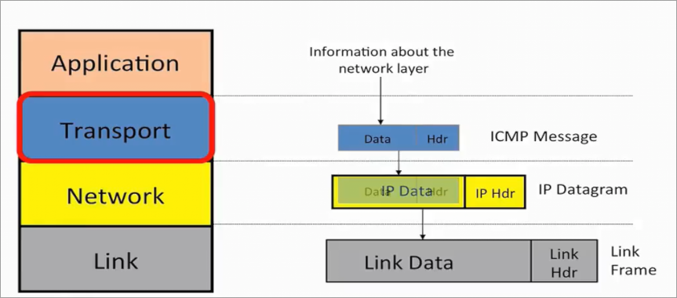

### 例子 目标网络不可达

从A的浏览器到B的web服务端 A发送一个http请求

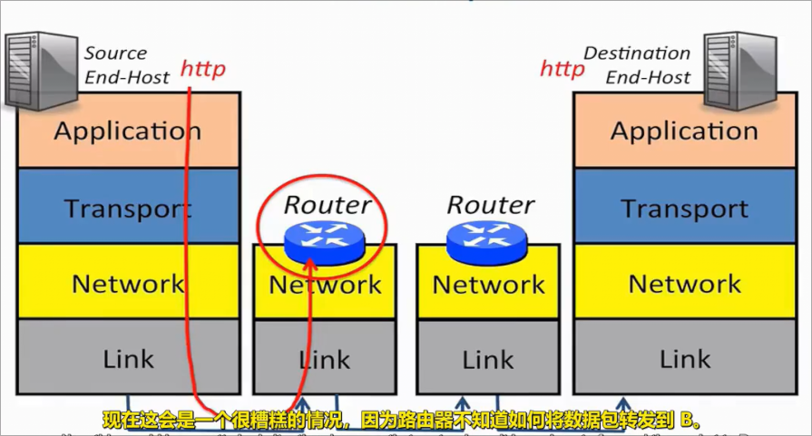

然而这个路由表没有存储相关目标的信息 它不知道如何转发到B 

这样路由表会发送回一条信息 内容包括目的地网络不可达

* 不可靠 不会重新发送 只是发送一个摘要 取来源IP数据报的一些信息 放到到ICMP的报文 然后整个ICMP包放到新的IP数据报

ICMP有很多信息类型

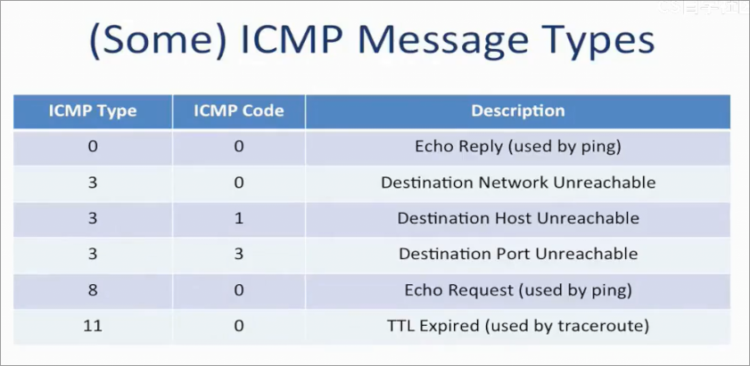

* 网络不可达 路由器不知道如何转发
* 主机不可达 到达最后一个路由器 但是路由器不知道主机在哪
* 端口不可达 主机不知道端口如何处理 无法识别目标端口

### ping

用来测试另一个主机是否存活 以及 我们是否与其连接

ping程序直接调用ICMP 发送ICMP echo 请求 type 8 code 0 

封装入IP报 发送到网络

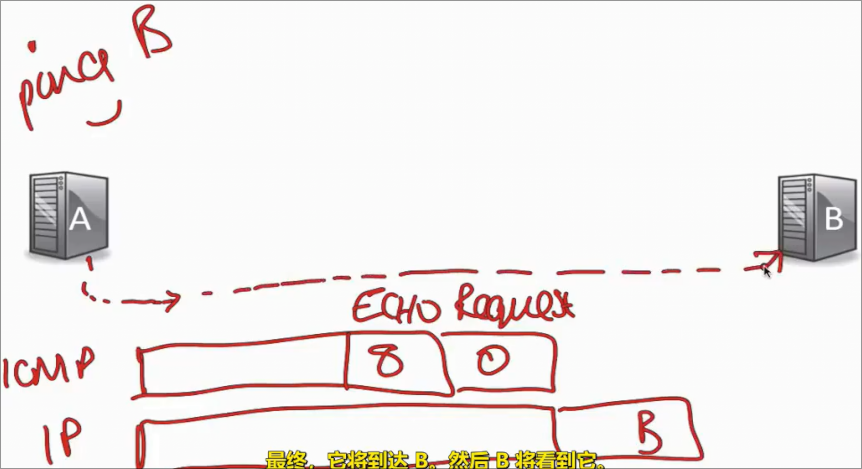

如果请求能到达B B做出 ICMP echo 响应 type 0 code 0 

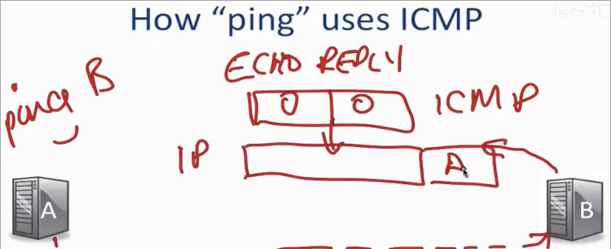

### traceroute

告诉我们数据包在网络中经过的路径以及访问的路由器 到每个路由器的往返时间

通过发送UDP消息来做到这一点

1. A发送UDP消息 封装为IP数据包 其中TTL字段设置为1
2. 当数据包到达第一个路由 TTL减1 变为0 被丢弃 但是丢弃时 会向A发送一个ICMP错误报告消息 type 11 TTL超时 
    * 封装入原IP数据报的一些信息 
3. 消息送回A时，它从消息得知 发生TTL超时 并从ICMP的载荷部分得知 是之前自己发送的原始消息 TTL=1的那一条
    * 并从IP头找到路由器的地址
    * 进行标记
4. 发送TTL设置2的消息 ...以此类推

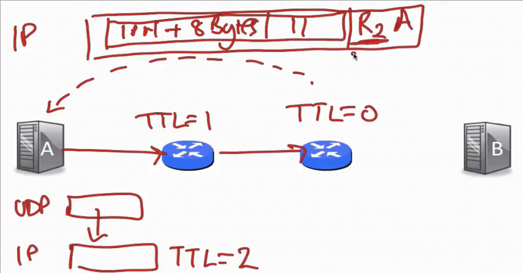

当到达B时，A选择的是一个不合法的端口 这样B也会返回一个ICMP

## 端到端原则

我们使用一个应用读取文件 使用TCP建立连接并传输 另一端应用从socket中读取

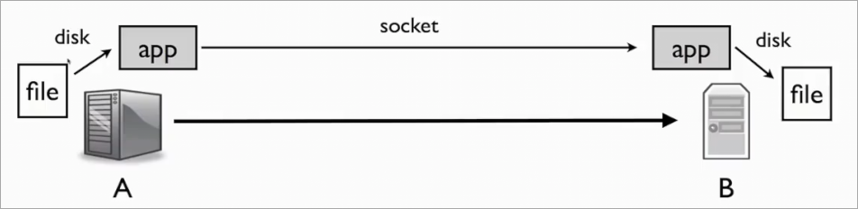

这样看来网络做的事情很少 为什么不做更多呢？

* 压缩数据 以加速传输？
* 重新格式化或改进请求？
* 缓存文件？
* 增加安全性？
* 添加移动支持？
* ...

原因是 **端到端原则**

端点的应用程序有更多的信息 因此在端点实现更多功能 更有可能正确和良好实现

例如想确保应用程序的安全性 那么应该在应用程序中实现端到端安全

### 文件传输

需要确保文件完好无损地到达

假设经过的每条链路都有错误检验机制，那么如果在传输过程中破坏 接收方检测并拒绝 发送方再重新发送

如果我们完全依赖于链路的错误检测机制，会得到错误的结果 原因在于 不仅仅链路可能存在问题 一些存储问题无法被检测到 我们只能进行端到端检测

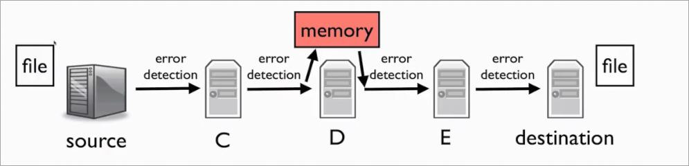

正确性不应依赖网络 网络只能帮助

另一个例子是TCP 尽管其提供可靠性 但是并不能完全依赖 可能其内部出错 我们应对其发送数据进行端到端检查

如BitTorrent 在TCP传输完一组数据块后 使用哈希函数检查数据块是否正确到达

然而网络可以辅助提高可靠性 如链路层提供一些基本的可靠性 确认消息 使得TCP性能更好

因此除了端到端的中间部分只能作为辅助 而不能替代端到端的功能

### 强端到端原则

网络应当尽可能高效快速灵活地完成传输任务 其余任何事物都应在端完成

这个原则表明根本不要在中间进行时间

因为如果中间添加一些功能 那么就一定要对两端做出一些假设 如链路层的可靠性 假设了重传是值得的

然而某些协议并不希望重传 但是只能做出妥协 阻碍了发展

## 错误检测

如今网络通常使用三种错误检测  **校验和** **循环冗余校验CRC** **消息认证码MAC**

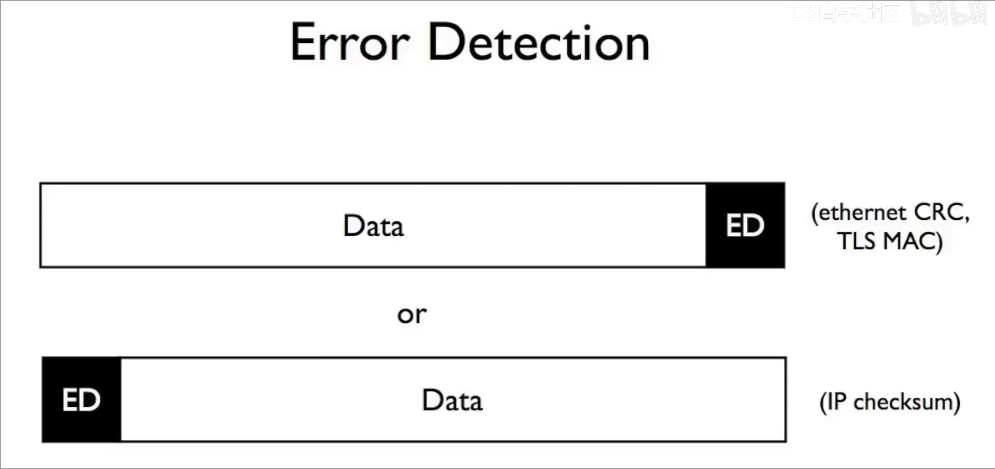

对数据做出某种计算 将结果放在开头或结尾

### 校验和

将数据加起来 `TCP` `IP` `UDP` 使用**一补码校验和**

计算很快 但是 错误保证 弱 可以用两个抵消的位错误 欺骗校验和

1. 首先将数据包的校验和字段设置0
2. 将数据包中每16位相加
3. 如果求和超过65535 则溢出
4. 翻转求和结果的比特 作为校验和 例外情况 得到全1时不翻转为全0
    * 因为全0表示没有校验和
5. 验证时 将整个数据包加起来 并 加以校验和 应得到全1

只保证能捕获单比特错误

### 循环冗余校验和 

计算量大得多 但是更可靠 

计算的是一个多项式的余数

以太网和许多链路层使用

把N位源数据转换为很少的C位错误检测数据

能够检测到任何奇数错误 2位错误 长度等于或小于C位的单个突发错误的数据包中的错误

使用 多项式长除法 消息的位描述多项式的系数

每种CRC算法存在一个独特的生成多项式

将填充后的消息m除以生成多项式g得到余数为CRC

在检查时 如果 `(m + CRC) % g == 0` 那么CRC通过

CRC的算法强度取决于生成多项式g

### 消息认证码

可以和一些秘密信息组合生成一个值

理论上拥有秘密信息的人才能生成或验证MAC

抵御恶意修改

用于 传输层安全协议 TLS  安全浏览网页 HTTPS

然而不擅长捕获错误

对于双方拥有的随机生成秘密s

消息认证码C 由MAC算法应用于消息M和秘密S

如果没有秘密S 则很难为消息M生成正确的C *只能穷举尝试*

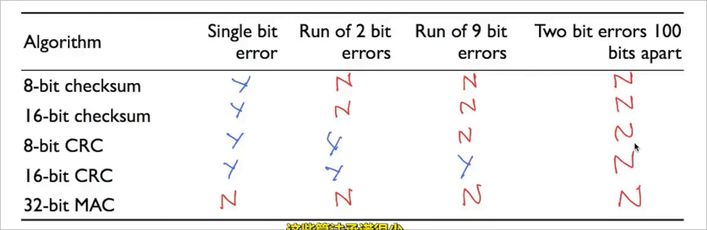

## 有限状态机

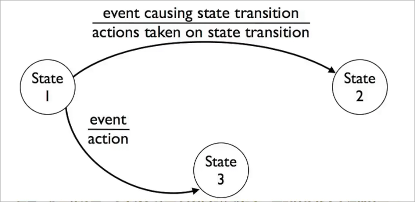

* 系统中存在一些状态
* 状态通过表示转换的边向连接
* 其中一条边上部分表示`event`是必须的 描述什么样的事件导致向另一状态转换的发送
  * 并且对于一个起点，其出边的`event`相互不同
* 下半部分`action`是可选的 表示转换发生还会伴随什么动作的产生

### 例子 http

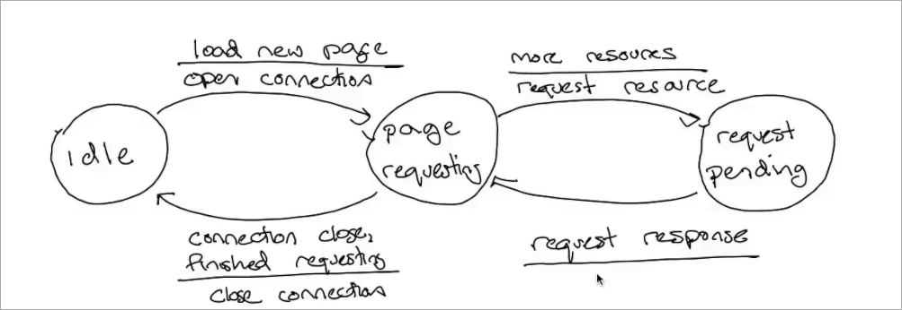

这里描述了3个状态

* 一般状态
  * 当发生加载新页面事件时 转化为 页面请求状态 发生 打开连接动作
* 页面请求状态
  * 发生需要更多资源事件时 转化为 请求中状态 发生请求资源
  * 当发生完成请求、连接关闭时 转化为 普通状态 发生 关闭连接
* 请求中状态
  * 当某资源请求完毕时 转化为页面请求状态

### tcp的有限状态机

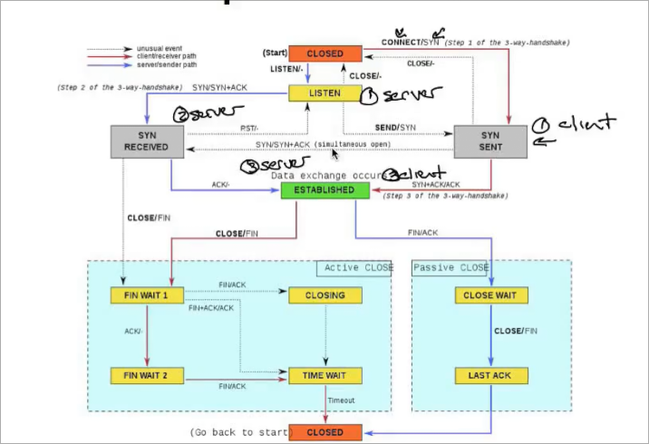

图中上半部分表示连接建立过程

在上半部分 客户端的转换采用蓝色 服务器的转换使用红色

起初 客户端处于 `CLOSED` 状态 服务器处于`LISTEN`状态

1. 客户端在socket上调用`CONNECT`, 转换为`SYN SENT`状态 发送`SYN`
2. 服务器接收到`SYN` 转换为`SYN RECEIVE`状态 发送`SYN+ACK`
3. 客户端收到`SYN+ACK`后转换为`ESTABLISHED` 发送`ACK`
4. 服务器收到`ACK`后转换为`ESTABLISHED`

完成连接的建立过程

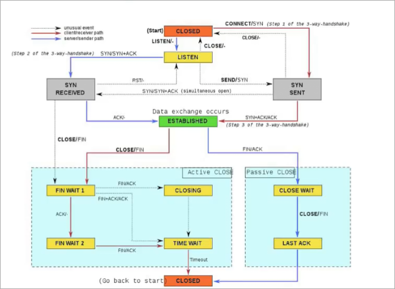

而下半部分表示 TCP 的连接拆除阶段 

红色表示主动拆除方 蓝色为被动拆除方

起初双方处于`ESTABLISHED`状态 相互收发数据

1. 主动方向socket调用`CLOSE` 转化为状态`FIN WAIT 1`， 发送`FIN`
2. 被动方接收到`FIN` 转化为状态`CLOSE WAIT` 发送`ACK`
     * 之后自行决定是否调用`CLOSE`以关闭己方的发送通道到达`LAST ACK`
3. 主动方如果接收到`ACK` 转化到`FIN WAIT 2` 等待被动方发送的`FIN` 以到达`TIME WAIT`
     * 如果同时收到`ACK+FIN` 证明被动方也关闭通道 直接到达`TIME WAIT` 回以`ACK`
     * 如果收到`FIN` 但没有`ACK` 证明对方也是主动方 双方差不多时间发送了`FIN` 那么转化为`CLOSING`后转为`TIME WAIT` 回以`ACK`
4. 主动方`TIME WAIT`后超时转化为`CLOSED`
5. 被动方由`LAST ACK` 后 *收到确认？图中没有* 转化为`CLOSED`
