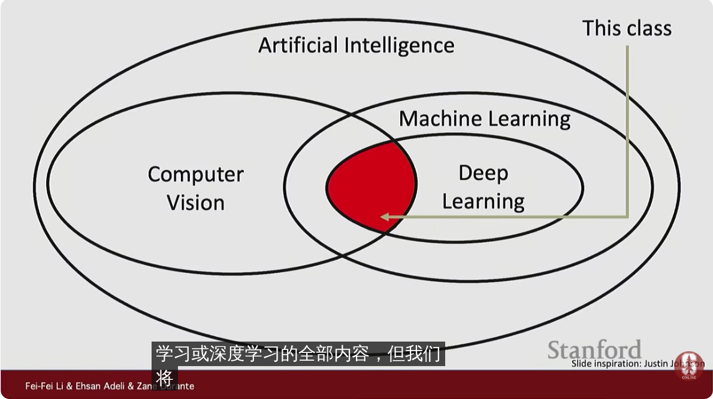
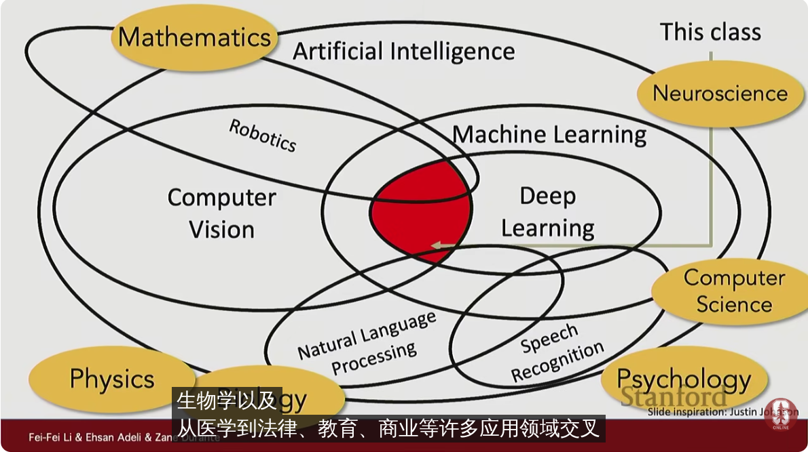
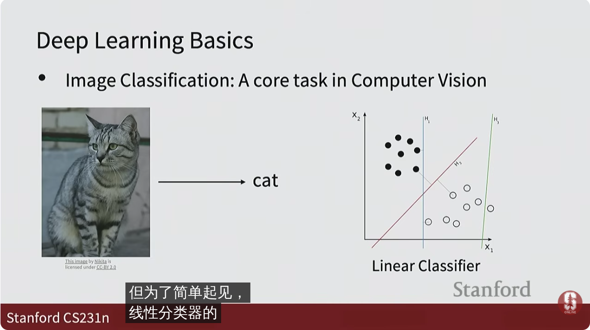
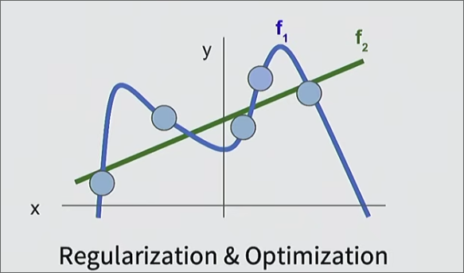
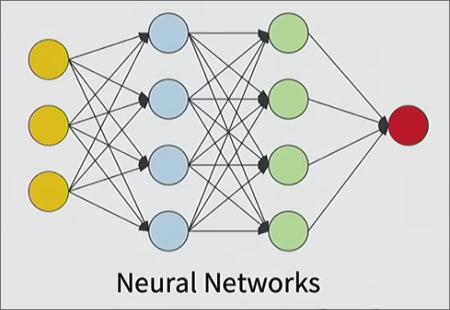
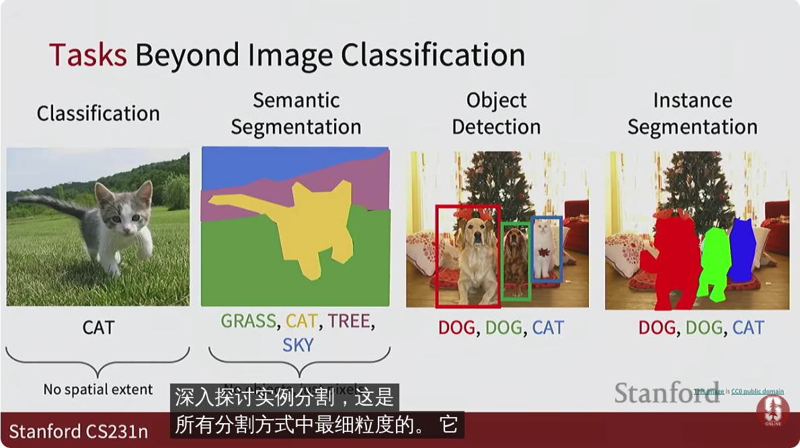
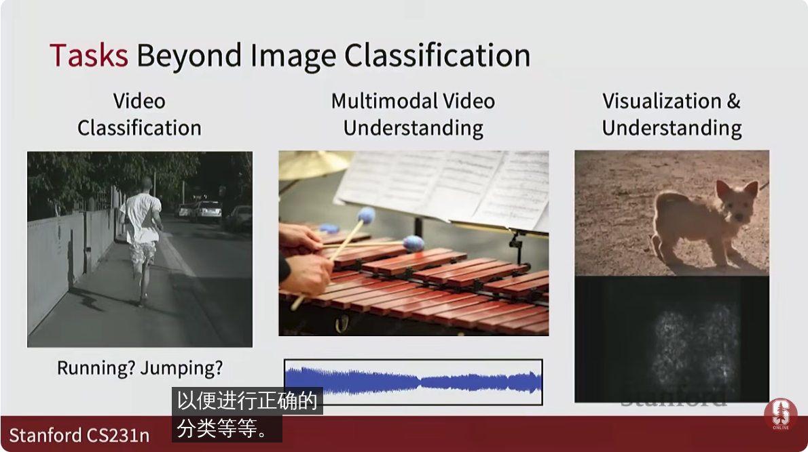
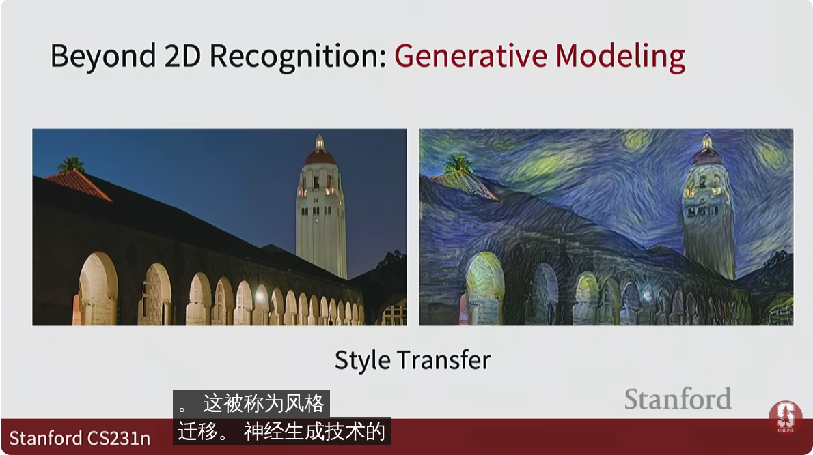

# 介绍和历史

* **计算机视觉**是人工智能的一个重要领域
* **机器学习**是人工智能领域的一个重要工具
* 而**深度学习**是机器学习中的近十年诞生的重要算法 
  *  其中主要围绕**神经网络**展开

**本课程主要涵盖深度学习和计算机视觉的交叉领域展开**

而这些内容事实上与更多领域相互交叉

## 历史

 1959，研究人员从简单动物中发现负责视觉的初级（最先处理）的神经元层中接受的只是一小块视觉（而不是整个视野）的处理，其负责处理边缘。而到了更高级的神经元层，其相互连接，处理角，物体...

之后仍有源源不断地对计算机视觉的研究...

一个视觉的难题是*从获取的二维信息中得到三维建模* 自然通过生成两只以上眼睛解决这件事（三角测量）但是（对于人）并不精准

计算机视觉和语言领域的一个不同是 

* 语言并非在自然中存在，其是人为生成的，语言是1D 的模型，因此建模较为简单
* 但是视觉的任务更加艰难

在人工智能研究进入寒冬时，认知、神经等科学仍在进行

对于切割后的**顺序不同**图片尽管某物体在同一位置（因此两次落在我们视网膜上的位置相同）但是我们检索其的感知不同

对于**快速**播放的图片 我们也能察觉到某人（物体的存在）

人脸识别算法被发明 （随后应用于数码相机的对焦）

互联网时代，开始有大量数据集

另一方面 **深度学习**技术也不断发展

日本研究人员手动设计了层结构神经元（类似59年研究出的视觉通路）及其上百个参数

86年研究出反向传播 一种学习方式

随后被应用于7层的可以识别字母的神经网络 用于邮局的识别系统

之后缺乏由于缺乏庞大的数据集 领域又开始停滞

2012年 出现了在相关比赛上表现亮眼的识别神经网络（相对日本的网络 主要提升点在于应用庞大的数据集和自动学习的反向传播算法）

同时 计算需要的**硬件**也不断发展中

## 课程内容

## 深度学习基础

计算机视觉是什么？让机器能看到和理解图像 最基本: 图像分类 

*线性分类*

对于数据不能用直线分类时通常会遇到过拟合和欠拟合的问题

我们需要用正则化取得平衡

*神经网络*

## 感知和理解视觉世界

1. 指定任务
  * 物体检测、场景理解、运动检测
2. 选择模型
  * 神经网络

*  超越多层感知的模型
  * 卷积神经网络
  * 循环神经网络
  * 更新的架构

* 大规模分布式训练
  * 大模型是如何训练的

## 生成式和交互式视觉智能

* 自监督学习
  *  使用无需标签的数据进行学习
* 生成模型

* 视觉语言模型
* 3D视觉模型
* 具身智能

## 以人类为中心的应用和影响

-
