# 基于线性分类的图像分类

图像分类是使得系统在给定一系列标签中给给定的图片选择最合适的

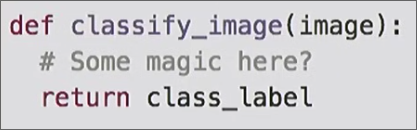

图像通常由一系列在0-255的整形张量(tensor)定义

一个困难是改变摄像机的角度，尽管在人眼中是完全相同的对象，但在计算机角度中像素完全不同，成为一个崭新的数据点

照明是另一个困难

此外还有识别时人不易遇到但是计算机很容易遇到的各种困难 背景、上下文、内部差异、形状特性、不完整局部...

对于图像分类，很少有像基本的排序算法那样拥有明确的步骤。一些论文指出一些步骤:

1. 边缘检测
2. 找到角和角的特征
3. 基于这些特征映射到输出类别

但是这种算法很难扩展
## 数据驱动方法

这种方法从另一角度看待分类问题，三个流程

1. 收集图像和标签的数据集
2. 使用机器学习训练算法训练一个分类器
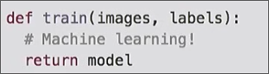

3. 对新图像评估分类器
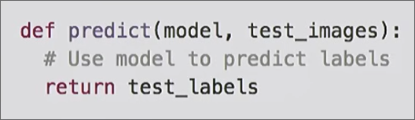
## 最近邻分类器

* **训练** 仅仅将训练集的图像和标签记住
* **预测** 寻找和测试图像最相似的训练图像 *依据距离函数* 输出其标签

  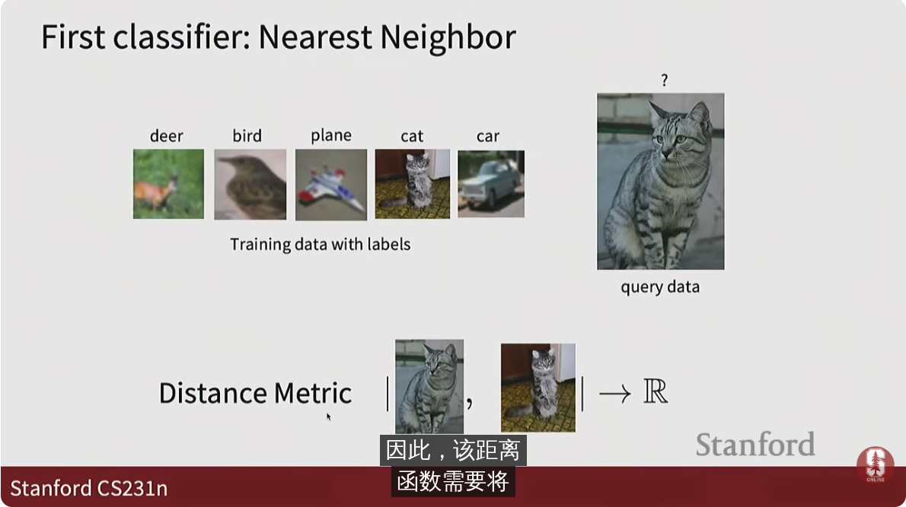

### 距离函数

* L1 distance 两张图像像素差的绝对值和
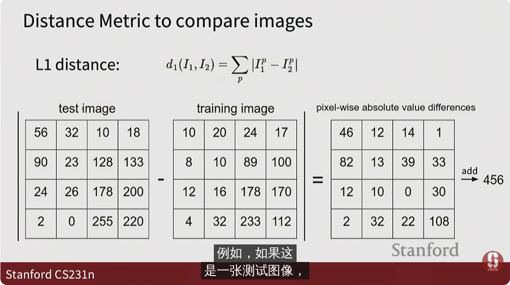

[numpy tutorial](https://numpy.org/doc/stable/user/quickstart.html)

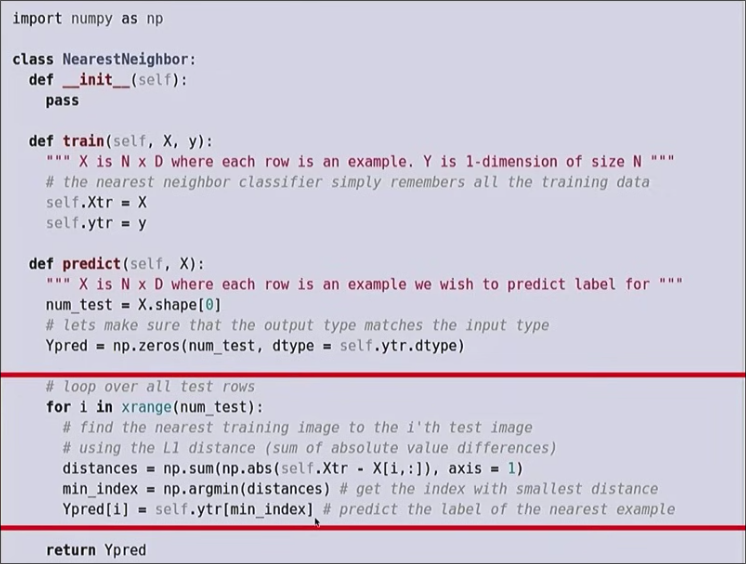

训练O(1) 预测O(N)

训练快但是预测很慢

同时最近邻算法易受到噪声的影响

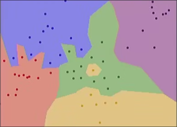

## k近邻算法

 多数投票的方式确定测试图像的标签

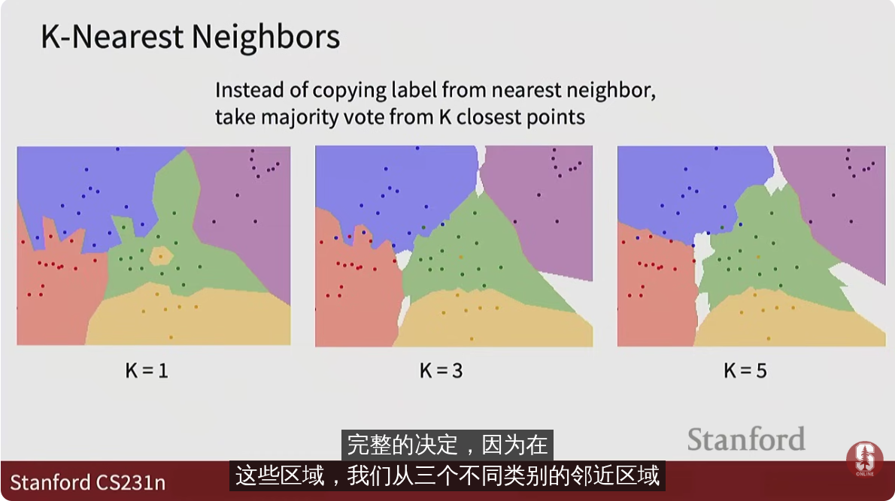

但是会出现一些模糊无法判断的区域（上图的白色区域）

另一种距离函数 *L2 distance 曼哈顿距离* 

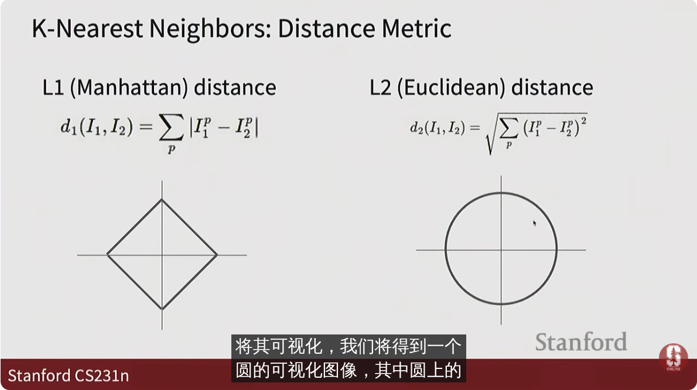

其中可视化 是取图形上一点作为I1 原点作为I2 对其应用距离函数(x, y分别作为两个特征) 所有图形上的点的距离相等

L2的好处是 如果旋转特征（使用不同特征）其框架和值都不变

而L1 对于特征值很敏感

[knn可视化](http://vision.stanford.edu/teaching/cs231n-demos/knn/)

### 超参数

运行算法时需要对其做出决定的变量 如k近邻算法的k值

很大程度取决于训练集和问题 **超参数调优**

一些调优想法

* 选择产生最佳训练损失的一组超参数
  * 很可能会过拟合（对于k近邻 这种调优方法 k=1 始终是最优解）
* 选择对测试集上工作最好的一组超参数
  * 这是作弊！
* 分割训练集中的部分作为**验证集**
  * 用未被分割的部分训练模型
  * 用验证集测试参数 找到产生最佳训练损失的参数

但是对于验证集很小 较佳的方法是**交叉验证** 将训练集分为若干折(fold) 每一折都作为验证集使用一次 对每一折的验证结果取均值

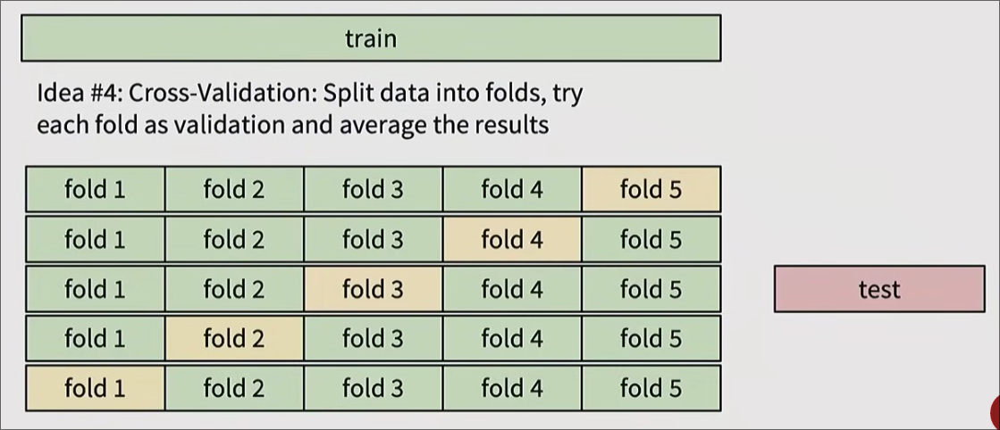

对于较大的数据集 往往凭直觉设置超参数 

但是基于像素的k近邻算法 在分类领域有很多限制
## 线性分类

是一种**参数化方法** 我们需要找到一些参数以将输入图像映射到输出类别

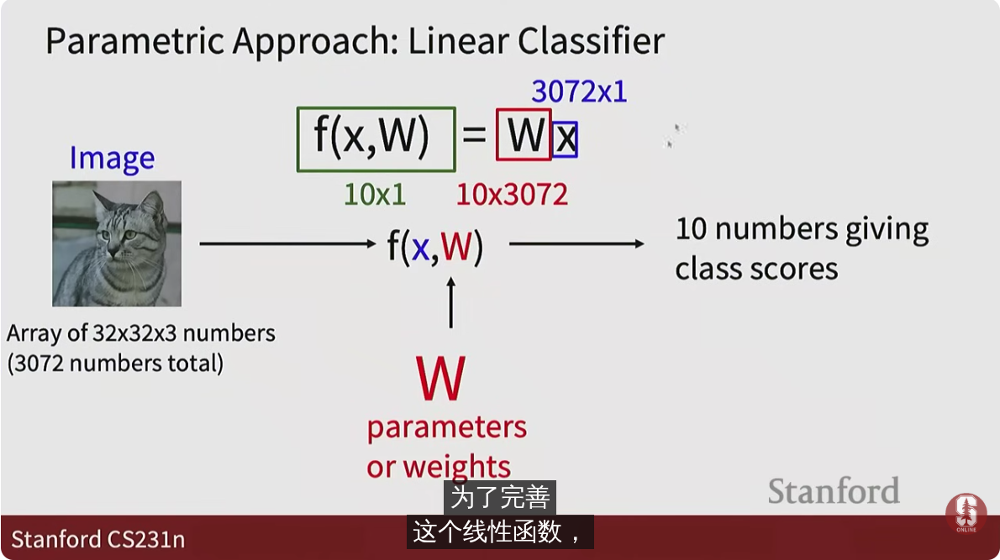

对于我们输入的图像x (3072,1) 我们要找到权重W (10, 3072) 以计算其在10个类别中的各得分

有时我们也会+b `f=Wx+b`

这些线性分类器也是神经网络的重要组成部分

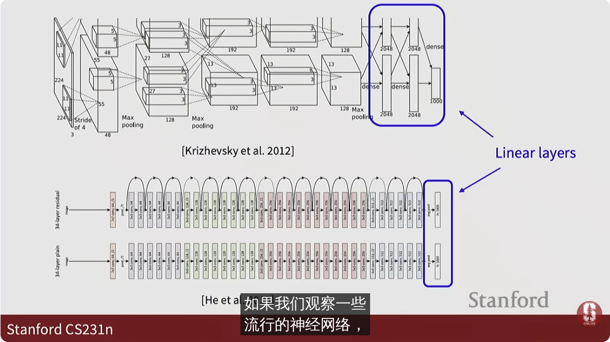

对于4个像素的图像 我们欲将其分为三个类别

W 是 (3, 4) 的矩阵

而b是 (3, 1) 的向量

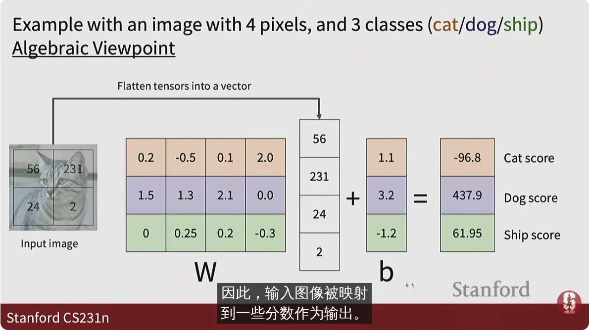

W和b的每一行 可以看作计算某类别时的参数

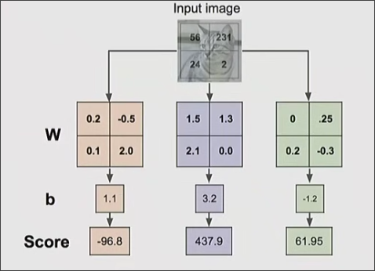

对于二维空间 线性分类做的是画分界线来归类

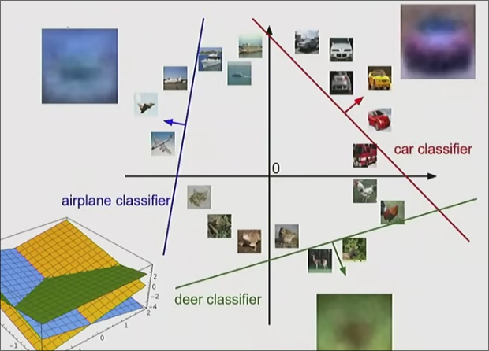

偏差的意义是让这些线可以脱离原点

但是对于分布在不同领域的和分界线复杂的数据等 无法很好分类

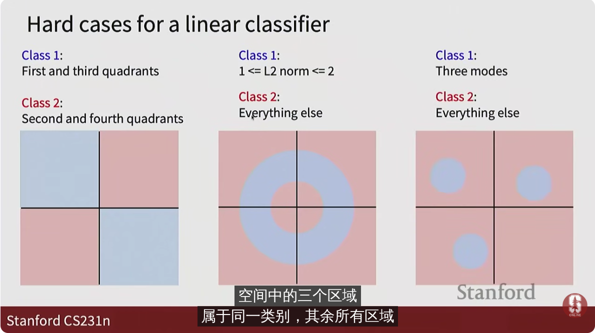

### W的确定 损失函数

**损失函数** 是训练数据得分的不满程度

有了这个函数 我们还需要找到让不满意程度下降的方法 **优化**

* `softmax`分类器

对于评分 我们将其转化为概率以控制在合适的范围内
 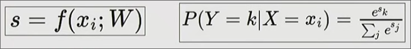

e^s 保证正数 之后进行归一化

对于实际类别的归一化后预测概率

对其取负对数 得到损失函数

因此预测概率越低 对数越小（负值） 负倒数越大 损失越大

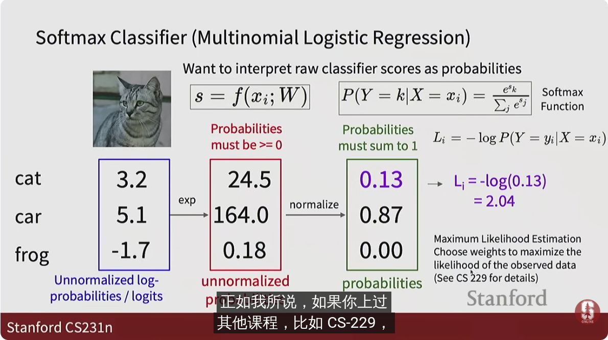

*KL散度的角度得到的结果相同*

