# 正则化与损失优化

正则化的意义是牺牲在训练集上的损失 而让模型在未见过的数据上表现更好
 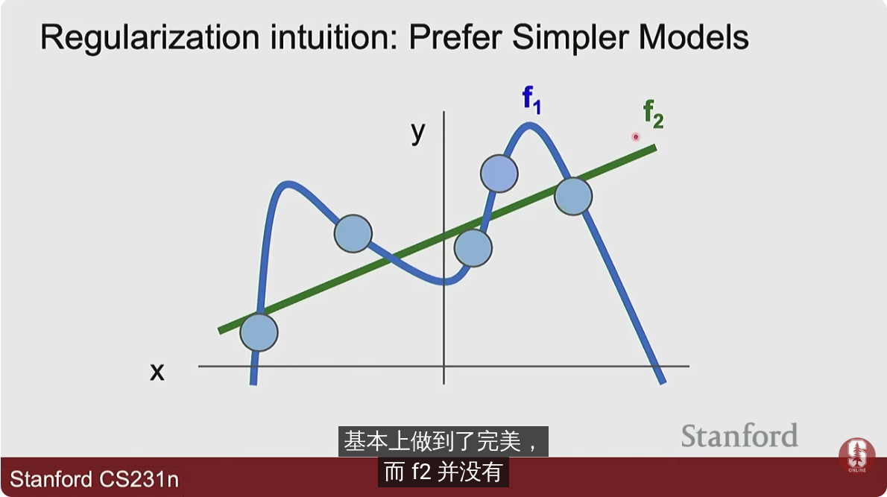

尽管f1对训练数据拟合更好 但是f2可能在测试集上有更好的表现

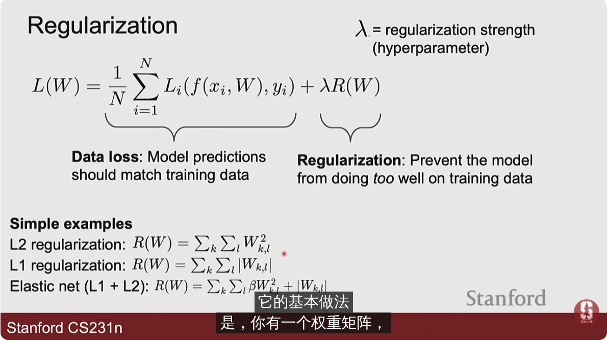

其中`r`为*超参数*（因此可以通过验证集确定）正则化系数 其决定了正则化的程度

* L1 正则化 会产生很多0值 *应用于偏好稀疏化的解决方案*
* L2正则化 允许很小的参数（对小参数的惩罚小）会产生很多非0但是很小的值

正则化也有助于更快训练模型

正则化有时也会让模型更复杂以换取在测试集上更好的表现

## 优化损失

找到山谷中的最低点

* 一种想法是随机取点 计算高度 
* 顺着斜坡走 

这是一维导数的定义

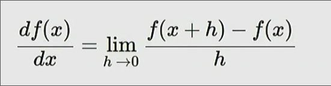

对于多维 对于一点 在不同方向上都能类似地得到一个**梯度**

最终各个方向梯度组合为一个向量 

* 一种计算方式是给这个点各个方向都增加一个很小的步长来计算 得到的不准确 速度慢
* 而事实上L是W的函数 通常是可微的 可以直接对其链式法则求导

### 梯度下降 

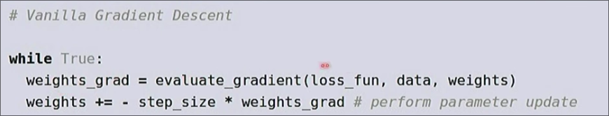

对上述方法的应用 每次下降一小步

* 随机梯度下降 每次只选取训练集中的部分数据 来计算梯度 *epoch* 完整选取训练集一次的训练结果 SGD

当坡度陡峭 而step较大时 可能会出现震荡甚至损失变大的情况

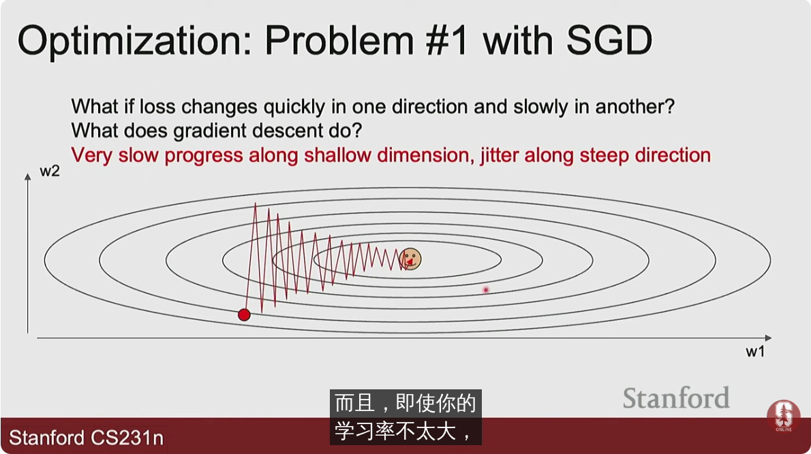

另一方面 如果损失函数有极小值 同样我们会被困住

*鞍点*也会使我们卡住

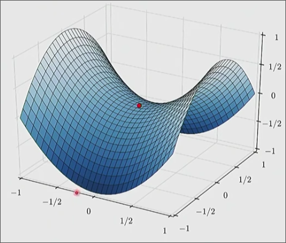

此外由于我们查看的是局部数据集 会受到噪声的影响
#### 动量

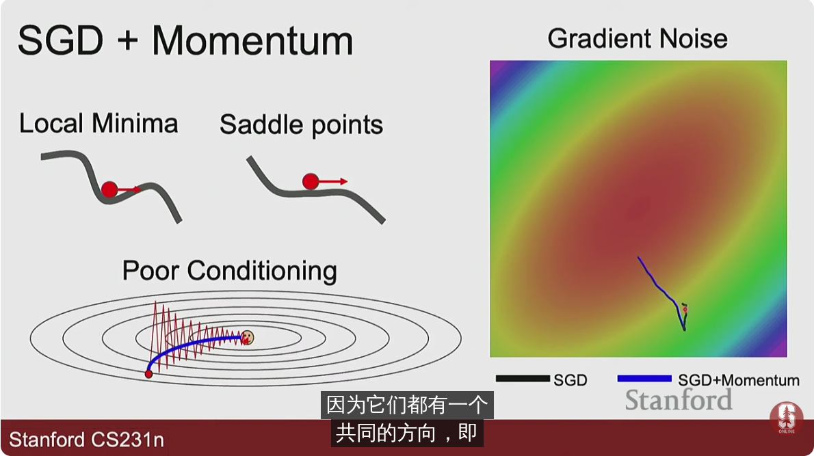

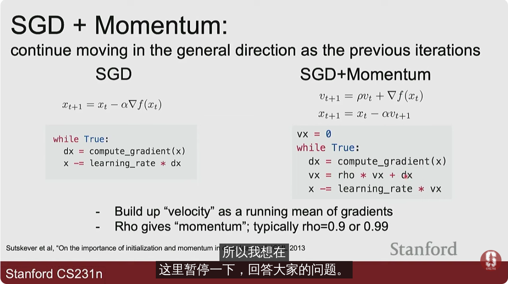

#### RMSProp 优化

对梯度进行缩放

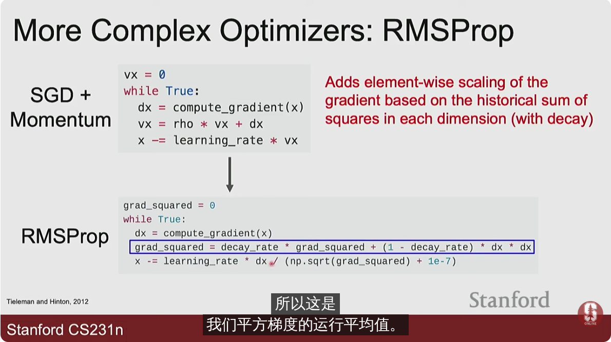

地形越平坦 步幅越大
#### Adam优化器

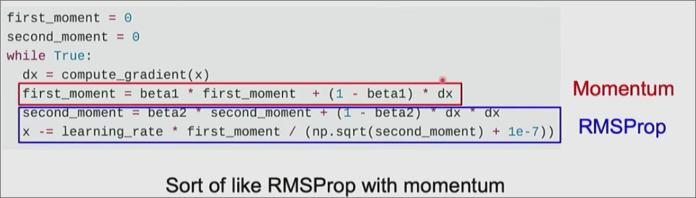

结合了上述两种优化

需要添加一些偏差项来初始化

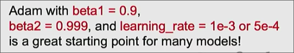

*几种方法的可视化*

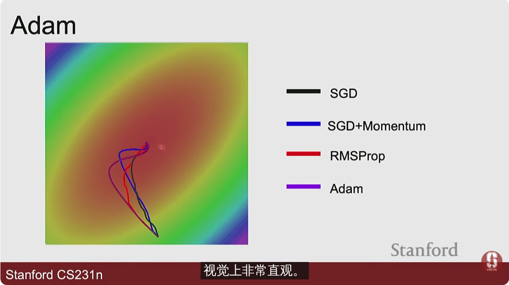

#### AdamW

AdamW将权重衰减从损失函数中分离出来，并在每次参数更新时直接应用。

- **更好的正则化**：由于AdamW显式地控制了权重衰减，它能够独立于梯度的调整进行更新，这使得模型的正则化效果更强，能够减少过拟合。
    
- **提升训练效果**：在某些任务和模型中，AdamW往往能在训练过程中表现得更为稳定，尤其是在大规模训练时。

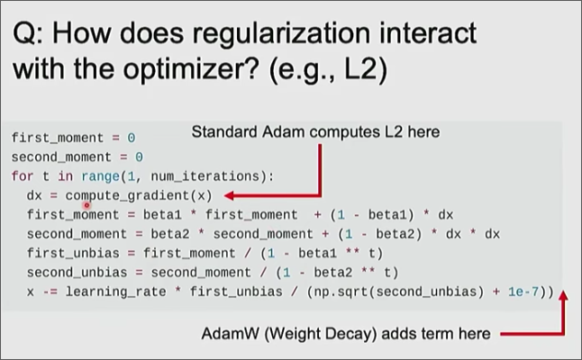

#### 学习率

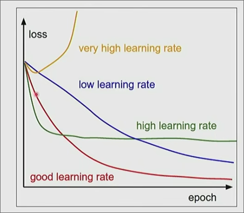

好的学习率会使损失在一开始迅速减少 而在epoch增加时 有持续改进

学习率也通常在训练过程中不固定

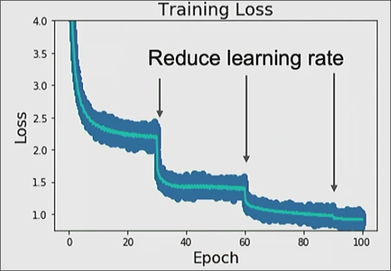

余弦学习率衰减法

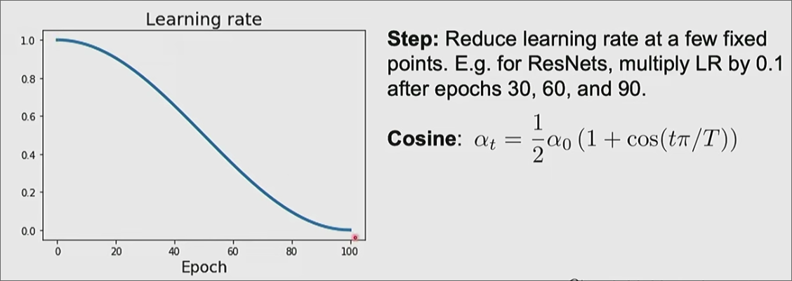

线性学习率衰减 平方根倒数衰减...

线性热身

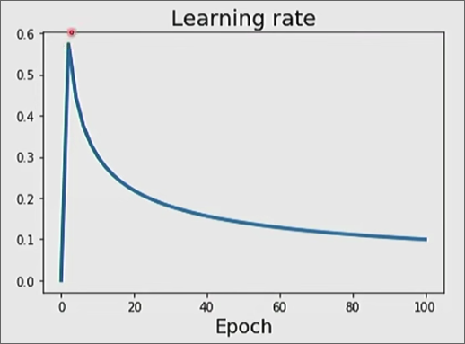

一个经验法则是如果将一批(batch)的大小增加N倍 学习率也应该成比例的增加

#### 二阶优化

适用于小量数据集的情况 整个数据集可以是一个batch 需要计算二阶导

应用Hessian矩阵
 