# 神经网络与反向传播

之前这是我们学习的线性回归 其可以看作单层的神经网络

其中W是(C, D)大小的矩阵 C表示类别数（也是神经元数） D表示特征数

对于构建新的一层

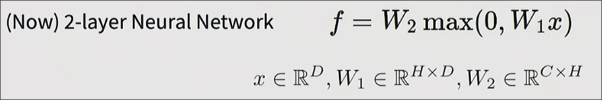

max的作用是帮助我们建立了**非线性关系** 

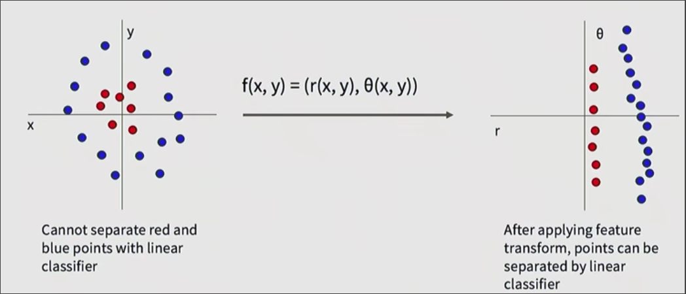

## 全连接神经网络

每种神经元都与前后层全部神经元相连接的神经网络叫**全连接神经网络**

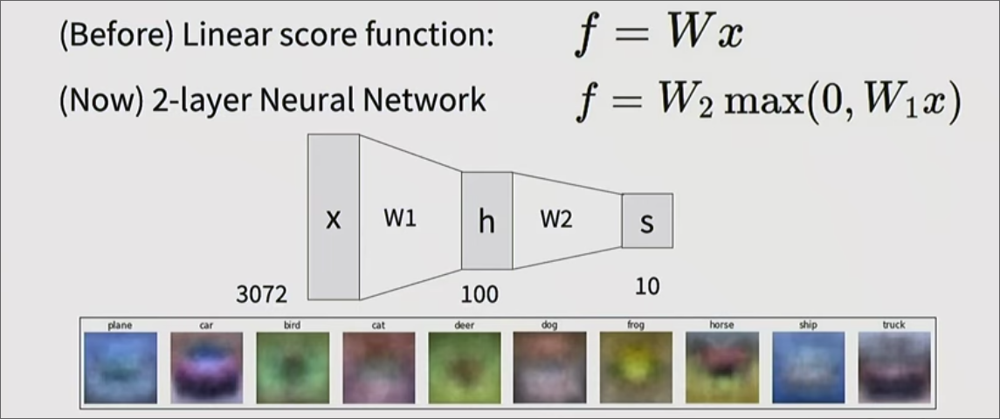

之前对于一层的网络 下面是其欲分类的模板 而对于新的**中间层** 有超过我们分类数量的神经元 宏观角度 其被赋予了*创造模板的能力*： 每个神经元可以从对象的局部分析
## 激活函数

在这里max被称为ReLU**激活函数** 如果没有激活函数 事实上神经网络等同于单层的神经网络 也就是线性回归

此外还有很多激活函数

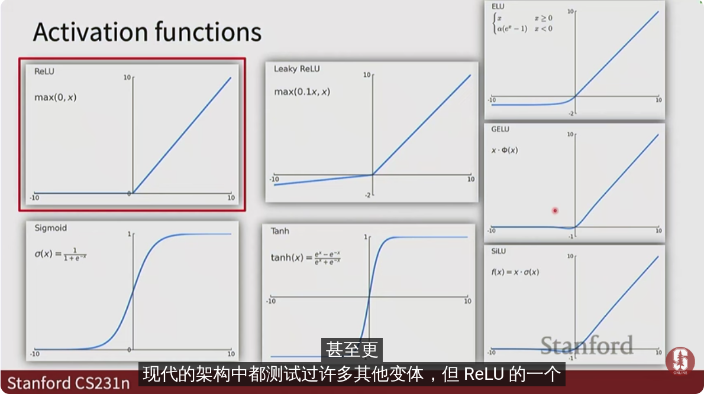

Relu 有时会创建死神经元（由于置为0的原因）有时会替换为`leaky ReLU` `ELU` 等更新的变体

通常不再神经网络的中间部分使用`Sigmoid` `Tanh` 因为其将数据限定了范围 会导致有时梯度消失 常用于后面的层

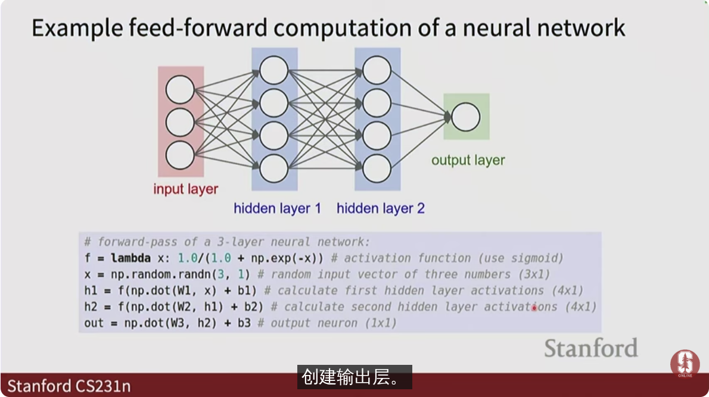

对于一个新问题 经验性地选择`relu`

*实现*

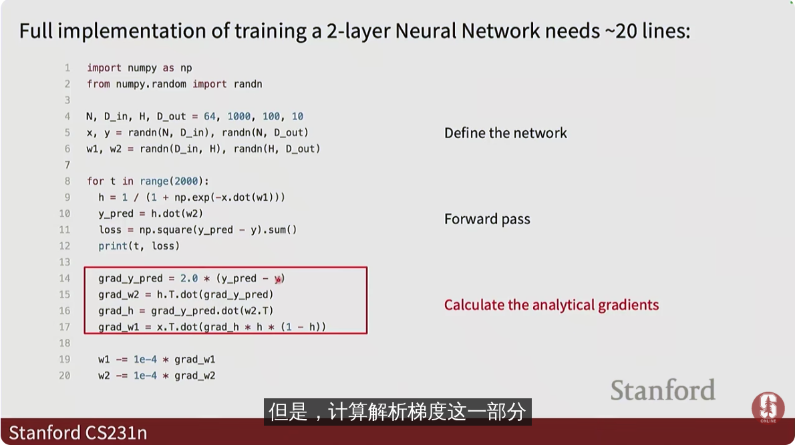

隐藏神经元的数量增多可以学习更复杂的分类 

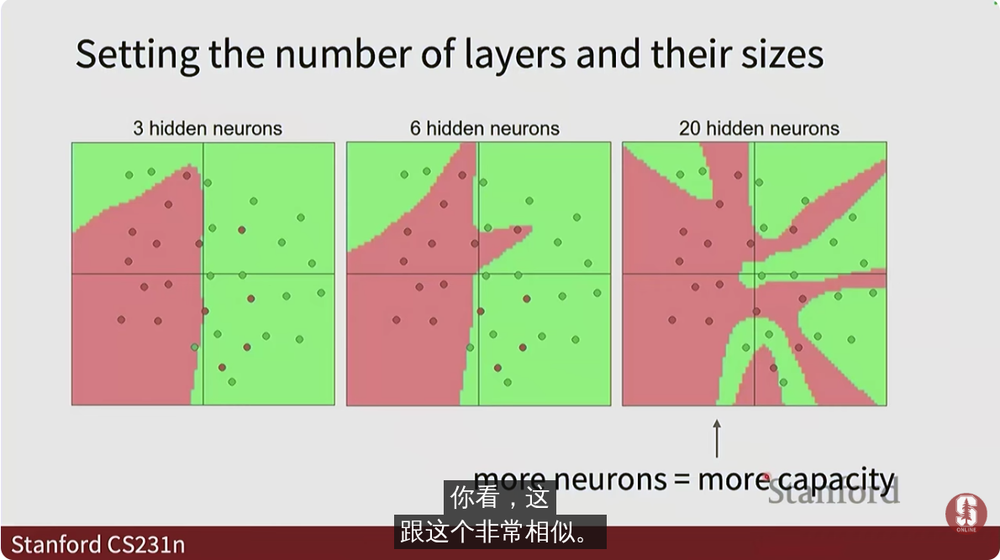

但是和*k近邻*一样会出现**过拟合**的问题

然而通常不会将神经网络的大小作为正则化项超参数

* 通常我们从较小的网络开始 逐步增加网络的规模 直到出现一定的过拟合 *此时网络已经了解了数据的模式并记住数据* 之后我们应用正则化
* 对于具体问题 我们可以参考同类和其他类型的网络来却确定神经元数量大致规模

而是运用常规的正则化

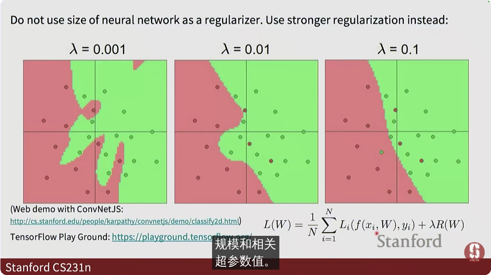

## 反向传播

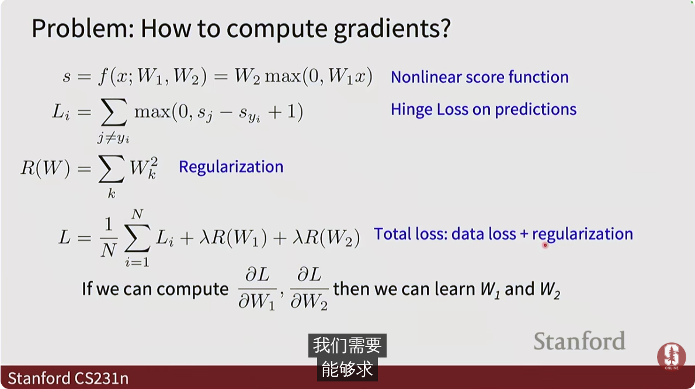

我们能否从梯度下降中得到灵感来获得多层网络的学习方法

我们绘制损失函数的**计算图**

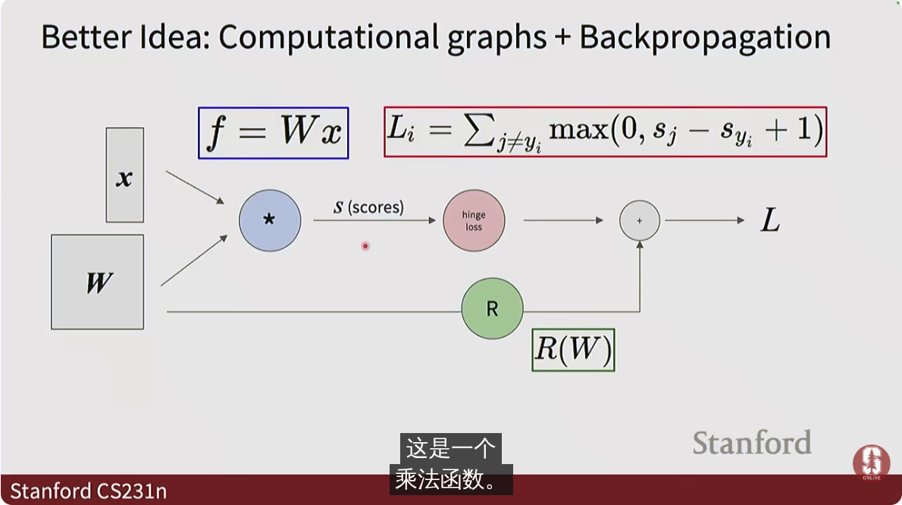

对于几个简单的函数 其计算图如下

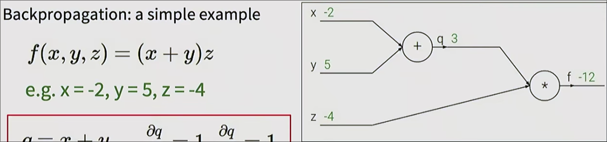

我们可以计算q对x、y的偏导 以f对q f对z的偏导

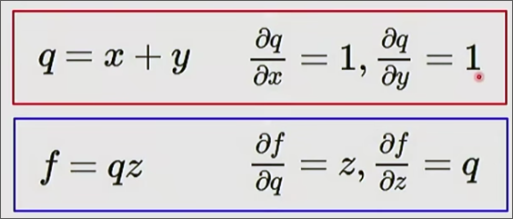

根据链式法则 f对x和y的偏导 也轻易得出

反向传播是从将**上游梯度**乘以**局部梯度**得到**下游梯度**（新的上游梯度）的过程

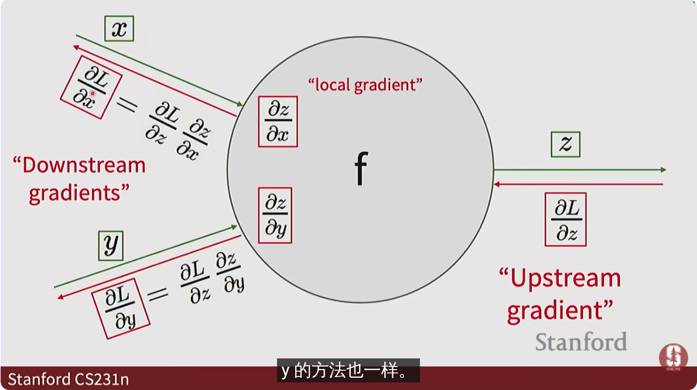

这是梯度计算中一些*元件*的特性

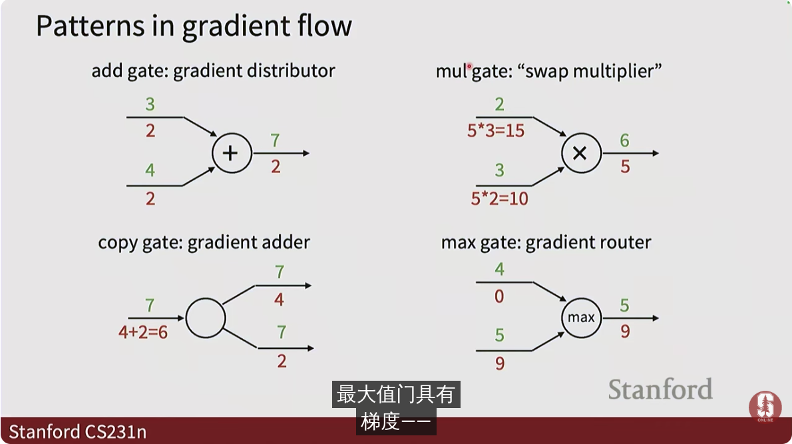

上面是输入输出值 下面是对应的梯度 我们可以找到一些规律

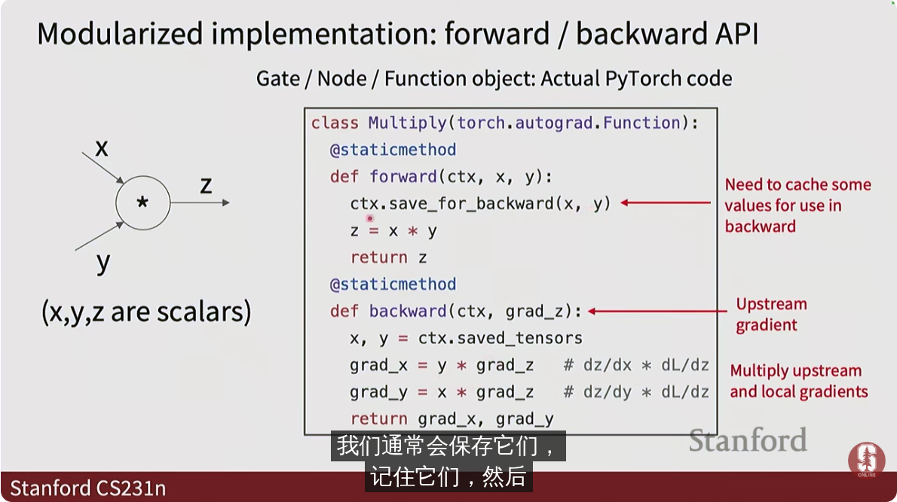
