# 训练卷积神经网络 卷积神经网络架构

## 卷积神经网络架构

### 其他层

#### 归一化层

通过均值、标准差等统计量归一化输入数据 

1. 使得输入数据 为单位高斯分布 *均值为0 标准差为1*
2. 对数据进行缩放和平移 *通过学习参数*

**层归一化**

对于 N个大小为D的数据 x N * D

我们计算N个均值、标准差

接下来通过两个可学习参数 $\gamma$ $\beta$ 1 * D

得到缩放和平移后的数据

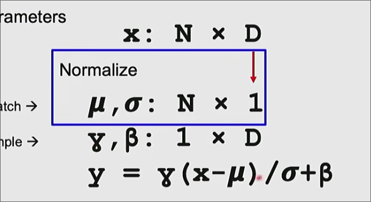

不同归一化方法的区别主要在于计算均值、标准差的方式不同

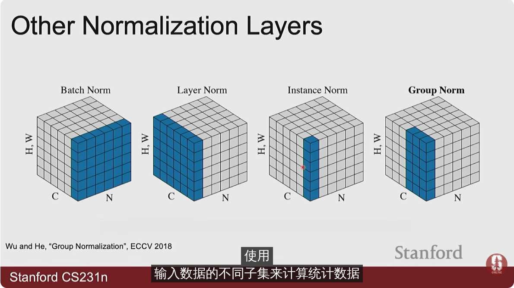

#### dropout层

为卷积神经网络的一个正则化层

在训练过程中加入随机性 在测试时移除

使得学习更难 但是泛化更好

每次前向传播时 随机地将某些神经元输出置0

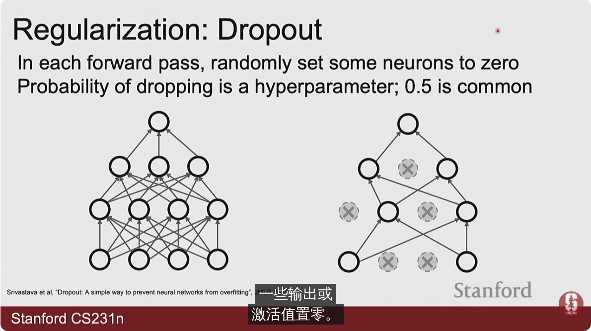

超参数为丢弃值的概率 通常是0.5 0.25

直觉是使得网络有冗余的表示 不过度依赖某些特征

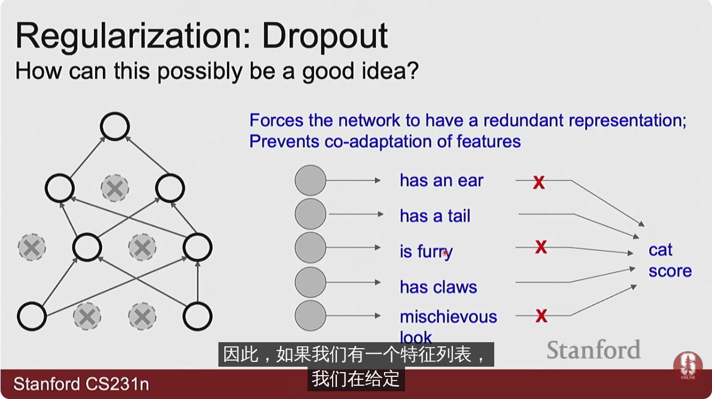

在测试时我们要乘以对应的系数消除 恢复的神经元额外输出的影响

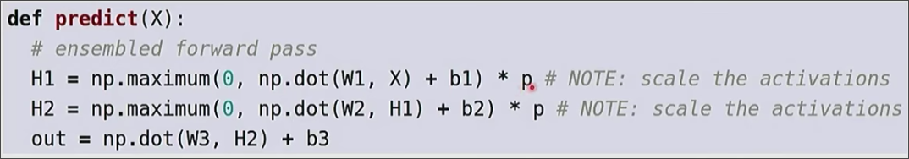

### 激活函数

* sigmoid 函数

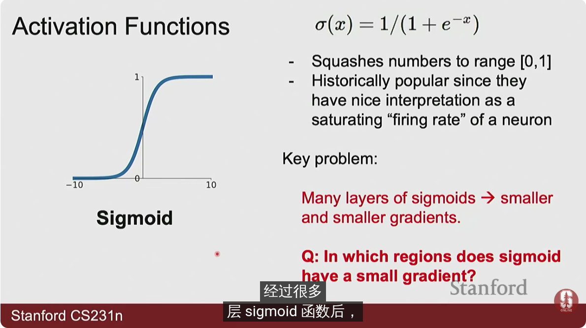

其如今已不常用 其的问题在于 当引入许多层sigmoid层后 其在反向传播时 梯度会越来越小（当出现很大的负值和正值时）

而使用relu 会让正值部分梯度正常 （计算也更容易）

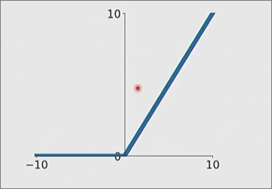

而改良的一些激活函数 通过在0的邻域内设置一定非平坦部分进一步改进

* gelu

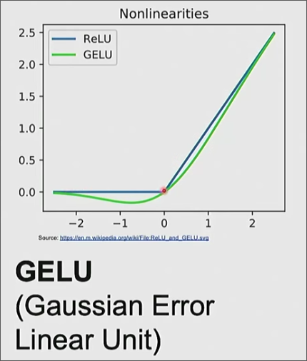

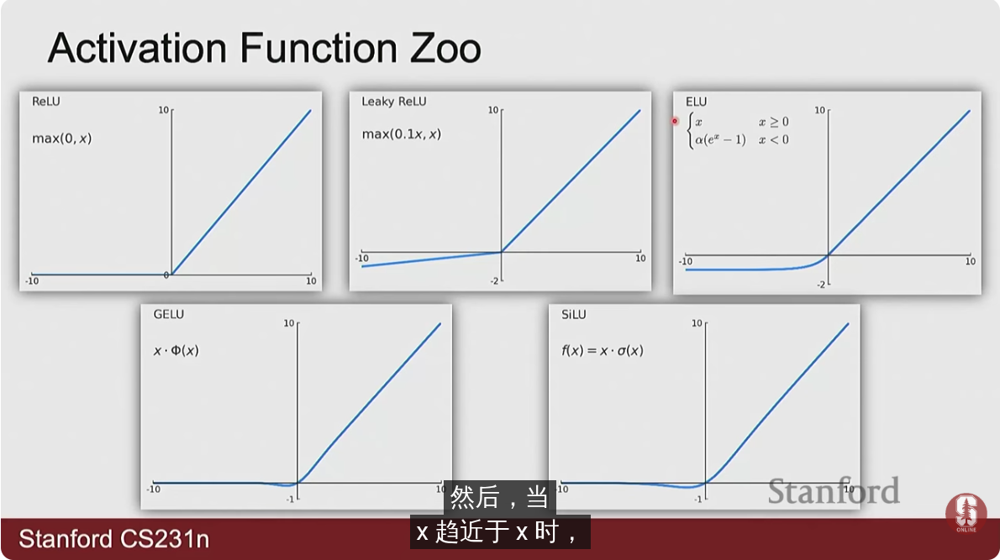
### CNN 架构

各个年份较好模型的错误率和层数

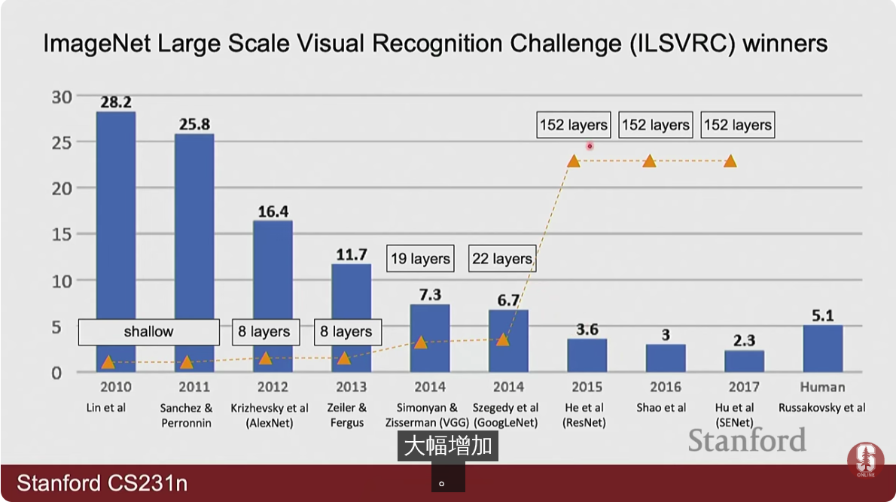

各个模型的层状表示

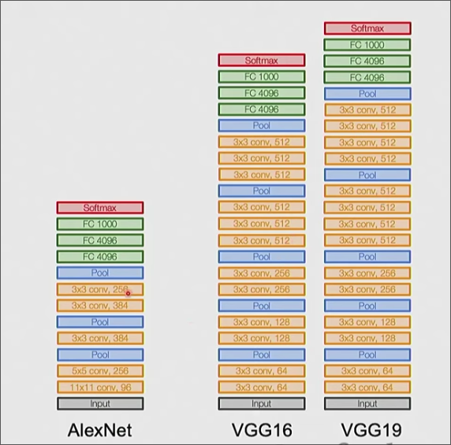

* 其使用了3 * 3滑块的卷积层（p1以保证输出大小不变、s1）
* 使用最大化池
* 两层 4096的全连接层
* 一层 1000的全连接层（输出1000个类别）
* softmax 输出层

使用 3 * 3滑块的好处是每次将感受野+2大小

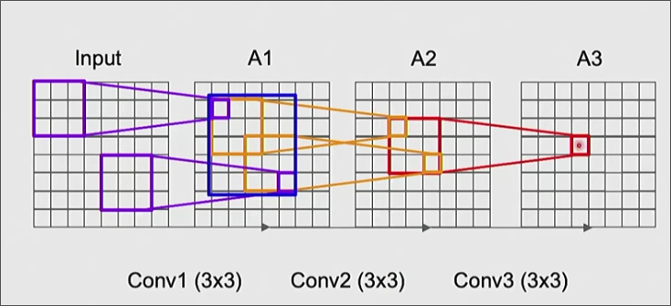

3个堆叠起来就是 7 * 7

同时有较少的参数

#### ResNet

对不同层数的CNN进行分析发现20层的误差优于56层（较低的测试误差和训练误差） *原因在于更难优化，处于局部最小值，更多时间也不会拟合到全局最小值*

我们的解决办法是**残差映射** 将卷积层前的x也输入到卷积层之后 这样后面层即接受卷积层的输入也接受原始值

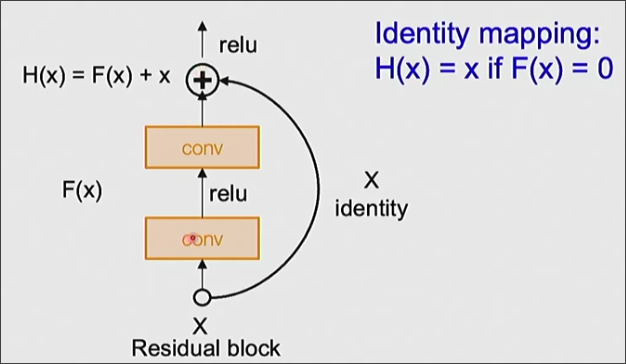

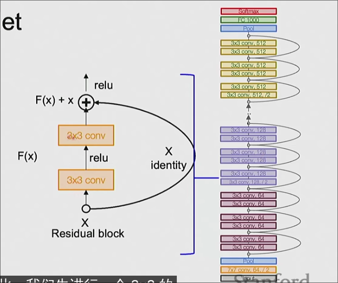

并且得出一系列合适层数 18 34 50 101 152 随着层数的增加 效果越来越好 但是增加的越来越不明显 当遇到一个新问题 首先从最小的层数开始 查看性能 再进行增加
### 参数初始化

如果过小 会导致 不同层输出的均值和标准差越来越小 *我们期望相同*

如果过大 不同层输出的均值和标准差越来越大

而一种初始化方式是 将系数设定为 **输入维度大小一半的平方根** *这样得到几乎恒定的均值和平方根*

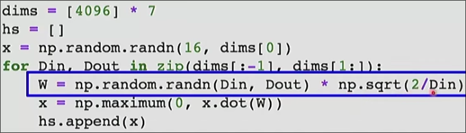

对于卷积层 其初始化的系数将维度换为核数
## 训练卷积神经网络

### 数据预处理

归一化 （对于每个像素的每个通道 减去平均值 除以标准差）
### 数据增强

为图像添加噪点有助于防止图像过拟合

正则化的一般模式 是在训练中添加随机值 在测试对随机进行平均 如*dropout*

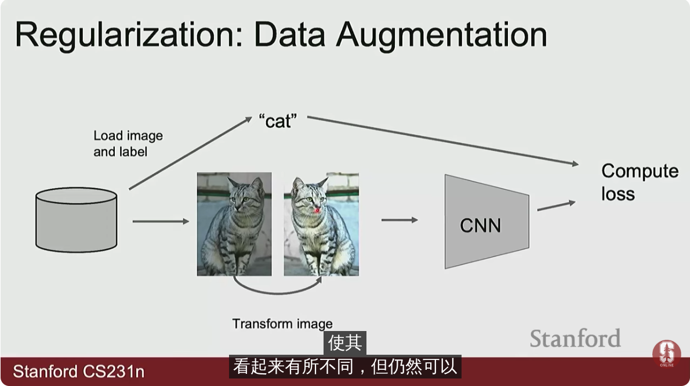

对图像做一些变换 并传递给模型 *有效增加数据集大小 但增加了训练损失*

*取决于具体问题*

* 水平反转 *对于日常物品*
* 调整大小 裁剪 并进行调整 *一般的做法是先选定一个小的合适长度  对每个图片选择一个随机的略大长度 对图片进行裁剪后将短边调整为该略大长度 裁剪调整后长边为何时长度*

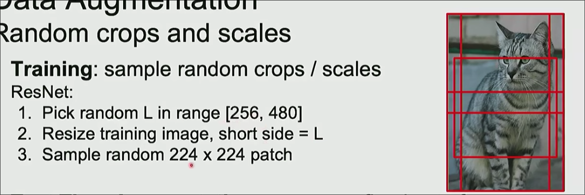

测试时增强 

对测试的图片进行各种调整 并输入模型得到结果取平均值

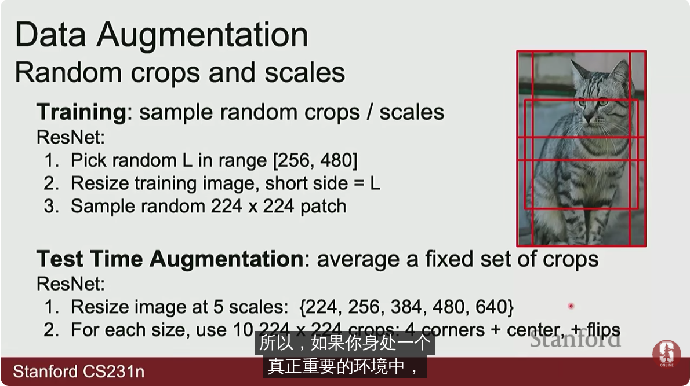

* 随机对比度和亮度
* 遮挡物体部分

### 迁移学习

有时并没有很多数据

可以使用庞大的训练集如ImageNet训练后的模型 

替换最后一层 然后仅仅训练这一层

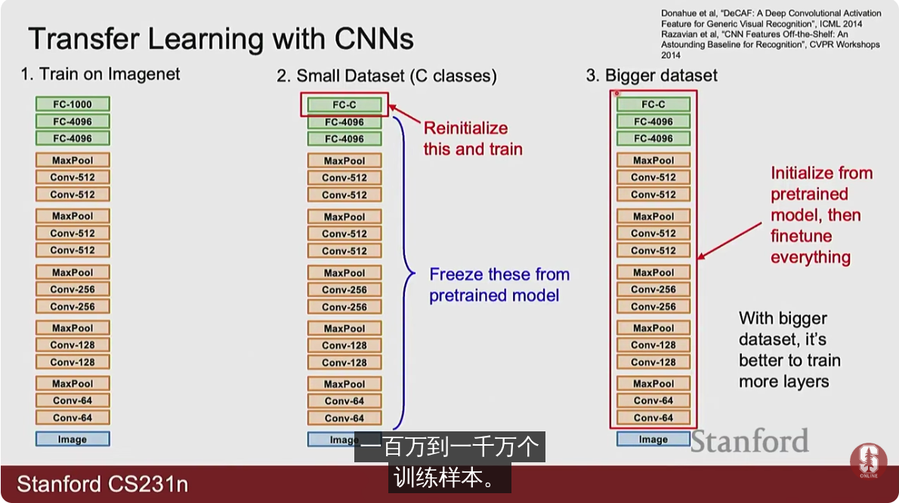

前序层 可以看作一个训练好的特征提取器

对于与公开训练集相似的训练集

* 训练集较小 通过上述方式微调最后层
* 训练集较大 微调全部层

对于不同的训练集

* 较小 尝试其他训练集或者收集更多数据 *也有一些跨领域泛化的技术*
* 较大 微调全部层或者从头训练

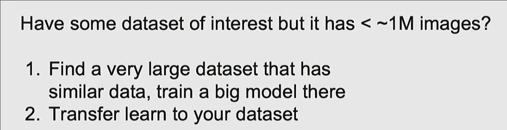

一些数据集和模型的来源

### 选择学习率

一种训练策略是在很小的数据集上训练 查看模型是否能记住这一个训练数据 来 debug 这也是选择学习率的好方法

常见学习率的选择 1e-1 1e-2 1e-3 1e-4 1e-5

采用粗略的超参数网格 查看不同学习率下的训练程度（训练一段时间）

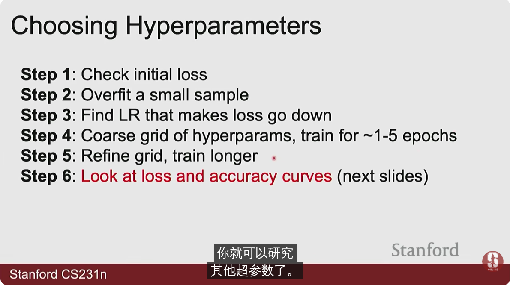

在确定学习率后查看准确率曲线

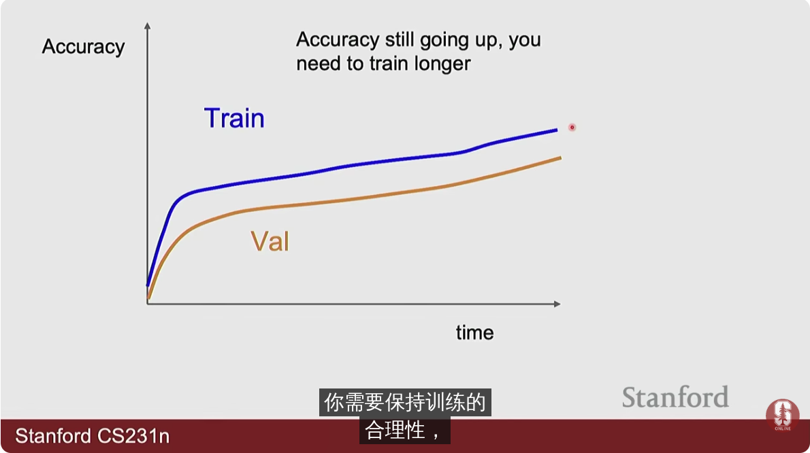

有时会遇到这种情况

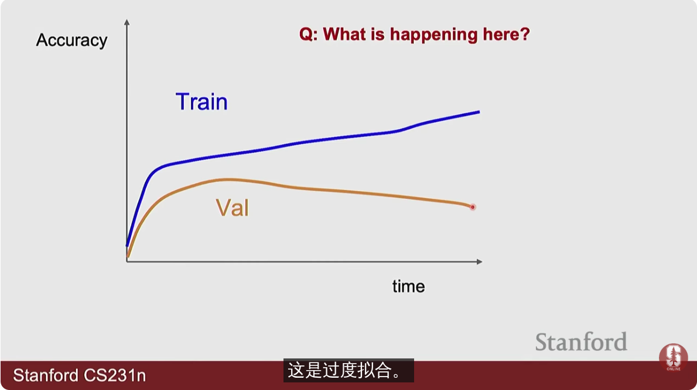

发生了过拟合 可以进行正则化 或者收集更多数据

如果差距很小 可能需要训练更多时间

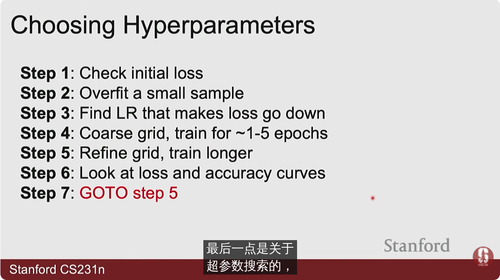

实践中对超参数网格随机取值通常效果更好 （防止某些不重要超参数浪费时间）

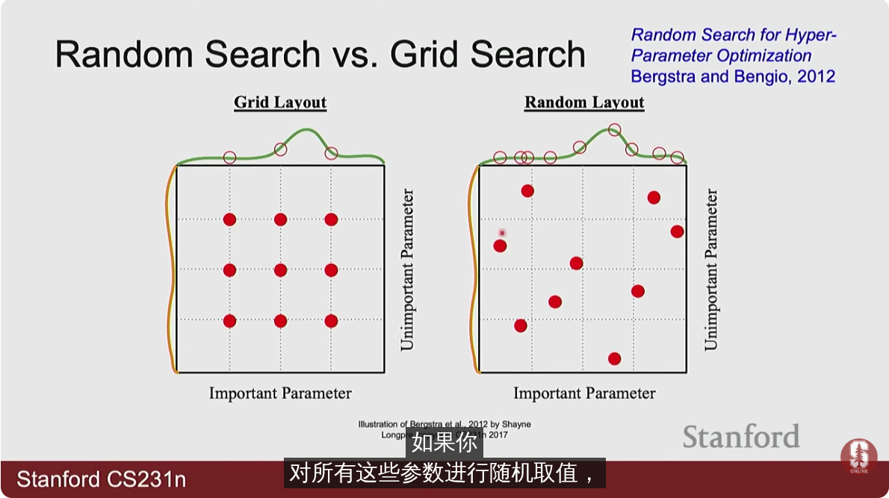