# 注意力机制 Transformer

我们以这样一个循环神经网络为例 输入是一系列英文单词 输出为一系列意大利语模型 *翻译*

使用一个循环神经网络作为**编码器**

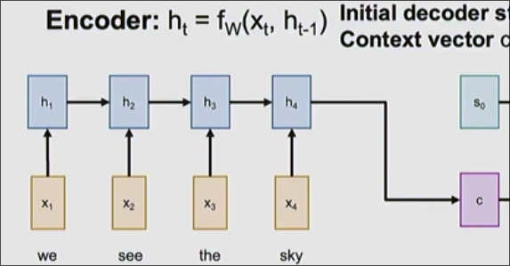

最后一个隐藏状态实际上包含了前序输入序列的信息 我们可以视其为总结 

而另一个循环神经网络作为**解码器**

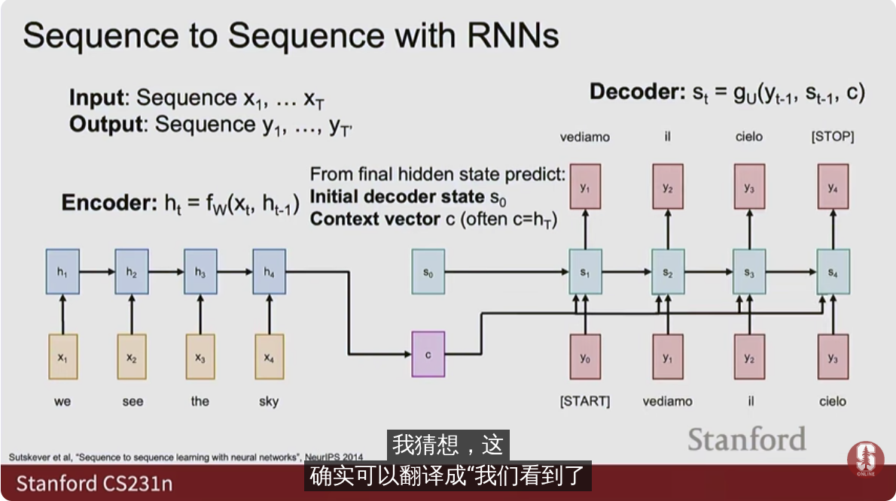

通过编码器获取的总结一同发送给隐藏状态获取输出

但是c是一个固定长度的向量 这对于不同长度的输入不太友好 *瓶颈*
## 注意力机制

解决方法是采用不同的架构 给予模型回顾输入序列的能力 当模型产生输出序列时我们希望网络可以回顾输入序列

编码器神经网络不变 为解码器设置初始隐藏状态

接下来 为每个输入序列计算一个得分 *表示输入token与解码器初始隐藏状态的匹配程度* **标量对齐分数**

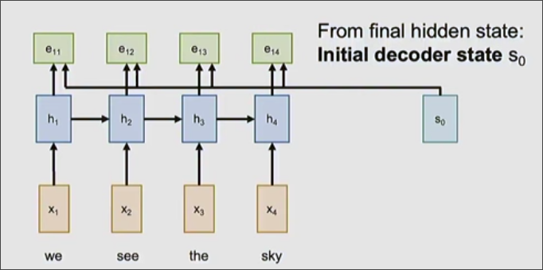

$$e_{t,i} = f_{att}(S_{t-1}, h_i)$$
$f_{att}$是一个线性层

接下来是一个 softmax 层 将标量对齐分数转为概率分布 **注意力得分**

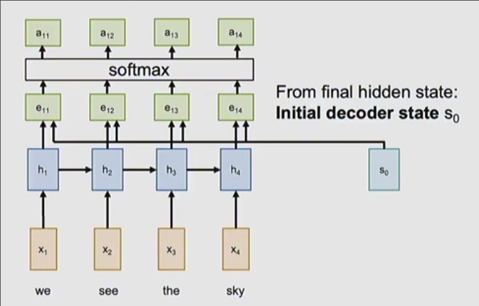

$0 < a_{t,i} < 1$         $\sum_ia_{t,i} = 1$

我们做的实际是根据解码器的隐藏状态来预测输入标记的分布

接下来分别对编码器中的隐藏层根据其注意力得分线性组合 得到 c1

$$
c_1 = \left[
\begin {matrix}
h1 & h2  & h3 & h4
\end {matrix}
\right] 
\left[
\begin {matrix}
a_{11} \\
a_{12} \\
a_{13} \\
a_{14}
\end {matrix}
\right]
$$

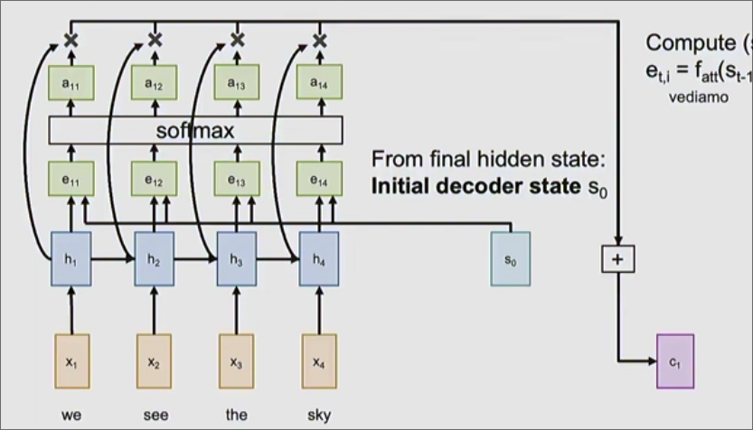

其是对编码器序列中信息的概括 这个和当前解码器状态相关的上下文向量c 倾向于关注当前编码器正在*处理*的输入序列 比如要翻译"we see"时 其a值*注意力得分 更高 因此解码器会回过头着重查看这两个词

再将其与解码器的初始输入一同传递给解码器得到输出..

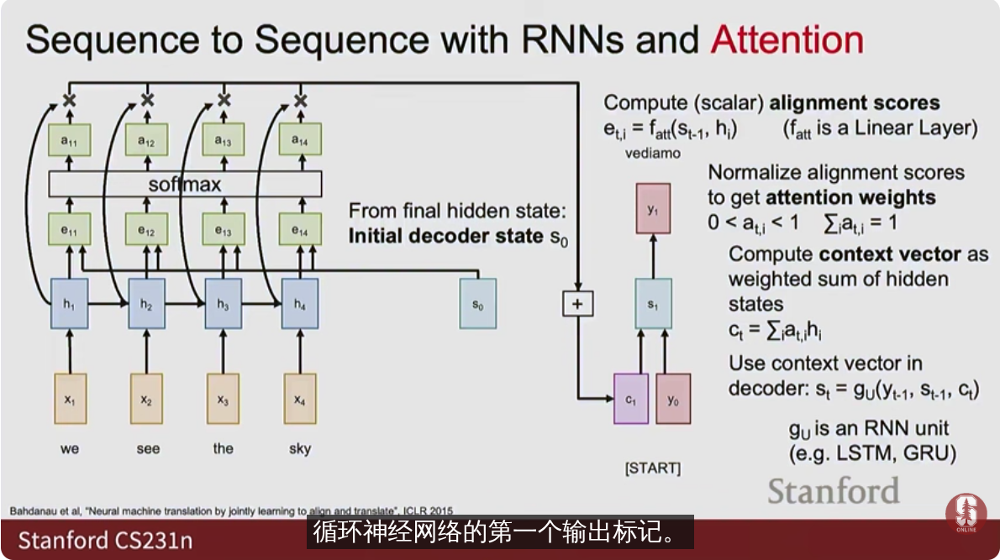

关于解码器的隐藏层的初始化 有时会设置为 编码器的最后一个状态 有时会设置一个编码器最后转台的线性映射 有时初始化为0

在解码器的下一个时间步 又再次根据其上一隐藏状态与编码器各隐藏层匹配 得到新的标量对齐分数、注意力得分 算出新的上下文c...

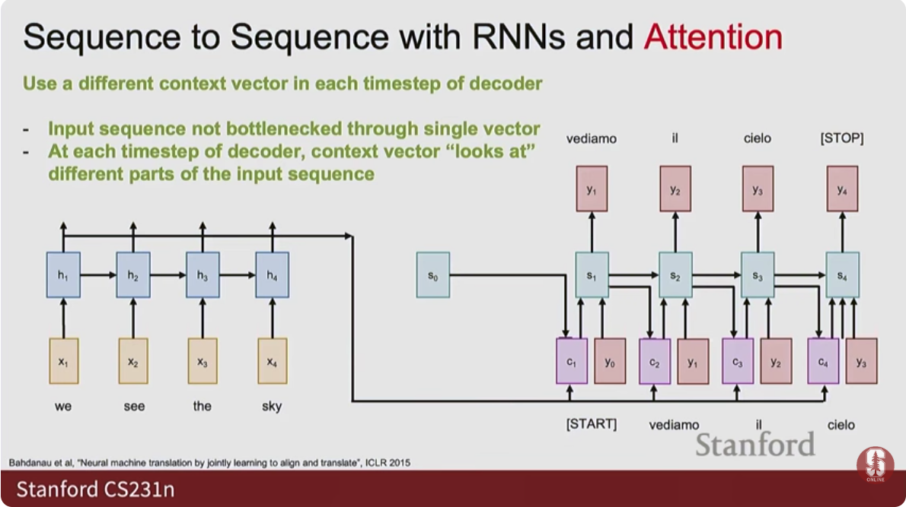

通过分析训练后网络在预测某输出时对应个输入序列的注意力权重 我们可以清晰地得出网络在关注什么

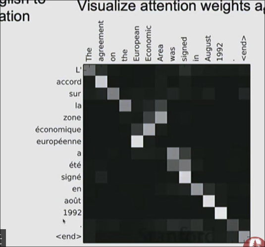

## 注意力层

*注意力是一种非常强大的机制 我们试图将其与循环神经网络分离 以应用更多*

总结一下 我们有两个序列 查询序列 *在这里是解码器的隐藏层*  数据序列 *这里是编码器的隐藏层* 注意力对于每个查询向量我们回顾数据序列 并将其信息汇总到该查询向量的**上下文向量**

**注意力算子接受一个查询向量 将其返回到数据向量中 并以某种方式概括数据向量 生成一个输出向量**

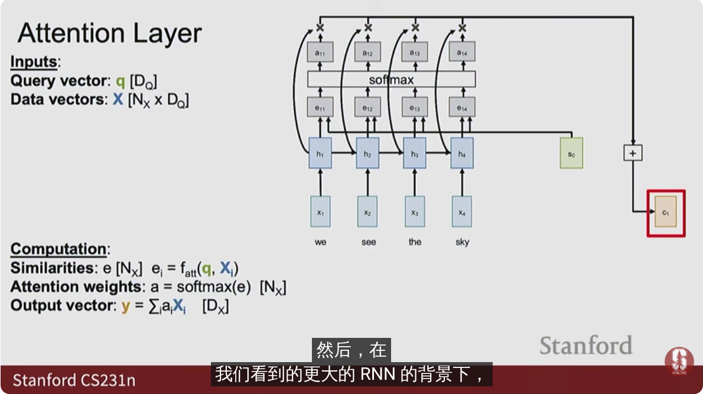

具体而言 首先计算查询向量与所有数据向量的相似度 然后获取注意力权重 在根据注意力权重对数据向量进行线性组合 得到我们的输出向量 

在循环神经网络 获取相似度使用的是 $f_{att}$ 函数 其接受两个向量 生成一个标量 而我们将其简化为点积来计算相似度 *由于softmax函数的一些原因会导致梯度消失 我们将点积除以维度的平方根*

**矢量化**

对于$N_Q$个维度为$D_Q$的查询向量，$N_x$个维度同样是$D_q$的数据向量 分别组合为 $Q [N_Q * D_Q]$, $X[N_X * D_Q]$

对于每个查询向量 其都于全部的数据向量分别点积得到对应标量 因此可以 矢量化为 $qX^T$ 

所有的查询向量都是这样的操作 因此矢量化为 $QX^T$

最后除以修正的维度平方根 得到一个相似度矩阵 

之后对找到每个查询向量的softmax 注意力权重

类似地矢量化得到输出向量

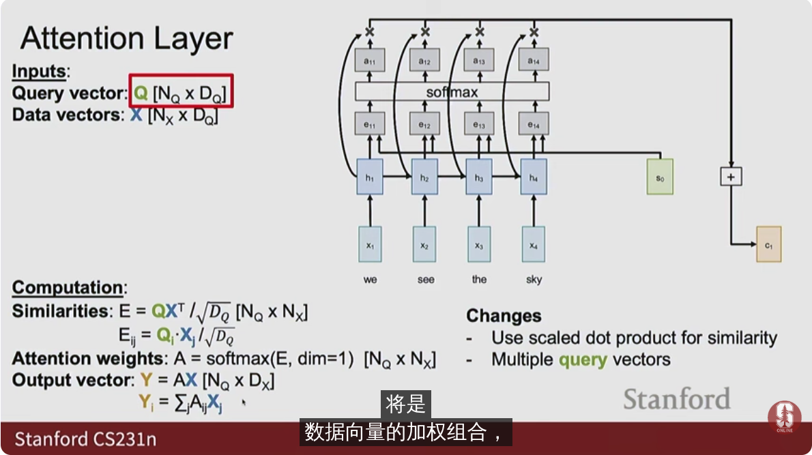

在上述过程 数据向量被使用了两次： 和查询向量进行匹配得到相似度 与注意力权重线性组合得到最终的输出向量

我们希望让网络自己找出使用数据向量的这两种方法

对于一个数据向量 我们将其线性投影为**键向量** *维度不变* 和**值向量** *列维度可能改变*

将键向量与查询向量进行匹配 而值向量用于依据注意力权重的线性组合得到输出

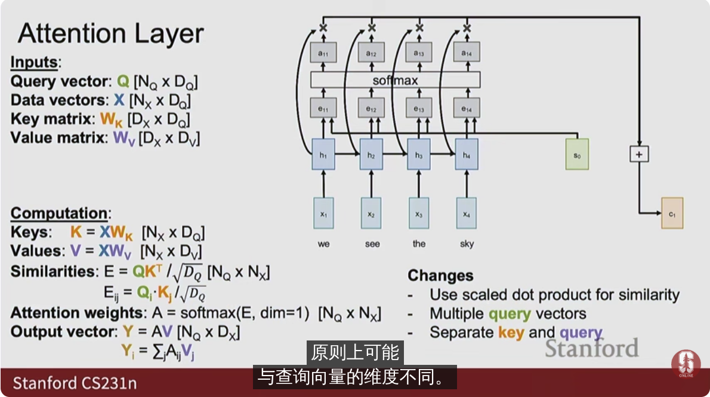

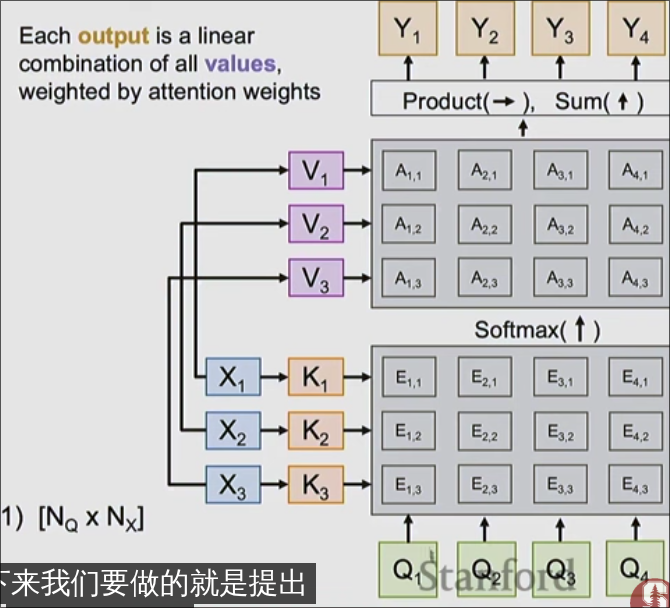

注意力层*交叉注意力层* 接受两个输入： 数据向量和查询向量
其有两个可学习参数： 键向量和值向量
输出一个输出向量
## 自注意力层

输入中 查询向量和数据向量不再分离  

将数据向量分别投影到 查询、键、值向量中

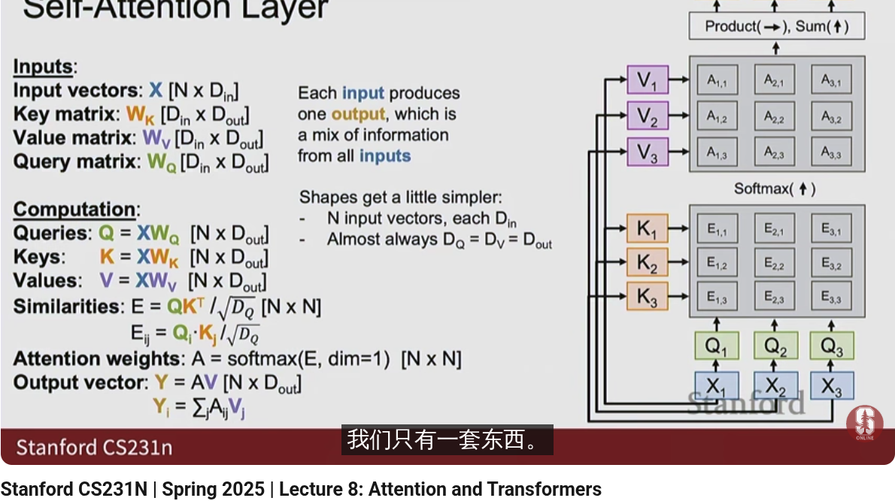

通常 $D_{in} = D_{out} = D_Q = D_V$

交叉注意力通常使用在有两种不同类型的数据进行比较 比如翻译： 原文本和翻译后文本  图像添加文字说明

自注意力 通常用在仅有一种类型数据 比如图像分类

**自注意层的置换等变性**： 打乱输入也会获得和未打乱输入相同的输出顺序

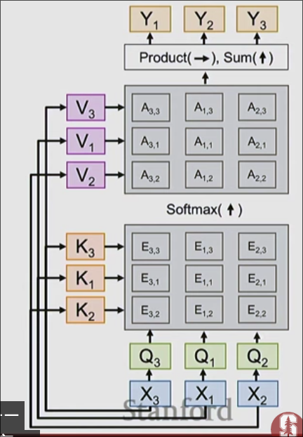

自注意力机制不关心输入向量的顺序 而是对一组无序的向量进行操作

对于需要关心向量序列顺序的问题 筒仓增加额外的数据连接到每个输入向量 **位置嵌入**

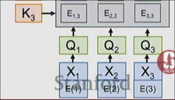

**遮蔽式自注意力层** 

只允许输入彼此之间查看部分而不是全部

在计算相似度时将遮蔽的部分置为负无穷  将导致softmax后的权重为0 因此 输出的线性组合时不会参与 *控制输入间相互交互*

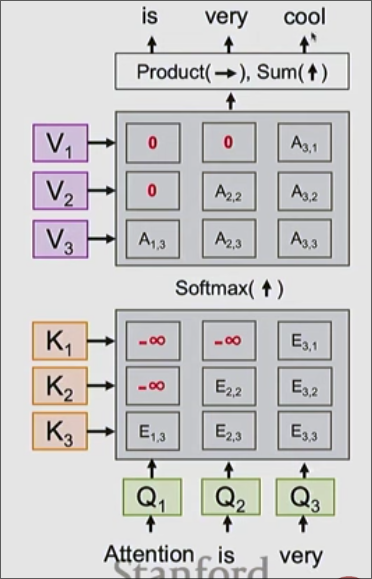

我们希望输入is 时预测仅仅依赖 Attention
而输入very 预测依赖前两个

**多头自注意力层**

*更加强大*

将输入 分别路由到 多个相同架构但是权重不同的自注意力层

每个自注意力层输出线性组合为一个线性投影

*最常用*

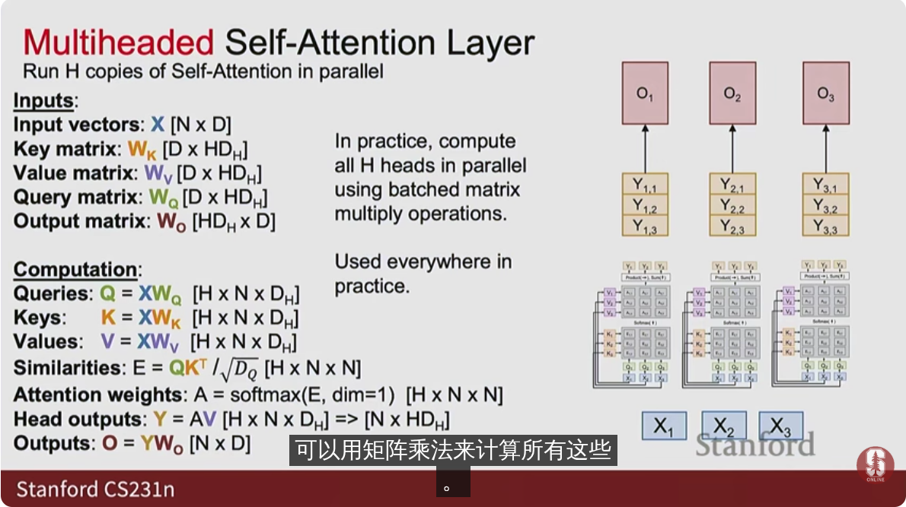

实际上仅仅四个大批量矩阵运算

## 对处理序列化数据神经网络的对比

* 循环神经网络 
不太适合并行化 *每个隐藏状态依赖于前一个隐藏状态 无法在整个序列中并行*
* 卷积
在多维网格中局部混合信息 *我们之前在2维网格* 
适合并行化
*对于大的图像或者长序列* 难以建立大的感受野 *需要大的卷积核或者多的卷积层*
* 自注意力
对长序列友好 不需要很多层
成本昂贵 *复杂度较高 或许不是坏事*
## Transformer

现代的神经网络架构，以自注意力作为核心

输入一组向量x 将向量通过自注意力机制进行处理

进行残差连接

将输出进行层归一化

除了通过自注意力*将各个输入彼此比较* 我们还希望赋予神经网络独立处理单个输入的能力

添加2层的多层感知器MLP

其在每个内部向量上单独运行 与自注意力机制协同工作

残差连接 再层归一化

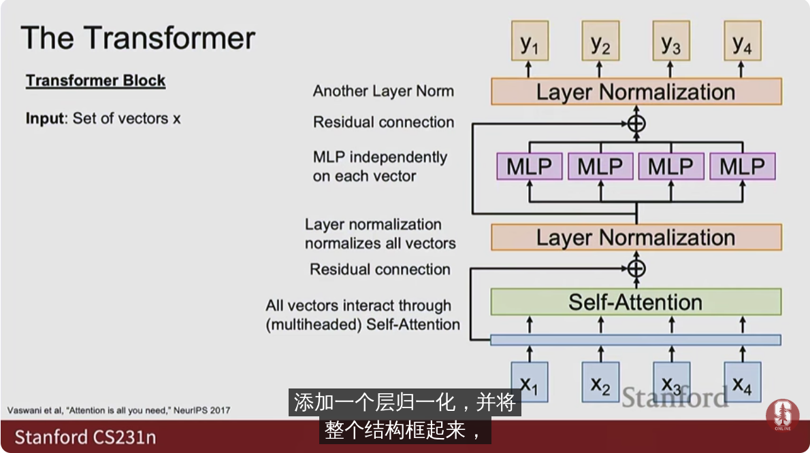

这被称为 Transformer 块

Transformer 为一系列块的组合

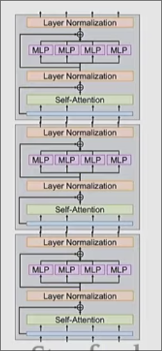

* 语言模型
* 图像模型
将图像分割为若干块 将每一款投影到一个向量
形成的向量序列作为输入
Transformer 为每个向量提供一个输出
对于分类问题 对输出进行池化操作 再使用一个线性层进行得分的预测