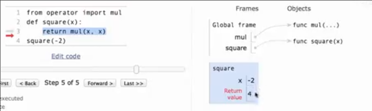

# 表达式_变量名称_赋值_用户定义函数
 
* [表达式的结构和计算过程](#表达式的结构和计算过程)
* [变量命名和赋值](#变量命名和赋值)
  * [内置变量_函数](#内置变量_函数)
  * [自定义变量名](#自定义变量名)
  * [自定义函数名](#自定义函数名)
  * [创建函数](#创建函数)
* [表达式的类别](#表达式的类别)
* [定义函数](#定义函数)
* [执行函数](#执行函数)
  * [在环境中查找名称](#在环境中查找名称)
  * [环境示意图](#环境示意图)
* [打印_纯函数_非纯函数](#打印_纯函数_非纯函数)

*expression*

表达式描述了一个计算 并转化为一个值

```python
>>> 2015
2015
>>> 2000 + 15
2015
>>> 1 * 2 * ((3 * 4 * 5 // 6) ** 3) + 7 + 8
2015
>>> max(2, 5) # 函数调用表达式 call expression
5
>>> min(-2, -9)
-9
>>> from operator import add, mul
>>> add(2000, 15)
2015
>>> mul(3, 5)
15
>>> max(add(2000, 15), mul(3, 5), 3) # 函数调用表达式可以嵌套
2015
```

## 表达式的结构和计算过程


函数表达式的调用过程是先从左到右递归地计算子表达式`operand`表达式的结果，再把计算结果得到的**常数作为参数**调用`operator`的函数，得到表达式的结果


*函数表达式调用树*


## 变量命名和赋值

### 内置变量_函数

有一些内置的变量、函数，其规定好了名称

```python
>>> from math import pi # 这是一种为值和函数绑定名称的方法
>>> pi
3.141592653589793
>>> pi * 71 / 223
1.0002380197528042
>>> from math import sin
>>> sin
<built-in function sin>
>>> sin(pi / 2)
1.0
```

### 自定义变量名

此外我们可使用赋值语句赋予自定义的名称

* `名称 = 表达式`
* python会将表达式计算，并绑定在我们自定义的名称

python还支持这种将多个名称绑定到对应值

```python
>>> radius = 10
>>> radius
10
>>> 2 * radius
20
>>> area, circ = pi * radius * radius, 2 * pi * radius
>>> area
314.1592653589793
>>> circ
62.83185307179586
```

### 自定义函数名

同样可以通过赋值的方式为函数绑定新名字

```python
>>> max(1, 2, 3)
3
>>> f = max
>>> f
<built-in function max>
>>> f(1, 2, 3)
3
```

f只是绑定的新的名字，它和`max`指向同一函数

在我们改变了`max`之后，也就是改变这个`name`所绑定，`f`仍绑定的是原函数

```python
>>> max = 7
>>> max
7
>>> f(1, 2, 3)
3
>>> f(1, 2, max)
7
```

max也可以重新绑定原函数 `max = f`

### 创建函数

这是为函数绑定名称的第三种方式，同时会创建函数

```python
>>> from operator import mul, add
>>> add
<built-in function add>
>>> mul
<built-in function mul>
>>> def square(x):
...     return mul(x, x)
... 
>>> square
<function square at 0x759844079120>
>>> square(11)
121
```

函数和变量的区别在于，函数在每次调用时都会重新执行函数体，而变量在定义时，绑定的是，其右侧表达式最终的**值**上，因此即为一个常数，所以利用函数可以建立如`area`和`redius`之间的依赖关系(把`area`定义为函数)

## 表达式的类别

* 原始表达式  `2` `add`(name) `hello`
* 函数调用表达式 `max(2, 2)`

## 定义函数

函数作为一个抽象，使得复杂的内部作为整体被命名，从而不需要考虑内部细节


规定了函数绑定到的`name`，传入的参数，以及函数体，定义时并不会实际执行

## 执行函数

1. 添加一个新的`栈帧`，形成一个新的环境
2. 在当前栈帧中绑定函数的形参绑定到传入的实际参数（在函数签名(定义的第一行)的指导下）
3. 执行函数的主体



* 在主栈帧中，我们用两种方式绑定名称到对应函数
* 之后在评估`square(-2)`时，调用`square`名称指向的函数，进入新的栈帧
* 将名称`x`指向实参`-2`，开始执行函数体，在返回结果时，回到主栈帧

### 在环境中查找名称

表达式的评估是在环境的上下文中进行

当前我们所了解的环境

* 主栈帧环境
* **函数调用时的函数内局部栈帧环境，同时包括主栈帧环境**（这意味着当名称没有在局部环境中找到时，会向主栈帧寻找） 

**环境由一系列帧组成**

```python
>>> from operator import mul
>>> mul(3, 4)
12
>>> def square(square):
...     return mul(square, square)
... 
>>> square
<function square at 0x73df4e424b80>
>>> square(4)
16
```

* 在函数定义时`square(square)`，第一个`square`名称在全局栈帧中，而第二个形参square名称则是在`square`指向的函数栈帧中，两者并不冲突
* 当调用`square(-2)`时，在全局栈帧中查找到`square`指向的函数，并调用，进入`square`栈帧，会将新栈帧中函数的形参`square`名称绑定到传入的实参-2
* 之后执行函数体时，遇到`square`现在当前栈帧中查找，即为-2


### 环境示意图

[一个可视化栈帧的在线python环境](https://pythontutor.com/cp/composingprograms.html)


```python
a = 1
b = 2
b, a = a + b, b
```

python 在评估表达式时，先评估`=`右侧，从左至右，将`,`分割的每一项评估完成后，和`=`左边对应的名称进行绑定

评估右侧 `b, a = 3, 2`


## 打印_纯函数_非纯函数

```python
>>> -2
-2
>>> print(-2)
-2
>>> 'Go Bears' # 这是python的一种规则，显示键入任何表达式的值, None特殊
'Go Bears'
>>> print('Go Bears') # 这是python的打印语句 其自身评估后的值(返回值) 为 None
Go Bears
>>> None
>>> print(None)
None
>>> print(print(1)) 
1
None
```

* 根据表达式的评估规则，首先评估最内侧的`print`
* 其会打印`-1`，并且其值是`None`，因此外侧`print`在调用时，其参数为`None`，并打印输出

如`print`这种除通过返回值输出外还有一些副作用用于输出，成为非纯函数 `Non-Pure Functions`


