# 对象
 
* [对象与面向对象的定义](#对象与面向对象的定义)
* [字符串对象](#字符串对象)
* [对象的改变](#对象的改变)
* [元组](#元组)
  * [定义和操作](#定义和操作)
* [变异](#变异)
  * [可变的默认参数很危险](#可变的默认参数很危险)
    * [利用可变默认参数定义可变函数](#利用可变默认参数定义可变函数)

## 对象与面向对象的定义

对象表现的像其所表示的东西

```py
>>> from datetime import date
>>> date
<class 'datetime.date'>
>>> today = date(2015, 2, 20)
>>> today
datetime.date(2015, 2, 20)
>>> freedom = date(2015, 5, 12)
>>> str(freedom - today)
'81 days, 0:00:00'
```

对象具有行为的主要机制是通过它们的**属性**

通过`.`来访问

```py
>>> today.year
2015
>>> today.month
```

`.`左侧是一个可以被评估为对象的表达式，右侧是要查找的属性

对象除了可以绑定属性，还可以绑定函数，被称为**方法**

```py
>>> today.strftime('%A %B %d')
```

对象代表了一系列信息，包含数据和行为，捆绑一起以创建抽象

可以表示事物，事物的属性，相互之间的作用，过程...

对象的数据类型称之为**类**

对象是面向对象的核心

* 中心思想是**一个大程序不再是一个大东西，而是一系列个体对象通过相互发送信息进行通信**
* 有一些特殊的语法如`.`利于提高程序的可读性和组织性
* `Python`中的**任何值都是一个对象** 包含数字、字符串...

函数一般完成一个特定的目标，而类会完成一系列目标，有多种使用方法

## 字符串对象

```py
>>> s = 'Hello'
>>> s.upper()
'HELLO'
>>> s.lower()
'hello'
>>> s.swapcase()
'hELLO'
>>> s
'Hello'
```

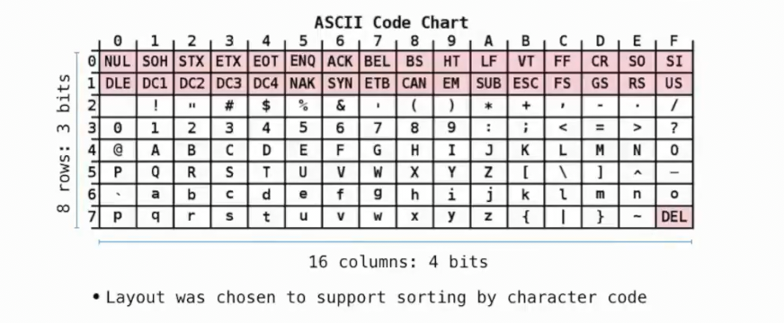

* 计算机通常按照`ascii`排序，如`!`在最前，大写字母开头的文件在小写字母前，`~`在后面
* 如果没有足够的位来表示，其提供一个子集`2 3 4 5`行
* 顶部的两行控制字符是为了传输或信息交换而设计, 比如`LF` *line feed* 相当于`\n`

```py
>>> a = 'A'
>>> ord(a)
65
>>> hex(ord(a))
'0x41'
```

此外还有`Unicode`编码，支持大多数语言

```py
>>> from unicodedata import name, lookup
>>> name('A')
'LATIN CAPITAL LETTER A'
>>> name('你')
'CJK UNIFIED IDEOGRAPH-4F60'
>>> lookup('CJK UNIFIED IDEOGRAPH-4F60')
'你'
>>> lookup('WHITE SMILING FACE')
'☺'
>>> lookup('SNOWMAN')
'☃'
>>> lookup('BABY')
'👶'
>>> lookup('SOCCER BALL')
'⚽'
>>> lookup('BABY').encode() 
b'\xf0\x9f\x91\xb6' # 使用四个字节
>>> '你'.encode()
b'\xe4\xbd\xa0'
>>> '𡈽'.encode()
b'\xf0\xa1\x88\xbd'
```

## 对象的改变

某些对象可以随时间改变其值，以列表为例

```py
>>> suits = ['coin', 'string', 'myriad']
>>> original_suits = suits
>>> suits.pop() # 总是弹出列表的最后一个元素
'myriad'
>>> suits.remove('string')
>>> suits
['coin']
>>> suits.append('cup')
>>> suits.extend(['sword', 'club'])
>>> suits
['coin', 'cup', 'sword', 'club']
>>> suits[2] = 'spade'
>>> suits[0:2] = ['heart', 'diamond']
>>> suits
['heart', 'diamond', 'spade', 'club']
>>> original_suits
['heart', 'diamond', 'spade', 'club']
```

在我们更改了这么多关于`suits`对象的值，我们再回过头查看`original_suits`, 发现其也被改变了

这意味这我们将`original_suits`绑定到的是同一对象，只是名称被改变了

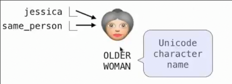

字典也是可修改对象

对象的修改我们称之为**变异**

```py
>>> numerals = {'I': 1, 'V': 5, 'X': 10}
>>> numerals
{'I': 1, 'V': 5, 'X': 10}
>>> numerals['X']
10
>>> numerals['X'] = 11
>>> numerals['X']
11
>>> numerals
{'I': 1, 'V': 5, 'X': 11}
>>> numerals['L'] = 50
>>> numerals
{'I': 1, 'V': 5, 'X': 11, 'L': 50}
>>> numerals['L']
50
>>> numerals.pop('X')
11
>>> numerals.get('X')
>>> 
```

函数也可以修改其范围内可变对象的值

```py
def mystery(s):
    s.pop()
    s.pop()
    
four = [1, 2, 3, 4]
mystery(four)
```

* 当调用`mystery(four)`时，将`mystery`帧内的`s`绑定到`four`指向的对象，在其中修改s时，就是在修改真正的`list`

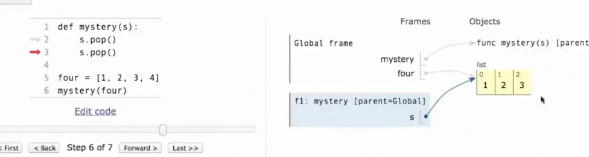

## 元组

元组是一种**不可变序列**

### 定义和操作

```py
>>> (3, 4, 5, 6)
(3, 4, 5, 6)
>>> 3, 4, 5, 6 # 任何, 分割的内容都被解释为一个元组
(3, 4, 5, 6)
>>> ()
()
>>> tuple()
()
>>> tuple([3, 4, 5])
(3, 4, 5)
>>> (2)
2
>>> (2,) #只有一个元素的元组这样创建
(2,)
>>> 2,
(2,)
```

也可以执行加法操作得到更大的元组

```py
>>> (3, 4) + (5, 6)
(3, 4, 5, 6)
```

支持大多数序列通用的操作

```py
>>> 5 in (3, 4, 5)
True
>>> tp = (3, 4, 5)
>>> tp[1:]
(4, 5)
>>> sum(tp)
12
```

元组是不可变的值，因此可以用作字典中的`key`

```py
>>> {(1, 2): 3}
{(1, 2): 3}
>>> {[1, 2]: 3}
Traceback (most recent call last):
  File "<stdin>", line 1, in <module>
TypeError: unhashable type: 'list'
```

当然即便`key`是元组这类不可变值，其内的元素也不能是可变值

```py
>>> {(1, [2]): 3}
Traceback (most recent call last):
  File "<stdin>", line 1, in <module>
TypeError: unhashable type: 'list'
```

数字和字符串也是不可变的值

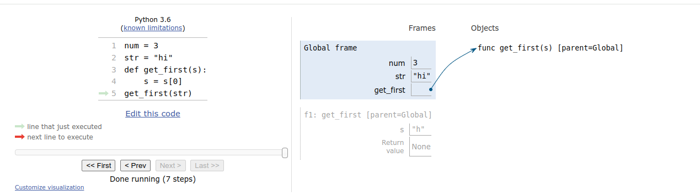

名称组成的表达式发生变化的原因可能有两种

* 名称绑定了新值
* 名称绑定的可变对象发生了变异

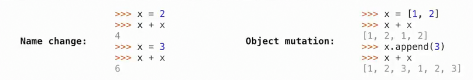

但是即便名称绑定了不可变对象，如果不可变对象中，存在可变对象, 那么这个可变对象的变异也会导致表达式变化, 而不会报错

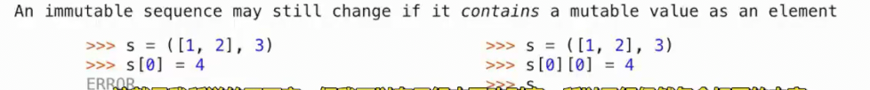

## 变异

整体不仅仅是部分之和，比如尽管更改了某个列表的一个值，其仍是原来的列表，名称的绑定依旧不变

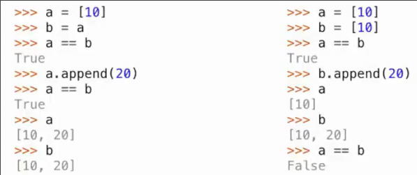

如何判断两个表达式是同一事物？

`表达式1 is 表达式2`

而`==`只要满足两个表达式返回的值相同即可

```py
>>> [10] == [10]
True
>>> a = [10]
>>> b = [10]
>>> a == b
True
>>> a is b
False
>>> a.extend([20, 30])
>>> a
[10, 20, 30]
>>> b
[10]
>>> c = b
>>> c is b
True
>>> c.pop()
10
>>> b
[]
>>> c
[]
```

### 可变的默认参数很危险

在定义函数时，默认参数是该函数的一部分，而不是每次调用函数重新生成，因此在函数中修改这个默认值，那么下一次调用时获取到的默认值发生了变化

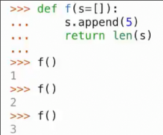

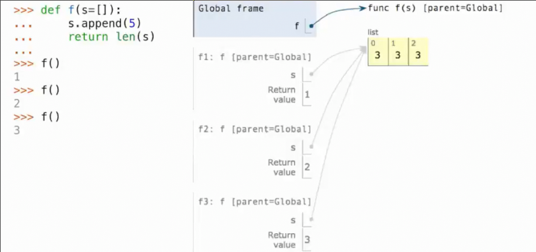

#### 利用可变默认参数定义可变函数

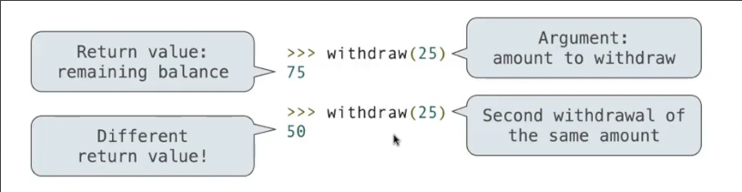

可以结合闭包实现

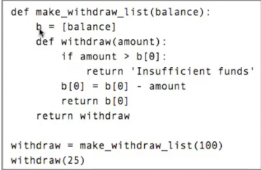

这种实现`b[0]`规避了赋值左侧评估出的名称只能在本地找(可以通过`nonlocal`和`global`更改为父级和全局帧中)，而是先评估`b[0]`而这个疑似序列的名称可以从父帧找
