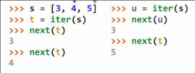
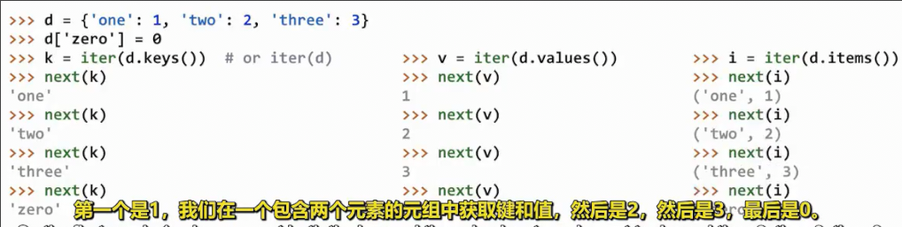
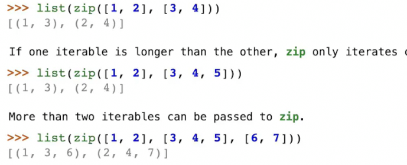
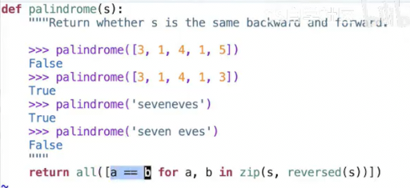
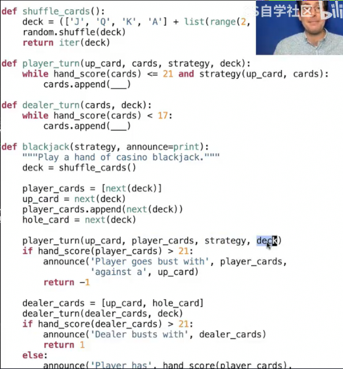
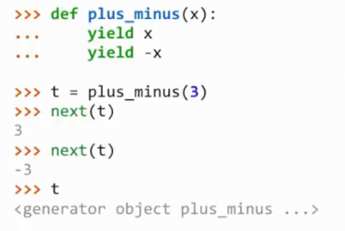
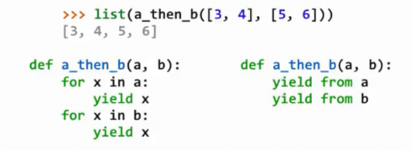
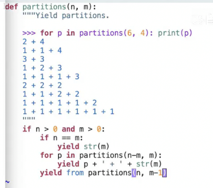

# 迭代器 生成器

## 迭代器

可以隐式表示顺序数据

在`python`中是访问许多不同容器元素的一种方式

### 创建和推进

* `iter(可迭代值)`可以创建迭代器
    * 迭代知道可迭代值的内容，以及指向下一个元素的一个标识
* `next(迭代器)`可以推进迭代器

```py
>>> s = [3, 4, 5]
>>> t = iter(s)
>>> t
<list_iterator object at 0x7bda90667370>
>>> next(t)
3
>>> next(t)
4
>>> list(t)
[5]
Traceback (most recent call last):
  File "<stdin>", line 1, in <module>
StopIteration
```



### 字典的迭代

可迭代的值为任何可以传递给`iter()`的值，以生成迭代器

迭代器从`iter()`返回，可以传递给内置`next()`函数

迭代器是**可变对象**，当调用`next()`值时，发生变异以指向下一个元素

字典，字典的键，值都是可迭代值

自3.6版本后的python,字典中元素的顺序为添加时的顺序

而之前版本的python，字典中的元素是任意顺序的(因此被称为无序的键值对集合)

 

```py
>>> d = {'one': 1, 'two': 2}
>>> k = iter(d)
>>> next(k)
'one'
>>> d['zero'] = 0
>>> next(k)
Traceback (most recent call last):
  File "<stdin>", line 1, in <module>
RuntimeError: dictionary changed size during iteration
```

值得注意的是当我更改字典大小时，之前的又字典生成的迭代器失效

但是只是更改字典的值依旧可以使用先前的迭代器

```py
>>> d['zero'] = 1
>>> next(k)
```

### for语句中的迭代器

```py
>>> r = range(3, 6)
>>> for i in r:
...     print(i)
... 
3
4
5
>>> for i in r:                                                                                                 
...     print(i)
... 
3
4
5
```

由于r没有改变，因此两次结果相同，但是迭代器的表现却不同

```py
>>> ri = iter(r)
>>> ri
<range_iterator object at 0x7a3afcd05d40>
>>> next(ri)
3
>>> for i in ri:
...     print(i)
... 
4
5
>>> for i in ri:
...     print(i)
... 
>>>
```

遍历迭代器，只会从当前的元素开始，并且每一次迭代会改变迭代器的位置

### 返回迭代器的内置函数 懒计算

处理可迭代值的大量处理都是用这些函数，其接受可迭代值，返回一个迭代器, 以使得**惰性**地在值被使用时，才进行计算

* `map(func, 可迭代值)` 
  * 迭代地将`func`作用于每一个元素，但是不会立即执行，而是先返回一个迭代器
  * 之后使用迭代器 再调用`func`于当前值
* `filter(func, 可迭代值)`
  * 接受一个谓词(返回布尔值的函数)
  * 如果当前作用于元素的谓词返回`True`，则返回
* `zip(可迭代值1, 可迭代值2)`
  * 返回`(x, y)`对
* `reversed(序列)`
  * 反向排序

这些都返回迭代器，在调用`next`时产生对应功能的值

可以通过`list()` `tuple()` `sorted()` 一次性返回从当前位置到末尾的迭代器中值
  * sorted() 创建一个包含可迭代对象中所有元素的排序列表

```py
>>> bcd = ['b', 'c', 'd']
>>> [x.upper() for x in bcd]
['B', 'C', 'D']
>>> map(lambda x: x.upper(), bcd)
<map object at 0x7a3afcb32f20>
>>> m = map(lambda x: x.upper(), bcd)
>>> next(m)
'B'
>>> next(m)
'C'
>>> next(m)
'D'
```

这些函数并非立即将完成计算

```py
def double(x):
    print('**', x, '=>', 2*x, '**')
    return 2*x
```

```py
>>> m = map(double, [3, 5, 7])
>>> next(m)
** 3 => 6 **
6
>>> next(m)
** 5 => 10 **
10
>>> next(m)
** 7 => 14 **
14
```

这些函数可以组合使用

```py
>>> m = map(double, range(3, 7))                                                                                 
>>> f = lambda y: y >= 10
>>> t = filter(f, m)                                                                                             
>>> next(t)
** 3 => 6 **
** 4 => 8 **
** 5 => 10 **
10
>>> next(t)
** 6 => 12 **
12
>>> list(t)
[]
```

当我们第一次调用`next(t)`时，首先取出m的一个元素，next(m)，由于m是个将会调用`double`的迭代器，因此触发了`** 3 => 6 **`, 之后`filter`将6与谓词检验不匹配，因此接连取出m的一系列元素，才返回我们`filter`迭代器的第一个值

`list`可以直接返回最终的结果

```py
>>> list(filter(f, map(double, range(3, 7))))
** 3 => 6 **
** 4 => 8 **
** 5 => 10 **
** 6 => 12 **
[10, 12]
```
    
`zip`可以返回一个迭代器，其表示的是传入其中所有可迭代对象，在某个索引的相应元组



当这些可迭代值不一样大时，将超过公共部分的忽略

也可以传入两个以上的可迭代值，有多少可迭代值，生成元组的大小就是多少

利用`reversed`和`zip`的一个判断任意可迭代值是否为回文数的函数



### 何时使用迭代器

迭代器使得，无论抽象数据用列表元组还是可迭代对象又或者是字典的键，都不用修改代码，我们只是把某物当成可迭代的对象

这对于数据抽象很有好处

* 同时传递了数据和迭代的位置，这在一些函数的传递中很方便，
* 确保每一个元素仅被处理一次
* 限制了对序列执行的操作，只能请求下一个值，不必担心函数对序列的改变



二十一点

## 生成器

### 生成器的定义和运行方式

生成器是一种特殊的迭代器 其由生成器函数返回



* 生成器函数通过`yield`而不是`return`来返回
* 生成器函数可以通过`yield`返回多个值，其被包含在最终的迭代器中
* 生成器是每次调用生成器函数时自动创建的迭代器

```py
def evens(start, end):
    """返回 [start, end) 之间所有偶数"""
    for i in range(start, end):
        if i % 2 == 0:
            yield i
```

```py
>>> t = evens(2, 10)
>>> t
<generator object evens at 0x7c4014188d60>
>>> next(t)
2
>>> next(t)
4
>>> next(t)
6
>>> next(t)
8
>>> t = evens(2, 10)
>>> list(t)
[2, 4, 6, 8]
```

当我们调用生成器函数时，并没有执行函数体

而当我们调用`next`时，才会执行，直到`yield`语句, 返回我们想要的结果，执行暂停，同时记下此时的所有环境

直到下一次next

### 在生成器中返回某迭代器中内容

`yield from` 从迭代器或可迭代值中逐个返回所有的值






