# 面向对象编程oop

## 类与对象

我们想将非常大型的程序组织成小的模块化组建，这样可以分别编写，测试，思考

面向对象中，程序不再是一个长长的信息列表以及其中的操作函数，而是一堆不同对象相互交互

每个**对象**会跟踪自己的信息，有自己的本地状态，随时间推移而发生变化，因此面向对象中经常涉及到变异

* 这种改变不在全局中发生，而是隶属于对象管理
* 与对象交互的方式是使用**方法**
  * 方法和函数的区别在与函数通常在全局帧中定义并可以在任何值上调用，而方法调用于特定对象

多个对象可能都是属于共同类的实例, 每个对象都有对应的类型即**类**

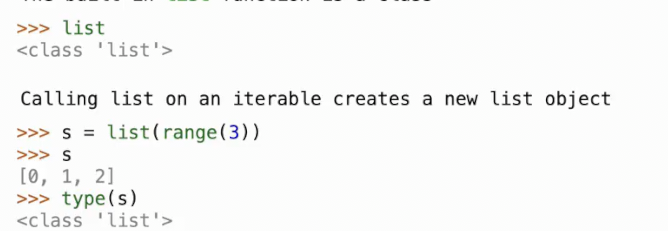

## 自定义类

一个类描述了其实例的行为

以银行账户为例，我们想要将与银行账户相关的信息捆绑在一起
  * 账户余额 账户所有人
  * 与账户相关的行为，比如存钱取钱

创建的实例应如下

当以函数的方式调用类时，应创建一个新的银行账户实例对象

用**点表达式**访问持有者和余额

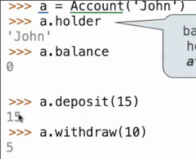

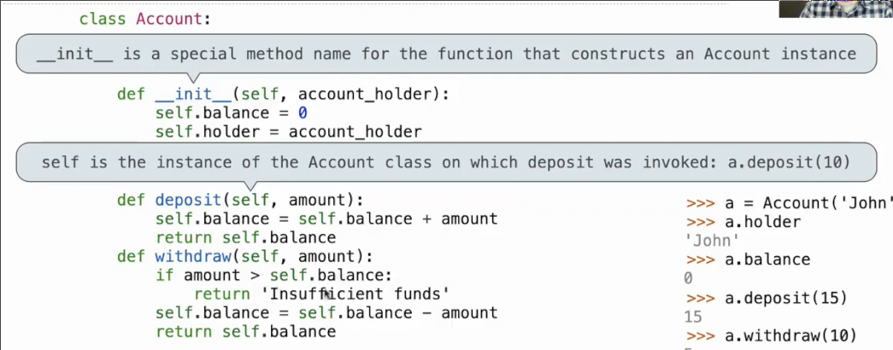

## 创建实例时发生的事情

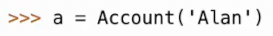

* 首先分配了空间, 其是一个`Account`类的实例，但是没用任何属性


* 之后立即调用`__init__`方法，这个方法以新创建的空对象作为**实参传递入其第一个形参** *我们总是将这个形参命名为`self`*
* 并且我们将其他构建对象需要的额外信息传递
* 开始执行构造函数体，并初始化对象的属性

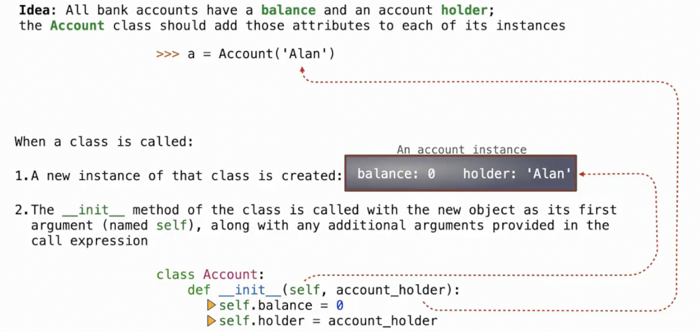

* 在构造结束后，我们就可以通过`.`来访问新实例的属性
* 如果不存在某属性，我们同样可以通过`.`以给其赋值

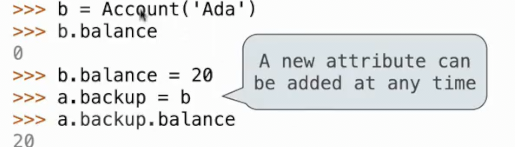

## 对象的标识

所有自定义类的对象都有一个标识

通过`is`来进行名称是否指向同一对象的区分

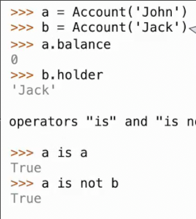

## 调用方法

所有调用方法的第一个形参都是`self`对象自身，因此都可以访问和操作对象的属性

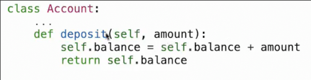


## 类定义语句的执行过程

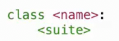

`class name` 定义了一个类，并且绑定了一个当前帧内的同名名称，这与函数的定义相似

之后在类定义体中，`def`和赋值语句创建了**类的属性**, 注意，并非实例的属性

类也是不同的对象，其也有属性

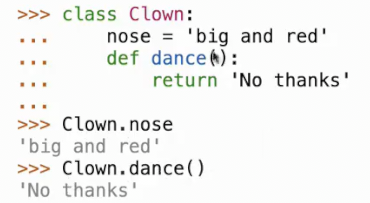

类属性在所有实例之间共享，因为其是类的属性，而非实例的

这样做的好处之一是，我们不需要为每个类都分配空间来存储某一公共属性，而是只在类中存储一次

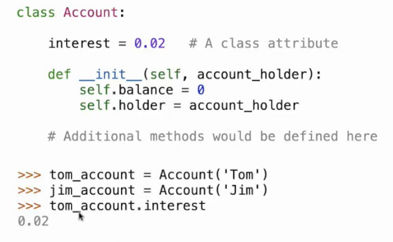

但是我们依旧可以使用`实例对象.属性`来访问类的属性，无论修改与否，对于类的每个实例保持相同的值

其不是实例的一部分，而是类的，查找过程是我们能通过其访问到类内

## 属性

### 属性的查找过程

`expression.name`

实例的属性和类的属性都可以通过`.`来访问

1. 评估左侧表达式为一个对象
2. 将`name`与该实例对象的实例属性进行匹配，如果存在具有该名称的属性，则返回其值
3. 如果没有在实例属性中找到，则在该对象的类中查找该名称，尝试返回类属性
    * 返回方法，其中形参`self`已经被填充为`expression`的值
    * 方法和类属性是同一地位的，取决与谁先定义，名称最终绑定于谁

#### getattr hasattr

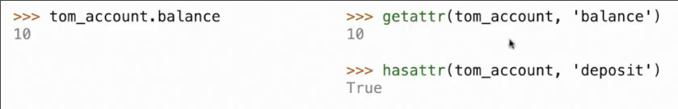

以相同的顺序查找

### 属性的赋值

左侧带有`.`的赋值语句是属性赋值语句

如果`.`左侧是一个实例，那么则设置实例属性

如果`.`左侧是一个类，则设置类属性

```py
class Account:
    interest = 0.02
    def __init__(self, holder):
        self.holder = holder
        self.balance = 0

tom_account = Account('Tom')
```

```py
>>> tom_account.interest
0.02
>>> tom_account.interest is Account.interest
True
>>> tom_account.interest = tom_account.interest + 1
# 右侧获取到的是类属性 而左侧设置的是实例属性
>>> tom_account.interest
1.02
>>> tom_account.interest is Account.interest
False
>>> Account.interest
0.02
```

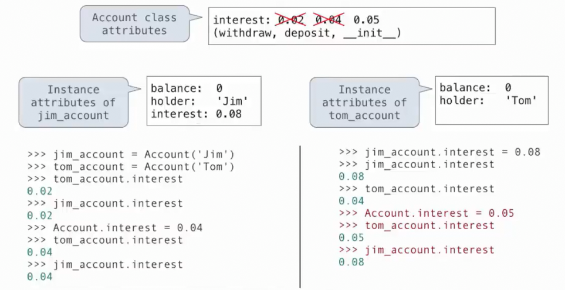

## 方法调用

方法是一个函数，其同时也是**类属性**

`expression.name`

`name`必须只是一个单独的名字

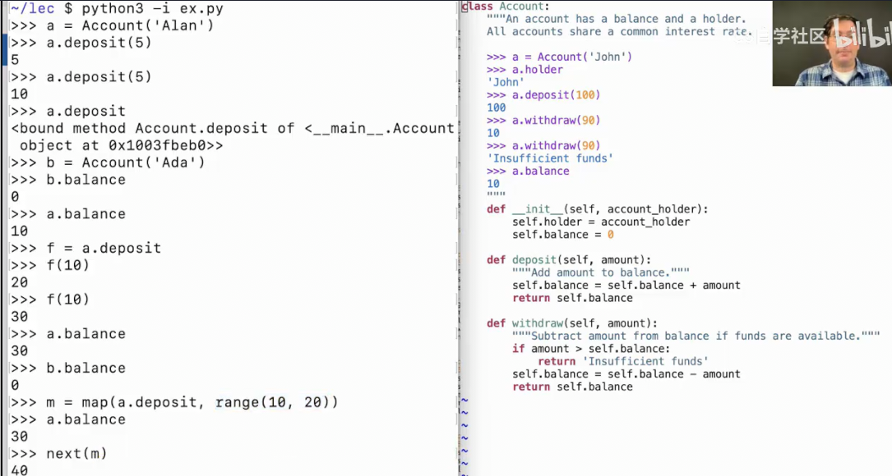

### 绑定方法

是一个函数，也是类属性，其中`self`参数已经填充为类的一个实例

`f = a.balance`

在python中，绑定方法也是一个对象，其是一个曾经是类属性的函数，并且已经将其第一个参数`self`绑定到类的实例

当`.`表达式可能求值为一个绑定方法时

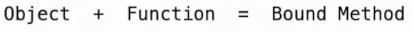

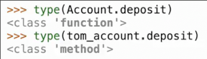
