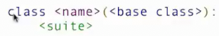
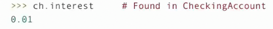
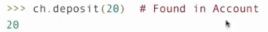
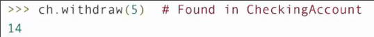

# 继承

## 继承的概念

继承是将多个类关联起来的一种方法

通常地 专用化的类可能具有和通用类相同的属性以及一些特殊情况的行为



基类就是这个类继承的内容

因此子类共享其基类的属性，也可能发生覆盖以稍微更改其行为，而未更改的内容保持不变

```py
class CheckingAccount(Account):
    """在取款时收取1元的账户"""
    withdraw_fee = 1
    interest = 0.01
    def withdraw(self, amount):
        return Account.withdraw(self, amount + self.withdraw_fee)
```

## 继承中属性的查找

基类的属性不会复制到子类，而是通过查找的方式找到基类身上去

1. 如果名字是一个类中的属性，那么就返回属性值
2. 查找基类中的属性，如果是，就返回属性值


我们查找`__init__，由于我们没有在`CheckingAccount`写构造函数，于是去基类中找



我们在`CheckingAccount`中重新定义了`interest`，因此返回的是新的`0.01`



只有`Account`有`deposit`函数，因此调用其



从子类中找到

```py
>>> a = Account('John')
>>> b = CheckingAccount('Jack')
>>> a
<__main__.Account object at 0x7162cd93c320>
>>> b
<__main__.CheckingAccount object at 0x7162ccf05e80>
>>> a.balance
0
>>> b.balance
0
>>> a.deposit(100)
100
>>> b.deposit(100)
100
>>> a.withdraw(10)
90
>>> b.withdraw(10)
89
```
