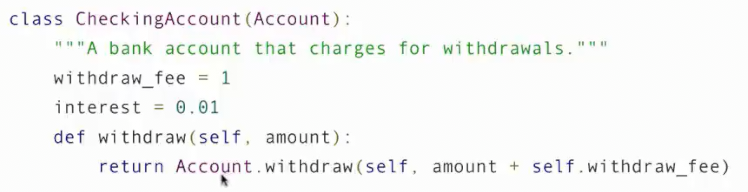

# 继承
 
* [继承的概念](#继承的概念)
* [继承中属性的查找](#继承中属性的查找)
* [设计面向对象的程序的一些建议](#设计面向对象的程序的一些建议)
* [继承和组合的选择问题](#继承和组合的选择问题)
* [多重继承](#多重继承)

## 继承的概念

继承是将多个类关联起来的一种方法

通常地 专用化的类可能具有和通用类相同的属性以及一些特殊情况的行为


基类就是这个类继承的内容

因此子类共享其基类的属性，也可能发生覆盖以稍微更改其行为，而未更改的内容保持不变

```py
class CheckingAccount(Account):
    """在取款时收取1元的账户"""
    withdraw_fee = 1
    interest = 0.01
    def withdraw(self, amount):
        return Account.withdraw(self, amount + self.withdraw_fee)
```

## 继承中属性的查找

基类的属性不会复制到子类，而是通过查找的方式找到基类身上去

1. 如果名字是一个类中的属性，那么就返回属性值
2. 查找基类中的属性，如果是，就返回属性值


我们查找`__init__，由于我们没有在`CheckingAccount`写构造函数，于是去基类中找


我们在`CheckingAccount`中重新定义了`interest`，因此返回的是新的`0.01`


只有`Account`有`deposit`函数，因此调用其


从子类中找到

```py
>>> a = Account('John')
>>> b = CheckingAccount('Jack')
>>> a
<__main__.Account object at 0x7162cd93c320>
>>> b
<__main__.CheckingAccount object at 0x7162ccf05e80>
>>> a.balance
0
>>> b.balance
0
>>> a.deposit(100)
100
>>> b.deposit(100)
100
>>> a.withdraw(10)
90
>>> b.withdraw(10)
89
```

## 设计面向对象的程序的一些建议

* 尽量避免自己重复地实现，而是利用现有的实现
* 已经被覆盖的属性应该仍能通过类本身这个对象来访问 *覆盖意味着在子类中给属性一个与基类中相同的名字，而我们仍能通过`基类.属性`来访问*
* 并且使用实例来间接访问到类属性也是一个好的选择，这意味着允许部分实例有着自身的同名独特属性



## 继承和组合的选择问题

**组合**就是一个对象将另一个对象视为属性

* 继承更适合表示 **子类是基类中的一种`is a`** 这样的陈述 表示特定类型 *支票账户是账户中的一种*
* 而组合 更能表示 **对象有一个什么属性`has`** *一个银行有一个账户列表*

```py
class Bank:
    """银行 has 银行账户列表

    >>> bank = Bank()
    >>> john = bank.open_account('John', 10)
    >>> jack = bank.open_account('Jack', 5, CheckingAccount)
    >>> john.interest
    0.02
    >>> jack.interest
    0.01
    >>> bank.pay_interest()
    >>> john.balance
    10.2
    >>> bank.too_big_to_fail()
    True
    """
    def __init__(self):
        self.accounts = []
    def open_account(self, holder, amount, kind=Account):
        account = kind(holder)
        account.deposit(amount)
        self.accounts.append(account)
        return account

    def pay_interest(self):
        for account in self.accounts:
            account.deposit(account.balance *  account.interest)

    def too_big_to_fail(self):
        return len(self.accounts) > 1
```

## 多重继承

一个子类有多个基类

这是一个存款需要一定金额的账户

```py
class SavingsAccount(Account):
    deposit_fee = 2
    def deposit(self, amount):
        return Account.deposit(self, amount - self.deposit_fee)
```

现在我们要构建这样一种账户 0.01的利息 取款需要 1元 存款需要 2元 开户时赠送1元

```py
class AsSeenOnTVAccount(CheckingAccount, SavingsAccount):
    def __init__(self, account_holder):
        self.holder = account_holder
        self.balance = 1
```

```py
>>> such_a_deal = AsSeenOnTVAccount("John")
>>> such_a_deal.balance
1
>>> such_a_deal.deposit(20)
19
```


