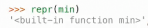

# 对象的字符串表示_FString_多态
 
* [对象的字符串表示](#对象的字符串表示)
  * [repr()](#repr())
  * [str()](#str())
* [F-Strings](#F-Strings)
* [多态函数](#多态函数)
  * [接口](#接口)
  * [python中特殊的方法名](#python中特殊的方法名)

## 对象的字符串表示

对象应该知道如何向世界展示自己，即生成自身的字符串表示

在python中所有对象都有两种字符串表示

* `str()` 人类可读
* `repr()` 对python解释器可读 是一个表达式
* 大多数时候二者相同，但不总是

### repr()

将一个评估为对象的python表达式作为字符串返回

返回规范的字符串表示

而`eval(repr(object)) == object`为真

结果正是我们在交互式会话中看到的

```
>>> 1
1
```

对于一些表达式，不能完全将其评估，如函数和类



使用`<>`表示其不是一个python表达式，而是一些人类可读的描述

```py
>>> from fractions import Fraction
>>> half = Fraction(1, 2)
>>> repr(half)
'Fraction(1, 2)'
>>> str(half)
'1/2'
>>> half
Fraction(1, 2)
>>> eval(repr(half))
Fraction(1, 2)
```

### str()

对对象调用`str()`的结果和`print()`对象的结果相同

```py
>>> print(half)
1/2
```


## F-Strings

允许在字符串文字中生成各种表达式的字符串

首选的字符串插值方法


其`{}`中的评估结果是子表达式的`str`字符串

顺序求值

## 多态函数

是一种适用于许多不同数据类型的函数

`repr`只是调用对象的类属性`.__repr__()`

```py
>>> repr(half)
'Fraction(1, 2)'
>>> half.__repr__()
'Fraction(1, 2)'
```

同样的`str()`也是调用对象的类属性`.__str__()`

```py
>>> half.__str__()
'1/2'
```

`repr()`忽略了传入对象身上的`__repr__`属性，而只调用其类属性


这两种`repr`的实现中，其中后者可以跳过x对象身上的`__repr__`属性，不受其影响，而调用其类属性`__repr__`

`str()`同样忽略实例上的`__str__`属性，如果类上没有`__str__`没有找到，则返回`repr`字符串

### 接口

对象之间会相互传递消息

而对象唯一相互传递信息的方式是查找彼此的属性

接口是一组共享的消息和告诉这些消息做什么代表什么的规范 

例如实现`__repr__`和`__str__`方法并分别返回可解释和可读的字符串

如果定义了一些类，这些类都有某个方法，而这些方法都做相似的事情，这就是一个接口

```py
class Ratio1:
    def __init__(self, n, d):
        self.numer = n
        self.denom = d

    def __repr__(self):
        return 'Ratio({0}, {1})'.format(self.numer, self.denom)

    def __str__(self):
        return '{0}/{1}'.format(self.numer, self.denom)
```

```py
>>> half = Ratio1(1, 2)
>>> half
Ratio(1, 2)
>>> print(half)
1/2
```

### python中特殊的方法名

这些方法名有一些内置行为，都是这种形式`__func__`

* `__init__` 在对象构造时会自动调用
* `__repr__` 被调用以生成表示对象的字符串的方法，也是在交互式python会话中用于显示值的方法
* `__add__` 两个参数，将一个对象添加到另一个对象
* `__bool__` 将对象转为布尔值
* `__float__` 尝试将对象转为实数


通过接口使得用户自定义类型和内置系统交互 *python 非常可扩展*

* 通过重写`__add__`使得使用加号能让该类的实例相加


`__radd__`的区别在于相加的顺序

```py
class Ratio1:
    def __init__(self, n, d):
        self.numer = n
        self.denom = d

    def __repr__(self):
        return 'Ratio({0}, {1})'.format(self.numer, self.denom)

    def __str__(self):
        return '{0}/{1}'.format(self.numer, self.denom)

    def __add__(self, other):
        if isinstance(other, int):
            n = self.numer + self.denom * other
            d = self.denom
        elif isinstance(other, Ratio1):
            n = self.numer * other.denom + self.denom * other.numer
            d = self.denom * other.denom
        g = gcd(n, d)
        return Ratio1(n // g, d // g)
    
    __radd__ = __add__ # 对于满足交换律的加法

def gcd(n, d):
    while n != d:
        n, d = min(n, d), abs(n-d)
    return n
```

处理浮点数


